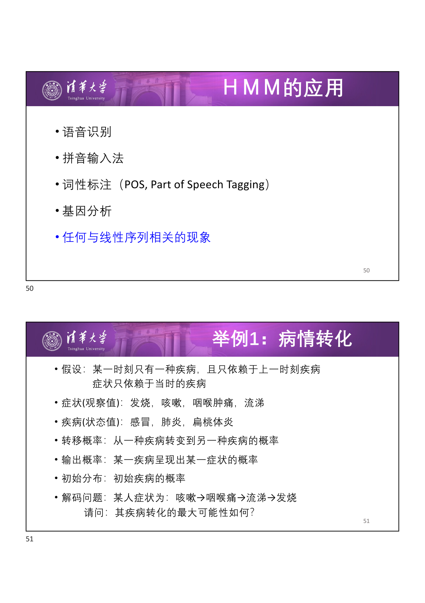
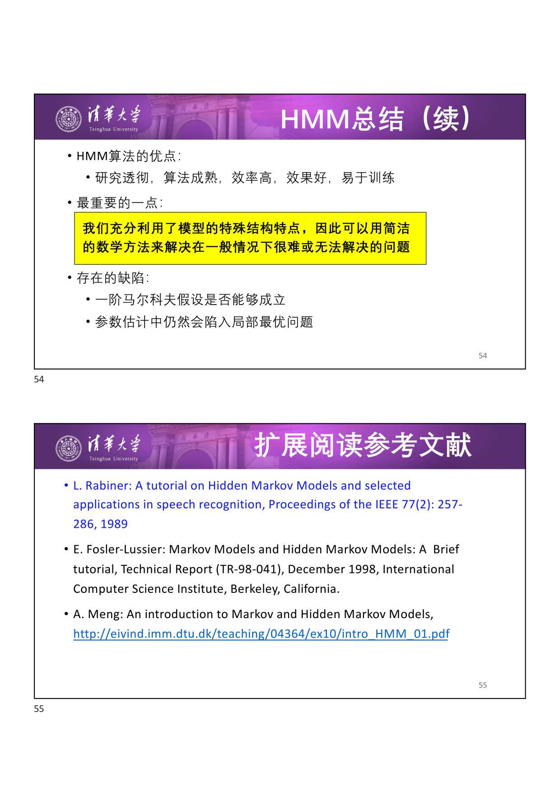
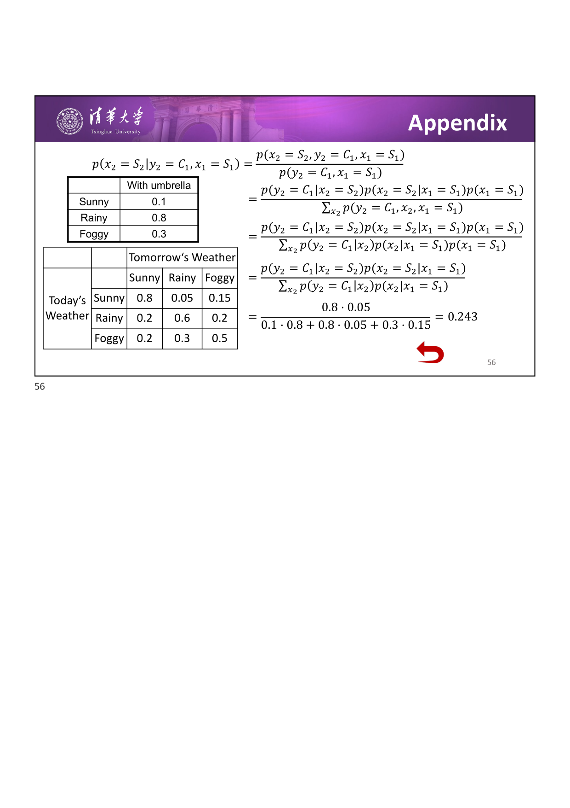

# 序列模型

# 一、马尔科夫模型

## 1.1 一阶马尔科夫假设

给定数据序列 $x_1, x_2, \ldots, x_n$，这些样例之间具有依赖关系。**一阶马尔科夫假设** （first-order Markov assumption）认为：时刻 $n$ 某观察值的概率只依赖于 $n-1$ 时刻的观察值。

$$
p(x_n \mid x_{n-1}, \ldots, x_1) = p(x_n \mid x_{n-1})
$$

变量 $x_i$ 可以是 $m$ 个状态之一 $\{S_1, S_2, \ldots, S_m\}$。

!!! abstract "定义：转移概率（Transition Probability）"

    $a_{i,j}$ 表示已知 $n$ 时刻状态为 $S_i$ 时，在 $n+1$ 时刻状态为 $S_j$ 的概率：

    $$
    a_{i,j} = p(x_{n+1} = S_j \mid x_n = S_i)
    $$

## 1.2 转移概率的特性

- **行和为 1**：$\sum_{j} a_{i,j} = 1$
- **时间不变性** （Time invariant / homogeneous）：转移概率不随时间变化，即 $p(x_{i+1} \mid x_i) = p(x_{j+1} \mid x_j)$ 对任意 $i, j$ 成立

转移概率矩阵（行和为 1）：

$$
A = \begin{bmatrix}
a_{1,1} & a_{1,2} & \cdots & a_{1,m} \\
a_{2,1} & a_{2,2} & \cdots & a_{2,m} \\
\vdots & \vdots & \ddots & \vdots \\
a_{m,1} & a_{m,2} & \cdots & a_{m,m}
\end{bmatrix}
$$

## 1.3 天气预报问题

使用马尔科夫假设，联合概率可分解为：

$$
p(w_1, w_2, \ldots, w_n) = p(w_1) \prod_{i=2}^{n} p(w_i \mid w_{i-1})
$$

!!! info "思考问题 1"

    已知今天天气 sunny，那么明天是 sunny 且后天 rainy 的概率是多少？

    $$
    P(w_2 = \text{Sunny}, w_3 = \text{Rainy} \mid w_1 = \text{Sunny}) = a_{S,S} \cdot a_{S,R}
    $$

!!! info "思考问题 2"

    今天天气是 foggy，那么后天为 rainy 的概率是多少？

    $$
    P(w_3 = \text{Rainy} \mid w_1 = \text{Foggy}) = \sum_{s \in \{S, R, F\}} a_{F,s} \cdot a_{s,R}
    $$

    需要对中间状态 $w_2$ 的所有可能取值求和。

## 1.4 Markov Model 的参数学习

Markov Model 的参数 $\mu = (A, \pi)$，其中 $A$ 为转移矩阵，$\pi$ 为初始分布。

如果转移矩阵未知，必须从观察序列（训练集）中学习：统计状态之间的转移频率来估计转移概率。

---

# 二、隐马尔科夫模型（HMM）

## 2.1 问题引入

天气预报问题中，假设某人一直呆在看不到外面的屋子里，不知道天气情况。唯一帮助此人做判断的依据是照顾者每天是否带了雨伞进来。

- **隐藏状态** （hidden states）：天气状况（Sunny / Rainy / Foggy）
- **观察状态** （observed states）：是否带雨伞（Umbrella / No umbrella）

## 2.2 HMM 的图模型结构

- **绿色圆圈**是隐藏状态 （hidden states），只与其前一个状态有关
- 给定当前状态，过去的状态与未来的状态独立：「The past is independent of the future given the present.」
- **紫色圆圈**代表观察到的状态 （observed states），只与其当前的隐藏状态相关

## 2.3 HMM 的形式化定义

一个 HMM 由五元组 $\{S, K, \Pi, A, B\}$ 定义：

| 符号 | 含义 |
| --- | --- |
| $S = \{s_1, \ldots, s_N\}$ | 隐状态的值 |
| $K = \{k_1, \ldots, k_M\}$ | 可观察量的取值 |
| $\Pi = \{\pi_i\}$ | 状态的初始分布，$\pi_i = p(x_1 = S_i)$ |
| $A = \{a_{ij}\}$ | 状态转移概率，$a_{ij} = p(x_n = S_j \mid x_{n-1} = S_i)$ |
| $B = \{b_{ij}\}$ | 输出概率，$b_{ij} = p(y_n = K_j \mid x_n = S_i)$ |

## 2.4 HMM 的三个基本假设

对于一个随机事件，观察到序列 $O_1, \ldots, O_T$，该事件隐含着状态序列 $X_1, \ldots, X_T$：

!!! abstract "假设 1：马尔科夫假设（状态构成一阶马尔科夫链）"

    $$
    p(X_i \mid X_{i-1} \ldots X_1) = p(X_i \mid X_{i-1})
    $$

!!! abstract "假设 2：时间不变性假设（状态与具体时间无关）"

    $$
    p(X_{i+1} \mid X_i) = p(X_{j+1} \mid X_j), \quad \forall i, j
    $$

!!! abstract "假设 3：输出独立性假设（输出仅与当前状态有关）"

    $$
    p(O_1, \ldots, O_T \mid X_1, \ldots, X_T) = \prod_{t=1}^{T} p(O_t \mid X_t)
    $$

## 2.5 MM vs HMM

| | Markov Model | Hidden Markov Model |
| --- | --- | --- |
| 状态 | 直接观察到 | 间接观察（通过输出概率关联） |
| 结构 | $x_1 \to x_2 \to \cdots \to x_T$ | $x_1 \to x_2 \to \cdots \to x_T$，每个 $x_t$ 产生 $o_t$ |

## 2.6 天气预报问题的 HMM

假设实际天气情况隐藏，只能观察到照看者是否带了伞。带伞概率：

| 天气 | 带伞概率 |
| --- | --- |
| Sunny | 0.1 |
| Rainy | 0.8 |
| Foggy | 0.3 |

!!! info "思考问题 3"

    设呆在屋子里的第一天天晴 （sunny），第二天照看者带了一把伞进来。那么第二天下雨 （rainy）的概率是多少？

    $$
    \begin{aligned}
    p(x_2 = S_2 \mid y_2 = C_1, x_1 = S_1)
    &= \frac{p(x_2 = S_2 \mid x_1 = S_1) \cdot p(y_2 = C_1 \mid x_2 = S_2)}{p(y_2 = C_1 \mid x_1 = S_1)} \\[4pt]
    &= \frac{0.05 \cdot 0.8}{0.1 \cdot 0.8 + 0.8 \cdot 0.05 + 0.3 \cdot 0.15} = 0.243
    \end{aligned}
    $$

---

# 三、HMM 的三个基本问题

令 $\mu = \{A, B, \pi\}$ 为给定 HMM 的参数，$\sigma = O_1, \ldots, O_T$ 为观察值序列。

| 问题 | 描述 | 算法 |
| --- | --- | --- |
| **评估** （Evaluation） | 对给定模型和观察值序列，求 $p(\sigma \mid \mu)$ | 前向/后向算法 |
| **解码** （Decoding） | 对给定模型和观察值序列，求可能性最大的状态序列 | Viterbi 算法 |
| **学习** （Learning） | 对给定观察值序列，调整 $\mu$ 使 $p(\sigma \mid \mu)$ 最大 | 前向-后向算法（EM） |

## 3.1 评估问题 — 前向算法

!!! abstract "定义：前向变量 $\alpha_t(i)$"

    $$
    \alpha_t(i) = p(O_1, \ldots, O_t, x_t = S_i \mid \mu)
    $$

    即到时刻 $t$ 为止观察到序列 $O_1, \ldots, O_t$ 且 $t$ 时刻状态为 $S_i$ 的概率。

### 递推关系

$$
\alpha_{t+1}(j) = \left[ \sum_{i=1}^{N} \alpha_t(i) \cdot a_{ij} \right] \cdot b_{j}(O_{t+1})
$$

- 从 $t$ 时刻所有可能的状态 $i$ 转移到 $t+1$ 时刻的状态 $j$
- 乘以 $t+1$ 时刻在状态 $j$ 下输出 $O_{t+1}$ 的概率

### 初始化和最终计算

- **初始化**：$\alpha_1(i) = \pi_i \cdot b_i(O_1)$
- **最终**：$p(O \mid \mu) = \sum_{i=1}^{N} \alpha_T(i)$
- **计算复杂度**：$O(N^2 T)$（$N$ 个可能状态，$T$ 个时刻），远超穷举法的 $O(2T N^T)$

## 3.2 评估问题 — 后向算法

!!! abstract "定义：后向变量 $\beta_t(i)$"

    $$
    \beta_t(i) = p(O_{t+1}, \ldots, O_T \mid x_t = S_i, \mu)
    $$

    即给定 $t$ 时刻状态为 $S_i$，从 $t+1$ 到 $T$ 时刻观察到 $O_{t+1}, \ldots, O_T$ 的概率。

### 递推关系

$$
\beta_t(i) = \sum_{j=1}^{N} a_{ij} \cdot b_j(O_{t+1}) \cdot \beta_{t+1}(j)
$$

### 初始化和最终计算

- **初始化**：$\beta_T(i) = 1$
- **最终**：$p(O \mid \mu) = \sum_{i=1}^{N} \pi_i \cdot b_i(O_1) \cdot \beta_1(i)$
- **计算复杂度**：同样 $O(N^2 T)$

### 三种方法对比

| 方法 | 复杂度 |
| --- | --- |
| 穷举法 | $O(2T N^T)$ |
| 前向算法 | $O(N^2 T)$ |
| 后向算法 | $O(N^2 T)$ |

## 3.3 解码问题 — Viterbi 算法

解码问题的目标是找到能够最好地解释观察值序列的状态序列：「state sequence that best explains the observations」。

!!! warning "难点"

    「最佳」（optimal）状态序列可能有多种评价方式，且最佳状态序列可能不是一个有效 （valid）的状态序列。

!!! abstract "定义：Viterbi 变量 $\delta_t(j)$"

    $$
    \delta_t(j) = \max_{x_1, \ldots, x_{t-1}} p(x_1, \ldots, x_{t-1}, x_t = S_j, O_1, \ldots, O_t \mid \mu)
    $$

    即到 $t$ 时刻为止，以状态 $S_j$ 结尾的、概率最大的状态序列的概率值。

### 递推关系

$$
\delta_{t+1}(j) = \max_{i} \left[ \delta_t(i) \cdot a_{ij} \right] \cdot b_j(O_{t+1})
$$

**回溯指针**（用于恢复路径）：

$$
\psi_{t+1}(j) = \arg\max_{i} \left[ \delta_t(i) \cdot a_{ij} \right]\cdot b_j(O_{t+1})
$$

### 算法流程

1. **初始化**：$\delta_1(i) = \pi_i \cdot b_i(O_1)$，$\psi_1(i) = 0$
2. **递推**：对 $t = 2, \ldots, T$，计算 $\delta_t(j)$ 和 $\psi_t(j)$
3. **终止**：$P^* = \max_i \delta_T(i)$，$x_T^* = \arg\max_i \delta_T(i)$
4. **回溯**：$x_t^* = \psi_{t+1}(x_{t+1}^*)$，从 $t = T-1$ 到 $1$

计算复杂度为 $O(N^2 T)$。

### 举例：健康/发烧判断

观察值序列：Normal → Cold → Dizzy，判断每个时刻最可能的健康状态 （Health / Fever）。

## 3.4 学习问题 — 前向-后向算法

!!! info "问题描述"

    对给定的一个观察值序列，调整参数 $\mu$，使得观察值出现的概率 $p(\sigma \mid \mu)$ 最大。

- HMM 三个问题中最难的一个，本质上是**缺失数据的参数估计问题**
- 目前还没有找到解析的解决方法，只有局部最优的解答
- 前向-后向算法 （Baum-Welch）是 EM 算法的一个特例：给定模型和观察序列，修改模型参数使其最适应该输出序列

!!! warning "注意"

    学习问题不做重点要求，了解即可。评估问题（前向/后向算法）和解码问题（Viterbi 算法）需要熟练掌握。

---

# 四、HMM 的应用

| 应用领域 | 说明 |
| --- | --- |
| 语音识别 | 音频特征为观察值，文本为隐藏状态 |
| 拼音输入法 | 拼音序列为观察值，汉字序列为隐藏状态 |
| 词性标注 （POS Tagging） | 词为观察值，词性标签为隐藏状态 |
| 基因分析 | DNA 序列中的功能区域预测 |

### 举例：病情转化

- 症状（观察值）：发烧、咳嗽、咽喉肿痛、流涕
- 疾病（状态值）：感冒、肺炎、扁桃体炎
- 转移概率：从一种疾病转变到另一种疾病的概率
- 输出概率：某一疾病呈现出某一症状的概率
- 解码问题：某人症状为 咳嗽 → 咽喉痛 → 流涕 → 发烧，疾病转化的最大可能性是什么？

### 举例：拼音输入法

- 问题：已知观察到拼音序列 $w_1 w_2 \ldots w_n$，求汉字序列 $c_1 c_2 \ldots c_n$
- HMM 建模：
  - 将汉字理解为状态
  - 将拼音串理解为输出值
- 训练：统计汉字之间的转移矩阵 $[a_{ij}]$ 和汉字到拼音串的输出矩阵 $[b_{ik}]$
- 求解：使用 Viterbi 算法

---

# 五、总结

| 问题 | 算法 | 复杂度 |
| --- | --- | --- |
| 评估问题 | 前向/后向算法（动态规划） | $O(N^2 T)$ |
| 解码问题 | Viterbi 算法（动态规划） | $O(N^2 T)$ |
| 学习问题 | 前向-后向算法（EM 特例） | 不做要求 |

### HMM 的优点

- 研究透彻，算法成熟，效率高，效果好，易于训练
- 充分利用了模型的特殊结构特点，用简洁的数学方法解决一般情况下的困难问题

### HMM 的缺陷

- 一阶马尔科夫假设在实际中是否成立存疑
- 参数估计中仍然会陷入局部最优问题

### 计算能力要求总结

!!! tip "考试重点"

    - 掌握 $\alpha_t(i)$ 的定义并会熟练计算
    - 掌握并会熟练使用 Viterbi 算法
    - 学习问题（前向-后向算法）不做要求

---

# 附录

### 扩展阅读

- L. Rabiner: A Tutorial on Hidden Markov Models and Selected Applications in Speech Recognition, _Proceedings of the IEEE_, 77(2): 257-286, 1989
- E. Fosler-Lussier: Markov Models and Hidden Markov Models: A Brief Tutorial, Technical Report (TR-98-041), ICSI, Berkeley, 1998
