# 期末复习

# 机器学习系统的设计

- 一种思路是回答以下几个问题：
	- 有什么经验？（数据）（直接还是间接）
	- 应该学什么？（目标函数）
	- 假设应该如何表示？
	- 具体用什么算法学习？

# [机器学习实验方法与原则](../%E6%9C%BA%E5%99%A8%E5%AD%A6%E4%B9%A0%E5%AE%9E%E9%AA%8C%E6%96%B9%E6%B3%95%E4%B8%8E%E5%8E%9F%E5%88%99/)

# [机器学习的评价指标](../%E6%9C%BA%E5%99%A8%E5%AD%A6%E4%B9%A0%E7%9A%84%E8%AF%84%E4%BB%B7%E6%8C%87%E6%A0%87/)

# 贝叶斯

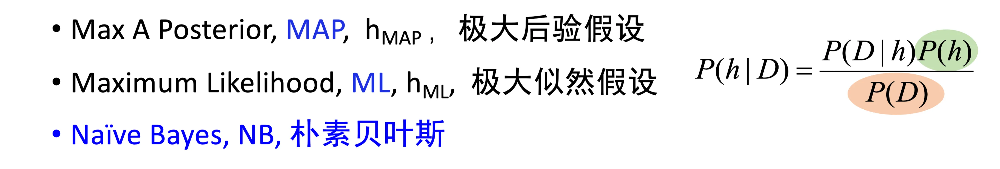

# KNN

- 关于连续取值的目标函数：选用 K 个近邻训练样例的均值
- KNN 是稳定的：小的扰动不会对分类结果有较大影响

- 距离加权：
	- 注意，这和属性加权是不一样的
	- 属性加权是为了得到更加精确的距离
	- 距离加权为了更好的用距离度量关系
	- 距离越近，权重越高，投票话语权越高，因此要与距离成负相关

- 4 个要素：
	- 选用什么距离？
	- 使用几个邻居？
	- 是否对距离加权？
	- 如何使用邻居？
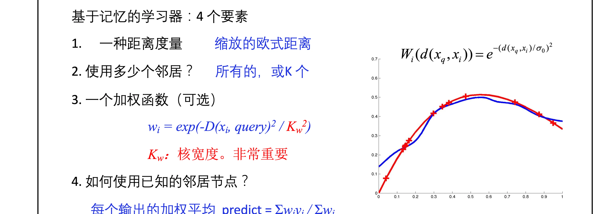

- 局部加权回归
	- 最小化加权均方误差
	- 用得到的参数来进行预测，而不是直接使用邻居的数据加权平均
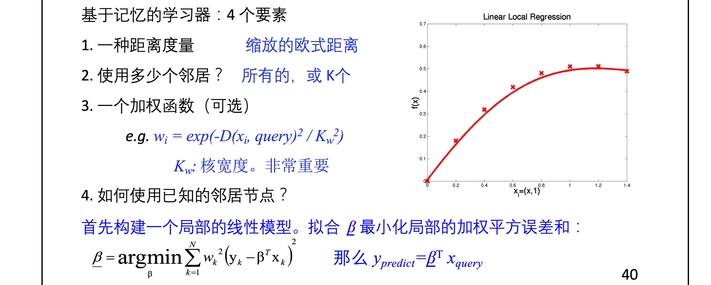

# 无监督学习

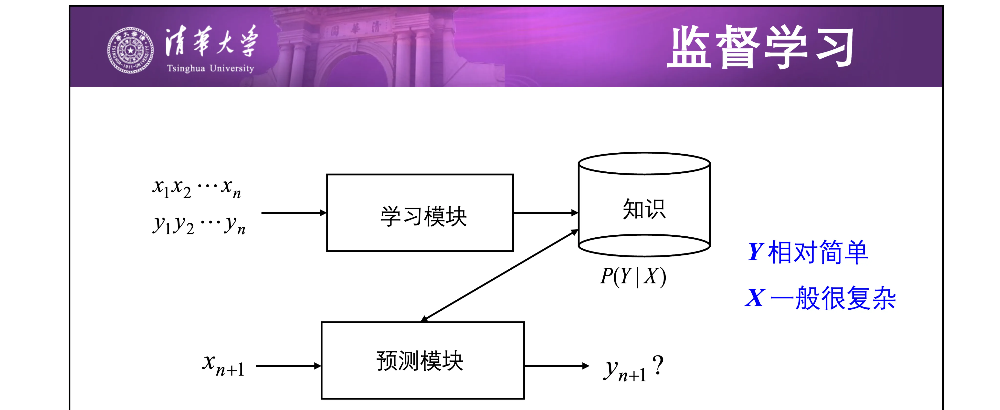
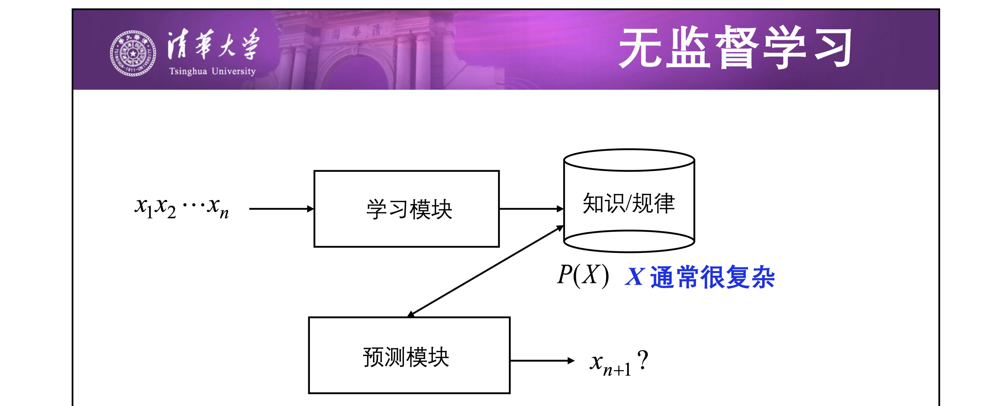
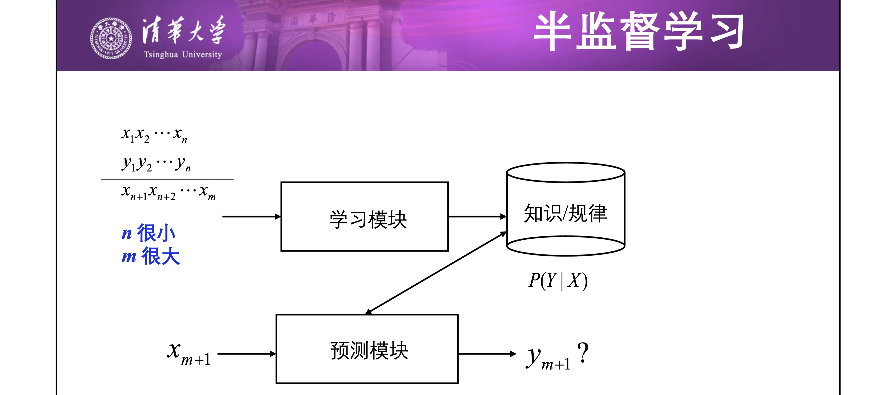

## K-means

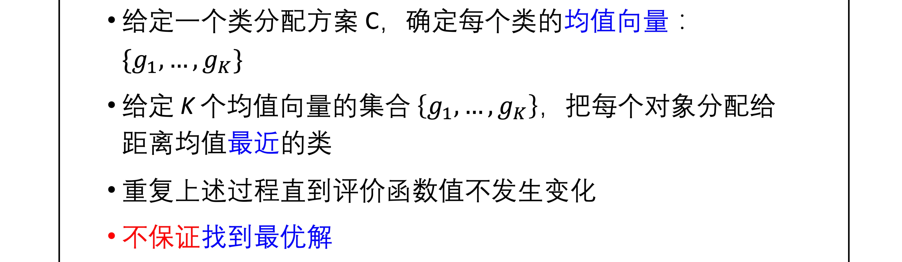

- 这里，均值向量：直接对类内的向量取平均值

- 如何确定 k 值？
	- 计算类内不相似度$W_k$，一般随着 k 增加 $W_k$减小
	- 观察到 $W_k$ 快速下降时，选该 k
	- 度量与**均匀分布**的 $W_k$ 间隔
- k-means的问题
	- 对**噪声和离群点**非常敏感

## K-medoids

- 用**最靠近类中心**的对象作为参考点，而非均值向量

- PAM 方法：用随机的非中心对象替换中心，效果好则保留
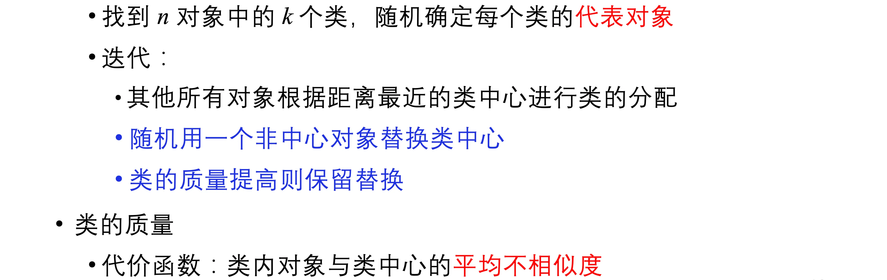
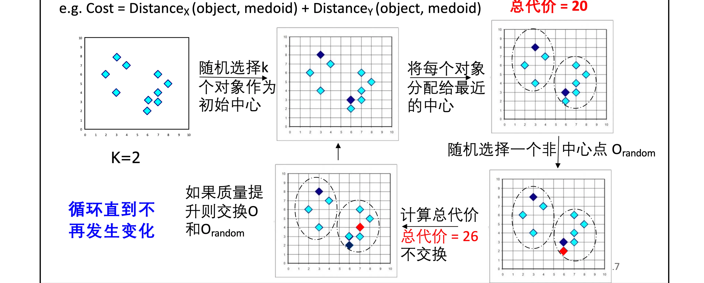

- K-medoids 优缺点
	- 优点：对噪音和孤立点更鲁棒
	- 缺点：慢、对大数据集效果不好

- CLARA
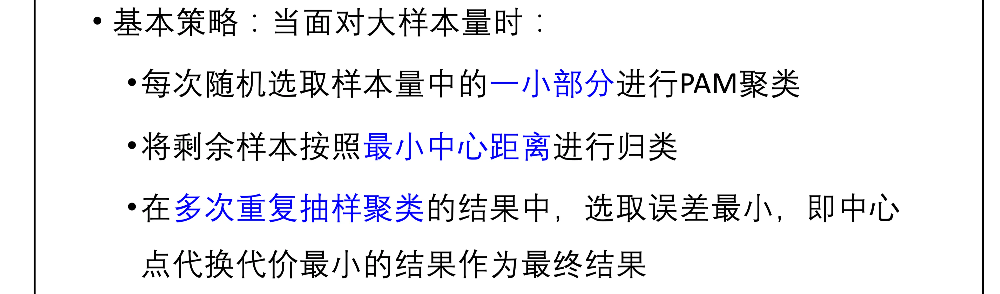

## 层次聚类

### 凝聚式层次聚类

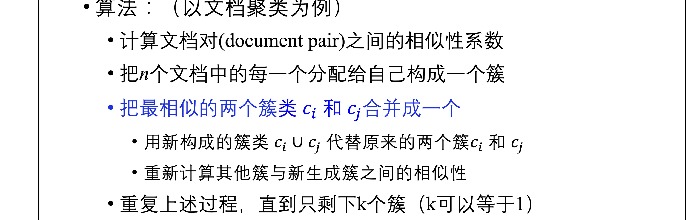
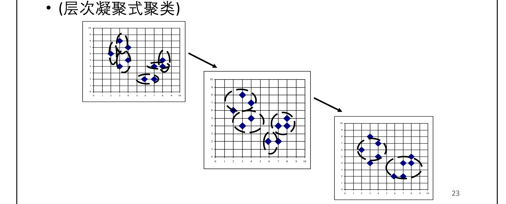

- 类相似度：
	- 两个类中，最相似的两个数据点之间的相似度
	- 最不相似的相似度
	- 所有数据点相似度的平均

### 分裂式层次聚类

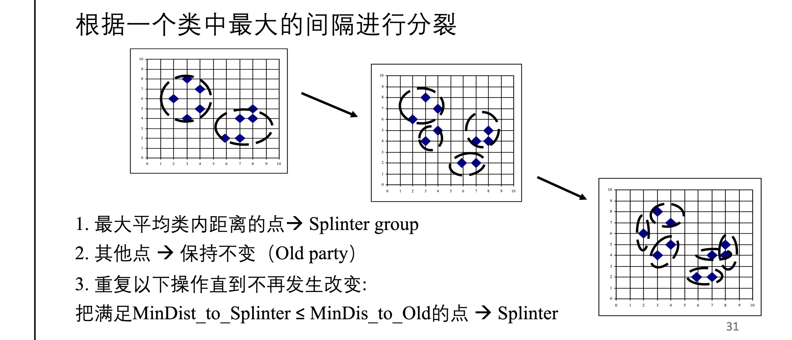

- 找出**最大平均类内距离**的点，作为要分裂出来的类的中心
- 把类中，距该点最近的点，放入新类中。最终得到新的分裂类。

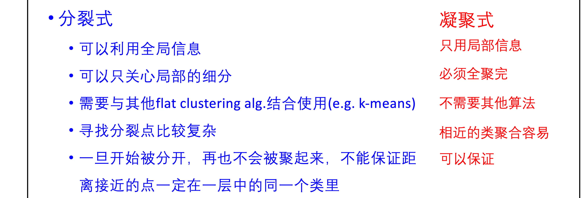

# 集成学习

- 加权多数算法：给每个学习器一个权重，对其输出加权，取权重最大的。
- stacking：将多个基学习器的输出，作为次学习器的输入，次学习器的输出作为最后的输出。

## bagging

- 在原始的 D 中**拔靴采样**（均匀随机有放回采样）得到多个数据集
	- 从 m 个原始样本中，**有放回**的采样**m**个样本，得到 $D_i$
- 在每个数据集上训练分类器，通过等权多数投票确定最后输出
- bagging 的适用情况：基学习器**不稳定**
	- 如决策树算法、神经网络
	- 而 KNN 是稳定的学习器，因此 bagging 效果不好
- 随机森林算法
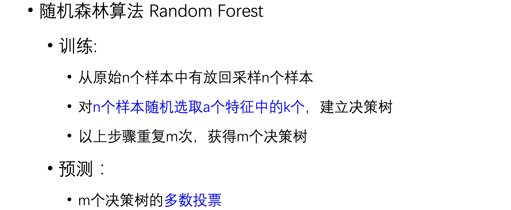

## Boosting

- 给每个样本权值，每轮迭代后，增大分类错误样本的权重
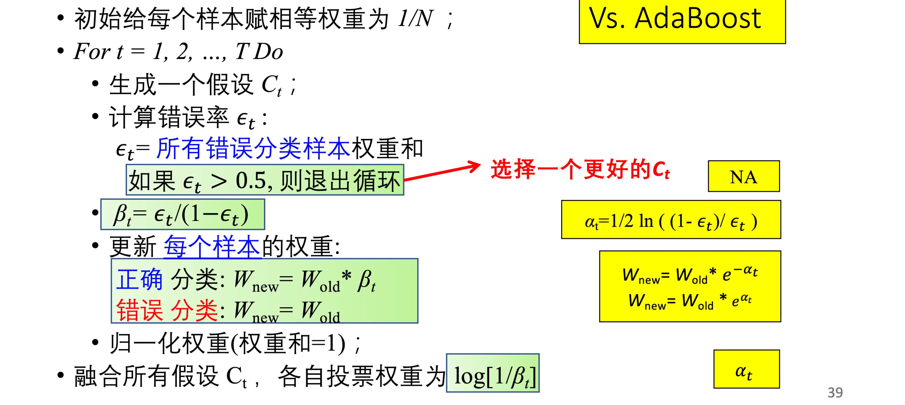

- 可以通过重采样来代替调整样本权重：
	- 根据样本的权值，决定其被抽样的概率
	- 更容易实现

# 假设评估

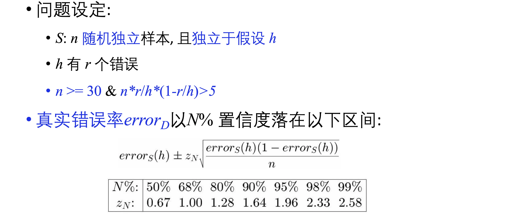

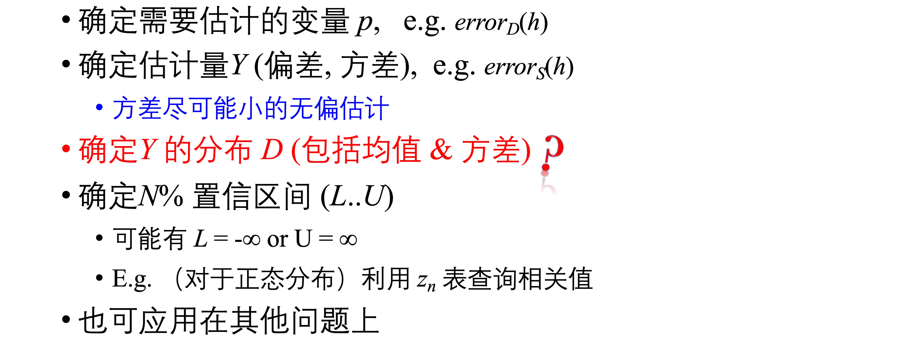

- 中心极限定理
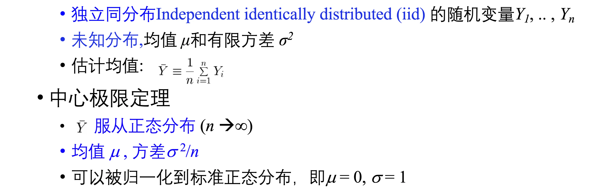

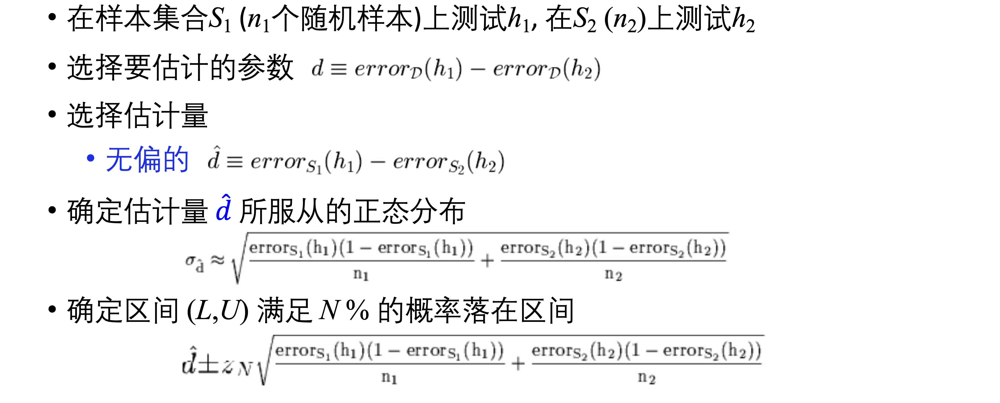

- 总之，确定了估计量的分布，就好求置信区间

- t 检验
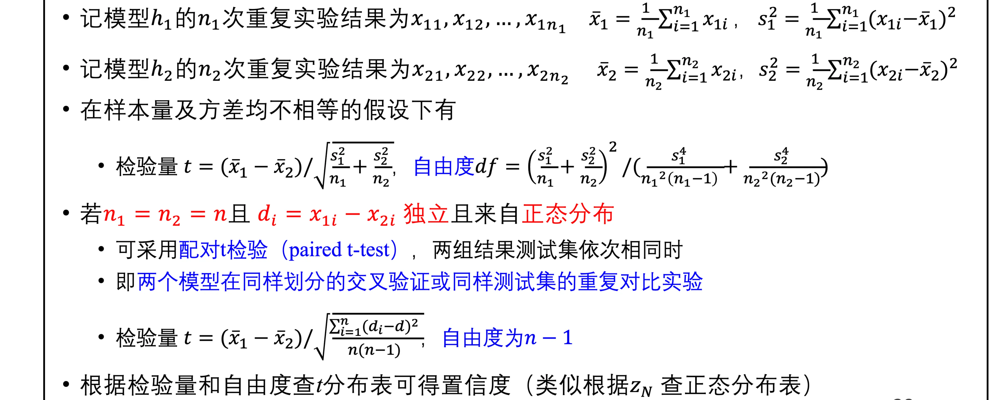

# 序列模型

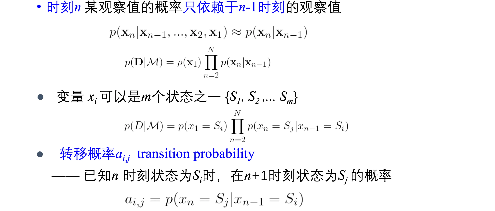

- HMM
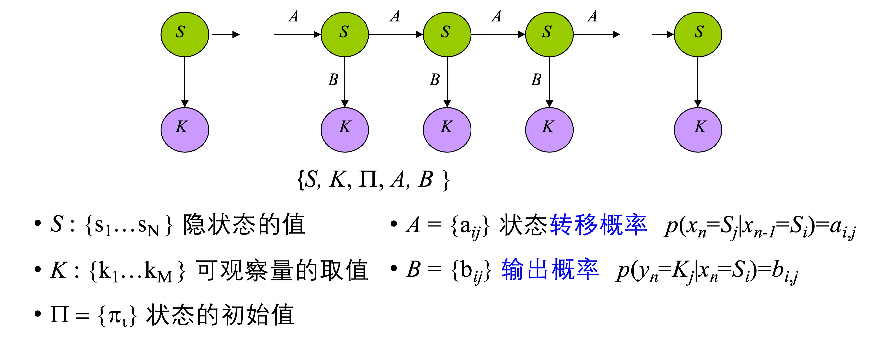
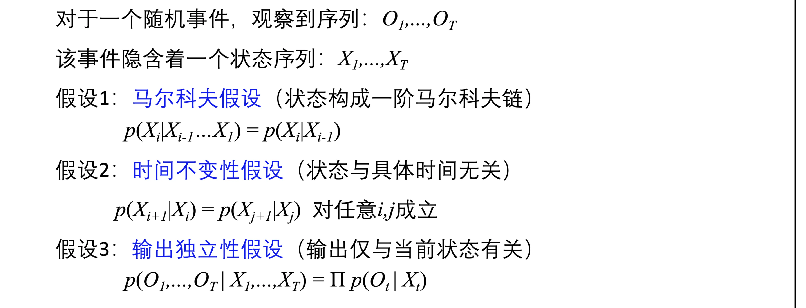

- HMM 的前向算法
	- 直观的：在观察到 $o_t$、t 时刻状态为 i，转移到 $o_{t + 1}$，t + 1 时刻状态为 j
	- 即列举所有可能的 i，乘上状态转移概率，再乘上状态观察概率

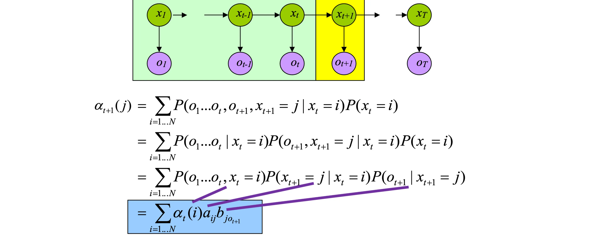

- Viterbi 算法
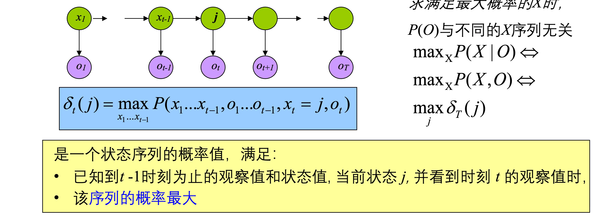
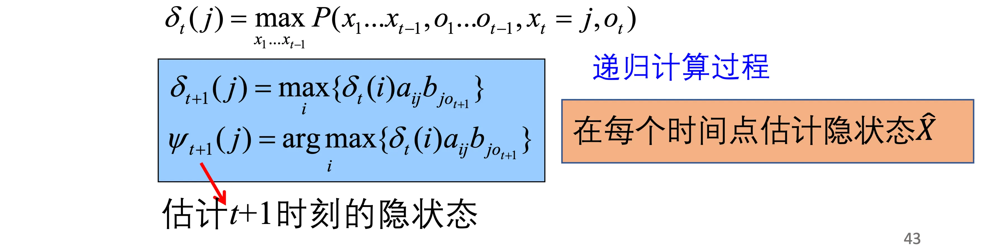

