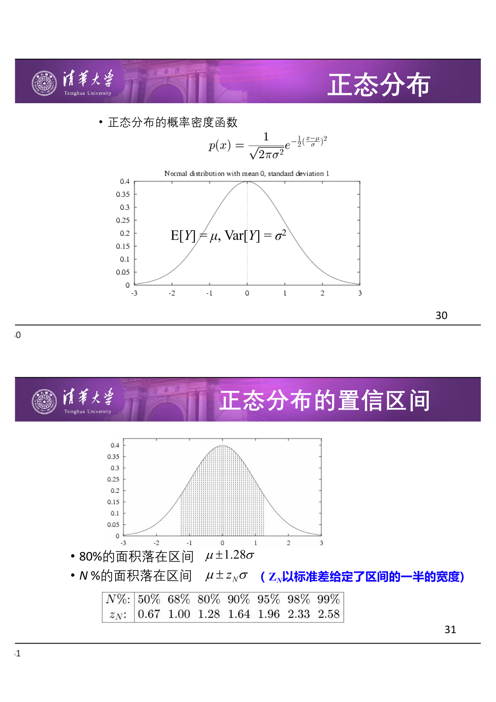
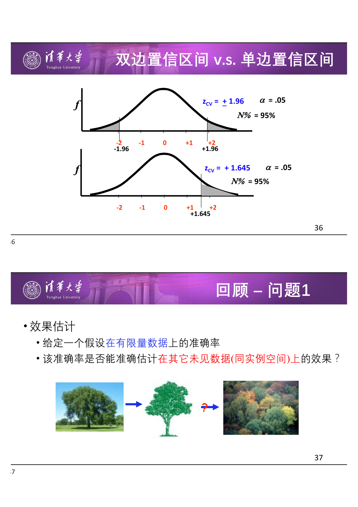

# 机器学习理论：假设评估

## 1 引言

机器学习理论的一个核心问题是：**给定一个假设 $h$，我们能在多大程度上相信它在未见数据上的表现？** 本章围绕假设评估（Hypothesis Evaluation），引入统计学中的采样理论、置信区间和中心极限定理等工具，建立从样本错误率推断真实错误率的严格框架。

---

## 2 基本概念

!!! abstract "定义 1：实例空间（Instance Space）$X$"

    所有可能的实例（样本）构成的集合。例如：每一天由属性（天空、气温、湿度、风、水、预报）描述，则 $X$ 为所有可能的属性组合。

!!! abstract "定义 2：假设空间（Hypothesis Space）$H$"

    学习器可能输出的所有假设的集合。例如：一个假设可以是 `if (温度 = 寒冷 AND 湿度 = 高) then 打网球 = 否`。

!!! abstract "定义 3：样例空间（Sample Space）$S$"

    实际能够获取到的样例集合，是 $X$ 的子集。即 $S \subseteq X$。

!!! abstract "定义 4：目标概念（Target Concept）$c$"

    样例的真实标记函数 $c: X \to \{0, 1\}$（二分类情形）。给定标注样本 $\langle x_1, c(x_1)\rangle, \dots, \langle x_m, c(x_m)\rangle$。

目标：寻找假设 $h \in H$，使得对所有 $x \in X$ 有 $h(x) = c(x)$。

!!! info "概念空间大小"

    若实例由 $n$ 个二值属性描述，实例空间 $X$ 包含 $2^n$ 个元素。假设空间 $H$ 最多有 $2^{2^n}$ 个元素（每个实例可以标记为正或负，所以对 $2^n$ 个实例的每一种标记组合都对应一个可能的假设）。

!!! warning "关键约束"

    通常 $X$ 非常大，我们无法保证 $h(x) = c(x)$ 对所有 $x \in X$ 都成立。作为替代，我们寻求一个好的近似—— 至少在所有已见样本 $S$ 上成立。

---

## 3 真实错误率与样本错误率

!!! abstract "定义 5：真实错误率（True Error）$\text{error}_D(h)$"

    假设 $h$ 在分布 $D$ 下误分类一个随机采样实例的概率：

    $$
    \text{error}_D(h) \equiv \Pr_{x \sim D}[c(x) \neq h(x)]
    $$

!!! abstract "定义 6：样本错误率（Sample Error）$\text{error}_S(h)$"

    假设 $h$ 在样本集 $S$ 上的错误率，可直接观测：

    $$
    \text{error}_S(h) \equiv \frac{1}{n} \sum_{i=1}^{n} \delta(c(x_i) \neq h(x_i))
    $$

    其中 $\delta(\cdot)$ 是指示函数，条件成立时为 $1$，否则为 $0$。

!!! tip "直觉"

    $\text{error}_D(h)$ 是「真实水平」—— 我们真正关心但观测不到的；$\text{error}_S(h)$ 是「考试成绩」—— 我们能看到但不一定代表真实水平。

---

## 4 假设评估的三个核心问题

### 4.1 问题 1：效果估计

!!! abstract "Q1.1 最佳估计"

    给定一个假设在有限量数据上的准确率，能否准确估计它在其他未见数据（同实例空间）上的效果？

!!! abstract "Q1.2 估计的不确定性"

    该准确率的估计可能包含多少错误？即 $\text{error}_S(h)$ 对 $\text{error}_D(h)$ 的估计有多好？

### 4.2 问题 2：假设比较

!!! abstract "问题 2"

    $h_1$ 在数据的一个样本集上表现优于 $h_2$，$h_1$ 总体上更好的概率有多大？

### 4.3 问题 3：数据使用策略

!!! abstract "问题 3"

    如何最好地使用有限数据 —— 既用于学习，也用于评估？数据分布可能与真实情况不同。

!!! info "Statistics（统计学）的定义"

    The mathematical study of the likelihood and probability of events occurring based on known information and inferred by taking a limited number of samples. —— Wolfram MathWorld

    核心思想：**通过有限的采样来推断未知的总体分布**。

---

## 5 采样理论基础

### 5.1 伯努利实验（Bernoulli Trial）

!!! abstract "定义 7：伯努利实验"

    只有两种输出的随机实验：成功（概率 $p$）或失败（概率 $q = 1-p$）。用随机变量 $X$ 记录成功次数。

**例**：抛硬币，正面朝上的概率为 $p$，抛 $n$ 次，观察到 $r$ 次正面朝上。

### 5.2 二项分布（Binomial Distribution）

!!! abstract "定义 8：二项分布 $B(n, p)$"

    $n$ 次独立伯努利实验中成功次数 $R$ 的分布：

    $$
    \Pr(R = r) = \binom{n}{r} p^r (1-p)^{n-r}
    $$

**二项分布的矩**：

- 均值（期望）：$\mu = \mathbb{E}[R] = np$
- 方差：$\sigma^2 = \operatorname{Var}[R] = np(1-p)$
- 标准差：$\sigma = \sqrt{np(1-p)}$

### 5.3 二项分布的应用条件

!!! abstract "适用条件"

    - 两个可能的输出（$Y = 0$ 或 $Y = 1$）
    - 每次尝试成功概率相等：$\Pr(Y_i = 1) = p$，$p$ 为常数
    - $n$ 次独立尝试，随机变量 $Y_1, \dots, Y_n$ **独立同分布（i.i.d.）**

---

## 6 回答问题 1.1：估计假设准确率

### 6.1 建模为二项分布

假设 $h$ 在 $n$ 个独立随机测试样本中误分类了 $r$ 个。将每次预测是否正确视为一次伯努利实验，则 $r \sim B(n, \text{error}_D(h))$。

- 样本错误率：$\text{error}_S(h) = \frac{r}{n}$
- 真实错误率 $p = \text{error}_D(h)$ 是未知参数，$\frac{r}{n}$ 是其点估计

!!! warning "样本量对估计可靠性的影响"

    $n = 100$, $r = 12$（12% 错误率）与 $n = 25$, $r = 3$（同样是 12% 错误率）—— 两者给出相同的点估计，但后者方差大得多，估计的可靠性差很多。

### 6.2 估计量的两个重要性质

!!! abstract "定义 9：估计的偏差（Bias）"

    $$
    \text{bias} \equiv \mathbb{E}[\text{error}_S(h)] - \text{error}_D(h)
    $$

!!! abstract "定义 10：估计的方差（Variance）"

    $$
    \operatorname{Var}[\text{error}_S(h)] = \mathbb{E}\left[(\text{error}_S(h) - \mathbb{E}[\text{error}_S(h)])^2\right]
    $$

!!! warning "偏差的来源"

    - 如果 $S$ 是训练集，则 $\text{error}_S(h)$ 是 **有偏** 的（偏乐观，因为 $h$ 是在 $S$ 上学习到的）
    - 对于 **无偏估计**（$\text{bias} = 0$），$h$ 和 $S$ 必须独立不相关地产生
    - **不要把训练集结果报告为测试结果！不要在测试集上调参！**

!!! tip "方差的影响"

    即使是 $S$ 的无偏估计，$\text{error}_S(h)$ 可能仍然和 $\text{error}_D(h)$ 不同。例如 $n=25$ 时，12% 的样本错误率对应 95% 置信区间宽度约 ±6.5%。

**理想估计**：无偏（$\text{bias}=0$）且方差尽可能小。

---

## 7 回答问题 1.2：置信区间

### 7.1 置信区间的定义

!!! abstract "定义 11：置信区间（Confidence Interval）"

    参数 $p$ 的 $N\%$ 置信区间是一个以 $N\%$ 的概率包含 $p$ 的区间。$N\%$ 称为 **置信度（Confidence Level）**。

置信区间描述估计的不确定性：
- 是我们期望真实值能够落入的区间
- 这种期望实现的概率为置信度
- 以平均值为中心，依赖于方差

!!! tip "直观例子"

    - 80% 的置信度，年龄：$[12, 24]$ —— 较窄的区间，但置信度较低
    - 99% 的置信度，年龄：$[3, 60]$ —— 几乎肯定包含真值，但区间太宽而无实际用处

**权衡**：置信度越高 → 区间越宽（保守性↑）；置信度越低 → 区间越窄（精确性↑）。

### 7.2 正态分布近似

!!! info "关键近似"

    对二项分布直接求置信区间较困难，但对 **足够大的样本量**（经验准则：$n \geq 30$, $np(1-p) > 5$），二项分布很好地近似于正态分布。

!!! abstract "正态分布 $\mathcal{N}(\mu, \sigma^2)$"

    概率密度函数：

    $$
    f(y) = \frac{1}{\sqrt{2\pi\sigma^2}} \exp\left(-\frac{(y-\mu)^2}{2\sigma^2}\right)
    $$

    - $\mathbb{E}[Y] = \mu$
    - $\operatorname{Var}[Y] = \sigma^2$

!!! abstract "正态分布的置信区间"

    - 80% 的面积落在区间 $\mu \pm 1.28\sigma$
    - $N\%$ 的面积落在区间 $\mu \pm z_N \sigma$，其中 $z_N$ 以标准差为单位给定了区间一半的宽度

**常用 $z$ 值**：

| 置信度 $N\%$ | $z_N$（双边） |
| :-------: | :-------: |
|    80%    |   1.28    |
|    90%    |   1.645   |
|    95%    |   1.96    |
|    99%    |   2.58    |

### 7.3 问题 1.2 的解答

!!! abstract "真实错误率的置信区间"

    若满足条件：$S$ 包含 $n \geq 30$ 个样本，与 $h$ 独立产生，且每个样本独立采样，则有约 95% 的概率 $\text{error}_D(h)$ 落在区间：

    $$
    \text{error}_S(h) \pm 1.96 \sqrt{\frac{\text{error}_S(h)(1 - \text{error}_S(h))}{n}}
    $$

等价表述：$\text{error}_D(h)$ 的 $N\%$ 置信区间为

$$
\text{error}_D(h) \in \left[\text{error}_S(h) - z_N \sqrt{\frac{\text{error}_S(h)(1-\text{error}_S(h))}{n}},\ \text{error}_S(h) + z_N \sqrt{\frac{\text{error}_S(h)(1-\text{error}_S(h))}{n}}\right]
$$

### 7.4 双边与单边置信区间

!!! abstract "双边置信区间（Two-sided）"

    同时给出上限和下限：$\Pr(L \leq p \leq U) = 1 - \alpha$。

!!! abstract "单边置信区间（One-sided）"

    只关心单侧边界：$\Pr(p \leq U) = 1 - \alpha/2$ 或 $\Pr(p \geq L) = 1 - \alpha/2$。

!!! tip "双边与单边的转换"

    由于正态分布的对称性，**双边的 $(1-\alpha)$ 置信度对应于单边的 $(1 - \alpha/2)$ 置信度**。

    例如：
    - 双边 95%（$\alpha = 0.05$）→ $z = 1.96$
    - 单边 95%（$\alpha = 0.05$）→ $z = 1.645$（等价于双边 90% 的 $z$ 值）

### 7.5 问题 1 解答总结

!!! abstract "问题 1 完整解答"

    **设定**：
    - $S$：$n$ 个随机独立样本，且独立于假设 $h$
    - $h$ 在 $S$ 上有 $r$ 个错误
    - $n \geq 30$ 且 $n \cdot \frac{r}{n} \cdot (1 - \frac{r}{n}) > 5$

    **结论**：真实错误率 $\text{error}_D(h)$ 以 $N\%$ 置信度落在区间

    $$
    \text{error}_S(h) \pm z_N \sqrt{\frac{\text{error}_S(h)(1 - \text{error}_S(h))}{n}}
    $$

    其中 $\text{error}_S(h) = \frac{r}{n}$。

---

## 8 推导置信区间的一般方法

!!! abstract "一般步骤"

    1. **确定需要估计的变量 $p$**，例如 $\text{error}_D(h)$
    2. **确定估计量 $Y$**（需考虑其偏差和方差），例如 $\text{error}_S(h)$
       - 选择方差尽可能小的 **无偏估计**
    3. **确定 $Y$ 的分布 $D_Y$**（包括均值和方差）
    4. **确定 $N\%$ 置信区间 $[L, U]$**
       - 可能有 $L = -\infty$ 或 $U = \infty$
       - 对于正态分布，利用 $z_N$ 表查询相关值
    5. 此方法可应用于其他类似问题

---

## 9 中心极限定理（Central Limit Theorem）

!!! abstract "定理 1：中心极限定理（CLT）"

    设 $Y_1, Y_2, \dots, Y_n$ 为独立同分布（i.i.d.）的随机变量，来自 **任意分布**，具有均值 $\mu$ 和有限方差 $\sigma^2$。

    定义样本均值 $\bar{Y}_n = \frac{1}{n}\sum_{i=1}^{n} Y_i$。则当 $n \to \infty$ 时：

    $$
    \bar{Y}_n \sim \mathcal{N}\left(\mu, \frac{\sigma^2}{n}\right)
    $$

    等价地，标准化后收敛到标准正态分布：

    $$
    \frac{\bar{Y}_n - \mu}{\sigma / \sqrt{n}} \sim \mathcal{N}(0, 1)
    $$

!!! tip "CLT 的意义"

    - **即使 $Y_i$ 的原始分布是未知的**，样本均值的分布也已知（近似正态）
    - 这为 **任意估计量** 的置信区间构建提供了统一基础
    - 前提：样本独立同分布、方差有限、$n$ 足够大

!!! warning "CLT 的局限"

    CLT 给出的是 **渐近** 结果（$n \to \infty$），有限样本下近似的质量依赖于原始分布的形态和样本量。实际中 $n \geq 30$ 通常可接受。

---

## 10 回答问题 2：假设比较

### 10.1 问题设定

!!! abstract "问题 2"

    $h_1$ 在数据的一个样本集上表现优于 $h_2$，$h_1$ 总体上更好的概率有多大？

核心思路：将两个假设的比较转化为 **错误率之差** 的置信度问题。

### 10.2 错误率差异的分布

设在样本集 $S_1$（$n_1$ 个随机样本）上测试 $h_1$，在 $S_2$（$n_2$ 个随机样本）上测试 $h_2$。

!!! abstract "定义 12：错误率差异估计量 $\hat{d}$"

    $$
    \hat{d} \equiv \text{error}_{S_1}(h_1) - \text{error}_{S_2}(h_2)
    $$

    其期望为真实错误率之差：

    $$
    d \equiv \text{error}_D(h_1) - \text{error}_D(h_2)
    $$

    $\hat{d}$ 是 $d$ 的 **无偏估计**。

!!! abstract "$\hat{d}$ 的分布"

    由中心极限定理，$\text{error}_{S_1}(h_1)$ 和 $\text{error}_{S_2}(h_2)$ 均近似正态分布。两个独立正态随机变量之差仍为正态分布，因此 $\hat{d}$ 也近似服从正态分布：

    $$
    \hat{d} \sim \mathcal{N}\left(d,\ \sigma_{\hat{d}}^2\right)
    $$

    其中方差为两估计量方差之和：

    $$
    \sigma_{\hat{d}}^2 \approx \frac{\text{error}_{S_1}(h_1)(1 - \text{error}_{S_1}(h_1))}{n_1} + \frac{\text{error}_{S_2}(h_2)(1 - \text{error}_{S_2}(h_2))}{n_2}
    $$

### 10.3 假设检验与 $z$ 检验

!!! abstract "假设检验（Hypothesis Test）"

    判断某个陈述为真的概率。例如：$\text{error}_D(h_1) > \text{error}_D(h_2)$ 的概率，即 $d > 0$ 的概率。

给定观测差异 $\hat{d}$，求 $d > 0$ 的置信度等价于求 $\hat{d} < d + \hat{d}$ 的概率（即观测值落在真实均值 $+ \hat{d}$ 范围内的概率）。

!!! abstract "$z$ 检验步骤"

    1. 计算 $\hat{d} = \text{error}_{S_1}(h_1) - \text{error}_{S_2}(h_2)$
    2. 估计标准差 $\sigma_{\hat{d}}$
    3. 计算 $z_N = \hat{d} / \sigma_{\hat{d}}$
    4. 查正态分布表得双边置信度，转换为单边置信度

### 10.4 $z$ 检验示例

**示例 1**（$n_1 = n_2 = 100$）：

- $\text{error}_{S_1}(h_1) = 0.3$，$\text{error}_{S_2}(h_2) = 0.2$
- $\hat{d} = 0.1$

$$
\begin{aligned}
\sigma_{\hat{d}} &\approx \sqrt{\frac{0.3 \times 0.7}{100} + \frac{0.2 \times 0.8}{100}} = \sqrt{0.0021 + 0.0016} = 0.061 \\[6pt]
z_N &= \frac{0.1}{0.061} = 1.64
\end{aligned}
$$

查表得双边置信度为 90%，因此 **单边置信度为 95%**。即 $\text{error}_D(h_1) > \text{error}_D(h_2)$ 的置信度为 95%。

**示例 2**（$n_1 = n_2 = 30$，其余相同）：

- $\hat{d} = 0.1$，但样本量减小

$$
\sigma_{\hat{d}} \approx \sqrt{\frac{0.3 \times 0.7}{30} + \frac{0.2 \times 0.8}{30}} = 0.111
$$

$z_N = 0.1 / 0.111 = 0.90$，双边置信度 68%，**单边置信度仅 84%**。

!!! warning "样本量的影响"

    同样的错误率差异（0.1），$n=100$ 时置信度 95%，$n=30$ 时仅 84%。样本量越小，方差越大，结论越不可靠。

!!! tip "双边与单边的转换（回忆 7.4 节）"

    求 $d > 0$ 的置信度是 **单边** 问题。若 $\hat{d} = z_N \sigma_{\hat{d}}$，则单边置信度 $= 1 - \alpha/2$，其中 $\alpha$ 对应双边置信度 $1 - \alpha$ 下 $z_N$ 的值。

---

## 11 回答问题 3：数据使用策略

### 11.1 问题设定

!!! abstract "问题 3"

    如何最好地使用有限数据 —— 既用于学习，也用于评估？数据分布可能与真实情况不同。

### 11.2 学习算法的比较框架

我们希望比较两个学习算法 $L_A$ 和 $L_B$ 的期望性能：

$$
\mathbb{E}_{S \sim D}\left[\text{error}_D(L(S))\right]
$$

其中 $L(S)$ 是算法 $L$ 在训练集 $S$ 上训练后输出的假设，期望是对所有可能的训练集 $S \sim D$ 取的。

实际中只有一个固定数据集 $D_0$，需要将其分割为训练集 $S$ 和测试集 $T_0$：

$$
\text{error}_{T_0}(L_A(S)) \quad \text{vs.} \quad \text{error}_{T_0}(L_B(S))
$$

!!! tip "配对测试（Paired Test）"

    在 **相同的训练/测试划分** 上比较两个算法，可以消除因数据划分不同引入的方差，使比较更精确。

### 11.3 $k$ 折交叉验证（$k$-Fold Cross Validation）

!!! abstract "定义 13：$k$ 折交叉验证"

    将数据集 $D_0$ 划分为 $k$ 个大小相等、互不相交的子集，每个子集至少 30 个样本。依次以每个子集作为测试集，其余 $k-1$ 个子集作为训练集，进行 $k$ 次训练和测试。

!!! info "$k$ 折交叉验证的性质"

    - **训练集之间不独立**（有大量重叠），但 **测试集之间是独立的**
    - 每次在同一测试子集上对比算法 A 和 B，构成配对比较
    - 虽然不是完美的独立实验，但比单次划分更可靠

!!! warning "其他抽样方法的缺陷"

    每次随机抽取测试集（至少 30 个样例）的方法，如果数据集不够大，测试集之间会重叠而不独立。

### 11.4 随机重复实验的 $t$ 检验

当随机变量的样本个数较少时（如多次重复实验），$z$ 检验不再适用，应使用 **$t$ 检验**。

!!! abstract "定义 14：两样本 $t$ 检验（Welch's $t$-test）"

    设模型 $h_1$ 的 $n_1$ 次重复实验结果 $x_{11}, x_{12}, \dots, x_{1n_1}$，样本均值 $\bar{x}_1$，样本方差 $s_1^2$；模型 $h_2$ 同理。

    在样本量和方差不等的假设下：

    $$
    t = (\bar{x}_1 - \bar{x}_2) \bigg/ \sqrt{\frac{s_1^2}{n_1} + \frac{s_2^2}{n_2}}
    $$

    自由度：

    $$
    df = \left(\frac{s_1^2}{n_1} + \frac{s_2^2}{n_2}\right)^2 \bigg/ \left(\frac{(s_1^2/n_1)^2}{n_1 - 1} + \frac{(s_2^2/n_2)^2}{n_2 - 1}\right)
    $$

    根据 $t$ 和 $df$ 查 $t$ 分布表可得置信度。

### 11.5 配对 $t$ 检验（Paired $t$-Test）

!!! abstract "定义 15：配对 $t$ 检验"

    若 $n_1 = n_2 = n$ 且 $d_i = x_{1i} - x_{2i}$ 独立且来自正态分布（即两个模型在 **同样划分** 的交叉验证或同样测试集的重复对比实验），可使用更强大的配对 $t$ 检验：

    $$
    t = (\bar{x}_1 - \bar{x}_2) \bigg/ \sqrt{\frac{\sum_{i=1}^{n}(d_i - \bar{d})^2}{n(n-1)}}
    $$

    自由度为 $n - 1$。

!!! tip "配对 $t$ 检验的优势"

    当两组结果在相同的测试集上获得时，$d_i$ 的方差远小于两独立样本的方差之和，因此配对 $t$ 检验的统计功效更强，更容易检测到显著差异。

---

## 12 统计有效性检验总结

| | $z$ 检验 | $t$ 检验 |
|:---|:---|:---|
| **适用场景** | 随机变量样本数较多（单次评测） | 随机变量样本数较少（多次重复实验） |
| **随机变量** | 每个测试样本的对错 | 每次测试集上的指标 |
| **理论基础** | 中心极限定理 → 正态分布 | $t$ 分布 |
| **典型用法** | 比较两个假设在单次测试集上的错误率差异 | 比较两个算法在多次交叉验证或重复实验中的平均性能差异 |

!!! warning "注意"

    - $z$ 检验要求 $n \geq 30$ 且满足正态近似条件
    - $t$ 检验不要求已知总体方差，用小样本的样本方差估计
    - 配对检验（paired test）在相同测试集上比较时更有效

---

## 13 小结：假设评估的三个问题

| 问题 | 核心方法 |
|:---|:---|
| **问题 1**：假设的精度 | 二项分布 → 正态分布 → 置信区间与置信度 |
| **问题 2**：假设比较 | 错误率之差 → $z$ 检验 → 单边置信度 |
| **问题 3**：数据使用策略 | $k$ 折交叉验证 + 配对 $t$ 检验 |

---

## 14 总结

| 概念 | 公式 / 要点 |
|:---|:---|
| 样本错误率 | $\text{error}_S(h) = \frac{r}{n}$ |
| 真实错误率 | $\text{error}_D(h) = \Pr_{x\sim D}[c(x) \neq h(x)]$ |
| 二项分布 | $\Pr(R=r) = \binom{n}{r}p^r(1-p)^{n-r}$，$\mu=np$, $\sigma^2=np(1-p)$ |
| 估计偏差 | $\text{bias} = \mathbb{E}[\text{error}_S(h)] - \text{error}_D(h)$ |
| 95% 置信区间 | $\text{error}_S(h) \pm 1.96\sqrt{\frac{\text{error}_S(h)(1-\text{error}_S(h))}{n}}$ |
| 中心极限定理 | $\bar{Y}_n \xrightarrow{d} \mathcal{N}(\mu, \frac{\sigma^2}{n})$ |
| 错误率差异方差 | $\sigma_{\hat{d}}^2 \approx \frac{\text{error}_{S_1}(1-\text{error}_{S_1})}{n_1} + \frac{\text{error}_{S_2}(1-\text{error}_{S_2})}{n_2}$ |
| $z$ 检验 | $z_N = \hat{d}/\sigma_{\hat{d}}$，查正态分布表得置信度 |
| 配对 $t$ 检验 | $t = (\bar{x}_1 - \bar{x}_2) / \sqrt{\sum(d_i-\bar{d})^2 / (n(n-1))}$，$df = n-1$ |

**核心方法论**：通过有限采样的统计性质（二项分布 → 正态近似 → 置信区间）来量化从样本错误率推断真实错误率的不确定性。在此基础上，利用 $z$ 检验比较假设间的差异显著性，利用 $k$ 折交叉验证和 $t$ 检验在有限数据下公平比较学习算法。这一框架不仅是假设评估的理论基础，也是机器学习实验方法论的基石。
