# 集成学习（Ensemble Learning）

## 1 集成学习简介

### 1.1 背景与直觉

集成学习（Ensemble Learning）的核心思想是融合多个学习器的预测结果来提升整体性能。

!!! tip "直觉"

    「Two heads are better than one.」「三个臭皮匠，顶个诸葛亮。」—— 把对同一问题的多个预测结果综合起来考虑，精度通常比单一学习方法更好。

### 1.2 为什么集成学习有效

!!! abstract "理由 1：经验法则易得，精确规则难求"

    很容易找到非常正确的「rules of thumb（经验法则，指在实践中广泛有效但不保证绝对精确的启发式规则）」，但是很难找到单个的高准确率规则。

!!! abstract "理由 2：训练样本稀少时存在多个等优假设"

    如果训练样本很少，而假设空间很大，则存在多个同样精度的假设。选择某一个假设可能在测试集上效果较差。

!!! abstract "理由 3：降低局部最优风险"

    算法可能收敛到局部最优解，融合不同假设可降低收敛到差的局部最优的风险。此外，在假设空间中穷举式全局搜索代价太大，因此可以结合一些局部预测较准确的假设。

!!! abstract "理由 4：真实假设不在假设空间中"

    由当前算法定义的假设空间不包括真实的假设，但有一些不错的近似。融合这些近似可以逼近真实假设。

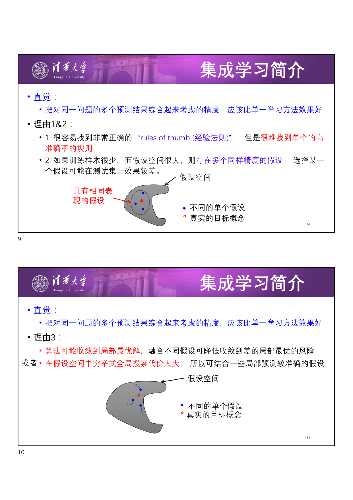

### 1.3 集成有效的前提：分类器多样且不差

!!! warning "集成有效的前提"

    分类器效果 **不能太差** 且彼此之间 **要有差异**（different）。如果所有分类器犯相同的错误，集成不会带来任何提升。

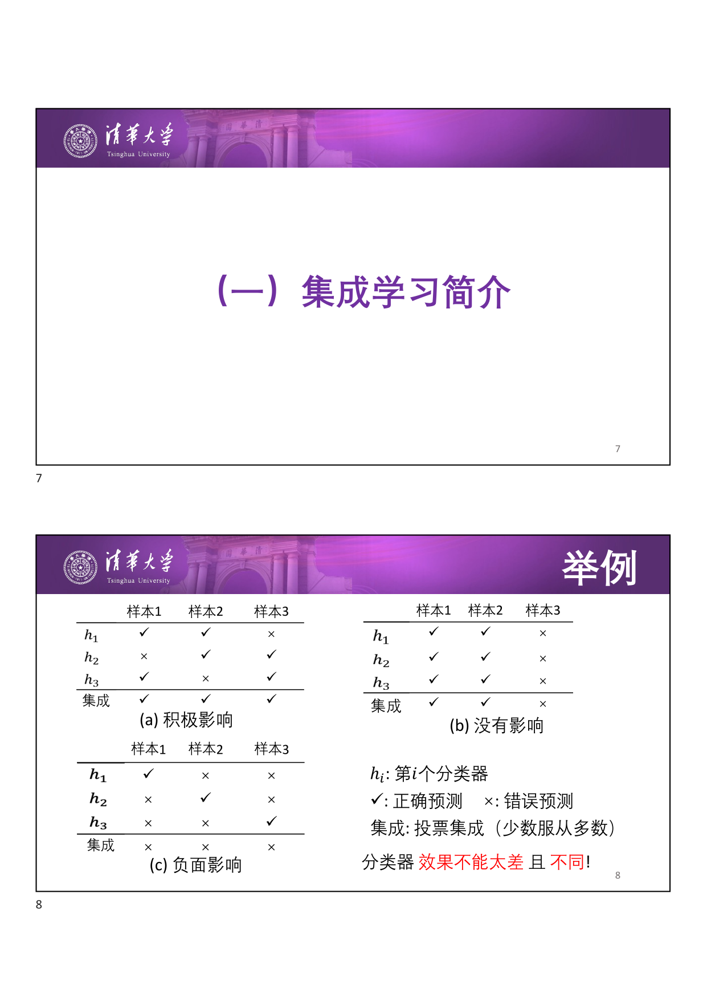

上图展示了三种情形：
- **(a) 积极影响**：三个分类器各自在某些样本上犯错，但多数投票后集成结果全对；
- **(b) 没有影响**：三个分类器在相同的样本上犯错，集成结果与单个分类器一致；
- **(c) 负面影响**：三个分类器各自在不同样本上犯错且错误占多数，集成后反而全错。

### 1.4 强学习器与弱学习器

!!! abstract "定义：强学习器 vs 弱学习器"

    - **强学习器（Strong Learner）**：具有高准确度的学习算法。
    - **弱学习器（Weak Learner）**：在任何训练集上可以做到比随机预测略好的学习算法，即错误率 $\varepsilon = \frac{1}{2} - \gamma$（其中 $\gamma > 0$ 为一个小的正数）。

核心问题：**能否把弱学习器增强成一个强学习器？** 这是集成学习要回答的关键问题。

### 1.5 集成学习基本框架

- 算法池（pool）中的每一个学习器都有其权重；
- 当需要对一个新的实例作预测时，每个学习器作出自己的预测，主算法根据权值合并结果，作出最终预测。

### 1.6 集成策略概览

| 策略 | 简述 |
| --- | --- |
| **平均法** | 简单平均、加权平均 |
| **投票法** | 多数投票法、加权投票法 |
| **学习法** | 加权多数（Weighted Majority）、Stacking、Bagging、Boosting |

---

## 2 加权多数算法（Weighted Majority Algorithm）

### 2.1 预测机制

加权多数算法维护一个算法池 $A = \{a_1, a_2, \dots, a_n\}$，每个算法 $a_i$ 对应权重 $w_i$。假设二值输出 $\{0, 1\}$。

对于输入 $x$，计算加权投票：

$$
q_0 = \sum_{i: a_i(x)=0} w_i, \quad q_1 = \sum_{i: a_i(x)=1} w_i
$$

最终预测：

$$
\hat{y} = \begin{cases} 0 & \text{if } q_0 > q_1 \\ 1 & \text{otherwise} \end{cases}
$$

!!! info "扩展"

    此框架很容易扩展为非二值输出问题（如多分类、回归）。

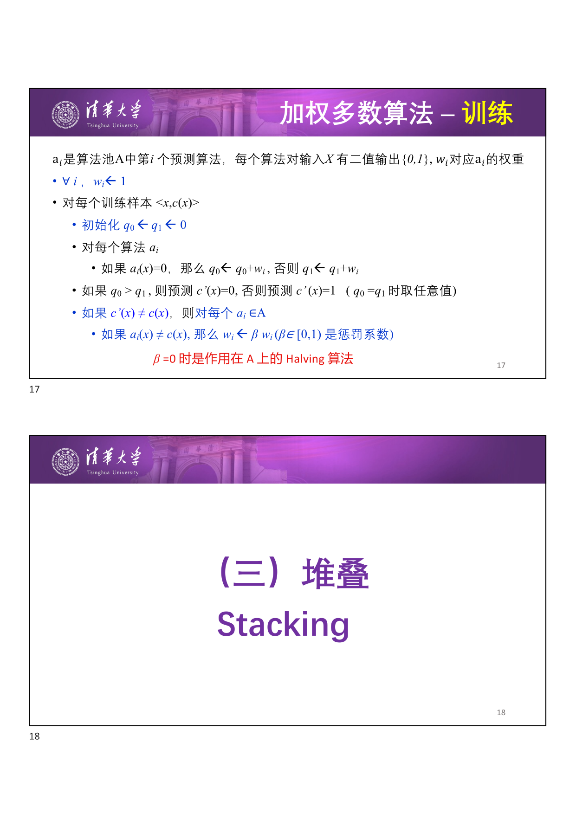

### 2.2 训练（权重更新）

训练过程中，对分类错误的算法施以惩罚，降低其权重：

**初始化**：$\forall i,\; w_i \leftarrow 1$

对每个训练样本 $\langle x, c(x) \rangle$：
1. 计算 $q_0, q_1$，得到集成预测 $c'(x)$
2. 若 $c'(x) \neq c(x)$（预测错误），则对每个 $a_i \in A$：
   - 若 $a_i(x) \neq c(x)$，则 $w_i \leftarrow \beta \cdot w_i$，其中 $\beta \in [0, 1)$ 为惩罚系数

!!! tip "特例：Halving 算法"

    当 $\beta = 0$ 时，错误分类的算法权重直接清零，等价于 Halving 算法（每次淘汰所有犯错的算法）。

---

## 3 堆叠（Stacking）

### 3.1 基本思想

Stacking 是一种 **层次融合** 方法，通过元学习器（meta-learner）学习如何组合基学习器的输出。

!!! abstract "Stacking 流程"

    给定数据 $\langle x_i, y_i \rangle$：

    1. $K$ 个基学习器 $M_1, M_2, \dots, M_K$ 分别对每个 $x_i$ 输出 $\hat{y}_{i1}, \hat{y}_{i2}, \dots, \hat{y}_{iK}$
    2. 将基学习器的输出作为 **元学习器（meta-learner）** 的输入特征：$\langle [\hat{y}_{i1}, \hat{y}_{i2}, \dots, \hat{y}_{iK}], y_i \rangle$
    3. 元学习器的输出作为最终预测 $\hat{y}_i'$

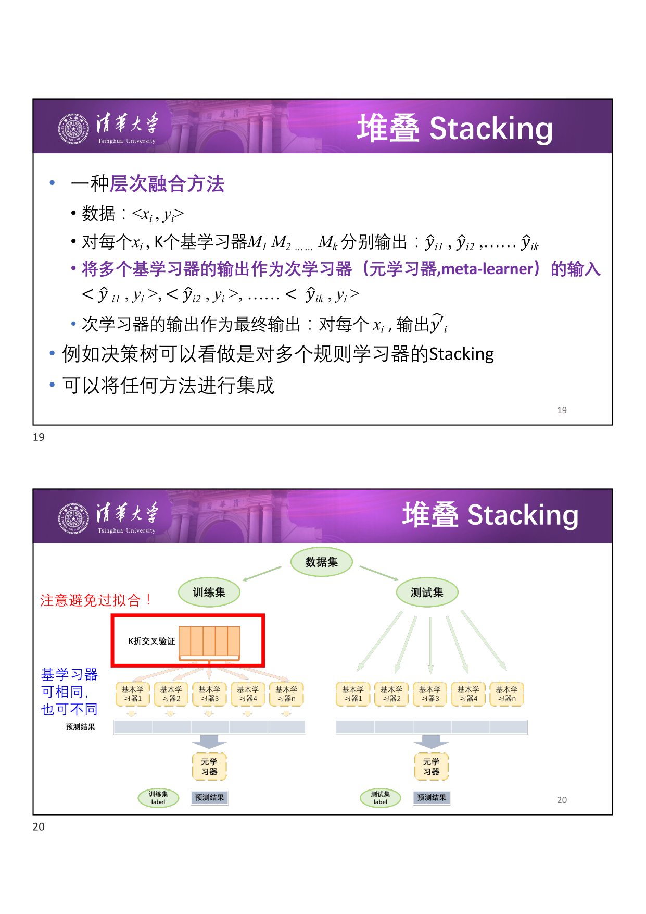

!!! tip "理解"

    例如决策树可以看作是对多个规则学习器的 Stacking。Stacking 可以将任意方法进行集成，基学习器可以相同也可以不同。

!!! warning "注意事项"

    Stacking 容易过拟合，需要合理设计交叉验证策略。

---

## 4 Bagging

### 4.1 直觉与动机

如果我们只有一个弱学习器，如何通过集成来提升它的表现？核心思路是通过 **不同的数据子集** 训练出不同的模型。

!!! warning "朴素方法的局限"

    直接从训练集中采样不同子集进行训练 —— 模型会大不相同，但效果可能并不好（数据量减少）。

解决方法：**拔靴法采样（Bootstrap Sampling）**。

### 4.2 Bootstrap 采样

!!! abstract "定义：Bootstrap Sampling（拔靴法/自举法采样）"

    给定集合 $D$，含有 $m$ 个训练样本。通过从 $D$ 中 **均匀随机地有放回采样**（drawn with replacement）$m$ 个样本，构建新的训练集 $D_i$。

由于是有放回采样，$D_i$ 中有些样本会出现多次，有些样本不会出现（约 36.8% 的样本不会被抽中，可作为 out-of-bag 验证）。

!!! info "历史"

    Bootstrap 由 Bradley Efron（斯坦福大学统计学教授）于 1993 年提出。Bagging 由 Leo Breiman 于 1994 年在 Berkeley 提出。

### 4.3 Bagging 算法

!!! abstract "Bagging（Bootstrap Aggregating）"

    由 Leo Breiman 于 1994 年提出。

    **训练**：For $t = 1, 2, \dots, T$：
    1. 从训练集 $S$ 中拔靴采样产生 $D_t$
    2. 在 $D_t$ 上训练一个分类器 $H_t$

    **预测**：对新的样本 $x$，通过 $H_t$ 的多数投票（等权重）决定最终类别：

    $$
    H(x) = \arg\max_{y} \sum_{t=1}^{T} \mathbb{I}[H_t(x) = y]
    $$

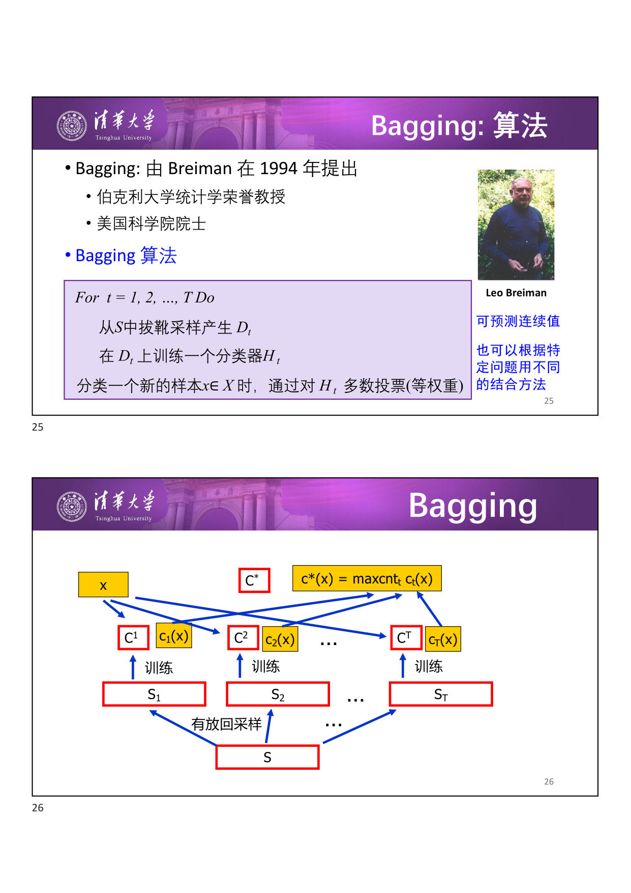

!!! info "扩展"

    Bagging 也可用于回归 —— 将多数投票替换为取平均值即可。

### 4.4 Bagging 效果分析

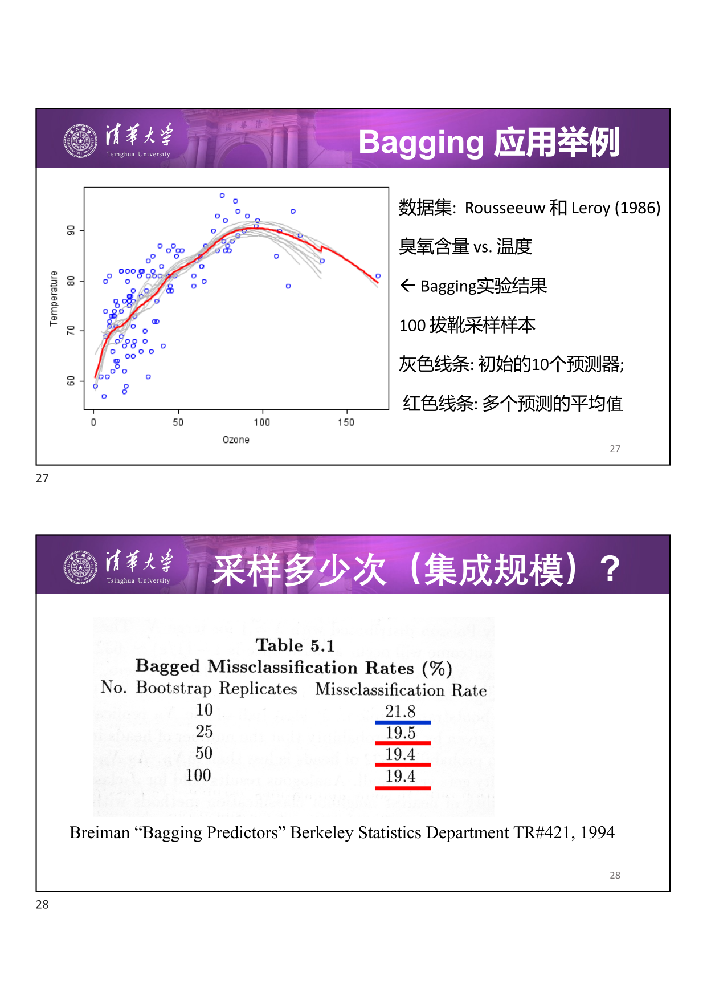

上图展示了 Bagging 在臭氧含量 vs 温度数据集上的应用（Rousseeuw & Leroy, 1986）。灰色线条为初始的 10 个预测器，红色线条为 100 个拔靴采样样本训练的预测器取平均后的结果 —— 可见集成后的曲线更平滑、更稳定。

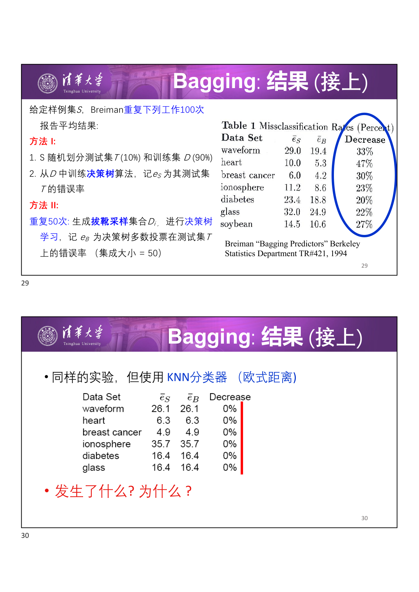

实验（Breiman, 1994）表明：Bagging 对决策树等不稳定学习器有明显提升，但对 KNN 等稳定学习器几乎没有效果。

!!! abstract "核心洞察：不稳定性是关键"

    Bagging 在学习器 **不稳定（unstable）** 时有用。不稳定的含义是：训练集的微小差异可以导致产生的假设大不相同。例如：决策树、神经网络。

    「如果打乱训练集可以造成产生的预测器大不相同，则 Bagging 算法可以提升其准确率。」—— Breiman, 1996

!!! tip "为什么 Bagging 对 KNN 无效？"

    KNN 作为基于距离的惰性学习方法，对训练集的微小扰动不敏感（稳定学习器），因此 Bagging 无法产生足够多样化的基学习器。

### 4.5 随机森林（Random Forest）

随机森林是 Bagging 的一种特殊变体，在样本采样的基础上进一步引入 **特征采样**。

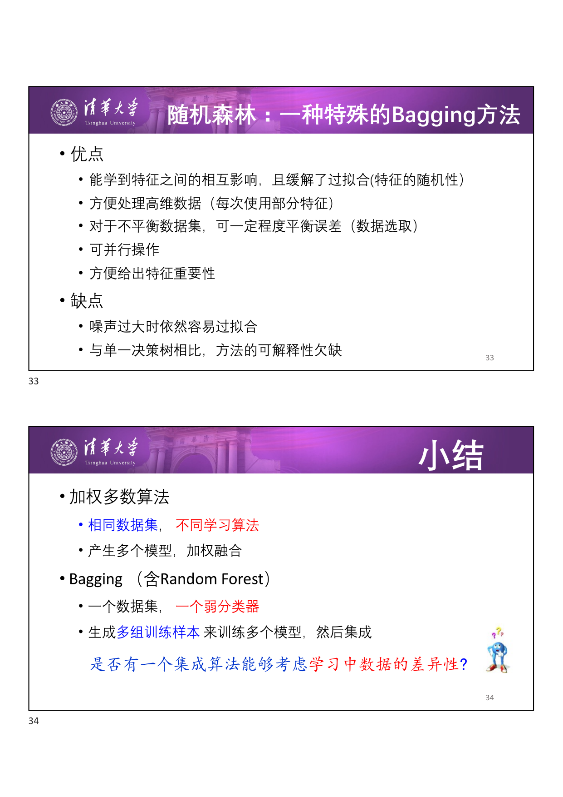

!!! abstract "随机森林算法"

    **训练**：

    - 从原始 $n$ 个样本中有放回采样 $n$ 个样本
    - 在该样本集上，随机选取 $a$ 个特征中的 $k$ 个（$k < a$），建立决策树
    - 以上步骤重复 $m$ 次，获得 $m$ 个决策树

    **预测**：$m$ 个决策树的多数投票。

**优点**：
- 能学到特征之间的相互影响，且通过特征的随机性缓解了过拟合
- 方便处理高维数据（每次只使用部分特征）
- 对于不平衡数据集，可一定程度平衡误差
- 可并行操作
- 方便给出特征重要性

**缺点**：
- 噪声过大时依然容易过拟合
- 与单一决策树相比，可解释性欠缺

---

## 5 Boosting

### 5.1 基本思想

Boosting 的核心理念是 **「从失败中学习」**：在每一轮迭代中，增大上一轮错误分类样本的权重，使后续分类器更关注「难」样本。

!!! abstract "Boosting 框架"

    给每个样本一个权值。$T$ 轮迭代，每轮：

    1. 在带权样本集合上训练一个分类器 $C_t$
    2. 根据分类结果调整样本权重 —— 错误分类的样本权重增大
    3. 继续下一轮

    最终融合所有分类器的结果。

!!! info "历史"

    - Kearns & Valiant (1988)：提出寻找 Boosting 算法的开放问题
    - Schapire (1989), Freund (1990)：第一个多项式时间的 Boosting 算法
    - Drucker, Schapire & Simard (1992)：首次在实验中使用 Boosting
    - **Freund & Schapire (1995)**：提出 **AdaBoost** 算法，相比之前的 Boosting 算法在实际使用中优势巨大

### 5.2 AdaBoost 算法

!!! abstract "AdaBoost（Adaptive Boosting）"

    **初始化**：每个样本赋予相等权重 $w_i = 1/N$

    **For** $t = 1, 2, \dots, T$：

    1. 在带权样本上训练一个弱分类器 $C_t$
    2. 计算 $C_t$ 的加权错误率：

    $$
    \varepsilon_t = \sum_{i: C_t(x_i) \neq y_i} w_i
    $$

    其中 $\varepsilon_t$ 是所有错误分类样本的权重之和。

    3. 计算 $C_t$ 的投票权重：

    $$
    \alpha_t = \frac{1}{2} \ln\left(\frac{1 - \varepsilon_t}{\varepsilon_t}\right)
    $$

    $\alpha_t$ 的含义：分类器 $C_t$ 的错误率越低，其在最终投票中的权重越大。当 $\varepsilon_t = 0.5$ 时 $\alpha_t = 0$（等同于随机猜测，不参与投票）；当 $\varepsilon_t \to 0$ 时 $\alpha_t \to +\infty$。

    4. 更新每个样本的权重：

    $$
    w_i^{\text{new}} = \begin{cases}
    w_i^{\text{old}} \cdot e^{-\alpha_t} & \text{正确分类} \\
    w_i^{\text{old}} \cdot e^{\alpha_t} & \text{错误分类}
    \end{cases}
    $$

    正确分类的样本权重缩小（$\times e^{-\alpha_t} < 1$），错误分类的样本权重放大（$\times e^{\alpha_t} > 1$）。

    5. 归一化权重，使所有权重之和为 1

    **最终预测**：加权多数投票

    $$
    H(x) = \operatorname{sign}\left(\sum_{t=1}^{T} \alpha_t \cdot C_t(x)\right)
    $$

### 5.3 AdaBoost.M1 变体

!!! abstract "AdaBoost.M1（与 AdaBoost 的对比）"

    |  | AdaBoost | AdaBoost.M1 |
    | --- | --- | --- |
    | 权重更新（正确） | $w_{\text{new}} = w_{\text{old}} \cdot e^{-\alpha_t}$ | $w_{\text{new}} = w_{\text{old}} \cdot \beta_t$ |
    | 权重更新（错误） | $w_{\text{new}} = w_{\text{old}} \cdot e^{\alpha_t}$ | $w_{\text{new}} = w_{\text{old}}$（保持不变） |
    | 投票权重 | $\alpha_t$ | $\log(1/\beta_t)$ |
    | 早停条件 | 无 | $\varepsilon_t > 0.5$ 则退出 |
    | 参数关系 | $\alpha_t = \frac{1}{2}\ln((1-\varepsilon_t)/\varepsilon_t)$ | $\beta_t = \varepsilon_t / (1 - \varepsilon_t)$ |

其中 $\beta_t = \varepsilon_t / (1 - \varepsilon_t) \in [0, 1]$，且 $\alpha_t = \frac{1}{2}\ln(1/\beta_t) = -\frac{1}{2}\ln\beta_t$。

### 5.4 Boosting 架构

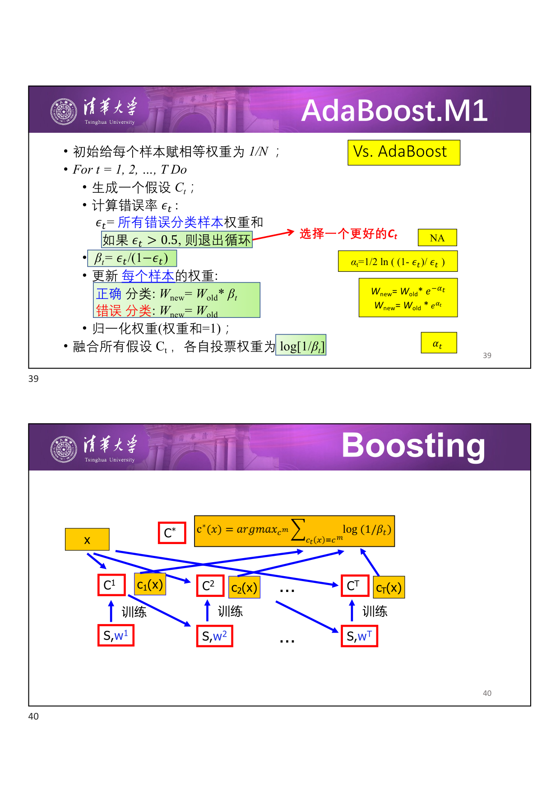

与 Bagging 不同：Boosting 是 **序列化** 的训练过程，每轮分类器依赖上一轮的权重分布 $w_t$。所有分类器都在同一数据集 $S$ 上训练，但样本权重不同。

### 5.5 AdaBoost 示例

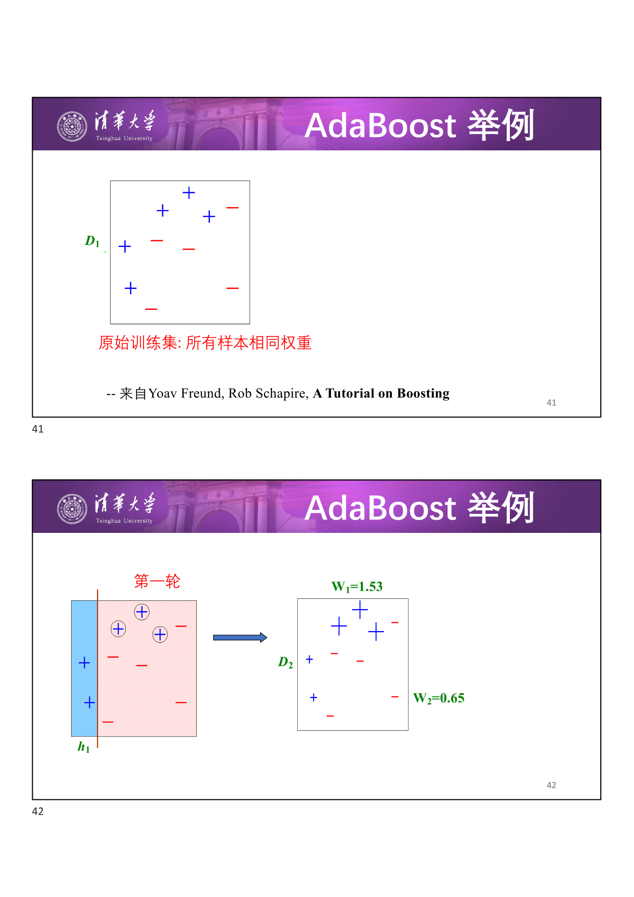

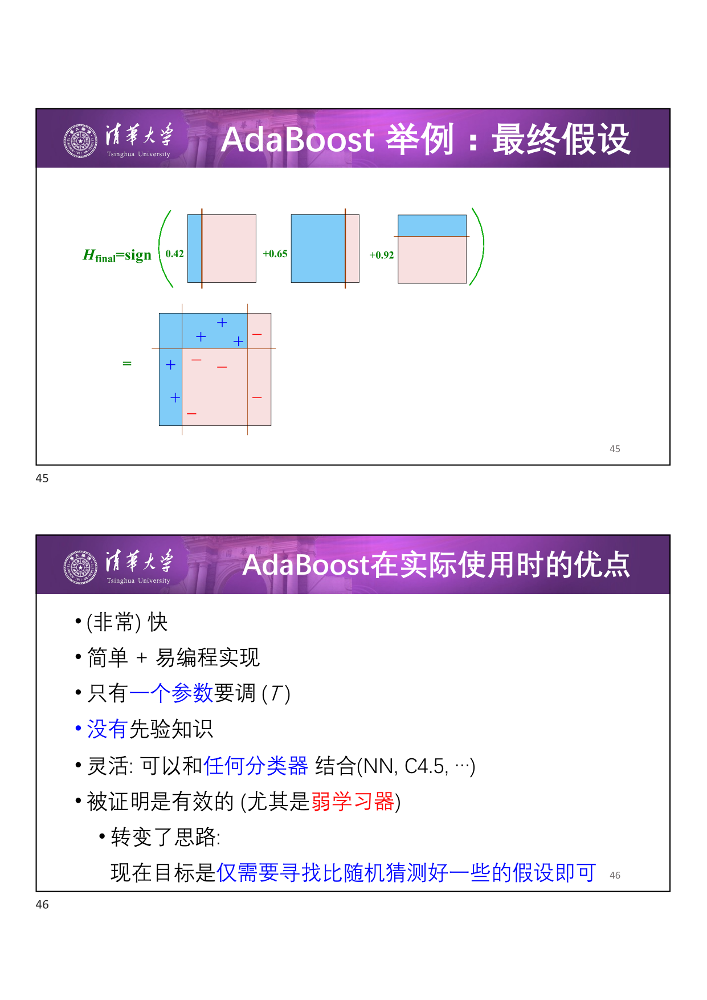

三轮迭代的直观过程：
- **第 1 轮**（$\varepsilon_1 = 0.30,\; \alpha_1 = 0.42$）：$h_1$ 在初始等权数据上训练，错误分类的样本权重放大
- **第 2 轮**（$\varepsilon_2 = 0.21,\; \alpha_2 = 0.65$）：$h_2$ 更关注之前的错误样本，错误率降低，投票权重增大
- **第 3 轮**（$\varepsilon_3 = 0.14,\; \alpha_3 = 0.92$）：$h_3$ 进一步聚焦难样本，错误率最低，投票权重最大

最终分类器：

$$
H_{\text{final}} = \operatorname{sign}\left(0.42 \cdot h_1(x) + 0.65 \cdot h_2(x) + 0.92 \cdot h_3(x)\right)
$$

### 5.6 AdaBoost 的优点

- **非常快**：训练高效
- **简单易实现**：算法逻辑清晰
- **仅一个超参数** $T$（迭代轮数）
- **无需先验知识**
- **灵活**：可与任何分类器结合（NN、C4.5、…）
- **理论保证有效**（尤其对于弱学习器）：转变了思路 —— 现在只需寻找比随机猜测略好的假设即可

### 5.7 AdaBoost 注意事项

!!! warning "AdaBoost 可能失效的情况"

    - **弱学习器太复杂** → 过拟合
    - **弱学习器太弱**（$\alpha_t \to 0$ 过快）→ 欠拟合，或边界太窄导致过拟合
    - **对噪声敏感**：过去的实验表明，AdaBoost 似乎较容易受到噪声的影响

!!! tip "核心权衡"

    AdaBoost 的性能依赖于 **数据** 和 **弱学习器** 的匹配。弱学习器不能太强（过拟合），也不能太弱（欠拟合）。

---

## 6 总结

### 6.1 集成方法对比

| 方法 | 数据 | 学习器 | 核心机制 |
| --- | --- | --- | --- |
| **加权多数** | 相同数据集 | 不同学习算法 | 动态调整算法权重（惩罚犯错算法） |
| **Bagging** | Bootstrap 采样生成多个子集 | 同一弱分类器 | 并行训练多个模型，投票/平均融合 |
| **随机森林** | Bootstrap + 特征采样 | 决策树 | Bagging + 特征随机性，进一步去相关 |
| **Boosting（AdaBoost）** | 相同数据集，样本权重变化 | 同一弱分类器 | 序列训练，聚焦难样本，加权投票 |

### 6.2 关键区别

!!! abstract "Bagging vs Boosting"

    - **Bagging**：一个数据集，一个弱分类器 → 生成多组训练样本训练多个模型，**并行** 集成。主要降低 **方差**。
    - **Boosting**：从失败中学习，**序列化** 训练，每轮关注上一轮的错分样本。主要降低 **偏差**。
    - Bagging 对不稳定的学习器（如决策树、神经网络）有效；Boosting 对弱学习器最有效。

!!! tip "记忆要点"

    - 加权多数：**相同数据，不同算法**
    - Bagging：**不同数据（Bootstrap），相同算法，并行**
    - Boosting：**不同权重（关注难样本），相同算法，串行**
    - Stacking：**层次融合，元学习器学习如何组合**
