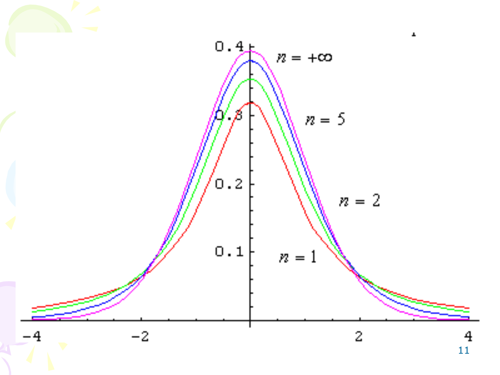

# 区间估计：抽样分布与置信区间

## 1 抽样分布

统计量的分布称为 **抽样分布**。在区间估计中，三大抽样分布是构造置信区间的理论基础。

### 1.1 $\chi^2$ 分布

!!! abstract "定义 1.1（$\chi^2$ 分布）"

    设 $X_1, \dots, X_n \stackrel{\text{i.i.d.}}{\sim} N(0, 1)$，则

    $$
    \chi^2 = \sum_{i=1}^{n} X_i^2 \sim \chi^2(n)
    $$

    称为自由度为 $n$ 的 $\chi^2$ 分布。

$\chi^2(n)$ 分布的概率密度函数：

$$
p(y) =
\begin{cases}
\frac{1}{2^{n/2} \Gamma(n/2)} \, y^{\,n/2 - 1} e^{-y/2}, & y > 0, \\[6pt]
0, & y \leq 0.
\end{cases}
$$

!!! abstract "分位数"

    设 $X \sim \chi^2(n)$，若对于 $\alpha$（$0 < \alpha < 1$），存在 $\chi^2_{1-\alpha}(n) > 0$，满足

    $$
    P\big[X \leq \chi^2_{1-\alpha}(n)\big] = 1 - \alpha
    $$

    则称 $\chi^2_{1-\alpha}(n)$ 为 $\chi^2(n)$ 分布的（下侧）$1-\alpha$ 分位数。

### 1.2 $F$ 分布

!!! abstract "定义 1.2（$F$ 分布）"

    若 $X_1 \sim \chi^2(n_1)$ 与 $X_2 \sim \chi^2(n_2)$ 相互独立，则

    $$
    F = \frac{X_1 / n_1}{X_2 / n_2} \sim F(n_1, n_2)
    $$

    称为分子自由度为 $n_1$、分母自由度为 $n_2$ 的 $F$ 分布。

$F(n_1, n_2)$ 的概率密度函数：

$$
p(y) =
\begin{cases}
\frac{\Gamma\!\left(\frac{n_1+n_2}{2}\right)}{\Gamma\!\left(\frac{n_1}{2}\right) \Gamma\!\left(\frac{n_2}{2}\right)}
\left(\frac{n_1}{n_2}\right)^{n_1/2}
\frac{y^{\,n_1/2 - 1}}{\left(1 + \frac{n_1}{n_2}y\right)^{(n_1+n_2)/2}}, & y > 0, \\[12pt]
0, & y \leq 0.
\end{cases}
$$

!!! tip "$F$ 分位数的对称性质"

    $$
    F_{\alpha}(n_2, n_1) = \frac{1}{F_{1-\alpha}(n_1, n_2)}
    $$

    **证明**：设 $F \sim F(n_1, n_2)$，则 $\frac{1}{F} \sim F(n_2, n_1)$。由
    $P\!\left[\frac{1}{F} \leq F_{\alpha}(n_2, n_1)\right] = \alpha$ 及
    $P[F > F_{1-\alpha}(n_1, n_2)] = \alpha$，两式等价即得证。

### 1.3 $t$ 分布

!!! abstract "定义 1.3（$t$ 分布）"

    若 $X_1 \sim N(0, 1)$ 与 $X_2 \sim \chi^2(n)$ 独立，则

    $$
    t = \frac{X_1}{\sqrt{X_2 / n}} \sim t(n)
    $$

    称为自由度为 $n$ 的 $t$ 分布。

$t(n)$ 的概率密度函数：

$$
p_n(y) = \frac{\Gamma\!\left(\frac{n+1}{2}\right)}{\sqrt{n\pi}\,\Gamma(n/2)}
\left(1 + \frac{y^2}{n}\right)^{-\frac{n+1}{2}}, \quad -\infty < y < +\infty
$$

**基本性质**：

1. $p_n(y)$ 关于 $y = 0$（纵轴）对称
2. 当 $n \to \infty$ 时，$t(n)$ 的极限分布是 $N(0,1)$：

$$
\lim_{n \to \infty} p_n(y) = \frac{1}{\sqrt{2\pi}} e^{-\frac{y^2}{2}}, \quad -\infty < y < +\infty
$$

3. $t_{1-\alpha}(n) = -t_{\alpha}(n)$（对称性）

### 1.4 抽样分布重要结论

!!! abstract "定理 1.1（单正态总体的抽样分布）"

    若 $X_1, \dots, X_n \stackrel{\text{i.i.d.}}{\sim} N(\mu, \sigma^2)$，则

    1. $\bar{x}$ 与 $s^2$ 相互独立
    2. $u = \dfrac{\sqrt{n}(\bar{x} - \mu)}{\sigma} \sim N(0, 1)$
    3. $\chi^2 = \dfrac{(n-1)s^2}{\sigma^2} \sim \chi^2(n-1)$
    4. $t = \dfrac{\sqrt{n}(\bar{x} - \mu)}{s} \sim t(n-1)$

这些结论是构造单正态总体置信区间的核心工具。

!!! abstract "定理 1.2（双正态总体的抽样分布）"

    若 $X_1, \dots, X_{n_1} \stackrel{\text{i.i.d.}}{\sim} N(\mu_1, \sigma_1^2)$，
    $Y_1, \dots, Y_{n_2} \stackrel{\text{i.i.d.}}{\sim} N(\mu_2, \sigma_2^2)$，
    且两样本独立，则

    1. $F = \dfrac{s_1^2 / \sigma_1^2}{s_2^2 / \sigma_2^2} \sim F(n_1-1, n_2-1)$
    2. 若 $\sigma_1 = \sigma_2$，则

    $$
    t = \frac{\bar{x} - \bar{y} - (\mu_1 - \mu_2)}{s_w \sqrt{\frac{1}{n_1} + \frac{1}{n_2}}} \sim t(n_1 + n_2 - 2)
    $$

    其中 $s_w^2 = \dfrac{(n_1-1)s_1^2 + (n_2-1)s_2^2}{n_1 + n_2 - 2}$ 称为 **混合样本方差**。

## 2 区间估计的基本概念

!!! abstract "定义 2.1（置信区间）"

    设总体 $X$ 的分布函数 $F(x; \theta)$ 含有未知参数 $\theta$，对于给定值 $\alpha$（$0 < \alpha < 1$），若由样本 $X_1, \dots, X_n$ 确定的两个统计量 $\hat{\theta}_L, \hat{\theta}_U$ 使得对任意 $\theta$ 有

    $$
    P\big(\hat{\theta}_L \leq \theta \leq \hat{\theta}_U\big) = 1 - \alpha
    $$

    则称随机区间 $[\hat{\theta}_L, \hat{\theta}_U]$ 为 $\theta$ 的置信水平为 $1-\alpha$ 的（同等）置信区间；
    $\hat{\theta}_L, \hat{\theta}_U$ 分别称为 $\theta$ 的（双侧）置信下限和置信上限。

!!! tip "置信水平的含义"

    置信水平 $1-\alpha$ 表示：在重复抽样下，所构造的置信区间中包含真值 $\theta$ 的频率趋近于 $1-\alpha$。它不是「$\theta$ 落在区间内的概率为 $1-\alpha$」——$\theta$ 是常数而非随机变量。

### 2.1 枢轴量法

求总体参数置信区间的 **标准步骤** —— 枢轴量法：

### 算法 2.1（枢轴量法求置信区间）

$$
\begin{aligned}
& \textbf{算法: } \text{PivotalQuantityMethod} \\
& \textbf{输入: } \text{样本 } X_1, \dots, X_n \text{、置信水平 } 1-\alpha \\
& \textbf{输出: } \theta \text{ 的 } 1-\alpha \text{ 置信区间} \\
& 1. \quad \text{构造枢轴量 } G = G(X_1, \dots, X_n; \theta)\text{，要求：} \\
& \quad\; \text{—— 仅含待估参数 } \theta \text{ 且分布已知（与 } \theta \text{ 无关）} \\
& 2. \quad \text{令 } P(c \leq G \leq d) = 1 - \alpha\text{，区间尽量短} \\
& \quad\; \text{—— 按几何对称或概率对称选取分位数} \\
& 3. \quad \text{解不等式 } c \leq G \leq d \text{ 得 } \hat{\theta}_L \leq \theta \leq \hat{\theta}_U \\
& 4. \quad \text{由观测值及 } \alpha \text{ 值查表计算得所求置信区间} \\
& 5. \quad \textbf{return } [\hat{\theta}_L, \hat{\theta}_U]
\end{aligned}
$$

!!! warning "区间最短原则"

    给定置信水平 $1-\alpha$，$\theta$ 的置信区间不唯一。通常要求区间尽量短，即按几何对称或概率对称选取分位数。对于正态总体，对称取 $\pm u_{1-\alpha/2}$ 时区间最短。

## 3 单正态总体参数的置信区间

设 $X_1, \dots, X_n \stackrel{\text{i.i.d.}}{\sim} N(\mu, \sigma^2)$，给定置信水平 $1-\alpha$。

### 3.1 期望 $\mu$ 的置信区间（$\sigma$ 已知）

**枢轴量**：$u = \dfrac{\sqrt{n}(\bar{x} - \mu)}{\sigma} \sim N(0, 1)$。

令 $P(-u_{1-\alpha/2} \leq u \leq u_{1-\alpha/2}) = 1 - \alpha$，解得：

!!! abstract "$\mu$ 的 $1-\alpha$ 置信区间（$\sigma$ 已知）"

    $$
    \left[ \bar{x} - \frac{\sigma}{\sqrt{n}} u_{1-\alpha/2},\; \bar{x} + \frac{\sigma}{\sqrt{n}} u_{1-\alpha/2} \right]
    $$

???+ example "例 3.1（$\sigma$ 已知）"

    设 $n = 3$，$\bar{x} = 15.4$，$\sigma = 0.1$，$\alpha = 0.05$，
    $u_{1-\alpha/2} = u_{0.975} = 1.96$。

    $$
    \bar{x} \pm \frac{\sigma}{\sqrt{n}} u_{1-\alpha/2} = 15.4 \pm \frac{1.96 \times 0.1}{\sqrt{3}} = 15.4 \pm 0.0653 = [15.3347,\; 15.4653]
    $$

### 3.2 期望 $\mu$ 的置信区间（$\sigma$ 未知）

**枢轴量**：$t = \dfrac{\sqrt{n}(\bar{x} - \mu)}{s} \sim t(n-1)$。

令 $P(|t| \leq t_{1-\alpha/2}(n-1)) = 1 - \alpha$，解得：

!!! abstract "$\mu$ 的 $1-\alpha$ 置信区间（$\sigma$ 未知）"

    $$
    \left[ \bar{x} - \frac{s}{\sqrt{n}} t_{1-\alpha/2}(n-1),\; \bar{x} + \frac{s}{\sqrt{n}} t_{1-\alpha/2}(n-1) \right]
    $$

???+ example "例 3.2（$\sigma$ 未知）"

    设 $n = 12$，$\bar{x} = 4.7092$，$s^2 = 0.0615$，$\alpha = 0.05$，$t_{0.975}(11) = 2.201$。

    $$
    \bar{x} \pm \frac{s}{\sqrt{n}} t_{1-\alpha/2}(n-1) = 4.7092 \pm \frac{\sqrt{0.0615} \times 2.201}{\sqrt{12}} = [4.5516,\; 4.8668]
    $$

!!! tip "$\sigma$ 已知 vs 未知"

    - $\sigma$ 已知时用标准正态分位数 $u_{1-\alpha/2}$
    - $\sigma$ 未知时用 $t$ 分位数 $t_{1-\alpha/2}(n-1)$，自由度损失了 1（因为用 $s$ 估计 $\sigma$）
    - 当 $n$ 很大时，$t_{1-\alpha/2}(n-1) \approx u_{1-\alpha/2}$，两者差异很小

### 3.3 方差 $\sigma^2$ 的置信区间

假定 $\mu$ 未知。**枢轴量**：$\eta = \dfrac{(n-1)s^2}{\sigma^2} \sim \chi^2(n-1)$。

令 $P\big(\chi^2_{\alpha/2}(n-1) \leq \eta \leq \chi^2_{1-\alpha/2}(n-1)\big) = 1 - \alpha$，解得：

!!! abstract "$\sigma^2$ 的 $1-\alpha$ 置信区间"

    $$
    \left[ \frac{(n-1)s^2}{\chi^2_{1-\alpha/2}(n-1)},\; \frac{(n-1)s^2}{\chi^2_{\alpha/2}(n-1)} \right]
    $$

$\sigma$ 的 $1-\alpha$ 置信区间为：

$$
\left[ \sqrt{\frac{(n-1)s^2}{\chi^2_{1-\alpha/2}(n-1)}},\; \sqrt{\frac{(n-1)s^2}{\chi^2_{\alpha/2}(n-1)}} \right]
$$

!!! warning "为什么 $\chi^2$ 分位数不对称？"

    $\chi^2$ 分布是偏态分布，几何对称（取 $\pm c$）不可行，因此按 **概率对称** 选取分位数：左右各留 $\alpha/2$ 的概率。

???+ example "例 3.3（方差置信区间）"

    设 $n = 9$，$s^2 = 0.0325$，$\alpha = 0.05$，$\chi^2_{0.025}(8) = 2.1797$，$\chi^2_{0.975}(8) = 17.5345$。

    $$
    \left[ \frac{8 \times 0.0325}{17.5345},\; \frac{8 \times 0.0325}{2.1797} \right] = [0.1218,\; 0.3454]
    $$

## 4 双正态总体参数的置信区间

设 $X_1, \dots, X_{n_1} \stackrel{\text{i.i.d.}}{\sim} N(\mu_1, \sigma_1^2)$，
$Y_1, \dots, Y_{n_2} \stackrel{\text{i.i.d.}}{\sim} N(\mu_2, \sigma_2^2)$，两样本独立。

### 4.1 期望差 $\mu_1 - \mu_2$ 的置信区间

**情形 1**：$\sigma_1, \sigma_2$ 已知

**枢轴量**：$u = \dfrac{\bar{x} - \bar{y} - (\mu_1 - \mu_2)}{\sqrt{\frac{\sigma_1^2}{n_1} + \frac{\sigma_2^2}{n_2}}} \sim N(0, 1)$。

!!! abstract "$\mu_1 - \mu_2$ 的 $1-\alpha$ 置信区间（$\sigma_1, \sigma_2$ 已知）"

    $$
    \left[ \bar{x} - \bar{y} - u_{1-\alpha/2} \sqrt{\frac{\sigma_1^2}{n_1} + \frac{\sigma_2^2}{n_2}},\;
    \bar{x} - \bar{y} + u_{1-\alpha/2} \sqrt{\frac{\sigma_1^2}{n_1} + \frac{\sigma_2^2}{n_2}} \right]
    $$

**情形 2**：$\sigma_1 = \sigma_2 = \sigma$ 但未知

**枢轴量**：$t = \dfrac{\bar{x} - \bar{y} - (\mu_1 - \mu_2)}{s_w \sqrt{\frac{1}{n_1} + \frac{1}{n_2}}} \sim t(n_1 + n_2 - 2)$，其中 $s_w^2 = \dfrac{(n_1-1)s_1^2 + (n_2-1)s_2^2}{n_1 + n_2 - 2}$。

!!! abstract "$\mu_1 - \mu_2$ 的 $1-\alpha$ 置信区间（$\sigma_1 = \sigma_2$ 未知）"

    $$
    \left[ \bar{x} - \bar{y} - s_w \cdot t_{1-\alpha/2}(n_1+n_2-2) \sqrt{\frac{1}{n_1} + \frac{1}{n_2}},\;
    \bar{x} - \bar{y} + s_w \cdot t_{1-\alpha/2}(n_1+n_2-2) \sqrt{\frac{1}{n_1} + \frac{1}{n_2}} \right]
    $$

**情形 3**（许宝騄）：$n_1, n_2$ 很大时

当样本量很大时，可用近似正态方法：

!!! abstract "$\mu_1 - \mu_2$ 的近似 $1-\alpha$ 置信区间（大样本）"

    $$
    \left[ \bar{x} - \bar{y} - u_{1-\alpha/2} \sqrt{\frac{s_1^2}{n_1} + \frac{s_2^2}{n_2}},\;
    \bar{x} - \bar{y} + u_{1-\alpha/2} \sqrt{\frac{s_1^2}{n_1} + \frac{s_2^2}{n_2}} \right]
    $$

???+ example "例 4.1（$\sigma_1 = \sigma_2$ 未知，比较灯泡寿命）"

    A 型灯泡 $n_1 = 5$，$\bar{x} = 1000\text{h}$，$s_1 = 28\text{h}$；
    B 型灯泡 $n_2 = 7$，$\bar{y} = 980\text{h}$，$s_2 = 32\text{h}$。
    设两总体方差相等，求 $\mu_1 - \mu_2$ 的 95% 置信区间。

    **解**：

    $$
    s_w^2 = \frac{(n_1-1)s_1^2 + (n_2-1)s_2^2}{n_1 + n_2 - 2}
    = \frac{4 \times 28^2 + 6 \times 32^2}{10} = 928
    $$

    $s_w = 30.46$，$t_{0.975}(10) = 2.2281$，$\sqrt{\frac{1}{5} + \frac{1}{7}} = 0.5855$。

    $$
    \mu_1 - \mu_2: 20 \pm 2.2281 \times 30.46 \times 0.5855 = 20 \pm 39.74 = [-19.74,\; 59.74]
    $$

!!! tip "期望差置信区间的解读"

    - 若 $\mu_1 - \mu_2$ 的置信下限大于 0，则可认为 $\mu_1 > \mu_2$
    - 若置信上限小于 0，则可认为 $\mu_1 < \mu_2$
    - 若置信上、下限异号（区间包含 0），则认为 $\mu_1$ 与 $\mu_2$ 没有显著差异

### 4.2 方差比 $\sigma_1^2 / \sigma_2^2$ 的置信区间

假定 $\mu_1, \mu_2$ 未知。**枢轴量**：$F = \dfrac{s_1^2 / \sigma_1^2}{s_2^2 / \sigma_2^2} \sim F(n_1-1, n_2-1)$。

令 $P\big(F_{\alpha/2}(n_1-1, n_2-1) \leq F \leq F_{1-\alpha/2}(n_1-1, n_2-1)\big) = 1 - \alpha$，解得：

!!! abstract "$\sigma_1^2 / \sigma_2^2$ 的 $1-\alpha$ 置信区间"

    $$
    \left[ \frac{s_1^2 / s_2^2}{F_{1-\alpha/2}(n_1-1, n_2-1)},\;
    \frac{s_1^2 / s_2^2}{F_{\alpha/2}(n_1-1, n_2-1)} \right]
    $$

???+ example "例 4.2（方差比置信区间）"

    机器 A：$n_1 = 18$，$s_1^2 = 0.34$；机器 B：$n_2 = 13$，$s_2^2 = 0.29$。
    求 $\sigma_1^2 / \sigma_2^2$ 的 90% 置信区间。

    **解**：

    $F_{0.95}(17, 12) = 2.59$，$F_{0.05}(17, 12) = 1 / F_{0.95}(12, 17) = 1 / 2.38$。

    $$
    \left[ \frac{0.34/0.29}{2.59},\; \frac{0.34}{0.29} \times 2.38 \right] = [0.45,\; 2.79]
    $$

!!! tip "方差比置信区间的解读"

    - 若 $\sigma_1^2 / \sigma_2^2$ 的置信下限大于 1，则可认为 $\sigma_1^2 > \sigma_2^2$
    - 若置信上限小于 1，则可认为 $\sigma_1^2 < \sigma_2^2$
    - 若区间包含 1，则认为两总体方差没有显著差异

## 5 总结

### 5.1 单正态总体置信区间速查

| 待估参数 | 条件 | 枢轴量 | 分布 | 置信区间 |
| --- | --- | --- | --- | --- |
| $\mu$ | $\sigma$ 已知 | $\frac{\sqrt{n}(\bar{x}-\mu)}{\sigma}$ | $N(0,1)$ | $\bar{x} \pm \frac{\sigma}{\sqrt{n}} u_{1-\alpha/2}$ |
| $\mu$ | $\sigma$ 未知 | $\frac{\sqrt{n}(\bar{x}-\mu)}{s}$ | $t(n-1)$ | $\bar{x} \pm \frac{s}{\sqrt{n}} t_{1-\alpha/2}(n-1)$ |
| $\sigma^2$ | $\mu$ 未知 | $\frac{(n-1)s^2}{\sigma^2}$ | $\chi^2(n-1)$ | $\left[ \frac{(n-1)s^2}{\chi^2_{1-\alpha/2}(n-1)},\; \frac{(n-1)s^2}{\chi^2_{\alpha/2}(n-1)} \right]$ |

### 5.2 双正态总体置信区间速查

| 待估参数 | 条件 | 枢轴量 | 分布 | 置信区间核心形式 |
| --- | --- | --- | --- | --- |
| $\mu_1 - \mu_2$ | $\sigma_1, \sigma_2$ 已知 | $u$ | $N(0,1)$ | $(\bar{x}-\bar{y}) \pm u_{1-\alpha/2} \sqrt{\frac{\sigma_1^2}{n_1} + \frac{\sigma_2^2}{n_2}}$ |
| $\mu_1 - \mu_2$ | $\sigma_1 = \sigma_2$ 未知 | $t$ | $t(n_1+n_2-2)$ | $(\bar{x}-\bar{y}) \pm s_w \cdot t_{1-\alpha/2} \sqrt{\frac{1}{n_1} + \frac{1}{n_2}}$ |
| $\mu_1 - \mu_2$ | 大样本 | $u$ | 近似 $N(0,1)$ | $(\bar{x}-\bar{y}) \pm u_{1-\alpha/2} \sqrt{\frac{s_1^2}{n_1} + \frac{s_2^2}{n_2}}$ |
| $\sigma_1^2 / \sigma_2^2$ | $\mu_1, \mu_2$ 未知 | $F$ | $F(n_1-1,n_2-1)$ | $\left[ \frac{s_1^2/s_2^2}{F_{1-\alpha/2}},\, \frac{s_1^2/s_2^2}{F_{\alpha/2}} \right]$ |

### 5.3 区间估计与点估计的关系

- **点估计** 给出参数的一个「最佳猜测」值，但无法量化不确定性
- **区间估计** 以给定的置信水平给出参数的可能范围，提供了估计精度和可靠性的度量
- 区间估计依赖于点估计（区间中心通常是点估计值）和抽样分布理论

$$
\text{置信区间} = \text{点估计} \pm \text{分位数} \times \text{标准误}
$$
