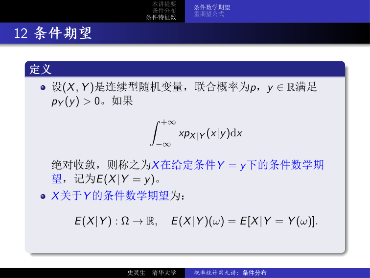
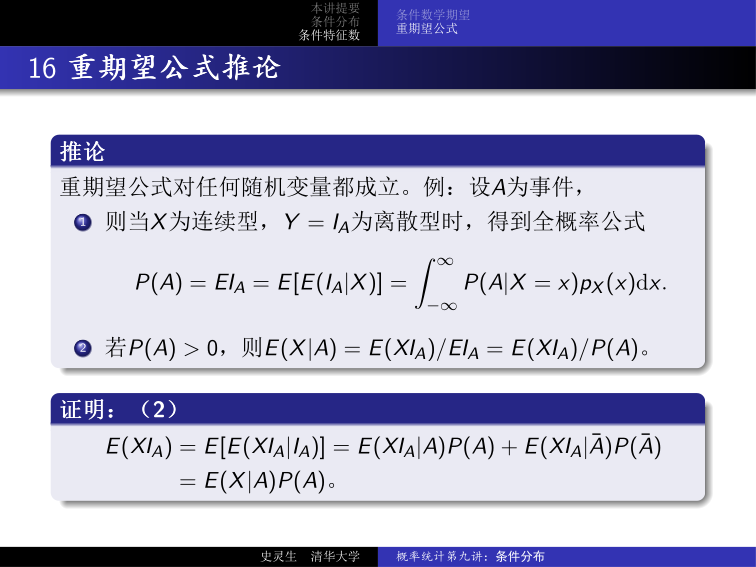
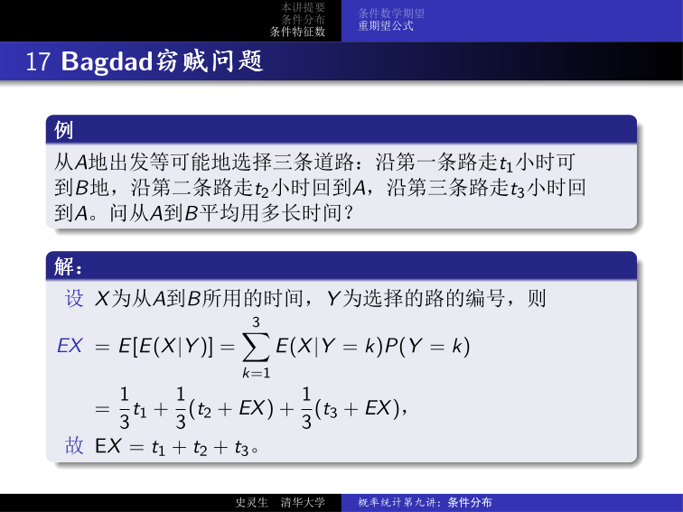
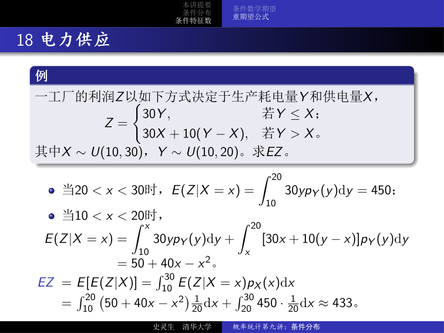
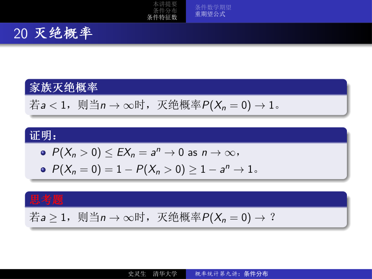
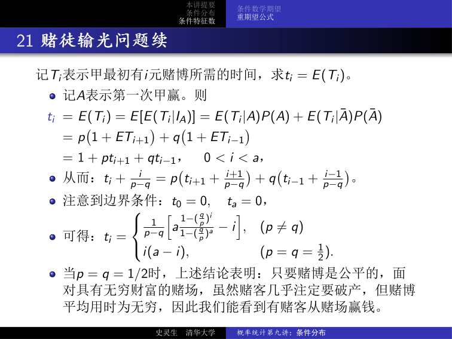

# 概率统计第九讲：条件分布——条件分布、条件数学期望与重期望公式

## 1 本讲提要

**条件分布：**

- 离散型
- 连续型

**条件特征数：**

- 条件数学期望
- 重期望公式

---

## 2 离散型条件分布

对离散型随机变量 $(X, Y)$ 的联合分布律 $P(X = x_i,\; Y = y_j) = p_{ij}$，有：

$$
P(X = x_i \mid Y = y_j) = \frac{P(X = x_i,\; Y = y_j)}{P(Y = y_j)} = \frac{p_{ij}}{p_{\cdot j}^Y} = \frac{p_{ij}}{\sum_k p_{kj}}.
$$

!!! abstract "定义（离散型条件分布律）"

    称

    | $X$ | $x_1$ | $\cdots$ | $x_i$ | $\cdots$ |
    | --- | ----- | -------- | ----- | -------- |
    | $P$ | $p_{1j}/p_{\cdot j}^Y$ | $\cdots$ | $p_{ij}/p_{\cdot j}^Y$ | $\cdots$ |

    为已知 $Y = y_j$ 下 $X$ 的 **条件分布律**（conditional distribution law），记为 $P_{X|Y}(x_i \mid y_j) = P(X = x_i \mid Y = y_j)$。

---

## 3 二项分布与 Poisson 分布

???+ example "例：Poisson 分布的条件分布"

    设 $X \sim P(\lambda)$ 与 $Y \sim P(\mu)$ 相互独立，则 $X \mid X + Y = n \sim b(n,\; \lambda/(\lambda + \mu))$。

??? note "证明"

    由 Poisson 分布的可加性，$X + Y \sim P(\lambda + \mu)$，于是

    $$
    \begin{aligned}
    P_{X|X+Y}(k \mid n) &= \frac{P(X = k,\; X + Y = n)}{P(X + Y = n)} = \frac{P(X = k,\; Y = n - k)}{P(X + Y = n)} \\
    &= \frac{P(X = k)\,P(Y = n - k)}{P(X + Y = n)} \\
    &= \frac{\dfrac{\lambda^k}{k!} e^{-\lambda} \cdot \dfrac{\mu^{n-k}}{(n-k)!} e^{-\mu}}{\dfrac{(\lambda + \mu)^n}{n!} e^{-(\lambda + \mu)}} \\
    &= \binom{n}{k} \left(\frac{\lambda}{\lambda + \mu}\right)^k \left(\frac{\mu}{\lambda + \mu}\right)^{n-k}.
    \end{aligned}
    $$

    $\square$

---

## 4 Poisson 分布在随机选择下的不变性

???+ example "例：Poisson 分布在随机选择下的不变性"

    某商店一天内顾客数 $X \sim P(\lambda)$，每个顾客独立地以概率 $p$ 是男性，则男顾客数 $Y \sim P(\lambda p)$。

??? note "证明"

    由 $Y \mid X = n \sim b(n, p)$：

    $$
    \begin{aligned}
    P(Y = k) &= \sum_{n = k}^{\infty} P(Y = k \mid X = n)\,P(X = n) \\
    &= \sum_{n = k}^{\infty} \binom{n}{k} p^k (1 - p)^{n - k} \cdot \frac{\lambda^n}{n!} e^{-\lambda} \\
    &= \frac{(\lambda p)^k}{k!} e^{-\lambda} \sum_{n = k}^{\infty} \frac{[\lambda (1 - p)]^{n - k}}{(n - k)!} \\
    &= \frac{(\lambda p)^k}{k!} e^{-\lambda} e^{\lambda (1 - p)} = \frac{(\lambda p)^k}{k!} e^{-\lambda p}.
    \end{aligned}
    $$

    $\square$

---

## 5 离散型条件分布典型例题

???+ example "例：球盒模型（第 $n$ 个球落入的盒子）"

    一室有 $a$ 个男生、$b$ 个女生，每次独立地以概率 $p$ 抽到某一人，各次独立。问第 $n$ 次抽到男生的条件分布。

    设 $X_n$ 为第 $n$ 次是否抽到男生的示性函数，$Y$ 为 $n - 1$ 次中男生的人数，则：

    - $P_{X_n|Y}(1 \mid k) = k/(a + b)$
    - $P(X_n = 1) = \sum_k P(Y = k)\,P_{X_n|Y}(1 \mid k) = \sum_k P(Y = k)\,k/(a + b) = EY/(a + b)$
    - $EY = (a + b)\,P(X_n = 1)$

!!! info "进一步：$P_{X_{n+1}|X_n}(1 \mid 1)$ 的计算"

    由全概率公式与 Bayes 公式：

    $$
    \begin{aligned}
    P_{X_{n+1}|X_n}(1 \mid 1) &= \sum_k P_{Y|X_n}(k \mid 1)\,P(X_{n+1} = 1 \mid X_n = 1,\; Y = k) \\
    &= \sum_k \frac{P_{X_n|Y}(1 \mid k)\,P(Y = k)}{P(X_n = 1)} \cdot \frac{k}{a + b} \\
    &= \frac{EY^2}{(a + b)^2 P(X_n = 1)} \\
    &= \frac{(EY)^2 + \mathrm{Var}(Y)}{(a + b)^2 P(X_n = 1)} \\
    &= P(X_n = 1) + \frac{\mathrm{Var}(Y)}{(a + b)^2 P(X_n = 1)} \neq P(X_n = 1),\quad n > 1.
    \end{aligned}
    $$

---

## 6 在事件条件下的条件分布

!!! abstract "定义（事件条件下的条件分布函数、条件密度函数）"

    设 $X$ 是概率空间 $(\Omega, \mathcal{F}, P)$ 上的随机变量，事件 $A \in \mathcal{F}$ 满足 $P(A) > 0$，则称

    $$
    F_{X|A} : \mathbb{R} \to \mathbb{R},\quad F_{X|A}(x) = P(X \leq x \mid A) = \frac{P(X \leq x,\; A)}{P(A)}
    $$

    为在已知 $A$ 发生的条件下 $X$ 的 **条件分布函数**。若存在非负可积函数 $p_{X|A} : \mathbb{R} \to \mathbb{R}$ 使得

    $$
    F_{X|A}(x) = \int_{-\infty}^{x} p_{X|A}(u)\,\mathrm{d}u,
    $$

    则称 $p_{X|A}$ 为在已知 $A$ 发生的条件下 $X$ 的 **条件密度函数**。

---

## 7 连续型条件分布的推导

对连续型随机变量 $(X, Y)$，由于 $P(Y = y) = 0$，条件分布不能直接通过传统条件概率定义。取小邻域 $[y,\; y + \Delta y)$：

$$
\begin{aligned}
P(X \leq x \mid y \leq Y < y + \Delta y) &= \frac{P(X \leq x,\; y \leq Y < y + \Delta y)}{P(y \leq Y < y + \Delta y)} \\
&= \frac{[F(x,\; y + \Delta y) - F(x,\; y)]/\Delta y}{[F_Y(y + \Delta y) - F_Y(y)]/\Delta y} \\
&\xrightarrow{\Delta y \to 0} \frac{\dfrac{\partial F(x, y)}{\partial y}}{p_Y(y)} = \frac{\displaystyle\int_{-\infty}^{x} p_{X,Y}(u, y)\,\mathrm{d}u}{p_Y(y)} = \int_{-\infty}^{x} \frac{p_{X,Y}(u, y)}{p_Y(y)}\,\mathrm{d}u.
\end{aligned}
$$

!!! abstract "定义（连续型条件分布函数与条件密度）"

    设 $(X, Y)$ 是连续型随机变量，$p_Y$ 在 $y$ 连续且 $p_Y(y) > 0$。则称

    $$
    F_{X|Y}(x \mid y) = \int_{-\infty}^{x} \frac{p_{X,Y}(u, y)}{p_Y(y)}\,\mathrm{d}u
    $$

    为在已知 $Y = y$ 下 $X$ 的 **条件分布函数**，条件密度函数为：

    $$
    p_{X|Y}(x \mid y) = \frac{p_{X,Y}(x, y)}{p_Y(y)}.
    $$

---

## 8 密度公式体系

!!! abstract "密度公式"

    1. **乘法公式：** $p_{X,Y}(x, y) = p_Y(y)\,p_{X|Y}(x \mid y)$
    2. **全概率公式：** $p_X(x) = \displaystyle\int_{-\infty}^{\infty} p_Y(y)\,p_{X|Y}(x \mid y)\,\mathrm{d}y$
    3. **Bayes 公式：** $p_{X|Y}(x \mid y) = \dfrac{p_X(x)\,p_{Y|X}(y \mid x)}{\displaystyle\int_{-\infty}^{\infty} p_X(x)\,p_{Y|X}(y \mid x)\,\mathrm{d}x}$
    4. **因子分解引理：** 若 $p_{X,Y}(x, y) = g(y)\,h(x, y)$ 且对任意给定 $y$，$h(\cdot, y)$ 非负可积且 $\displaystyle\int_{-\infty}^{\infty} h(x, y)\,\mathrm{d}x = 1$，则 $g(y) = p_Y(y)$，$h(x, y) = p_{X|Y}(x \mid y)$。

---

## 9 条件数学期望（离散型）

!!! abstract "定义（离散型条件数学期望）"

    设 $(X, Y)$ 是概率空间 $(\Omega, \mathcal{F}, P)$ 上的离散型随机变量，$y \in \mathbb{R}$ 满足 $P(Y = y) > 0$。若级数

    $$
    \sum_x x\,P_{X|Y}(x \mid y)
    $$

    绝对收敛，则称其为 $X$ 在已知 $Y = y$ 下的 **条件数学期望**（conditional expectation），记为 $E(X \mid Y = y)$。

!!! info "作为随机变量的 $E(X \mid Y)$"

    不难证明：若 $EX$ 存在，则对任意满足 $P(Y = y) > 0$ 的 $y$，$E(X \mid Y = y)$ 均存在。将其视为 $y$ 的函数，记为

    $$
    g(y) = E(X \mid Y = y),
    $$

    则定义随机变量 $g(Y)$ 为 $X$ 关于 $Y$ 的 **条件数学期望**，记为 $E(X \mid Y)$。

---

## 10 条件数学期望（连续型）

!!! abstract "定义（连续型条件数学期望）"

    设 $(X, Y)$ 是连续型随机变量，联合密度为 $p$，$y \in \mathbb{R}$ 满足 $p_Y(y) > 0$。若

    $$
    \int_{-\infty}^{+\infty} x\,p_{X|Y}(x \mid y)\,\mathrm{d}x
    $$

    绝对收敛，则称之为 $X$ 在给定条件 $Y = y$ 下的 **条件数学期望**，记为 $E(X \mid Y = y)$。

    $X$ 关于 $Y$ 的条件数学期望为：

    $$
    E(X \mid Y) : \Omega \to \mathbb{R},\quad E(X \mid Y)(\omega) = E[X \mid Y = Y(\omega)].
    $$

---

## 11 二维正态分布的条件期望与条件方差

**情形 1：** $(X, Y) \sim N(0, 0, 1, 1, \rho)$

$$
p_{X|Y}(x \mid y) = \frac{p(x, y)}{p_Y(y)} = \frac{1}{\sqrt{2\pi (1 - \rho^2)}} e^{-\dfrac{(x - \rho y)^2}{2(1 - \rho^2)}},
$$

即 $X \mid Y = y \sim N(\rho y,\; 1 - \rho^2)$，从而：

- $E(X \mid Y = y) = \rho y$，$E(X \mid Y) = \rho Y$
- $\mathrm{Var}(X \mid Y) = 1 - \rho^2$

**情形 2：** $(X, Y) \sim N(\mu_1, \mu_2, \sigma_1^2, \sigma_2^2, \rho)$

作标准化 $X^* = (X - \mu_1)/\sigma_1$，$Y^* = (Y - \mu_2)/\sigma_2$，则 $(X^*, Y^*) \sim N(0, 0, 1, 1, \rho)$，$X^* \mid Y^* = y \sim N(\rho y,\; 1 - \rho^2)$。由此：

$$
X \mid Y = y \sim N\!\left(\mu_1 + \rho \frac{\sigma_1}{\sigma_2}(y - \mu_2),\; (1 - \rho^2)\sigma_1^2\right).
$$

!!! abstract "定理（正态分布的条件期望与条件方差）"

    $$
    E(X \mid Y) = \mu_1 + \rho \frac{\sigma_1}{\sigma_2}(Y - \mu_2),\quad \mathrm{Var}(X \mid Y) = (1 - \rho^2)\sigma_1^2.
    $$

!!! tip "与线性回归的联系"

    对比上一讲线性回归结论：$\hat{X} = \dfrac{\mathrm{Cov}(X, Y)}{\mathrm{Var}(Y)}(Y - EY) + EX$。正态分布下，条件期望 $E(X \mid Y)$ 恰好是最佳线性预报 $\hat{X}$——即 **正态分布的最佳预报就是线性预报**。

---

## 12 条件期望的性质：重期望公式

由于条件数学期望是条件分布下的数学期望，它也满足数学期望的常见性质（如线性性）。除此之外，还有：

!!! abstract "定理（重期望公式）"

    若 $EX$ 存在，则

    $$
    EX = E[E(X \mid Y)].
    $$

??? note "证明（离散型）"

    $$
    \begin{aligned}
    EX &= \sum_{x, y} x\,P(X = x,\; Y = y) = \sum_{x, y} x\,P(Y = y)\,P(X = x \mid Y = y) \\
    &= \sum_y \left[\sum_x x\,P(X = x \mid Y = y)\right] P(Y = y) \\
    &= \sum_y E(X \mid Y = y)\,P(Y = y) = E[E(X \mid Y)].
    \end{aligned}
    $$

    $\square$

??? note "证明（连续型）"

    $$
    \begin{aligned}
    EX &= \iint_{\mathbb{R}^2} x\,p(x, y)\,\mathrm{d}x\mathrm{d}y = \iint_{\mathbb{R}^2} x\,p_{X|Y}(x \mid y)\,p_Y(y)\,\mathrm{d}x\mathrm{d}y \\
    &= \int_{\mathbb{R}} \left[\int_{\mathbb{R}} x\,p_{X|Y}(x \mid y)\,\mathrm{d}x\right] p_Y(y)\,\mathrm{d}y \\
    &= \int_{\mathbb{R}} E(X \mid Y = y)\,p_Y(y)\,\mathrm{d}y = E[E(X \mid Y)].
    \end{aligned}
    $$

    $\square$

---

## 13 重期望公式推论

!!! abstract "推论"

    重期望公式对任何随机变量都成立。例：设 $A$ 为事件，

    1. 则当 $X$ 为连续型、$Y = I_A$ 为离散型时，得到 **全概率公式**

        $$
        P(A) = EI_A = E[E(I_A \mid X)] = \int_{-\infty}^{\infty} P(A \mid X = x)\,p_X(x)\,\mathrm{d}x.
        $$

    2. 若 $P(A) > 0$，则 $E(X \mid A) = E(X I_A)/E I_A = E(X I_A)/P(A)$。

??? note "证明（推论 2）"

    $$
    E(X I_A) = E[E(X I_A \mid I_A)] = E(X I_A \mid A)\,P(A) + E(X I_A \mid \bar{A})\,P(\bar{A}) = E(X \mid A)\,P(A).
    $$

    $\square$

---

## 14 Bagdad 窃贼问题

???+ example "例：Bagdad 窃贼"

    从 $A$ 地出发，等可能地选择三条道路：沿第一条路走 $t_1$ 小时可到 $B$ 地；沿第二条路走 $t_2$ 小时回到 $A$；沿第三条路走 $t_3$ 小时回到 $A$。问从 $A$ 到 $B$ 平均用多长时间？

**解：** 设 $X$ 为从 $A$ 到 $B$ 所用的时间，$Y$ 为选择的路的编号，则

$$
\begin{aligned}
EX &= E[E(X \mid Y)] = \sum_{k=1}^{3} E(X \mid Y = k)\,P(Y = k) \\
&= \frac{1}{3} t_1 + \frac{1}{3}(t_2 + EX) + \frac{1}{3}(t_3 + EX),
\end{aligned}
$$

故 $EX = t_1 + t_2 + t_3$。

---

## 15 电力供应问题

???+ example "例：电力供应"

    一工厂的利润 $Z$ 以如下方式决定于生产耗电量 $Y$ 和供电量 $X$：

    $$
    Z = \begin{cases} 30Y, & \text{若 } Y \leq X, \\ 30X + 10(Y - X), & \text{若 } Y > X. \end{cases}
    $$

    其中 $X \sim U(10, 30)$，$Y \sim U(10, 20)$，求 $EZ$。

**解：**

- 当 $20 < x < 30$ 时，$E(Z \mid X = x) = \displaystyle\int_{10}^{20} 30y\,p_Y(y)\,\mathrm{d}y = 450$
- 当 $10 < x < 20$ 时，

    $$
    E(Z \mid X = x) = \int_{10}^{x} 30y\,p_Y(y)\,\mathrm{d}y + \int_{x}^{20} [30x + 10(y - x)]\,p_Y(y)\,\mathrm{d}y = 50 + 40x - x^2.
    $$

由重期望公式：

$$
EZ = E[E(Z \mid X)] = \int_{10}^{30} E(Z \mid X = x)\,p_X(x)\,\mathrm{d}x = \int_{10}^{20} (50 + 40x - x^2)\,\frac{1}{20}\,\mathrm{d}x + \int_{20}^{30} 450 \cdot \frac{1}{20}\,\mathrm{d}x \approx 433.
$$

---

## 16 分支过程

???+ example "例：分支过程（Galton–Watson 过程）"

    一个家族第 $n$ 代有 $X_n$ 个人，$X_0 = 1$。假设这个家族每个人后代的个数是独立同分布的随机变量。求这个家族第 $n$ 代的平均后代数。

**解：** 设 $Y_k$（$k = 1, \ldots, X_1$）是第一代第 $k$ 个人的后代数，则

$$
X_2 = \sum_{k=1}^{X_1} Y_k,
$$

其中 $X_1, Y_1, Y_2, \ldots$ 独立同分布。设 $EX_1 = EY_k =: a$，$\forall k$，则

$$
E(X_2 \mid X_1 = n) = E\!\left(\sum_{i=1}^{X_1} Y_i \,\middle|\, X_1 = n\right) = E\!\left(\sum_{i=1}^{n} Y_i\right) = n\,EY_1 = na,
$$

$$
EX_2 = E[E(X_2 \mid X_1)] = \sum_n n a \,P(X_1 = n) = a \sum_n n\,P(X_1 = n) = a^2.
$$

由数学归纳法得 $EX_n = a^n$。

---

## 17 灭绝概率

!!! abstract "定理（家族灭绝概率）"

    若 $a < 1$，则当 $n \to \infty$ 时，灭绝概率 $P(X_n = 0) \to 1$。

??? note "证明"

    $$
    \begin{aligned}
    P(X_n > 0) &\leq EX_n = a^n \to 0,\quad n \to \infty, \\
    P(X_n = 0) &= 1 - P(X_n > 0) \geq 1 - a^n \to 1.
    \end{aligned}
    $$

    $\square$

!!! tip "思考题"

    若 $a \geq 1$，则当 $n \to \infty$ 时，灭绝概率 $P(X_n = 0) \to \;?$

    答案并非 $0$。实际上，若 $a = 1$（临界情形），灭绝概率仍为 $1$（除非后代数退化为常数 $1$）；$a > 1$ 时灭绝概率严格小于 $1$，是方程 $s = \varphi(s)$ 的最小非负解，其中 $\varphi$ 为后代数分布的生成函数。

---

## 18 赌徒输光问题续

???+ example "例：赌徒输光问题"

    记 $T_i$ 表示甲最初有 $i$ 元赌博所需的时间，求 $t_i = E(T_i)$。

**解：** 记 $A$ 表示第一次甲赢。则

$$
\begin{aligned}
t_i = E(T_i) &= E[E(T_i \mid I_A)] = E(T_i \mid A)\,P(A) + E(T_i \mid \bar{A})\,P(\bar{A}) \\
&= p(1 + ET_{i+1}) + q(1 + ET_{i-1}) \\
&= 1 + p\,t_{i+1} + q\,t_{i-1},\quad 0 < i < a.
\end{aligned}
$$

从而

$$
t_i + \frac{i}{p - q} = p\!\left(t_{i+1} + \frac{i + 1}{p - q}\right) + q\!\left(t_{i-1} + \frac{i - 1}{p - q}\right).
$$

注意到边界条件 $t_0 = 0$，$t_a = 0$，可得：

$$
t_i = \begin{cases} \dfrac{1}{p - q}\!\left[a \cdot \dfrac{1 - (q/p)^i}{1 - (q/p)^a} - i\right], & p \neq q, \\[8pt] i(a - i), & p = q = \dfrac{1}{2}. \end{cases}
$$

!!! tip "公平赌博的无穷期望"

    当 $p = q = 1/2$ 时，上述结论表明：只要赌博是公平的，面对具有无穷财富的赌场，虽然赌客几乎注定要破产，但赌博平均用时为无穷。因此我们能看到有赌客从赌场赢钱。

---

## 19 Poisson 分布与指数分布

???+ example "例：Poisson 分布与指数分布"

    一商场在 $t$ 时刻前顾客人数是参数为 $\lambda t$ 的 Poisson 分布，来走人数是参数为 $\mu t$ 的 Poisson 分布，且相互独立。求第一个来的是顾客的概率为 $\lambda/(\lambda + \mu)$。

**解：** 第一个顾客与第一个走人出现的时刻分别为 $X, Y$，则 $X, Y$ 分别服从参数为 $\lambda, \mu$ 的指数分布，且相互独立。

$$
\begin{aligned}
P(X < Y) &= \int_{-\infty}^{+\infty} P(X < Y \mid Y = y)\,p_Y(y)\,\mathrm{d}y \quad (\text{全概率公式}) \\
&= \int_{-\infty}^{+\infty} P(X < y)\,p_Y(y)\,\mathrm{d}y \quad (\text{独立性}) \\
&= \int_{0}^{+\infty} (1 - e^{-\lambda y})\,\mu e^{-\mu y}\,\mathrm{d}y \\
&= \frac{\lambda}{\lambda + \mu}.
\end{aligned}
$$

---

## 20 总结

| 主题 | 核心公式 |
| --- | --- |
| 离散型条件分布 | $P_{X\mid Y}(x_i \mid y_j) = p_{ij}/p_{\cdot j}^Y$ |
| 连续型条件密度 | $p_{X\mid Y}(x \mid y) = p_{X,Y}(x, y)/p_Y(y)$ |
| 乘法公式 | $p_{X,Y}(x, y) = p_Y(y)\,p_{X\mid Y}(x \mid y)$ |
| 全概率公式（密度） | $p_X(x) = \int p_Y(y)\,p_{X\mid Y}(x \mid y)\,\mathrm{d}y$ |
| Bayes 公式（密度） | $p_{X\mid Y}(x \mid y) = p_X(x)\,p_{Y\mid X}(y \mid x) / \int p_X(x)\,p_{Y\mid X}(y \mid x)\,\mathrm{d}x$ |
| 条件期望（离散） | $E(X \mid Y = y) = \sum_x x\,P_{X\mid Y}(x \mid y)$ |
| 条件期望（连续） | $E(X \mid Y = y) = \int x\,p_{X\mid Y}(x \mid y)\,\mathrm{d}x$ |
| 重期望公式 | $EX = E[E(X \mid Y)]$ |
| 全概率公式（事件） | $P(A) = \int P(A \mid X = x)\,p_X(x)\,\mathrm{d}x$ |
| 条件期望（事件） | $E(X \mid A) = E(X I_A)/P(A)$ |
| 正态分布条件期望 | $E(X \mid Y) = \mu_1 + \rho(\sigma_1/\sigma_2)(Y - \mu_2)$ |
| 正态分布条件方差 | $\mathrm{Var}(X \mid Y) = (1 - \rho^2)\sigma_1^2$ |
| Poisson 条件分布 | $X \sim P(\lambda),\; Y \sim P(\mu)$ 独立 $\Rightarrow X \mid X + Y = n \sim b(n,\;\lambda/(\lambda + \mu))$ |
| Poisson 随机分流 | $X \sim P(\lambda),\; Y \mid X = n \sim b(n, p) \Rightarrow Y \sim P(\lambda p)$ |
| 分支过程 | $EX_n = a^n$，$a < 1 \Rightarrow$ 灭绝概率 $\to 1$ |
| 赌徒输光时间 | $p = q$ 时 $t_i = i(a - i)$ |
