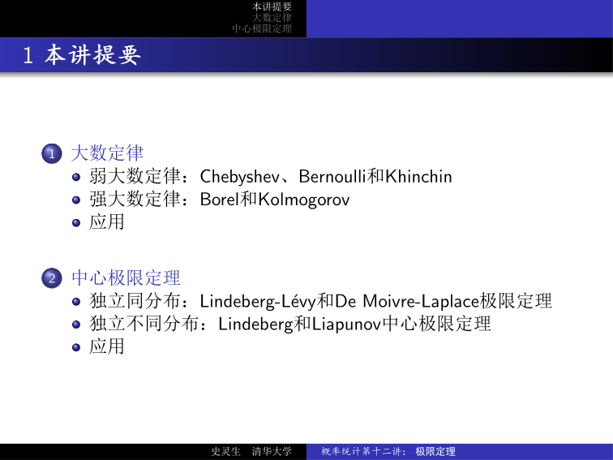
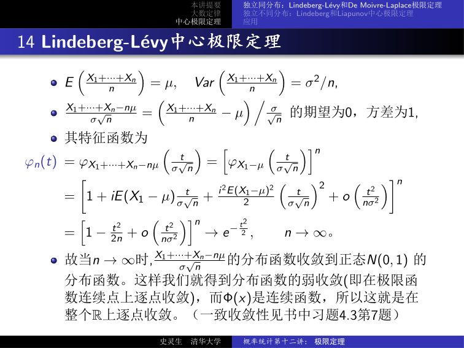

# 概率统计第十二讲：极限定理——大数定律与中心极限定理

## 1 引言

概率极限理论主要研究 **大量随机变量之和** 的渐近行为，是现代概率论的两大支柱：

- **大数定律**（Law of Large Numbers, LLN）：样本均值在何种意义下、以何种速度收敛到总体均值？
- **中心极限定理**（Central Limit Theorem, CLT）：样本均值的波动在何种尺度下近似正态分布？

!!! info "核心区别"

    大数定律关注 **均值本身** 的收敛性，中心极限定理关注 **均值波动** 的分布收敛性。前者说「平均会稳定」，后者说「波动有多正态」。

---

## 2 弱大数定律

弱大数定律（Weak LLN）刻画 **依概率收敛**：样本均值 $\bar{X}_n$ 与总体均值 $\mu$ 的偏差超过 $\varepsilon$ 的概率趋于零。

### 2.1 Chebyshev 弱大数定律

!!! abstract "定理 2.1（Chebyshev 弱大数定律）"

    设 $\{X_n\}$ 为 **独立同分布** 随机变量序列，存在数学期望和有限方差。记 $\mu = EX_n$，$\sigma^2 = \operatorname{Var}(X_n)$。则对任意 $\varepsilon > 0$，

    $$
    \lim_{n \to \infty} P\left(\left|\frac{X_1 + \cdots + X_n}{n} - \mu\right| < \varepsilon\right) = 1.
    $$

??? note "证明"

    利用 Chebyshev 不等式：

    $$
    \begin{aligned}
    P\left(\left|\frac{X_1 + \cdots + X_n}{n} - \mu\right| \ge \varepsilon\right)
    &= P\left(\left|\frac{X_1 + \cdots + X_n}{n} - E\left[\frac{X_1 + \cdots + X_n}{n}\right]\right| \ge \varepsilon\right) \\[4pt]
    &\le \frac{1}{\varepsilon^2} \operatorname{Var}\!\left(\frac{X_1 + \cdots + X_n}{n}\right)
    = \frac{\sigma^2}{n\varepsilon^2} \to 0, \quad n \to \infty.
    \end{aligned}
    $$

    $\square$

定理告诉我们：用一组独立观测值的算术平均作为总体均值 $\mu$ 的估计是合理的（概率意义上），即便我们完全不知道这个随机变量的概率分布——只要方差有限即可。

### 2.2 Bernoulli 弱大数定律

!!! abstract "推论 2.1（Bernoulli 弱大数定律）"

    设某事件在一次试验中发生的概率为 $p$，$S_n$ 为 $n$ 次独立试验中该事件发生的次数。则频率 $S_n / n$ **依概率收敛** 到 $p$：

    $$
    \lim_{n \to \infty} P\left(\left|\frac{S_n}{n} - p\right| < \varepsilon\right) = 1.
    $$

??? note "证明"

    令

    $$
    X_k = \begin{cases}
    1, & \text{第 } k \text{ 次试验中事件发生}; \\
    0, & \text{否则}.
    \end{cases}
    $$

    则 $X_k \stackrel{\text{i.i.d.}}{\sim} b(1, p)$，$EX_k = p$，$\operatorname{Var}(X_k) = p(1-p)$，且 $S_n = X_1 + \cdots + X_n$。由 Chebyshev 弱大数定律即得。$\square$

!!! info "历史注记"

    Jakob Bernoulli 最早证明了上述形式的弱大数定律，这是「大数定律」这个名称的来源。Poisson 后来将 Bernoulli 的结果推广为：若在 $n$ 次独立试验中，第 $k$ 次试验的事件发生概率为 $p_k$，则

    $$
    \frac{S_n}{n} - \frac{p_1 + \cdots + p_n}{n} \to 0, \quad n \to \infty.
    $$

!!! tip "推广条件"

    Chebyshev 大数定律的成立条件可放宽：
    - 若 $\{X_n\}$ 两两不相关（不必独立），存在数学期望且 **方差一致有界**，结论仍成立（Chebyshev 大数定律的一般形式）。
    - 若 $\{X_n\}$ 满足 $\lim_{|k-l| \to \infty} \operatorname{Cov}(X_k, X_l) = 0$，存在数学期望且 **方差一致有界**，结论仍成立（Bernstein 大数定律）。

### 2.3 Khinchin 弱大数定律

Chebyshev 大数定律要求方差有限，但这个条件可以去掉。

!!! abstract "定理 2.2（Khinchin 弱大数定律）"

    设 $\{X_n\}$ **独立同分布**，存在数学期望 $\mu = EX_n$（**不要求方差存在**）。则弱大数定律仍成立：

    $$
    \lim_{n \to \infty} P\left(\left|\frac{X_1 + \cdots + X_n}{n} - \mu\right| < \varepsilon\right) = 1.
    $$

??? note "证明（用特征函数）"

    记 $\phi(t) = E e^{itX_1}$。则

    $$
    \begin{aligned}
    \phi_{\frac{X_1 + \cdots + X_n}{n}}(t) &= \prod_{k=1}^{n} \phi_{X_k}\!\left(\frac{t}{n}\right)
    = \left[\phi\!\left(\frac{t}{n}\right)\right]^n \\
    &= \left[1 + i\mu \frac{t}{n} + o\!\left(\frac{t}{n}\right)\right]^n
    \to e^{i\mu t}, \quad n \to \infty.
    \end{aligned}
    $$

    因此对任意 $x \neq \mu$，$F_{\frac{X_1 + \cdots + X_n}{n}}(x) \to F_\mu(x) = I_{[\mu, \infty)}(x)$（退化分布），从而

    $$
    \begin{aligned}
    P\left(\left|\frac{X_1 + \cdots + X_n}{n} - \mu\right| < \varepsilon\right)
    &= P\left(\mu - \varepsilon < \frac{X_1 + \cdots + X_n}{n} < \mu + \varepsilon\right) \\
    &\to F_\mu(\mu + \varepsilon^-) - F_\mu(\mu - \varepsilon) = 1 - 0 = 1.
    \end{aligned}
    $$

    $\square$

!!! tip "直觉"

    Khinchin 大数定律说明：**只要期望存在**（哪怕方差无限），样本均值仍然依概率收敛到期望。证明中特征函数起到了关键作用——它绕过了对方差的要求。具体来说，特征函数展开时只需要一阶项 $i\mu t/n$，方差项 $-\frac{1}{2}\sigma^2 t^2/n^2$ 是否出现不影响极限行为。

---

## 3 强大数定律

强大数定律（Strong LLN）将收敛性加强为 **几乎必然收敛**（a.s. 收敛）：$P(\omega: \lim_{n \to \infty} \bar{X}_n = \mu) = 1$。

### 3.1 Borel 强大数定律

!!! abstract "定理 3.1（Borel 强大数定律）"

    设 $X_1, \dots, X_n, \dots$ **独立同分布**，$EX_1 = \mu$，$\operatorname{Var}(X_1) < \infty$。则

    $$
    P\!\left(\omega: \lim_{n \to \infty} \frac{X_1 + \cdots + X_n}{n} = \mu\right) = 1.
    $$

特别地，在 Bernoulli 试验中，相对频率满足

$$
P\!\left(\omega: \lim_{n \to \infty} \frac{S_n}{n} = p\right) = 1.
$$

### 3.2 Kolmogorov 强大数定律

Borel 定理要求同分布，Kolmogorov 将其推广到仅要求独立的情形。

!!! abstract "定理 3.2（Kolmogorov 强大数定律）"

    设 $X_1, \dots, X_n, \dots$ **相互独立**，满足

    $$
    \sum_{n=1}^{\infty} \frac{\operatorname{Var}(X_n)}{n^2} < +\infty,
    $$

    则

    $$
    P\!\left(\omega: \lim_{n \to \infty} \frac{1}{n} \sum_{k=1}^{n} (X_k - EX_k) = 0\right) = 1.
    $$

!!! tip "强弱对比"

    | 方面 | 弱大数定律 | 强大数定律 |
    | --- | --- | --- |
    | 收敛模式 | 依概率收敛 | 几乎必然收敛 |
    | 含义 | 对每个 $\varepsilon > 0$，大概率下 $\vert\bar{X}_n - \mu\vert < \varepsilon$ | 对几乎所有样本路径，$\bar{X}_n \to \mu$ |
    | 强度 | 较弱 | 较强（强 LLN $\Rightarrow$ 弱 LLN） |
    | 典型条件 | Khinchin：i.i.d. + $E\vert X\vert < \infty$ | Kolmogorov：i.i.d. + $E\vert X\vert < \infty$ |

---

## 4 应用：Monte Carlo 随机模拟

大数定律为 Monte Carlo 方法提供了理论基础：用大量随机试验的平均结果逼近真实值。

### 4.1 随机投点法

???+ example "例 4.1（随机投点法求定积分）"

    设 $0 \le f(x) \le 1$，求积分 $J = \int_0^1 f(x)\,\mathrm{d}x$ 的近似值。

    **方法**：取 $X, Y \sim U[0, 1]$ 相互独立，则

    $$
    P[Y \le f(X)] = \int_0^1 \int_0^{f(x)} \mathrm{d}y\,\mathrm{d}x = \int_0^1 f(x)\,\mathrm{d}x = J.
    $$

    可用频率来近似此概率：

    1. 生成 $[0, 1]$ 上 $2n$ 个独立均匀随机数：$x_i, y_i$，$i = 1, 2, \dots, n$。
    2. 记满足 $y_i \le f(x_i)$ 的个数为 $S_n$，则 $J \approx S_n / n$。

### 4.2 样本均值法

???+ example "例 4.2（样本均值法求定积分）"

    求积分 $J = \int_0^{\frac{\pi}{2}} \sqrt{\cos x}\,\mathrm{d}x$ 的近似值。

    **方法**：注意到

    $$
    J = \int_0^{\frac{\pi}{2}} \frac{\pi}{2} \sqrt{\cos x} \cdot \frac{2}{\pi}\,\mathrm{d}x = E\!\left[\frac{\pi}{2} \sqrt{\cos X}\right],
    $$

    其中 $X \sim U(0, \frac{\pi}{2})$。令 $\{X_n\}_{n=1}^{\infty}$ 为来自 $U(0, \frac{\pi}{2})$ 的独立随机样本，则 $\left\{\frac{\pi}{2} \sqrt{\cos X_n}\right\}$ 独立同分布，且

    $$
    \frac{\pi}{2} \sqrt{\cos X_n} < \frac{\pi}{2} \sqrt{2},
    $$

    有有限期望和方差。由 Chebyshev 弱大数定律：

    $$
    \frac{\frac{\pi}{2}\sqrt{\cos X_1} + \cdots + \frac{\pi}{2}\sqrt{\cos X_n}}{n} \xrightarrow{P} E\!\left[\frac{\pi}{2} \sqrt{\cos X_1}\right] = J.
    $$

---

## 5 估计量比较——一个例子

???+ example "例 5.1（均匀分布最大值 vs 样本均值）"

    设随机变量序列 $\{X_n\}$ 独立同分布，均服从 $(0, \beta)$ 上的均匀分布。令 $Y_n = \max\{X_1, X_2, \dots, X_n\}$。

    **（1）$Y_n$ 依概率收敛到 $\beta$**：
    对 $0 < \varepsilon < \beta$，

    $$
    \begin{aligned}
    P(|Y_n - \beta| \ge \varepsilon) &= P(Y_n \le \beta - \varepsilon) \\
    &= P(X_1 \le \beta - \varepsilon, \dots, X_n \le \beta - \varepsilon) \\
    &= \left(\frac{\beta - \varepsilon}{\beta}\right)^n = \left(1 - \frac{\varepsilon}{\beta}\right)^n \to 0, \quad n \to \infty.
    \end{aligned}
    $$

    故 $Y_n \xrightarrow{P} \beta$。

    **（2）两种估计量的比较**：由弱大数定律，$2\bar{X}_n \xrightarrow{P} \beta$。因此 $Y_n$ 和 $2\bar{X}_n$ 都是 $\beta$ 的相合估计，哪个更好？

!!! info "无偏性与有效性"

    - $2\bar{X}_n$ 是 **无偏**（unbiased）的：$E(2\bar{X}_n) = \beta$，$\forall n$。
    - $Y_n = \max\{X_1, \dots, X_n\}$ 是 **有偏** 的：$EY_n = \frac{n}{n+1}\beta$，偏差（bias）为 $-\frac{\beta}{n+1}$。
    - $\frac{n+1}{n} Y_n$ 也是 $\beta$ 的无偏估计。

    比较 $\frac{n+1}{n}Y_n$ 和 $2\bar{X}_n$ 的方差：

    $$
    \operatorname{Var}\!\left(\frac{n+1}{n} Y_n\right) = \frac{\beta^2}{n(n+2)}, \qquad
    \operatorname{Var}(2\bar{X}_n) = \frac{\beta^2}{3n}.
    $$

    当 $n \ge 1$ 时，$\operatorname{Var}(\frac{n+1}{n} Y_n) \le \operatorname{Var}(2\bar{X}_n)$，且两者方差之比 $\frac{3}{n+2} \to 0$（$n \to \infty$）。因此基于最大值的无偏估计比 $2\bar{X}_n$ 更有效。

---

## 6 中心极限定理

大数定律告诉我们 $\bar{X}_n$ 收敛到 $\mu$，但未回答：$\bar{X}_n - \mu$ 的波动有多大？中心极限定理刻画了经适当标准化后，$\bar{X}_n$ 的分布渐近于标准正态分布。

### 6.1 独立同分布情形

#### Lindeberg-Lévy 中心极限定理

!!! abstract "定理 6.1（Lindeberg-Lévy 中心极限定理）"

    设 $\{X_n\}$ 为 **独立同分布** 随机变量序列，存在数学期望 $\mu$ 和有限方差 $\sigma^2 > 0$。则当 $n \to \infty$ 时，

    $$
    \frac{X_1 + \cdots + X_n - n\mu}{\sigma\sqrt{n}} \xrightarrow{d} N(0, 1),
    $$

    即对任意 $x \in \mathbb{R}$，

    $$
    \lim_{n \to \infty} P\!\left(\frac{X_1 + \cdots + X_n - n\mu}{\sigma\sqrt{n}} \le x\right) = \Phi(x),
    $$

    且该收敛对 $x$ 是 **一致收敛** 的：

    $$
    \lim_{n \to \infty} \sup_{x \in \mathbb{R}} \left|P\!\left(\frac{X_1 + \cdots + X_n - n\mu}{\sigma\sqrt{n}} \le x\right) - \Phi(x)\right| = 0.
    $$

??? note "证明（用特征函数）"

    令 $Z_n = \frac{X_1 + \cdots + X_n - n\mu}{\sigma\sqrt{n}} = \sum_{k=1}^{n} \frac{X_k - \mu}{\sigma\sqrt{n}}$。记 $Y_k = \frac{X_k - \mu}{\sigma}$，则 $EY_k = 0$，$\operatorname{Var}(Y_k) = 1$。

    $Z_n$ 的特征函数：

    $$
    \begin{aligned}
    \phi_n(t) &= \phi_{Z_n}(t) = \left[\phi_{Y_1}\!\left(\frac{t}{\sqrt{n}}\right)\right]^n \\
    &= \left[1 + i EY_1 \frac{t}{\sqrt{n}} + \frac{i^2 EY_1^2}{2} \frac{t^2}{n} + o\!\left(\frac{t^2}{n}\right)\right]^n \\
    &= \left[1 - \frac{t^2}{2n} + o\!\left(\frac{t^2}{n}\right)\right]^n \to e^{-t^2/2}, \quad n \to \infty.
    \end{aligned}
    $$

    $e^{-t^2/2}$ 正是 $N(0, 1)$ 的特征函数。由连续性定理（Lévy-Cramér），$Z_n \xrightarrow{d} N(0, 1)$。又因 $\Phi(x)$ 连续，分布函数收敛等价于逐点收敛且是一致收敛。$\square$

!!! tip "直觉"

    中心极限定理的惊人之处在于：**无论原始分布是什么**（只要方差有限），标准化后的样本均值总是渐近正态。这就是为什么正态分布在统计中如此普遍——大量微小的、独立的随机扰动叠加起来就产生正态分布。Galton 的豆子机（bean machine / quincunx）就是这个现象的物理演示。

#### De Moivre-Laplace 中心极限定理

作为 Lindeberg-Lévy CLT 的直接推论，历史上最早的 CLT 是 De Moivre（1733）针对二项分布发现的，后由 Laplace（1812）推广。

!!! abstract "推论 6.1（De Moivre-Laplace 中心极限定理）"

    设 $X_n \sim b(n, p)$。则

    $$
    \lim_{n \to \infty} P\!\left(\frac{X_n - np}{\sqrt{npq}} \le x\right) = \Phi(x), \quad \forall x \in \mathbb{R},
    $$

    且该收敛对 $x$ 是一致收敛的。

### 6.2 独立不同分布情形

#### Lindeberg 中心极限定理

当 $\{X_n\}$ 独立但 **不同分布** 时，需要额外的条件来控制「没有单个变量主导总和」。

!!! abstract "定理 6.2（Lindeberg 中心极限定理）"

    设 $X_1, X_2, \dots, X_n, \dots$ **相互独立**，密度分别为 $p_1(x), p_2(x), \dots, p_n(x), \dots$。记 $B_n = \left(\sum_{i=1}^{n} \operatorname{Var}(X_i)\right)^{1/2}$。若对任意 $\tau > 0$，满足 **Lindeberg 条件**：

    $$
    \lim_{n \to \infty} \frac{1}{\tau^2 B_n^2} \sum_{i=1}^{n} \int_{|x - EX_i| > \tau B_n} (x - EX_i)^2 p_i(x)\,\mathrm{d}x = 0,
    $$

    则

    $$
    \frac{\sum_{i=1}^{n} (X_i - EX_i)}{B_n} \xrightarrow{d} N(0, 1).
    $$

!!! tip "直觉"

    Lindeberg 条件的含义：对任意 $\tau > 0$，当 $n$ 充分大时，每个 $X_i$ 在 $\pm \tau B_n$ 范围内的贡献相对于 $B_n^2$ 是微不足道的——即 **没有任何一个变量能主导总和**。

#### Liapunov 中心极限定理

Lindeberg 条件难以直接验证。Liapunov 给出了一个更易检查的充分条件。

!!! abstract "定理 6.3（Liapunov 中心极限定理）"

    设 $X_1, X_2, \dots, X_n, \dots$ **相互独立**，且存在某个 $\delta > 0$，使得

    $$
    \lim_{n \to \infty} \left(\sum_{j=1}^{n} \operatorname{Var}(X_j)\right)^{-1-\delta/2}
    \sum_{i=1}^{n} E|X_i - EX_i|^{2+\delta} = 0,
    $$

    则

    $$
    \frac{\sum_{i=1}^{n} (X_i - EX_i)}{\sqrt{\sum_{j=1}^{n} \operatorname{Var}(X_j)}} \xrightarrow{d} N(0, 1).
    $$

!!! info "Liapunov 条件的含义"

    要求每个 $X_i$ 的 $2+\delta$ 阶绝对中心矩存在，且其总和相对于方差总和的 $1+\delta/2$ 次方是低阶的。$\delta = 1$ 是常见选择，此时只需验证三阶矩存在。

!!! tip "正态随机数生成"

    Liapunov CLT 的一个实用推论：取 $x_1, x_2, \dots, x_{12}$ 为独立 $(0, 1)$ 上均匀随机数，则

    $$
    y = \sum_{i=1}^{12} x_i - 6
    $$

    可近似视为标准正态随机数（$E x_i = 1/2$，$\operatorname{Var}(x_i) = 1/12$）。进一步 $z = \sigma y + \mu$ 可视为 $N(\mu, \sigma^2)$ 随机数。

---

## 7 应用例题

???+ example "例 7.1（骰子点数之和）"

    将一颗骰子连掷 100 次，求点数之和不小于 300 的概率。

    **解**：令 $X_k$ 为第 $k$ 次掷出的点数，$k = 1, 2, \dots, 100$，则 $X_1, \dots, X_{100}$ 独立同分布。

    $$
    E(X_1) = \frac{7}{2}, \quad \operatorname{Var}(X_1) = \frac{1}{6}\sum_{k=1}^{6} k^2 - \frac{49}{4} = \frac{35}{12}.
    $$

    由 Lindeberg-Lévy 中心极限定理：

    $$
    \frac{\sum_{i=1}^{100} X_i - 100 \times 7/2}{10 \times \sqrt{35/12}} \xrightarrow{\text{approx}} N(0, 1).
    $$

    故

    $$
    P\!\left(\sum_{i=1}^{100} X_i \ge 300\right) \approx 1 - \Phi\!\left(\frac{300 - 350}{10\sqrt{35/12}}\right) \approx 0.9983.
    $$

???+ example "例 7.2（保险公司赔付问题）"

    在一家寿险公司有 10000 个同年龄的人参加人寿保险，每人每年交 12 元保费。一年内一个人死亡的概率为 0.6%，死亡时其家属可从保险公司领得 1000 元。

    **（1）保险公司亏本的概率有多大？**

    令 $X$ 表示一年内死亡人数，则 $X \sim b(10000, 0.6\%)$。由 De Moivre-Laplace 中心极限定理：

    $$
    \frac{X - 10000 \times 0.6\%}{\sqrt{10000 \times 0.6\% \times 99.4\%}} \xrightarrow{\text{approx}} N(0, 1).
    $$

    令 $Y$ 表示保险公司一年的利润，则 $Y = 120000 - 1000X$。

    $$
    P(Y < 0) = P(120000 - 1000X < 0) = 1 - P(X \le 120) \approx 1 - \Phi(8) \approx 0.
    $$

    **（2）其他条件不变，为使保险公司一年的利润不低于 60000 的概率不小于 90%，每人每年至多交多少保费？**

    设每人每年交 $a$ 元保费，则

    $$
    P(Y \ge 60000) = P(10000a - 1000X \ge 60000) = P\!\left(X \le \frac{60000}{a}\right) \ge 0.9.
    $$

    由 De Moivre-Laplace CLT 近似：

    $$
    \Phi\!\left(\frac{60000/a - 10000 \times 0.6\%}{\sqrt{10000 \times 0.6\% \times 99.4\%}}\right) \ge 0.9 \quad \Rightarrow \quad a \le 858.
    $$

---

## 8 总结

| 定理 | 条件 | 结论 |
| --- | --- | --- |
| Chebyshev WLLN | i.i.d.，方差有限 | $\bar{X}_n \xrightarrow{P} \mu$ |
| Bernoulli WLLN | $S_n \sim b(n, p)$ | $S_n/n \xrightarrow{P} p$ |
| Khinchin WLLN | i.i.d.，期望存在（方差可不存） | $\bar{X}_n \xrightarrow{P} \mu$ |
| Borel SLLN | i.i.d.，方差有限 | $\bar{X}_n \xrightarrow{\text{a.s.}} \mu$ |
| Kolmogorov SLLN | 独立，$\sum \operatorname{Var}(X_n)/n^2 < \infty$ | $\bar{X}_n - E\bar{X}_n \xrightarrow{\text{a.s.}} 0$ |
| Lindeberg-Lévy CLT | i.i.d.，方差有限 | $(\bar{X}_n - \mu)/(\sigma/\sqrt{n}) \xrightarrow{d} N(0, 1)$ |
| De Moivre-Laplace CLT | $X \sim b(n, p)$ | $(X - np)/\sqrt{npq} \xrightarrow{d} N(0, 1)$ |
| Lindeberg CLT | 独立 + Lindeberg 条件 | 标准化和 $\xrightarrow{d} N(0, 1)$ |
| Liapunov CLT | 独立 + $E\vert X_i\vert^{2+\delta} < \infty$ | 标准化和 $\xrightarrow{d} N(0, 1)$ |

!!! warning "关键区分"

    - **依概率收敛**（$\xrightarrow{P}$）：对每个 $\varepsilon > 0$，$P(\vert\bar{X}_n - \mu\vert > \varepsilon) \to 0$。这是「大概率接近」。
    - **几乎必然收敛**（$\xrightarrow{\text{a.s.}}$）：$P(\lim_{n} \bar{X}_n = \mu) = 1$。这是「几乎所有样本路径都收敛」。
    - **依分布收敛**（$\xrightarrow{d}$）：分布函数在连续点处收敛。CLT 说的是这种收敛——标准化后的 $\bar{X}_n$ 的整个分布形状趋近于正态。
