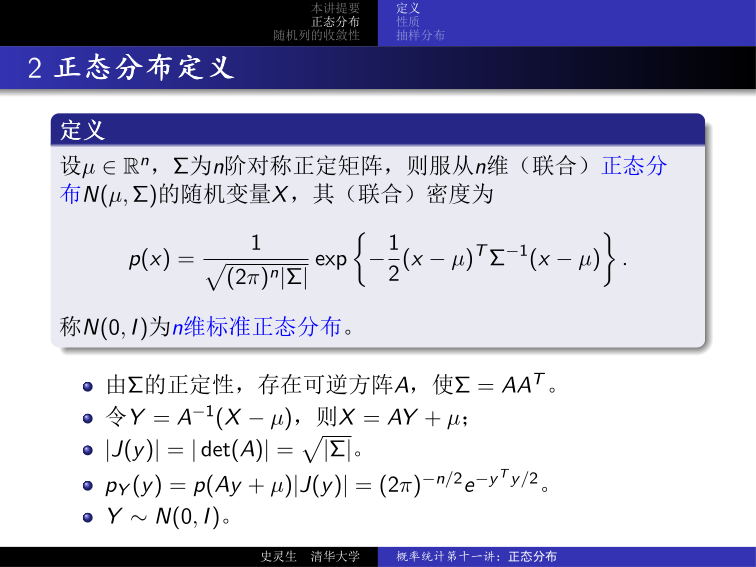
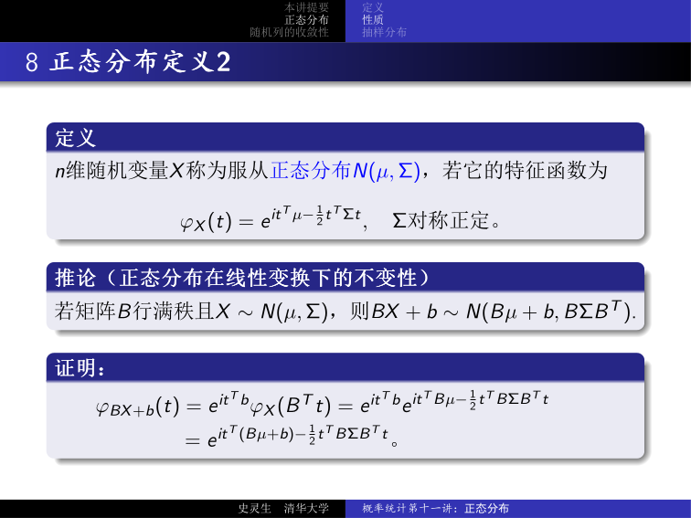
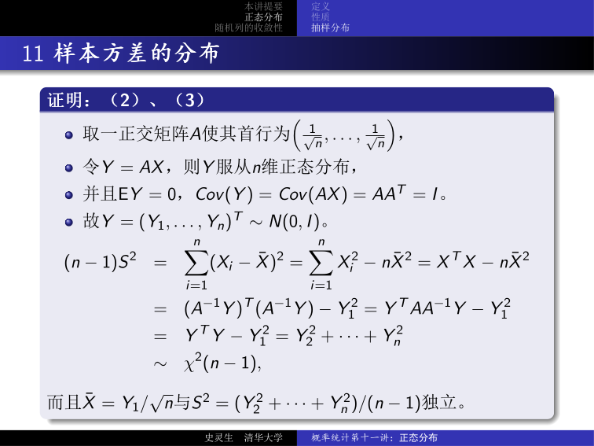
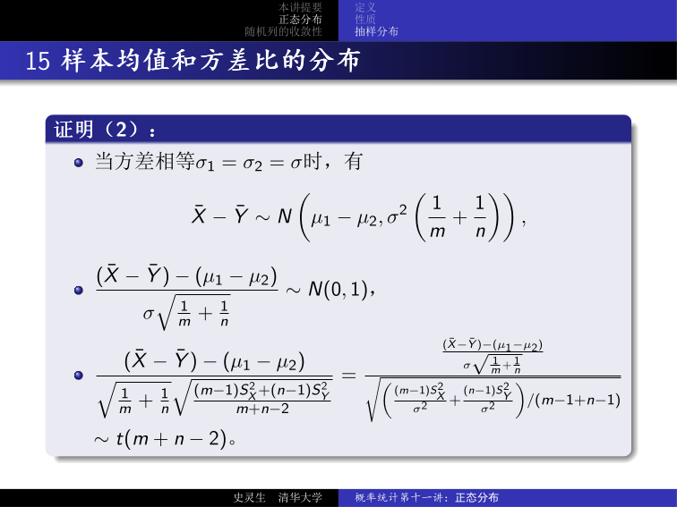
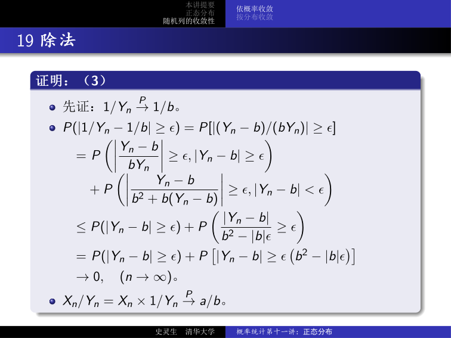

# 概率统计第十一讲：正态分布——多元正态分布的定义、性质、抽样分布与随机变量收敛性

## 1 本讲提要

**正态分布：**

- 多元正态分布的定义（密度函数与特征函数）
- 标准正态分布与线性变换
- 独立性与不相关性
- 等价刻画
- 样本均值与样本方差的抽样分布

**随机变量的收敛性：**

- 依概率收敛
- 依分布收敛

---

## 2 多元正态分布

### 2.1 密度函数定义

!!! abstract "定义 2.1（多元正态分布）"

    设 $\mu \in \mathbb{R}^n$，$\Sigma$ 为 $n$ 阶对称正定矩阵，则称 $n$ 维随机向量 $X$ 服从 **正态分布** $N(\mu, \Sigma)$，若其联合概率密度函数为

    $$
    p(x) = \frac{1}{\sqrt{(2\pi)^n |\Sigma|}} \exp\left(-\frac{1}{2}(x - \mu)^\mathsf{T} \Sigma^{-1} (x - \mu)\right).
    $$

称 $N(0, I)$ 为 $n$ 维 **标准正态分布**，其中 $I$ 为单位阵。

**从标准正态到一般正态**：由 $\Sigma$ 的正定性，存在可逆矩阵 $A$ 使得 $\Sigma = AA^\mathsf{T}$。令 $Y = A^{-1}(X - \mu)$，则：

$$
p_Y(y) = p(Ay + \mu) \, |J(y)| = (2\pi)^{-n/2} e^{-y^\mathsf{T} y / 2},
$$

即 $Y \sim N(0, I)$，且 $X = AY + \mu$。这建立了标准正态与一般正态之间的线性变换关系。

### 2.2 标准正态分布的基本性质

对 $X = (X_1, X_2, \dots, X_n)^\mathsf{T} \sim N(0, I)$：

- 各分量 $X_i \sim N(0, 1)$，$i = 1, \dots, n$
- 密度函数可分解：$p_X(x) = p_{X_1}(x_1) p_{X_2}(x_2) \cdots p_{X_n}(x_n)$，因此 $X_1, \dots, X_n$ **相互独立**
- $EX = 0$，$\operatorname{Cov}(X) = (\operatorname{Cov}(X_i, X_j))_{n \times n} = I$

对 $X = AY + \mu \sim N(\mu, \Sigma)$（其中 $Y \sim N(0, I)$）：

- $EX = E(AY + \mu) = \mu$
- $\operatorname{Cov}(X) = \operatorname{Cov}(AY) = A \operatorname{Cov}(Y) A^\mathsf{T} = AA^\mathsf{T} = \Sigma$

### 2.3 协方差矩阵的验证

??? note "验证 $\operatorname{Cov}(X) = \Sigma$"

    设 $X \sim N(\mu, \Sigma)$，$Y = A^{-1}(X - \mu) \sim N(0, I)$。对 $Y$ 的各分量，协方差 $\operatorname{Cov}(Y_i, Y_j) = \delta_{ij}$。

    $$
    \begin{aligned}
    \operatorname{Cov}(X_i, X_j) &= \operatorname{Cov}\!\left(\sum_{k=1}^n a_{ik}Y_k + \mu_i,\; \sum_{l=1}^n a_{jl}Y_l + \mu_j\right) \\
    &= \operatorname{Cov}\!\left(\sum_{k=1}^n a_{ik}Y_k,\; \sum_{l=1}^n a_{jl}Y_l\right) \\
    &= \sum_{k,l} a_{ik} a_{jl} \operatorname{Cov}(Y_k, Y_l) = \sum_{k=1}^n a_{ik} a_{jk}.
    \end{aligned}
    $$

    故 $\operatorname{Cov}(X) = (\,\sum_{k=1}^n a_{ik} a_{jk})_{n \times n} = AA^\mathsf{T} = \Sigma$。

### 2.4 独立性与不相关性等价

!!! abstract "定理 2.2（正态分布下独立 ⇔ 不相关）"

    设 $X = (X_1, \dots, X_n)^\mathsf{T} \sim N(\mu, \Sigma)$，则 $X_1, \dots, X_n$ **相互独立** 当且仅当 $\operatorname{Cov}(X_i, X_j) = 0$（$i \neq j$），即 $\Sigma$ 为对角阵。

??? note "证明"

    **必要性**：显然（独立 ⇒ 协方差为零）。

    **充分性**：设 $\Sigma = \operatorname{diag}(\sigma_1^2, \dots, \sigma_n^2)$，则 $\Sigma^{-1} = \operatorname{diag}(1/\sigma_1^2, \dots, 1/\sigma_n^2)$。此时

    $$
    \begin{aligned}
    p_X(x) &= \frac{1}{\sqrt{(2\pi)^n |\Sigma|}} \exp\!\left(-\frac{1}{2}(x - \mu)^\mathsf{T} \Sigma^{-1} (x - \mu)\right) \\
    &= \prod_{i=1}^n \frac{1}{\sqrt{2\pi}\sigma_i} \exp\!\left(-\frac{(x_i - \mu_i)^2}{2\sigma_i^2}\right) = \prod_{i=1}^n p_{X_i}(x_i).
    \end{aligned}
    $$

    联合密度等于各边缘密度的乘积，故分量相互独立。 $\square$

!!! tip "直觉"

    对于一般的联合分布，「独立 ⇒ 不相关」成立，但「不相关 ⇒ 独立」不成立。正态分布是少数几个使得两者等价的分布族之一，这是正态分布最重要的性质之一。

### 2.5 特征函数

!!! abstract "定理 2.3（多元正态分布的特征函数）"

    设 $X \sim N(\mu, \Sigma)$，其中 $\mu \in \mathbb{R}^n$，$\Sigma$ 为 $n$ 阶对称正定实矩阵，则 $X$ 的特征函数为

    $$
    \phi_X(t) = e^{i t^\mathsf{T} \mu - \frac{1}{2} t^\mathsf{T} \Sigma t}.
    $$

??? note "证明"

    存在可逆矩阵 $A$ 使得 $\Sigma = AA^\mathsf{T}$。令 $Y = A^{-1}(X - \mu) \sim N(0, I)$，则 $X = AY + \mu$。

    由于 $Y$ 各分量独立且 $Y_k \sim N(0, 1)$，$\phi_{Y_k}(t_k) = e^{-t_k^2/2}$，故

    $$
    \phi_Y(t) = \prod_{k=1}^n \phi_{Y_k}(t_k) = \prod_{k=1}^n e^{-t_k^2/2} = e^{-t^\mathsf{T} t / 2}.
    $$

    进而

    $$
    \phi_X(t) = e^{i t^\mathsf{T} \mu} \, \phi_Y(A^\mathsf{T} t) = e^{i t^\mathsf{T} \mu - \frac{1}{2} t^\mathsf{T} \Sigma t}.
    $$

    $\square$

反过来，给定上述形式的特征函数，也存在对应的正态分布：

!!! abstract "定理 2.4（特征函数刻画）"

    设 $\mu \in \mathbb{R}^n$，$\Sigma$ 为 $n$ 阶对称正定实矩阵，则存在随机向量 $X \sim N(\mu, \Sigma)$，使得

    $$
    \varphi: \mathbb{R}^n \to \mathbb{C}, \quad \varphi(t) = e^{i t^\mathsf{T} \mu - \frac{1}{2} t^\mathsf{T} \Sigma t}
    $$

    是 $X$ 的特征函数。

### 2.6 基于特征函数的定义

!!! abstract "定义 2.5（多元正态分布——特征函数定义）"

    $n$ 维随机向量 $X$ 称为服从 **正态分布** $N(\mu, \Sigma)$，若其特征函数为

    $$
    \phi_X(t) = e^{i t^\mathsf{T} \mu - \frac{1}{2} t^\mathsf{T} \Sigma t}, \quad \Sigma \text{ 对称正定}.
    $$

!!! abstract "推论 2.1（线性变换不变性）"

    若矩阵 $B$ 满秩且 $X \sim N(\mu, \Sigma)$，则 $BX + b \sim N(B\mu + b,\; B\Sigma B^\mathsf{T})$。

??? note "证明"

    $$
    \phi_{BX + b}(t) = e^{i t^\mathsf{T} b} \phi_X(B^\mathsf{T} t) = e^{i t^\mathsf{T} b} e^{i t^\mathsf{T} B\mu - \frac{1}{2} t^\mathsf{T} B\Sigma B^\mathsf{T} t} = e^{i t^\mathsf{T} (B\mu + b) - \frac{1}{2} t^\mathsf{T} B\Sigma B^\mathsf{T} t}.
    $$

    $\square$

### 2.7 正态分布的等价刻画

!!! abstract "定理 2.6（正态分布的等价刻画）"

    $n$ 维随机向量 $X$ 服从正态分布，当且仅当对任意 $a \in \mathbb{R}^n \setminus \{0\}$，$a^\mathsf{T} X$ 是一维正态随机变量。

??? note "证明"

    **必要性**：由推论 2.1 直接可得。

    **充分性**：设对任意 $a \in \mathbb{R}^n \setminus \{0\}$，$a^\mathsf{T} X$ 为一维正态随机变量。记 $EX = \mu$，$\operatorname{Cov}(X) = \Sigma$。则

    $$
    E(a^\mathsf{T} X) = a^\mathsf{T} \mu, \quad \operatorname{Var}(a^\mathsf{T} X) = a^\mathsf{T} \Sigma a > 0,
    $$

    故 $\Sigma$ 正定。又

    $$
    \phi_{a^\mathsf{T} X}(t) = \exp\!\left\{i a^\mathsf{T} \mu t - \frac{1}{2} a^\mathsf{T} \Sigma a \, t^2\right\},
    $$

    取 $t = 1$ 得 $\phi_X(a) = \phi_{a^\mathsf{T} X}(1) = \exp\{i a^\mathsf{T} \mu - \frac{1}{2} a^\mathsf{T} \Sigma a\}$，由 $a$ 的任意性及特征函数定义，$X \sim N(\mu, \Sigma)$。 $\square$

!!! tip "直觉"

    这个等价刻画意味着：要判断一个随机向量是否是多元正态，只需检验其任意线性投影是否为一元正态。这为多元正态的判定提供了极大便利。

---

## 3 正态总体的抽样分布

### 3.1 标准正态总体：$X_i \overset{\text{iid}}{\sim} N(0, 1)$

!!! abstract "定理 3.1（样本均值与样本方差——标准情形）"

    设 $X = (X_1, \dots, X_n)^\mathsf{T} \sim N(0, I)$，记样本均值 $\bar{X} = \frac{1}{n}\sum_{i=1}^n X_i$、样本方差 $S^2 = \frac{1}{n-1}\sum_{i=1}^n (X_i - \bar{X})^2$。则：

    1. $\bar{X} \sim N(0,\, 1/n)$；
    2. $\bar{X}$ 与 $S^2$ 相互独立；
    3. $(n-1)S^2 \sim \chi^2(n-1)$。

??? note "证明（正交变换方法）"

    构造正交矩阵 $A$，使其第一行为 $(\frac{1}{\sqrt{n}}, \dots, \frac{1}{\sqrt{n}})$。令 $Y = AX$，则 $Y$ 也服从 $n$ 维标准正态分布，且 $EY = 0$，$\operatorname{Cov}(Y) = AA^\mathsf{T} = I$。

    关键恒等式：

    $$
    \begin{aligned}
    (n-1)S^2 &= \sum_{i=1}^n (X_i - \bar{X})^2 = \sum_{i=1}^n X_i^2 - n\bar{X}^2 = X^\mathsf{T} X - n\bar{X}^2 \\
    &= (A^{-1}Y)^\mathsf{T} (A^{-1}Y) - Y_1^2 = Y^\mathsf{T} AA^{-1} Y - Y_1^2 \\
    &= Y^\mathsf{T} Y - Y_1^2 = Y_2^2 + \cdots + Y_n^2 \sim \chi^2(n-1),
    \end{aligned}
    $$

    且 $\bar{X} = Y_1 / \sqrt{n}$ 与 $S^2 = (Y_2^2 + \cdots + Y_n^2)/(n-1)$ 相互独立。 $\square$

### 3.2 一般正态总体：$X_i \overset{\text{iid}}{\sim} N(\mu, \sigma^2)$

!!! abstract "定理 3.2（样本均值与样本方差——一般情形）"

    设 $X = (X_1, \dots, X_n)^\mathsf{T} \sim N(\mu e, \sigma^2 I)$，其中 $e$ 为全 1 向量。记 $\bar{X} = \frac{1}{n}\sum_{i=1}^n X_i$，$S^2 = \frac{1}{n-1}\sum_{i=1}^n (X_i - \bar{X})^2$。则：

    1. $\bar{X}$ 与 $S^2$ 相互独立；
    2. $\bar{X} \sim N(\mu,\, \sigma^2/n)$；
    3. $\displaystyle \frac{(n-1)S^2}{\sigma^2} \sim \chi^2(n-1)$；
    4. $\displaystyle \frac{\sqrt{n}(\bar{X} - \mu)}{S} \sim t(n-1)$。

??? note "证明"

    标准化：令 $Y = (X - \mu e)/\sigma$，则 $Y \sim N(0, I)$，归结为定理 3.1。

    (2) $\bar{X} = e^\mathsf{T} X / n = e^\mathsf{T}(\sigma Y + \mu e)/n = \sigma e^\mathsf{T} Y / n + \mu = \sigma \bar{Y} + \mu \sim N(\mu, \sigma^2/n)$（因为 $\bar{Y} \sim N(0, 1/n)$）。

    (3)

    $$
    \frac{(n-1)S_X^2}{\sigma^2} = \frac{1}{\sigma^2} \sum_{i=1}^n (X_i - \bar{X})^2 = \sum_{i=1}^n \left(\frac{X_i - \mu}{\sigma} - \frac{\bar{X} - \mu}{\sigma}\right)^2 = \sum_{i=1}^n (Y_i - \bar{Y})^2 = (n-1)S_Y^2 \sim \chi^2(n-1).
    $$

    (4)

    $$
    \frac{\sqrt{n}(\bar{X} - \mu)}{S} = \frac{\frac{\sqrt{n}(\bar{X} - \mu)}{\sigma}}{\sqrt{\frac{(n-1)S^2}{\sigma^2} / (n-1)}} \sim t(n-1).
    $$

    $\square$

### 3.3 两个正态总体的比较

!!! abstract "推论 3.1（两个独立正态总体的抽样分布）"

    设 $X = (X_1, \dots, X_m)^\mathsf{T} \sim N(\mu_1 e, \sigma_1^2 I)$ 与 $Y = (Y_1, \dots, Y_n)^\mathsf{T} \sim N(\mu_2 e, \sigma_2^2 I)$ 相互独立。记 $\bar{X}, \bar{Y}$ 为样本均值，$S_X^2, S_Y^2$ 为样本方差。则：

    1. $\displaystyle \frac{S_X^2 / \sigma_1^2}{S_Y^2 / \sigma_2^2} \sim F(m-1,\, n-1)$；
    2. 当 $\sigma_1 = \sigma_2 = \sigma$ 时，

    $$
    \frac{(\bar{X} - \bar{Y}) - (\mu_1 - \mu_2)}{\sqrt{\frac{1}{m} + \frac{1}{n}} \; \sqrt{\frac{(m-1)S_X^2 + (n-1)S_Y^2}{m+n-2}}} \sim t(m+n-2).
    $$

??? note "证明（第 2 条）"

    当 $\sigma_1 = \sigma_2 = \sigma$ 时：

    $$
    \bar{X} - \bar{Y} \sim N\!\left(\mu_1 - \mu_2,\; \sigma^2\!\left(\frac{1}{m} + \frac{1}{n}\right)\right),
    $$

    故 $\frac{(\bar{X} - \bar{Y}) - (\mu_1 - \mu_2)}{\sigma\sqrt{1/m + 1/n}} \sim N(0, 1)$。又由定理 3.2，$\frac{(m-1)S_X^2}{\sigma^2} \sim \chi^2(m-1)$，$\frac{(n-1)S_Y^2}{\sigma^2} \sim \chi^2(n-1)$，且两个卡方变量独立，可加得 $\frac{(m-1)S_X^2 + (n-1)S_Y^2}{\sigma^2} \sim \chi^2(m+n-2)$。按 $t$ 分布定义即得。 $\square$

---

## 4 随机变量的收敛性

### 4.1 依概率收敛

!!! abstract "定义 4.1（依概率收敛，Convergence in Probability）"

    设 $\{X_n\}$ 为一随机变量序列，$X$ 为一随机变量。若对任意 $\varepsilon > 0$，有

    $$
    P(|X_n - X| \geq \varepsilon) \to 0 \quad (n \to \infty),
    $$

    则称 $\{X_n\}$ **依概率收敛** 于 $X$，记为 $X_n \xrightarrow{P} X$。

!!! abstract "定理 4.1（依概率收敛的四则运算）"

    设 $\{X_n\}$、$\{Y_n\}$ 为两个随机变量序列，$a$、$b$ 为常数。若 $X_n \xrightarrow{P} a$，$Y_n \xrightarrow{P} b$，则：

    1. $X_n \pm Y_n \xrightarrow{P} a \pm b$；
    2. $X_n Y_n \xrightarrow{P} ab$；
    3. $X_n / Y_n \xrightarrow{P} a / b$（$b \neq 0$）。

??? note "证明（第 1 条：加法）"

    利用事件包含关系：

    $$
    \{|X_n + Y_n - (a + b)| \geq \varepsilon\} \subset \{|X_n - a| \geq \varepsilon/2\} \cup \{|Y_n - b| \geq \varepsilon/2\},
    $$

    故

    $$
    0 \leq P(|X_n + Y_n - (a + b)| \geq \varepsilon) \leq P(|X_n - a| \geq \varepsilon/2) + P(|Y_n - b| \geq \varepsilon/2) \to 0.
    $$

    减法类似。 $\square$

??? note "证明（第 2 条：乘法）"

    先证若 $X_n \xrightarrow{P} 0$ 则 $X_n^2 \xrightarrow{P} 0$：
    $P(|X_n^2| \geq \varepsilon) = P(|X_n| \geq \sqrt{\varepsilon}) \to 0$。

    再证若 $X_n \xrightarrow{P} a$ 则 $cX_n \xrightarrow{P} ca$（$c \neq 0$ 时）。

    最后证 $X_n \xrightarrow{P} a \Rightarrow X_n^2 \xrightarrow{P} a^2$：

    $$
    X_n - a \xrightarrow{P} 0 \Rightarrow (X_n - a)^2 \xrightarrow{P} 0,\; 2a(X_n - a) \xrightarrow{P} 0,
    $$

    $$
    X_n^2 - a^2 = (X_n - a)^2 + 2a(X_n - a) \xrightarrow{P} 0.
    $$

    同理 $Y_n^2 \xrightarrow{P} b^2$，$(X_n + Y_n)^2 \xrightarrow{P} (a+b)^2$。于是

    $$
    X_n Y_n = \frac{(X_n + Y_n)^2 - X_n^2 - Y_n^2}{2} \xrightarrow{P} \frac{(a+b)^2 - a^2 - b^2}{2} = ab.
    $$

    $\square$

??? note "证明（第 3 条：除法）"

    先证 $1/Y_n \xrightarrow{P} 1/b$。考虑

    $$
    \begin{aligned}
    P(|1/Y_n - 1/b| \geq \varepsilon) &= P\!\left(\left|\frac{Y_n - b}{b Y_n}\right| \geq \varepsilon\right) \\
    &\leq P(|Y_n - b| \geq \varepsilon) + P\!\left(|Y_n - b| \geq \varepsilon(b^2 - |b|\varepsilon)\right) \to 0.
    \end{aligned}
    $$

    再由乘法得 $X_n / Y_n = X_n \cdot 1/Y_n \xrightarrow{P} a/b$。 $\square$

### 4.2 依分布收敛

!!! abstract "定义 4.2（依分布收敛，Convergence in Distribution）"

    设随机变量 $X, X_1, X_2, \dots$ 的分布函数分别为 $F(x), F_1(x), F_2(x), \dots$。若对 $F(x)$ 的任意连续点 $x$，均有

    $$
    \lim_{n \to \infty} F_n(x) = F(x),
    $$

    则称 $\{F_n(x)\}$ **依分布收敛** 于 $F(x)$，记为 $F_n(x) \xrightarrow{W} F(x)$；也称 $\{X_n\}$ 依分布收敛于 $X$，记为 $X_n \xrightarrow{L} X$。

!!! abstract "定理 4.2（依概率收敛 ⇒ 依分布收敛）"

    $$
    X_n \xrightarrow{P} X \quad\Longrightarrow\quad X_n \xrightarrow{L} X.
    $$

    特别地，若 $X = c$ 为常数，则 $X_n \xrightarrow{P} c \iff X_n \xrightarrow{L} c$。

!!! warning "注意：依分布收敛 $\nRightarrow$ 依概率收敛"

    反例：设 $X$ 服从 $P(X = 1) = P(X = -1) = 1/2$，令 $X_n = -X$。则 $X_n$ 与 $X$ 同分布，$X_n \xrightarrow{L} X$。但对 $0 < \varepsilon < 2$，

    $$
    P(|X_n - X| \geq \varepsilon) = P(2|X| \geq \varepsilon) = 1,
    $$

    故 $X_n$ 不依概率收敛于 $X$。

!!! tip "直觉"

    - **依概率收敛**：$X_n$ 和 $X$ 以高概率取到彼此接近的值（逐点逼近）
    - **依分布收敛**：只要求分布函数逐点收敛，不关心 $X_n$ 和 $X$ 之间的联合关系（分布逼近）
    - 依概率收敛更强——它不仅要求分布逼近，还要求 $|X_n - X|$ 本身趋于零
