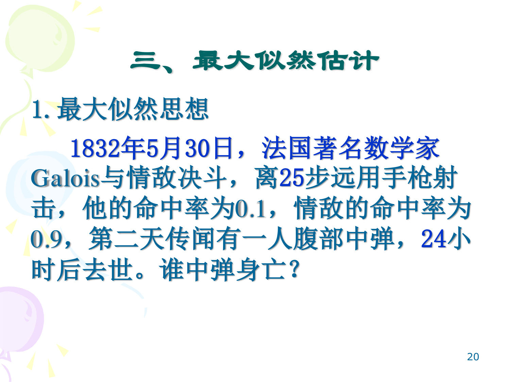
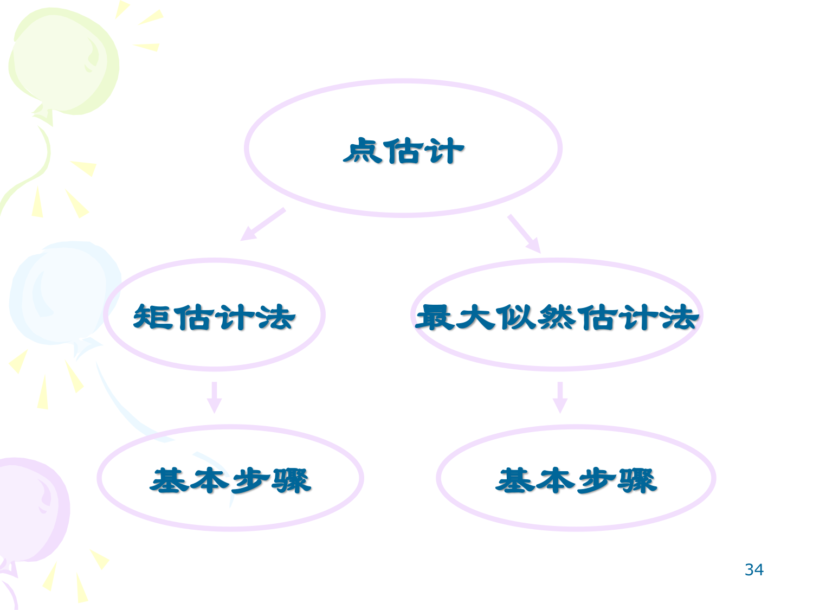

<script>
  window.MathJax = {
    tex: {
      inlineMath: [["$", "$"], ["\\(", "\\)"]],
      displayMath: [["$$", "$$"], ["\\[", "\\]"]],
      processEscapes: true,
      processEnvironments: true,
      tags: "none"
    },
    options: {
      ignoreHtmlClass: "no-mathjax",
      processHtmlClass: "arithmatex"
    },
    svg: { fontCache: "global" }
  };
</script>
<script async src="https://cdn.jsdelivr.net/npm/mathjax@3/es5/tex-mml-chtml.js"></script>
<script>
  (function () {
    function typeset() {
      if (window.MathJax && window.MathJax.typesetPromise) {
        window.MathJax.typesetPromise();
      }
    }
    if (typeof document$ !== "undefined" && document$.subscribe) {
      document$.subscribe(typeset);
    } else if (document.readyState === "loading") {
      document.addEventListener("DOMContentLoaded", typeset);
    } else {
      typeset();
    }
  })();
</script>

# 点估计：矩估计与最大似然估计

## 1 数理统计引言

数理统计是概率论的应用分支，研究如何有效地收集、整理和分析带有随机性的数据，以对所考察的问题作出推断或预测，并为决策和行动提供依据和建议。

典型的统计推断问题包括：

- **参数估计**：已知总体的分布类型，对分布中的未知参数进行统计推断（如估计正态分布的 $\mu$ 和 $\sigma^2$）
- **假设检验**：对总体分布的某些假设进行检验

!!! info "参数估计 vs 非参数推断"

    参数估计假定总体分布形式已知（如正态分布），只需求估计其中的未知参数；非参数推断则不对总体分布做严格的参数化假设。

## 2 总体与样本

### 2.1 总体

!!! abstract "定义 2.1（总体）"

    总体指研究对象的全体，通常指研究对象的某项数量指标。组成总体的元素称为个体。

    从本质上讲，总体就是所研究的随机变量或随机变量的分布。

### 2.2 样本

!!! abstract "定义 2.2（简单随机样本）"

    来自总体的部分个体 $X_1, \dots, X_n$ 如果满足：

    1. **同分布性**：$X_i$（$i = 1, \dots, n$）与总体同分布
    2. **独立性**：$X_1, \dots, X_n$ 相互独立

    则称为容量为 $n$ 的 **简单随机样本**，简称样本。而称 $X_1, \dots, X_n$ 的一次实现为 **样本观察值**，记为 $x_1, \dots, x_n$。

来自总体 $X$ 的随机样本 $X_1, \dots, X_n$ 可记为

$$
X_1, \dots, X_n \stackrel{\text{i.i.d.}}{\sim} X \quad \text{或} \quad F(x),\; p(x),\; \dots
$$

样本的联合分布函数和联合密度函数分别为：

$$
F(x_1, x_2, \dots, x_n) = \prod_{i=1}^{n} F(x_i)
$$

$$
p(x_1, x_2, \dots, x_n) = \prod_{i=1}^{n} p(x_i)
$$

### 2.3 总体、样本与样本观察值的关系

统计是从手中已有的资料 —— 样本观察值，去推断总体的情况 —— 总体分布。样本是联系两者的桥梁：总体分布决定了样本取值的概率规律，因而可以用样本观察值去推断总体。

```
总体（理论分布） → 样本（随机变量） → 样本观察值（具体数值）
```

## 3 统计量

!!! abstract "定义 3.1（统计量）"

    称样本 $X_1, \dots, X_n$ 的函数 $T(X_1, \dots, X_n)$ 是总体的一个 **统计量**，如果 $T(X_1, \dots, X_n)$ 不含未知参数。

### 3.1 常用统计量

**（1）样本均值**

$$
\bar{x} = \frac{1}{n}\sum_{i=1}^{n} x_i
$$

**（2）样本方差**

$$
s_n^2 = \frac{1}{n}\sum_{i=1}^{n}(x_i - \bar{x})^2
$$

**（3）无偏方差**

$$
s^2 = \frac{1}{n-1}\sum_{i=1}^{n}(x_i - \bar{x})^2
$$

样本标准差：$s_n = \sqrt{s_n^2}$ 或 $s = \sqrt{s^2}$（无偏标准差）。

!!! tip "为什么无偏方差分母是 $n-1$ ？"

    详见 Section 7.2 无偏性的讨论：用 $n-1$ 作为分母可保证 $E[s^2] = \sigma^2$。

**（4）样本 $k$ 阶矩**

- 原点矩：$\hat{a}_k = \frac{1}{n}\sum_{i=1}^{n} x_i^k$
- 中心矩：$\hat{b}_k = \frac{1}{n}\sum_{i=1}^{n} (x_i - \bar{x})^k$

### 3.2 经验分布函数

用 $S(x)$ 表示随机样本 $X_1, \dots, X_n$ 中不大于 $x$ 的样本个数。定义经验分布函数：

$$
F_n(x) = \frac{S(x)}{n}
$$

!!! abstract "Glivenko 定理"


    $$
    P\left( \lim_{n \to \infty} \sup_{-\infty < x < +\infty} |F_n(x) - F(x)| = 0 \right) = 1
    $$

即当 $n$ 充分大时，经验分布函数 $F_n(x)$ 以概率 1 一致逼近总体分布函数 $F(x)$。

## 4 点估计的基本概念

!!! abstract "定义 4.1（点估计）"

    设 $X_1, \dots, X_n$ 是总体的一个样本，其分布函数为 $F(x; \theta)$，$\theta \in \Theta$；其中 $\theta$ 为未知参数，$\Theta$ 为参数空间。若统计量 $\theta'(X_1, \dots, X_n)$ 可作为 $\theta$ 的一个估计，则称其为 $\theta$ 的一个 **估计量**，记为

    $$
    \hat{\theta} = \theta'(X_1, X_2, \dots, X_n)
    $$

若 $x_1, \dots, x_n$ 是样本的一组观测值，则 $\hat{\theta} = \theta'(x_1, x_2, \dots, x_n)$ 称为 $\theta$ 的 **估计值**。

!!! info "点估计"

    由于 $\theta'(X_1, \dots, X_n)$ 是实数域上的一个点，用它来估计 $\theta$，故称这种估计为 **点估计**。

点估计的经典方法：
1. **矩法估计**
2. **最大似然估计**
3. Bayes 估计（本讲略）

## 5 矩法估计

### 5.1 矩法的基本思想

!!! abstract "矩法估计"


    1. 用样本矩作为总体同阶矩的估计，即

       若 $\alpha_k = E X^k$，则 $\hat{\alpha}_k = \frac{1}{n}\sum_{i=1}^{n} X_i^k$

       若 $\beta_k = E(X - EX)^k$，则 $\hat{\beta}_k = \frac{1}{n}\sum_{i=1}^{n} (X_i - \bar{X})^k$

    2. 约定：若 $\hat{\theta}$ 是未知参数 $\theta$ 的矩估计，则 $g(\theta)$ 的矩估计为 $g(\hat{\theta})$。

核心思路：总体矩是参数的函数，用样本矩替代总体矩，解出参数的估计值。

### 5.2 矩法估计的例子

???+ example "例 5.1（二项分布 $b(m, p)$）"

    设 $X_1, \dots, X_n$ 为取自总体 $X \sim b(m, p)$ 的样本，其中 $m$ 已知，$0 < p < 1$ 未知，求 $p$ 的矩估计。

    **解**：$EX = mp$，故 $p = EX / m = \mu / m$。而 $\hat{\mu} = \bar{x}$，故 $p$ 的矩估计 $\hat{p} = \bar{x} / m$。

???+ example "例 5.2（指数分布）"

    设 $X_1, \dots, X_n$ 为取自参数为 $\lambda$ 的指数分布总体 $X$ 的样本，求 $\lambda$ 的矩估计。

    **解**：由 $X \sim \text{Exp}(\lambda)$ 知 $EX = 1/\lambda$，所以 $\lambda = 1/EX = 1/\mu$，得 $\hat{\lambda} = 1 / \bar{x}$。

???+ example "例 5.3（正态分布 $N(\mu, \sigma^2)$）"

    设 $X_1, \dots, X_n$ 为取自总体 $X \sim N(\mu, \sigma^2)$ 的样本，求参数 $\mu, \sigma^2$ 的矩估计。

    **解**：$EX = \mu$，$\text{Var}(X) = \sigma^2$，所以

    $$
    \hat{\mu} = \bar{x}, \quad \hat{\sigma}^2 = s^2 = \frac{1}{n-1}\sum_{i=1}^{n} (x_i - \bar{x})^2
    $$

???+ example "例 5.4（均匀分布 $U(a, b)$）"

    设 $X_1, \dots, X_n \stackrel{\text{i.i.d.}}{\sim} U(a, b)$，试求 $a$ 和 $b$ 的矩估计。

    **解**：$EX = (a+b)/2$，$\text{Var}(X) = (a-b)^2 / 12$。解得

    $$
    a = EX - \sqrt{3\text{Var}(X)}, \quad b = EX + \sqrt{3\text{Var}(X)}
    $$

    故

    $$
    \hat{a} = \bar{x} - \sqrt{3}\, s, \quad \hat{b} = \bar{x} + \sqrt{3}\, s
    $$

???+ example "例 5.5（Laplace 分布）"

    设总体 $X$ 的概率密度为 $p(x) = \frac{1}{2\sigma}e^{-|x|/\sigma}$，$X_1, \dots, X_n$ 为样本，求参数 $\sigma$ 的矩估计。

    **解**：$\mu = EX = \int_{-\infty}^{\infty} \frac{x}{2\sigma} e^{-|x|/\sigma} dx = 0$（奇函数），

    $$
    \alpha_2 = EX^2 = \int_{-\infty}^{\infty} \frac{x^2}{2\sigma} e^{-|x|/\sigma} dx = \frac{1}{\sigma}\int_0^{\infty} x^2 e^{-x/\sigma} dx
    $$

    分部积分得 $\alpha_2 = 2\sigma^2$。故 $\sigma = \sqrt{\alpha_2 / 2}$，从而

    $$
    \hat{\sigma} = \sqrt{\frac{\hat{\alpha}_2}{2}} = \sqrt{\frac{1}{2n}\sum_{i=1}^{n} x_i^2}
    $$

## 6 最大似然估计

### 6.1 最大似然思想

!!! tip "直观理解：Galois 决斗问题"

    1832 年，法国数学家 Galois 与情敌决斗：Galois 命中率 0.1，情敌命中率 0.9。次日传闻有一人腹部中弹身亡。谁中弹了？

    虽然我们不能绝对确定，但根据「已发生的事件应该是概率最大的那个」这一直观原则，更有可能是情敌命中了 Galois。



**最大似然思想**：事件 $A$ 发生的概率与参数 $\theta \in \Theta$ 有关，$\theta$ 取值不同，则 $P(A|\theta)$ 也不同。若 $A$ 发生了，则认为此时的 $\theta$ 值应是在 $\Theta$ 中使 $P(A|\theta)$ 达到最大的那一个。

### 6.2 似然函数与 MLE 定义

**离散型总体**：设总体 $X$ 的分布律为 $P(X = a_k) = P_\theta(a_k),\; k=1,2,\dots$，样本观察值 $x_1, \dots, x_n$ 取值于 $\{a_k\}$。记 $A = \{X_1 = x_1, \dots, X_n = x_n\}$，则

$$
P(A|\theta) = P_\theta(X_1 = x_1, \dots, X_n = x_n) = \prod_{i=1}^{n} P_\theta(x_i)
$$

$\theta$ 值应是使 $\prod_{i=1}^{n} P_\theta(x_i)$ 达到最大的那一个。

**连续型总体**：设总体 $X$ 的概率密度为 $p(x; \theta)$，样本观察值 $x_1, \dots, x_n$。记 $\delta(x_1, \dots, x_n)$ 为包围点 $(x_1, \dots, x_n)$ 的小球域，

$$
P(A|\theta) = \int_{\delta(x_1, \dots, x_n)} \prod_{i=1}^{n} p(x_i; \theta) \, dx_1 \cdots dx_n
$$

$\theta$ 值应是使样本联合密度达到最大的那一个。

!!! abstract "定义 6.1（似然函数与最大似然估计）"

    设 $X_1, X_2, \dots, X_n \stackrel{\text{i.i.d.}}{\sim} p(x; \theta)$，$\theta \in \Theta$，则称

    $$
    L(\theta) = L(X_1, X_2, \dots, X_n; \theta) = \prod_{i=1}^{n} p(X_i; \theta)
    $$

    为该总体的 **似然函数**。

    若有 $\hat{\theta} \in \Theta$，使得

    $$
    L(\hat{\theta}) = \max_{\theta \in \Theta} L(\theta) = \sup_{\theta \in \Theta} L(\theta)
    $$

    则称 $\hat{\theta}$ 为 $\theta$ 的 **最大似然估计**（Maximum Likelihood Estimation, MLE）。

### 6.3 求 MLE 的步骤

设 $X_1, \dots, X_n \stackrel{\text{i.i.d.}}{\sim} p(x; \theta)$，$\theta \in \Theta$，求 $\hat{\theta} = \hat{\theta}(X_1, \dots, X_n)$：

### 算法 6.1（求最大似然估计的标准步骤）

$$
\begin{aligned}
& \textbf{算法: } \text{MLE\_Standard} \\
& \textbf{输入: } X_1, \dots, X_n \sim p(x;\theta),\; \theta \in \Theta \\
& \textbf{输出: } \hat{\theta} = \hat{\theta}(X_1, \dots, X_n) \\
& 1. \quad \text{做似然函数 } L(\theta) = \prod_{i=1}^{n} p(X_i; \theta) \\
& 2. \quad \text{做对数似然函数 } \ln L(\theta) = \sum_{i=1}^{n} \ln p(X_i; \theta) \\
& 3. \quad \text{列似然方程 } \frac{d[\ln L(\theta)]}{d\theta} = 0 \\
& 4. \quad \text{若该方程有解，则从中得到最值为 } \hat{\theta} = \hat{\theta}(X_1, X_2, \dots, X_n) \\
& 5. \quad \textbf{return } \hat{\theta}
\end{aligned}
$$

!!! tip "为什么取对数？"

    对数函数是单调递增的，$\max L(\theta)$ 与 $\max \ln L(\theta)$ 等价。取对数后将乘积转化为求和，求导更方便。

!!! warning "似然方程无解的情况"

    当似然方程解不出 $\theta$ 的似然估计时，需由定义通过分析直接推求（见例 6.5 均匀分布情形）。

### 6.4 MLE 的例子

???+ example "例 6.1（Poisson 分布）"

    设 $X_1, \dots, X_n$ 为取自参数为 $\lambda$ 的 Poisson 分布总体 $X$ 的样本，求 $\lambda$ 的最大似然估计。

    **解**：

    $$
    L(\lambda) = \prod_{i=1}^{n} P_\lambda(X = x_i) = \prod_{i=1}^{n} \frac{\lambda^{x_i}}{x_i!} e^{-\lambda}
    = \frac{\lambda^{\,x_1+\cdots+x_n}}{e^{n\lambda} \prod_{i=1}^{n} x_i!}
    $$

    $$
    \ln L(\lambda) = \sum_{i=1}^{n} x_i \ln \lambda - n\lambda - \sum_{i=1}^{n} \ln(x_i!)
    $$

    令 $\frac{d[\ln L(\lambda)]}{d\lambda} = \frac{1}{\lambda}\sum_{i=1}^{n} x_i - n = 0$，得 $\hat{\lambda} = \bar{x} = \frac{1}{n}\sum_{i=1}^{n} x_i$。

???+ example "例 6.2（正态分布 $N(\mu, \sigma^2)$）"

    设 $X_1, \dots, X_n$ 为取自 $N(\mu, \sigma^2)$ 总体的样本，求参数 $\mu, \sigma^2$ 的最大似然估计。

    **解**：

    $$
    L(\mu, \sigma^2) = \prod_{i=1}^{n} p(x_i; \mu, \sigma^2) = \prod_{i=1}^{n} \frac{1}{\sqrt{2\pi}\sigma} e^{-\frac{(x_i-\mu)^2}{2\sigma^2}}
    $$

    $$
    \Rightarrow L(\mu, \sigma^2) = \frac{1}{(2\pi)^{n/2} \sigma^n} \exp\!\left(-\sum_{i=1}^{n}\frac{(x_i-\mu)^2}{2\sigma^2}\right)
    $$

    $$
    \ln L(\mu, \sigma^2) = -\frac{n}{2}\ln(2\pi) - \frac{n}{2}\ln\sigma^2 - \sum_{i=1}^{n}\frac{(x_i-\mu)^2}{2\sigma^2}
    $$

    令偏导数为零：

    $$
    \begin{cases}
    \frac{\partial \ln L(\mu, \sigma^2)}{\partial \mu} = \frac{1}{\sigma^2}\sum_{i=1}^{n}(x_i - \mu) = 0, \\[8pt]
    \frac{\partial \ln L(\mu, \sigma^2)}{\partial \sigma^2} = -\frac{n}{2\sigma^2} + \sum_{i=1}^{n}\frac{(x_i-\mu)^2}{2\sigma^4} = 0.
    \end{cases}
    $$

    解得

    $$
    \hat{\mu} = \frac{1}{n}\sum_{i=1}^{n} x_i = \bar{x}, \quad \hat{\sigma}^2 = \frac{1}{n}\sum_{i=1}^{n} (x_i - \bar{x})^2 = s_n^2
    $$

!!! warning "正态分布下矩估计与 MLE 的差异"

    - $\mu$ 的矩估计和 MLE 相同：都是 $\bar{x}$
    - $\sigma^2$ 的矩估计是 $s^2 = \frac{1}{n-1}\sum(x_i-\bar{x})^2$（无偏）
    - $\sigma^2$ 的 MLE 是 $s_n^2 = \frac{1}{n}\sum(x_i-\bar{x})^2$（有偏）

    MLE 不保证无偏性！

???+ example "例 6.3（指数分布的 $F(x)$ 估计）"

    设 $X_1, \dots, X_n$ 为取自参数为 $\lambda$ 的指数分布总体的样本，$x > 0$ 为一给定实数，求 $p = F(x)$ 的最大似然估计。

    **解**：

    $$
    p = F(x) = \int_0^x \lambda e^{-\lambda t} dt = 1 - e^{-\lambda x}
    $$

    先求 $\lambda$ 的 MLE：

    $$
    L(\lambda) = \prod_{i=1}^{n} \lambda e^{-\lambda x_i} = \lambda^n e^{-\lambda\sum_{i=1}^{n} x_i}
    $$

    $$
    \ln L(\lambda) = n\ln\lambda - \lambda\sum_{i=1}^{n} x_i
    $$

    令 $\frac{d[\ln L(\lambda)]}{d\lambda} = \frac{n}{\lambda} - \sum_{i=1}^{n} x_i = 0$，得 $\hat{\lambda} = 1/\bar{x}$。

    由 MLE 的不变性，代入 $\hat{\lambda} = 1/\bar{x}$ 得 $\hat{p} = 1 - e^{-x/\bar{x}}$。

???+ example "例 6.4（均匀分布 $U(0, \theta)$ — 似然方程无解的情形）"

    设 $X_1, \dots, X_n$ 为取自 $U(0, \theta)$ 总体的样本，$\theta > 0$ 未知，求参数 $\theta$ 的最大似然估计。

    **解**：

    $$
    L(\theta) = \prod_{i=1}^{n} p(x_i; \theta) =
    \begin{cases}
    \frac{1}{\theta^n}, & 0 < x_i < \theta, \\[4pt]
    0, & \text{otherwise}.
    \end{cases}
    $$

    $\ln L(\theta) = -n\ln\theta$，令 $\frac{d[\ln L(\theta)]}{d\theta} = -\frac{n}{\theta} = 0$，**无解！**

    注意到为使 $L(\theta) \neq 0$，必须 $0 < \max\{x_i\} < \theta$，故 $\theta$ 的值域为 $(\max\{x_i\}, \infty)$。而 $L(\theta) = 1/\theta^n$ 关于 $\theta$ 单调递减，故 $\theta$ 越小 $L(\theta)$ 越大。因此

    $$
    L(\max\{x_i\}) = \sup_{\theta} L(\theta)
    $$

    故 $\hat{\theta} = \max\{X_i \mid i = 1, 2, \dots, n\} = X_{(n)}$。

### 6.5 MLE 的不变性

!!! abstract "MLE 的不变性"

    若 $\hat{\theta}$ 是未知参数 $\theta$ 的最大似然估计，则 $g(\theta)$ 的最大似然估计为 $g(\hat{\theta})$。

**对正态总体 $N(\mu, \sigma^2)$ 的应用**：

- 标准差 $\sigma$ 的 MLE 是 $s_n$
- 分布函数 $F(x) = \Phi\!\left(\frac{x - \mu}{\sigma}\right)$ 的 MLE 是 $\Phi\!\left(\frac{x - \bar{x}}{s_n}\right)$
- 总体 $\alpha$ 分位数 $x_\alpha = \mu + \sigma u_\alpha$ 的 MLE 是 $\bar{x} + s_n u_\alpha$（其中 $u_\alpha$ 为 $N(0,1)$ 分布的 $\alpha$ 分位数）



## 7 估计量的评选标准

同一个参数可以由不同的估计量来估计，如何评价估计量的优劣？三个基本标准：相合性、无偏性、有效性。

### 7.1 相合性

!!! abstract "定义 7.1（相合性）"

    设 $\hat{\theta}_n = \hat{\theta}(X_1, \dots, X_n)$ 是 $\theta$ 的估计量，若

    $$
    \hat{\theta}_n \xrightarrow{P} \theta
    $$

    则称 $\hat{\theta}$ 是 $\theta$ 的 **相合估计量**（一致估计量）。

相合性的直观含义：当样本容量 $n$ 足够大时，估计量会以高概率逼近真值。

???+ example "例 7.1（$b(m, p)$ 中 $p$ 的相合性）"

    设 $X_1, \dots, X_n \stackrel{\text{i.i.d.}}{\sim} b(m, p)$，$m$ 已知，讨论 $p$ 的矩估计量的相合性。

    **解**：由 Chebyshev 大数定律，

    $$
    \bar{x} = \frac{1}{n}\sum_{i=1}^{n} X_i \xrightarrow{P} EX = mp
    $$

    故 $\hat{p} = \bar{x} / m \xrightarrow{P} p$，$p$ 的矩估计量是相合的。

### 7.2 无偏性

!!! abstract "定义 7.2（无偏性）"

    设 $\hat{\theta} = \hat{\theta}(X_1, \dots, X_n)$ 为 $\theta$ 的估计量，若

    $$
    E\hat{\theta} = \theta
    $$

    则称 $\hat{\theta}$ 是 $\theta$ 的 **无偏估计量**。

**样本均值的无偏性**：

$$
E\bar{x} = E\!\left[\frac{1}{n}\sum_{i=1}^{n} X_i\right] = \frac{1}{n}\sum_{i=1}^{n} EX_i = EX = \mu
$$

$\bar{x}$ 是 $\mu$ 的无偏估计。

**样本方差的无偏性**（使用 $n-1$ 的分母）：

$$
\begin{aligned}
E[s^2] &= E\!\left[\frac{1}{n-1}\sum_{i=1}^{n}(X_i - \bar{x})^2\right] \\
&= \frac{1}{n-1} E\!\left[\sum_{i=1}^{n} X_i^2 - n\bar{x}^2\right] \\
&= \frac{1}{n-1}\left( \sum_{i=1}^{n} EX_i^2 - nE\bar{x}^2 \right) \\
&= \frac{1}{n-1}\Big[ n(\mu^2 + \sigma^2) - n(\mu^2 + \sigma^2/n) \Big] = \sigma^2
\end{aligned}
$$

所以 $s^2 = \frac{1}{n-1}\sum(X_i - \bar{x})^2$ 是 $\sigma^2$ 的无偏估计；而 MLE $s_n^2 = \frac{1}{n}\sum(X_i - \bar{x})^2$ 是有偏的。

???+ example "例 7.2（均匀分布 $U(0, \theta)$ 的无偏性比较）"

    设 $X_1, \dots, X_n \stackrel{\text{i.i.d.}}{\sim} U(0, \theta)$，考察 $\theta$ 的矩估计和最大似然估计的无偏性。

    **解**：$\theta$ 的矩估计和最大似然估计分别为

    $$
    \hat{\theta}_M = 2\bar{x}, \quad \hat{\theta}_{\text{MLE}} = X_{(n)}
    $$

    $E\hat{\theta}_M = 2E\bar{x} = 2 \cdot EX = 2 \cdot \frac{\theta}{2} = \theta$，故 $\hat{\theta}_M$ 无偏。

    但 MLE $X_{(n)}$ 是偏的。若取 $\theta^* = \frac{n+1}{n} \hat{\theta}_{\text{MLE}}$，则 $\theta^*$ 是 $\theta$ 的无偏估计。

### 7.3 有效性

!!! abstract "定义 7.3（有效性）"

    设 $\hat{\theta}_1$ 和 $\hat{\theta}_2$ 分别是参数 $\theta$ 的两个无偏估计，若

    $$
    \text{Var}(\hat{\theta}_1) \leq \text{Var}(\hat{\theta}_2)
    $$

    且存在 $\theta \in \Theta$ 使得不等号严格成立，则称 $\hat{\theta}_1$ 比 $\hat{\theta}_2$ **有效**。

续例 7.2：已知 $\hat{\theta}_M$ 与 $\frac{n+1}{n}\hat{\theta}_{\text{MLE}}$ 都是 $\theta$ 的无偏估计，通过比较方差可知后者比前者更有效。

???+ example "例 7.3（最优加权组合）"

    设 $\bar{x}_1$ 和 $\bar{x}_2$ 分别为取自总体 $X$ 的容量为 $n_1$ 和 $n_2$ 的两个样本的样本均值，求证：对任意实数 $a, b > 0$，$a + b = 1$，统计量 $a\bar{x}_1 + b\bar{x}_2$ 都是 $EX$ 的无偏估计，并求 $a$ 和 $b$ 使所得统计量最有效。

    **解**：

    $$
    E(a\bar{x}_1 + b\bar{x}_2) = aE\bar{x}_1 + bE\bar{x}_2 = (a+b)EX = EX
    $$

    故为无偏估计。

    $$
    \begin{aligned}
    \text{Var}(a\bar{x}_1 + b\bar{x}_2) &= a^2 \text{Var}(\bar{x}_1) + b^2 \text{Var}(\bar{x}_2) \\
    &= \left( \frac{a^2}{n_1} + \frac{b^2}{n_2} \right) \text{Var}(X) \\
    &\geq \frac{\text{Var}(X)}{n_1 + n_2}
    \end{aligned}
    $$

    等号成立时 $(a, b) = \left( \frac{n_1}{n_1+n_2}, \frac{n_2}{n_1+n_2} \right)$，即按样本容量加权平均最为有效。

## 8 总结

| 方法 | 核心思想 | 适用范围 | 性质 |
| --- | --- | --- | --- |
| 矩法估计 | 样本矩 = 总体矩，解出参数 | 矩存在的分布 | 简单直观，未必最优 |
| 最大似然估计 | 选择使观测数据出现概率最大的参数 | 任何可写出似然函数的模型 | 具有不变性，大样本下渐近有效 |

**评选标准的逻辑关系**：

- **相合性** 是估计量最基本的要求 —— 样本量增大时应当收敛到真值
- **无偏性** 保证估计量的期望等于真值，但无偏不意味着单次估计值更接近
- **有效性** 在无偏的前提下比较不同估计量的方差，方差越小越稳定

| 评选标准 | 含义 | 关键公式 |
| --- | --- | --- |
| 相合性 | 大样本下收敛到真值 | $\hat{\theta}_n \xrightarrow{P} \theta$ |
| 无偏性 | 期望等于真值 | $E\hat{\theta} = \theta$ |
| 有效性 | 无偏估计中方差最小 | $\text{Var}(\hat{\theta}_1) \leq \text{Var}(\hat{\theta}_2)$ |
