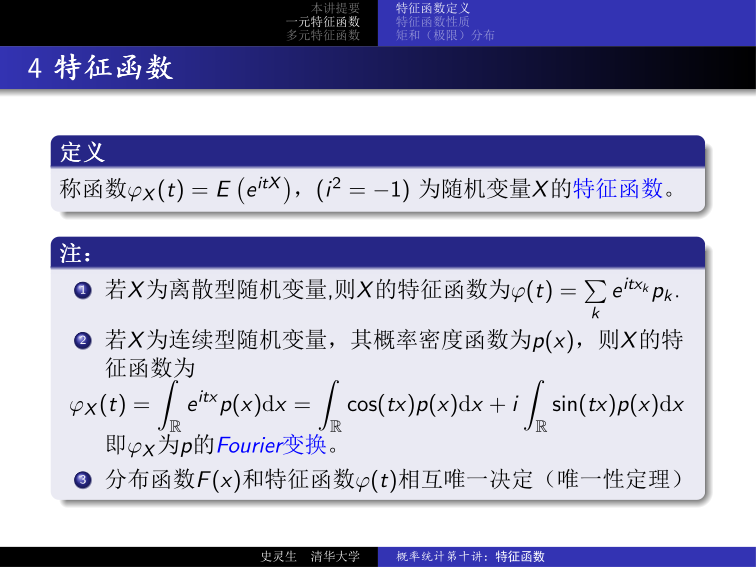
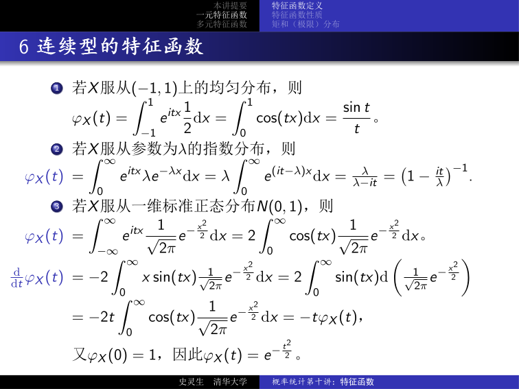
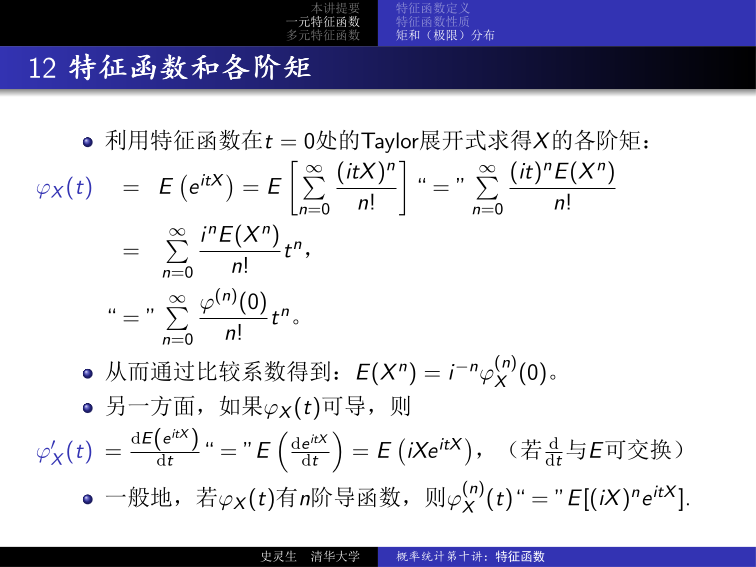
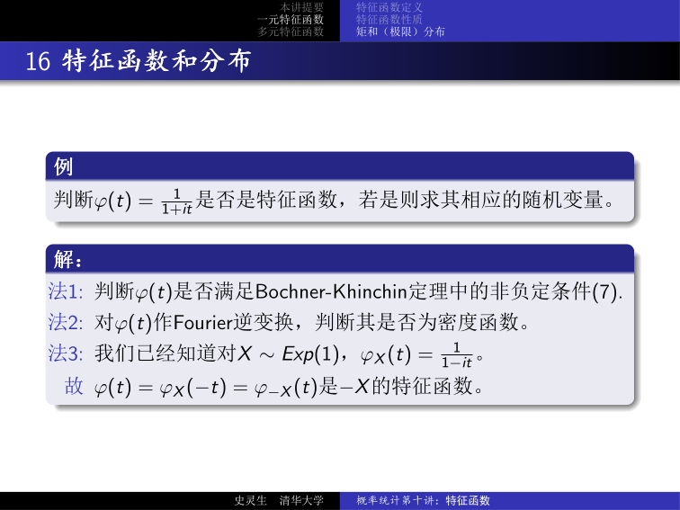

# 概率统计第十讲：特征函数——一维与多维特征函数的定义、性质及应用

## 1 引言

概率母函数 $E z^X = \sum_{n=1}^{\infty} P(X=n) z^n$ 是研究 **非负整值** 随机变量的有力工具。将 $z$ 替换为 $e^t$ 就得到矩母函数 $E e^{tX}$，它能承载概率母函数的所有良好性质，并且对更一般的随机变量也有定义。

但在计算矩 $EX^n$ 时，矩母函数不如概率母函数方便；更关键的是，**$e^{tX}$ 可能没有收敛的数学期望**。若将 $z$ 进一步设为复数 $e^{it}$（$i = \sqrt{-1}$），则得到 **特征函数** $\phi_X(t) = E e^{itX}$。

此时，对一切实随机变量都有定义（$|e^{itX}| = 1$），且能继承概率母函数和矩母函数的所有良好性质。代价是需要在复数域上操作，尤其在计算期望涉及积分时。

!!! info "历史注记"

    虚数单位 $i = \sqrt{-1}$ 最早出现在意大利数学家 **Cardan** 的三次方程求根公式中，但他称之为"矫揉造作、毫无用处"。瑞士数学家 **Euler** 在 1770 年的《代数全书》中大量使用虚数，并指出"形如 $\sqrt{-1}$、$\sqrt{-2}$ 的数学式子，都不对应实数，因为它们表示的是负数的平方根——对于这类数，我们只能断言：它们既不是无，也不大于无，也不小于无——这构成了它们的虚幻"。

---

## 2 一维特征函数

### 2.1 定义

!!! abstract "定义 2.1（特征函数）"

    称 $\phi_X(t) = E e^{itX}$（$i^2 = -1$）为随机变量 $X$ 的 **特征函数**（characteristic function）。

具体地：

- 若 $X$ 是 **离散型** 随机变量，则 $X$ 的特征函数为

$$
\phi(t) = \sum_k e^{it x_k} p_k.
$$

- 若 $X$ 是 **连续型** 随机变量，其概率密度函数为 $p(x)$，则 $X$ 的特征函数为

$$
\phi_X(t) = \int_{\mathbb{R}} e^{itx} p(x)\,\mathrm{d}x = \int_{\mathbb{R}} \cos(tx) p(x)\,\mathrm{d}x + i \int_{\mathbb{R}} \sin(tx) p(x)\,\mathrm{d}x.
$$

即 $\phi_X$ 是 $p$ 的 **Fourier 变换**。

!!! abstract "定理 2.1（唯一性定理）"

    分布函数 $F(x)$ 和特征函数 $\phi(t)$ 之间是 **相互唯一确定** 的。

### 2.2 离散型特征函数举例

???+ example "例 2.1：单点分布（退化分布）"

    若 $X$ 服从单点分布 $P(X = a) = 1$，则 $\phi_X(t) = e^{iat}$。

???+ example "例 2.2：Bernoulli 分布"

    若 $X \sim b(1, p)$，则

    $$
    \phi_X(t) = e^{it \cdot 0} q + e^{it \cdot 1} p = q + pe^{it}.
    $$

???+ example "例 2.3：几何分布"

    若 $X \sim G(p)$（$P(X = k) = pq^{k-1},\, k = 1, 2, \dots$），则

    $$
    \phi_X(t) = \sum_{k=1}^{\infty} e^{itk} pq^{k-1} = pe^{it} \sum_{k=0}^{\infty} \left(qe^{it}\right)^k = \frac{pe^{it}}{1 - qe^{it}}.
    $$

???+ example "例 2.4：Poisson 分布"

    若 $X$ 服从参数为 $\lambda$ 的 Poisson 分布 $P(\lambda)$，则

    $$
    \phi_X(t) = \sum_{k=0}^{\infty} e^{itk} \frac{\lambda^k}{k!} e^{-\lambda} = e^{-\lambda} \sum_{k=0}^{\infty} \frac{(\lambda e^{it})^k}{k!} = e^{\lambda(e^{it} - 1)}.
    $$

### 2.3 连续型特征函数举例

???+ example "例 2.5：均匀分布 $U(-1, 1)$"

    若 $X$ 服从 $(-1, 1)$ 上的均匀分布，则

    $$
    \phi_X(t) = \int_{-1}^{1} e^{itx} \frac{1}{2}\,\mathrm{d}x = \int_{0}^{1} \cos(tx)\,\mathrm{d}x = \frac{\sin t}{t}.
    $$

???+ example "例 2.6：指数分布"

    若 $X$ 服从参数为 $\lambda$ 的指数分布 $\mathrm{Exp}(\lambda)$，则

    $$
    \phi_X(t) = \int_{0}^{\infty} e^{itx} \lambda e^{-\lambda x}\,\mathrm{d}x = \lambda \int_{0}^{\infty} e^{(it - \lambda)x}\,\mathrm{d}x = \frac{\lambda}{\lambda - it} = \left(1 - \frac{it}{\lambda}\right)^{-1}.
    $$

???+ example "例 2.7：标准正态分布 $N(0, 1)$"

    若 $X \sim N(0, 1)$，则

    $$
    \phi_X(t) = \int_{-\infty}^{\infty} e^{itx} \frac{1}{\sqrt{2\pi}} e^{-\frac{x^2}{2}}\,\mathrm{d}x = 2 \int_{0}^{\infty} \cos(tx) \frac{1}{\sqrt{2\pi}} e^{-\frac{x^2}{2}}\,\mathrm{d}x.
    $$

    对 $\phi_X(t)$ 求导：

    $$
    \begin{aligned}
    \frac{\mathrm{d}}{\mathrm{d}t}\phi_X(t) &= -2 \int_{0}^{\infty} x \sin(tx) \frac{1}{\sqrt{2\pi}} e^{-\frac{x^2}{2}}\,\mathrm{d}x \\
    &= 2 \int_{0}^{\infty} \sin(tx)\,\mathrm{d}\!\left(\frac{1}{\sqrt{2\pi}} e^{-\frac{x^2}{2}}\right) \\
    &= -2t \int_{0}^{\infty} \cos(tx) \frac{1}{\sqrt{2\pi}} e^{-\frac{x^2}{2}}\,\mathrm{d}x = -t \phi_X(t).
    \end{aligned}
    $$

    结合 $\phi_X(0) = 1$，解微分方程得 $\phi_X(t) = e^{-t^2/2}$。

### 2.4 特征函数的性质

!!! abstract "性质 1（有界性）"

    $|\phi_X(t)| \le \phi_X(0) = 1$。

??? note "证明"

    $|\phi_X(t)| = |E e^{itX}| \le E|e^{itX}| = E(1) = 1 = \phi_X(0)$。$\square$

!!! abstract "性质 2（共轭对称性）"

    $\phi_X(t) = \overline{\phi_X(-t)} = \phi_{-X}(t)$。

??? note "证明"

    $\phi_X(t) = E e^{itX} = \overline{E e^{-itX}} = \overline{\phi_X(-t)}$。又 $\overline{\phi_X(-t)} = E e^{-itX} = \phi_{-X}(t)$。$\square$

!!! abstract "性质 3（实偶性）"

    $\phi_X(t)$ 是 **实偶函数** 当且仅当 $X$ 具有对称分布 $F_X(x) = F_{-X}(x)$，即 $F_X$ 图像关于 $(0, 1/2)$ 中心对称（若 $X$ 为连续型）。

??? note "证明"

    $\phi_X(t)$ 是实值函数 $\Leftrightarrow$ $\phi_X(t) = \overline{\phi_X(t)} = \phi_X(-t) = \phi_{-X}(t)$
    $\Leftrightarrow$ $F_X(x) = F_{-X}(x) = P(-X \le x) = P(X \ge -x) = 1 - F_X(-x)$，
    即 $F_X$ 图像关于 $(0, 1/2)$ 中心对称。$\square$

!!! abstract "性质 4（线性变换）"

    $\phi_{aX+b}(t) = e^{ibt} \phi_X(at)$。

??? note "证明"

    $\phi_{aX+b}(t) = E e^{it(aX+b)} = e^{ibt} E e^{i(at)X} = e^{ibt} \phi_X(at)$。$\square$

!!! abstract "性质 5（独立和的乘积性）"

    若 $X$ 与 $Y$ 相互独立，则 $\phi_{X+Y}(t) = \phi_X(t) \phi_Y(t)$。

??? note "证明"

    $\phi_{X+Y}(t) = E e^{it(X+Y)} = E(e^{itX} e^{itY}) = E e^{itX} \cdot E e^{itY} = \phi_X(t) \phi_Y(t)$。$\square$

!!! abstract "性质 6（一致连续性）"

    $\phi_X(t)$ 关于 $t$ 在 $\mathbb{R}$ 上 **一致连续**。

??? note "证明"

    $$
    \begin{aligned}
    |\phi_X(t+h) - \phi_X(t)| &= \left|E\left(e^{i(t+h)X} - e^{itX}\right)\right| \\
    &\le E\left|e^{itX}\left(e^{ihX} - 1\right)\right| = E\left|e^{ihX} - 1\right| \to 0,\quad h \to 0.
    \end{aligned}
    $$

    由控制收敛定理，$h \to 0$ 时 $|e^{ihX} - 1| \le 2$ 且 $e^{ihX} - 1 \to 0$，故期望趋于 $0$。上界与 $t$ 无关，故一致连续。$\square$

!!! abstract "性质 7（非负定性 / Bochner-Khinchin 条件）"

    对任意正整数 $n$、任意实数 $t_1, \dots, t_n$，$n$ 阶复矩阵 $(\phi_X(t_j - t_k))_{j,k}$ 是一个 **非负定 Hermite 矩阵**：对任意复数 $z_1, \dots, z_n$，

    $$
    \sum_{j,k=1}^{n} \phi_X(t_j - t_k) z_j \overline{z_k} \ge 0.
    $$

??? note "证明"

    设 $X$ 有密度 $p(x)$（离散型同理），则

    $$
    \begin{aligned}
    \sum_{j,k=1}^{n} \phi_X(t_j - t_k) z_j \overline{z_k}
    &= \sum_{j,k=1}^{n} z_j \overline{z_k} \int_{\mathbb{R}} e^{i(t_j - t_k)x} p(x)\,\mathrm{d}x \\
    &= \int_{\mathbb{R}} \left(\sum_{j=1}^{n} z_j e^{it_j x}\right) \left(\sum_{k=1}^{n} \overline{z_k} e^{-it_k x}\right) p(x)\,\mathrm{d}x \\
    &= \int_{\mathbb{R}} \left|\sum_{j=1}^{n} z_j e^{it_j x}\right|^2 p(x)\,\mathrm{d}x \ge 0.
    \end{aligned}
    $$

    $\square$

!!! abstract "定理 2.2（Bochner-Khinchin 定理）"

    若连续函数 $\phi: \mathbb{R} \to \mathbb{C}$ 满足 $\phi(0) = 1$，则 $\phi$ 是某个随机变量的特征函数 **当且仅当** $\phi$ 满足非负定性条件（性质 7）。

Bochner-Khinchin 定理给出了特征函数的 **充要条件**，是特征函数理论的基石——它告诉我们只需验证 $\phi(0) = 1$ 和非负定性，就能判定一个函数是否为特征函数。

### 2.5 特征函数性质的应用

???+ example "例 2.8：二项分布的特征函数"

    设 $X \sim b(n, p)$，则存在 i.i.d. $X_1, \dots, X_n \sim b(1, p)$ 使 $X = X_1 + \cdots + X_n$。于是

    $$
    \phi_X(t) = \prod_{k=1}^{n} \phi_{X_k}(t) = (q + pe^{it})^n.
    $$

???+ example "例 2.9：均匀分布 $U(a, b)$ 的特征函数"

    设 $X \sim U(a, b)$，令 $Y = \dfrac{X - \frac{a+b}{2}}{(b-a)/2} \sim U(-1, 1)$，则

    $$
    \phi_X(t) = \phi_{\frac{b-a}{2}Y + \frac{a+b}{2}}(t) = e^{i\frac{a+b}{2}t} \phi_Y\!\left(\frac{b-a}{2}t\right) = e^{i\frac{a+b}{2}t} \frac{\sin\!\left(\frac{b-a}{2}t\right)}{\frac{b-a}{2}t}.
    $$

    当 $b = -a$ 时，$X$ 具有对称分布，$\phi_X(t)$ 是实偶函数。

???+ example "例 2.10：一般正态分布 $N(\mu, \sigma^2)$ 的特征函数"

    设 $X \sim N(\mu, \sigma^2)$，令 $Y = (X - \mu)/\sigma \sim N(0, 1)$，则

    $$
    \phi_X(t) = \phi_{\sigma Y + \mu}(t) = e^{i\mu t} \phi_Y(\sigma t) = e^{i\mu t - \frac{\sigma^2 t^2}{2}}.
    $$

    当 $\mu = 0$ 时，$X$ 具有对称分布，$\phi_X(t)$ 是实偶函数。

???+ example "例 2.11：Gamma 分布的特征函数"

    设 $X \sim \Gamma(n, \lambda)$，则存在 i.i.d. $X_1, \dots, X_n \sim \mathrm{Exp}(\lambda)$ 使 $X = \sum_{k=1}^{n} X_k$，于是

    $$
    \phi_X(t) = \prod_{k=1}^{n} \phi_{X_k}(t) = \phi_{X_1}^n(t) = (1 - it/\lambda)^{-n}.
    $$

    特别地，$\chi^2(n) = \Gamma(n/2, 1/2)$，故 $\phi_X(t) = (1 - 2it)^{-n/2}$。

???+ example "例 2.12：独立 Poisson 变量之和"

    设 $X_1, \dots, X_n$ 相互独立，$X_k \sim P(\lambda_k)$，$\lambda_k > 0$，则

    $$
    \phi_{\sum X_k}(t) = \prod_{k=1}^{n} \phi_{X_k}(t) = \prod_{k=1}^{n} e^{\lambda_k(e^{it}-1)} = \exp\!\left(\sum_{k=1}^{n} \lambda_k (e^{it} - 1)\right).
    $$

    故 $\sum_{k=1}^{n} X_k$ 服从参数为 $\sum_{k=1}^{n} \lambda_k$ 的 **Poisson 分布**——Poisson 分布对独立和封闭。

???+ example "例 2.13：独立正态变量的线性组合"

    设 $X_1, \dots, X_n$ 相互独立，$X_k \sim N(\mu_k, \sigma_k^2)$，令 $X = b + \sum_{k=1}^{n} a_k X_k$（$a_1, \dots, a_n$ 不全为零），则

    $$
    \begin{aligned}
    \phi_X(t) &= e^{ibt} \prod_{k=1}^{n} \phi_{X_k}(a_k t)
               = e^{ibt} \prod_{k=1}^{n} e^{i\mu_k a_k t - \frac{1}{2}\sigma_k^2 a_k^2 t^2} \\
               &= \exp\!\left(i\mu t - \frac{1}{2}\sigma^2 t^2\right),
    \end{aligned}
    $$

    其中 $\mu = b + \sum_{k=1}^{n} a_k \mu_k$，$\sigma^2 = \sum_{k=1}^{n} a_k^2 \sigma_k^2$。故

    $$
    X = b + \sum_{k=1}^{n} a_k X_k \sim N(\mu, \sigma^2).
    $$

    即 **正态分布的线性组合仍是正态分布**。

### 2.6 特征函数与矩

利用特征函数在 $t = 0$ 处的 Taylor 展开可以求得 $X$ 的各阶矩：

$$
\phi_X(t) = E e^{itX} = E\!\left[\sum_{n=0}^{\infty} \frac{(itX)^n}{n!}\right] \;\text{「}=\text{」}\; \sum_{n=0}^{\infty} \frac{i^n E(X^n)}{n!} t^n.
$$

另一方面，

$$
\phi_X(t) = \sum_{n=0}^{\infty} \frac{\phi^{(n)}(0)}{n!} t^n.
$$

比较系数：$E(X^n) = i^{-n} \phi_X^{(n)}(0)$。

另一种方式是通过直接求导：若求导与期望可交换，则

$$
\phi'_X(t) = \frac{\mathrm{d}}{\mathrm{d}t} E(e^{itX}) \;\text{「}=\text{」}\; E(iX e^{itX}).
$$

一般地，若 $\phi_X(t)$ 有 $n$ 阶导数，则 $\phi_X^{(n)}(t) \;\text{「}=\text{」}\; E[(iX)^n e^{itX}]$。

!!! abstract "定理 2.3（特征函数与矩的关系）"

    1. 若 $E|X|^k < +\infty$，则对 $j = 1, 2, \dots, k$，有

    $$
    \phi_X^{(j)}(t) = E\!\left[(iX)^j e^{itX}\right],
    $$

    且

    $$
    \phi_X(t) = \sum_{j=0}^{k} \frac{(it)^j}{j!} EX^j + o(t^k).
    $$

    2. 若 $\phi_X^{(2n)}(0)$ 存在，则 $EX^{2n}$ 存在。

!!! warning "注意"

    定理 2.3 的 (2) 指出：若 **偶数阶** 特征函数导数在 $0$ 存在，则该阶矩存在。奇数阶不保证：例如 $t = 0$ 处一阶导数存在不意味着期望存在。

???+ example "例 2.14：正态分布 $N(\mu, \sigma^2)$ 的矩"

    已知 $\phi(t) = \exp(i\mu t - \frac{1}{2}\sigma^2 t^2)$。展开至 $t^3$：

    $$
    \begin{aligned}
    \phi(t) &= 1 + \left(i\mu t - \frac{1}{2}\sigma^2 t^2\right) + \frac{1}{2!}\left(i\mu t - \frac{1}{2}\sigma^2 t^2\right)^2 + \frac{1}{3!}\left(i\mu t - \frac{1}{2}\sigma^2 t^2\right)^3 + o(t^3) \\
    &= 1 + i\mu t - \frac{1}{2}(\sigma^2 + \mu^2)t^2 - \frac{i}{6}(3\mu\sigma^2 + \mu^3)t^3 + o(t^3).
    \end{aligned}
    $$

    比较系数：

    $$
    iEX = i\mu,\quad \frac{i^2 EX^2}{2!} = -\frac{1}{2}(\sigma^2 + \mu^2),\quad \frac{i^3 EX^3}{3!} = -\frac{i}{6}(3\mu\sigma^2 + \mu^3).
    $$

    解得 $EX = \mu$，$EX^2 = \sigma^2 + \mu^2$，$EX^3 = \mu(3\sigma^2 + \mu^2)$，从而

    $$
    \operatorname{Var}(X) = EX^2 - (EX)^2 = \sigma^2.
    $$

### 2.7 特征函数与分布

!!! abstract "定理 2.4（唯一性定理 / 反演公式）"

    设 $F(x)$ 和 $\phi(t)$ 分别是随机变量 $X$ 的分布函数和特征函数，则对分布函数 $F(x)$ 的任意连续点 $x, y$，有

    $$
    F(x) - F(y) = \frac{1}{2\pi} \lim_{T \to \infty} \int_{-T}^{T} \frac{e^{-ity} - e^{-itx}}{it} \phi(t)\,\mathrm{d}t.
    $$

!!! abstract "定理 2.5（Fourier 反演 / 反转公式）"

    若连续型随机变量 $X$ 的特征函数 $\phi(t)$ 绝对可积，则 $X$ 的密度函数 $p$ 是 $\phi$ 的 Fourier 逆变换：

    $$
    p(x) = \frac{1}{2\pi} \int_{-\infty}^{+\infty} e^{-itx} \phi(t)\,\mathrm{d}t.
    $$

???+ example "例 2.15：判定并还原特征函数"

    判断 $\phi(t) = \dfrac{1}{1+it}$ 是否为特征函数；若是，求出相应的随机变量。

    **方法一**（Bochner-Khinchin）：验证 $\phi(0)=1$ 和非负定性。

    **方法二**（Fourier 反演）：对 $\phi(t)$ 做 Fourier 逆变换，看是否得到密度函数。

    **方法三**（已知结果）：已知 $X \sim \mathrm{Exp}(1)$ 时 $\phi_X(t) = \frac{1}{1-it}$，故

    $$
    \phi(t) = \phi_X(-t) = \phi_{-X}(t)
    $$

    是 $-X$ 的特征函数，而 $-X$ 的分布为：密度 $p(x) = e^x$ 支撑在 $(-\infty, 0]$ 上。

### 2.8 连续性定理与弱收敛

!!! abstract "定理 2.6（连续性定理 / Lévy-Cramér 连续性定理）"

    设 $F_n, F$ 是概率分布函数，$\phi_n, \phi$ 是相应的特征函数。则

    $$
    \lim_{n \to \infty} \phi_n(t) = \phi(t), \quad \forall t \in \mathbb{R}
    $$

    **当且仅当**

    $$
    \lim_{n \to \infty} F_n(x) = F(x), \quad \forall F \text{ 的连续点 } x \in \mathbb{R}.
    $$

连续性定理是特征函数最重要的应用之一：分布函数列的 **弱收敛** 等价于特征函数列的 **逐点收敛**，使得中心极限定理等极限定理的证明大为简化。

!!! abstract "定理 2.7（Poisson 极限定理）"

    设 $X_n$ 服从二项分布 $b(n, p_n)$，其中 $\lim\limits_{n \to \infty} np_n = \lambda > 0$。则当 $n$ 充分大时，$X_n$ 近似服从参数为 $\lambda$ 的 **Poisson 分布**。

??? note "证明（用特征函数）"

    已知二项分布 $b(n, p)$ 的特征函数为 $(q + pe^{it})^n$：

    $$
    \begin{aligned}
    \phi_{X_n}(t) &= \left(p_n e^{it} + q_n\right)^n
                   = \left(1 + p_n(e^{it} - 1)\right)^n
                   = \left(1 + \frac{np_n}{n}(e^{it} - 1)\right)^n \\
                   &= \left[1 + \frac{\lambda + o(1)}{n}(e^{it} - 1)\right]^n
                   = \left[1 + \frac{\lambda(e^{it} - 1)}{n} + o\!\left(\frac{1}{n}\right)\right]^n \\
                   &\to e^{\lambda(e^{it} - 1)}, \quad n \to \infty.
    \end{aligned}
    $$

    而 $e^{\lambda(e^{it} - 1)}$ 正是参数为 $\lambda$ 的 Poisson 分布的特征函数。由连续性定理即得分布函数的弱收敛。特别地，对任意非负整数 $k$，取 $a \in (k-1, k)$，$b \in (k, k+1)$，有

    $$
    P(X_n = k) = F_{X_n}(b) - F_{X_n}(a) \to F(b) - F(a) = \frac{\lambda^k}{k!} e^{-\lambda}.
    $$

    $\square$

---

## 3 多维特征函数

### 3.1 定义

!!! abstract "定义 3.1（多维特征函数）"

    对随机向量 $\mathbf{X} = (X_1, \dots, X_n)^{\mathsf{T}}$，$\mathbf{t} = (t_1, \dots, t_n)^{\mathsf{T}} \in \mathbb{R}^n$，称

    $$
    \phi_{\mathbf{X}}(\mathbf{t}) = E e^{i\mathbf{t}^{\mathsf{T}} \mathbf{X}} = E e^{i(t_1 X_1 + \cdots + t_n X_n)}
    $$

    为 $\mathbf{X}$ 的 **特征函数**（也称 $X_1, \dots, X_n$ 的 **联合特征函数**）。

### 3.2 多维特征函数的性质

!!! abstract "性质 8（降维关系）"

    $\phi_{\mathbf{X}}(\mathbf{t}) = \phi_{\mathbf{t}^{\mathsf{T}}\mathbf{X}}(1)$。即多维特征函数在 $\mathbf{t}$ 处的值 = 一维线性组合 $\mathbf{t}^{\mathsf{T}}\mathbf{X}$ 的特征函数在 $1$ 处的值。

!!! abstract "性质 9（仿射变换）"

    $$
    \phi_{A\mathbf{X} + \mathbf{b}}(\mathbf{t}) = e^{i\mathbf{t}^{\mathsf{T}}\mathbf{b}} \phi_{\mathbf{X}}(A^{\mathsf{T}}\mathbf{t}).
    $$

!!! abstract "性质 10（独立性定理，见 3.3）"

!!! abstract "性质 11（唯一性定理）"

    分布函数与特征函数相互唯一确定。

!!! abstract "性质 12（连续性定理）"

    特征函数逐点收敛 $\Leftrightarrow$ 分布函数弱收敛。

!!! abstract "性质 13（混合矩公式）"

    $$
    \frac{\partial^{\alpha_1 + \cdots + \alpha_n}}{\partial t_1^{\alpha_1} \cdots \partial t_n^{\alpha_n}} \phi_{\mathbf{X}}(\mathbf{0}) = i^{\alpha_1 + \cdots + \alpha_n} E\!\left(X_1^{\alpha_1} \cdots X_n^{\alpha_n}\right).
    $$

### 3.3 特征函数与独立性

!!! abstract "定理 3.1（独立性等价条件）"

    随机变量 $X_1, \dots, X_n$ 相互独立 **当且仅当**

    $$
    \phi_{(X_1, \dots, X_n)}(t_1, \dots, t_n) = \prod_{k=1}^{n} \phi_{X_k}(t_k), \quad \forall t_1, \dots, t_n \in \mathbb{R}.
    $$

??? note "证明"

    **（$\Rightarrow$）** 若 $X_1, \dots, X_n$ 相互独立，则

    $$
    \phi(t_1, \dots, t_n) = E e^{i\mathbf{t}^{\mathsf{T}}\mathbf{X}}
    = E\!\left[\prod_{j=1}^{n} e^{it_j X_j}\right]
    = \prod_{j=1}^{n} E e^{it_j X_j}
    = \prod_{j=1}^{n} \phi_{X_j}(t_j).
    $$

    **（$\Leftarrow$）** 构造 $Y_1, \dots, Y_n$ 为相互独立的随机变量，且 $Y_k$ 与 $X_k$ 同分布。则 $\phi_{Y_k} = \phi_{X_k}$，且由必要性有

    $$
    \phi_{(Y_1,\dots,Y_n)}(t_1, \dots, t_n) = \prod_{j=1}^{n} \phi_{Y_j}(t_j) = \prod_{j=1}^{n} \phi_{X_j}(t_j) = \phi_{(X_1,\dots,X_n)}(t_1, \dots, t_n).
    $$

    由唯一性定理，$(Y_1, \dots, Y_n)$ 与 $(X_1, \dots, X_n)$ 同分布，故 $X_1, \dots, X_n$ 相互独立。$\square$

!!! tip "直觉"

    定理 3.1 是性质 5（独立和的特征函数 = 特征函数的乘积）的**多维推广**和**反向形式**。它不仅说「独立则乘积分解」，更本质的是 **「乘积可分解则独立」**——这提供了判断独立性的一个充分必要条件，在统计推断中有重要应用。

---

## 4 总结

| 性质 | 公式 |
| --- | --- |
| 定义 | $\phi_X(t) = E e^{itX}$ |
| 有界性 | $\vert\phi_X(t)\vert \le \phi_X(0) = 1$ |
| 共轭对称性 | $\phi_X(t) = \overline{\phi_X(-t)} = \phi_{-X}(t)$ |
| 线性变换 | $\phi_{aX+b}(t) = e^{ibt} \phi_X(at)$ |
| 独立和 | $\phi_{X+Y}(t) = \phi_X(t) \phi_Y(t)$ |
| 矩的关系 | $E(X^n) = i^{-n} \phi_X^{(n)}(0)$ |
| 唯一性 | $F_X \leftrightarrow \phi_X$ 一一对应 |
| 连续性 | $\phi_n \to \phi$（逐点）$\Leftrightarrow$ $F_n \Rightarrow F$（弱收敛） |
| 独立性充要条件 | $\phi_{(X_1,\dots,X_n)}(\mathbf{t}) = \prod_{k=1}^{n} \phi_{X_k}(t_k)$ |

| 分布 | 特征函数 $\phi_X(t)$ |
| --- | --- |
| 退化分布 $P(X=a)=1$ | $e^{iat}$ |
| Bernoulli $b(1, p)$ | $q + pe^{it}$ |
| 二项 $b(n, p)$ | $(q + pe^{it})^n$ |
| 几何 $G(p)$ | $\dfrac{pe^{it}}{1 - qe^{it}}$ |
| Poisson $P(\lambda)$ | $e^{\lambda(e^{it} - 1)}$ |
| 均匀 $U(a, b)$ | $e^{i\frac{a+b}{2}t} \dfrac{\sin((b-a)t/2)}{(b-a)t/2}$ |
| 指数 $\mathrm{Exp}(\lambda)$ | $(1 - it/\lambda)^{-1}$ |
| 正态 $N(\mu, \sigma^2)$ | $e^{i\mu t - \sigma^2 t^2/2}$ |
| Gamma $\Gamma(n, \lambda)$ | $(1 - it/\lambda)^{-n}$ |
| 卡方 $\chi^2(n)$ | $(1 - 2it)^{-n/2}$ |
