# 目标代码生成及代码优化基础

## 1 二者在编译程序中的逻辑位置

典型的编译程序将编译过程划分为 **前端** （词法分析、语法分析、语义分析）、**中端** （中间代码生成、机器无关代码优化）和 **后端** （目标代码生成、针对机器代码优化）三个层次。

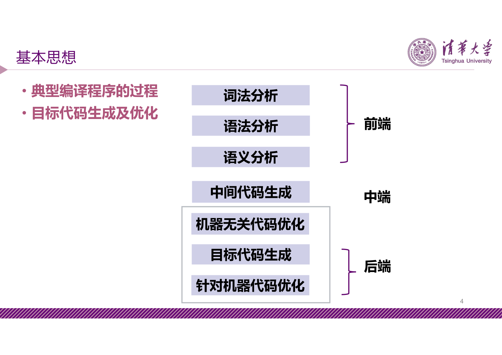

目标代码生成与代码优化处在编译流程的 **后端** 阶段，直接面向目标机器，是决定生成代码质量的关键环节。

---

## 2 基本块、流图和循环

### 2.1 基本块

!!! abstract "定义 1（基本块）"

    程序中一个顺序执行的语句序列，满足：

    - 只有一个入口语句和一个出口语句
    - 除入口语句外其他语句均不可以带标号
    - 除出口语句外其他语句均不可能是转移或停语句

**入口语句** 包括三类：

- 程序的第一个语句
- 条件转移语句或无条件转移语句的转移目标语句
- 紧跟在条件转移语句后面的语句

### 2.2 划分基本块的算法

针对三地址码（TAC），划分基本块分两步：

1. 求出 TAC 程序之中各个基本块的入口语句
2. 对每一入口语句，构造其所属的基本块 — 由该语句到下一入口语句（不包括下一入口语句），或到一转移语句（包括该转移语句），或到一停语句（包括该停语句）之间的语句序列组成

凡未被纳入某一基本块的语句，都是控制流程无法到达的语句，可以删除。

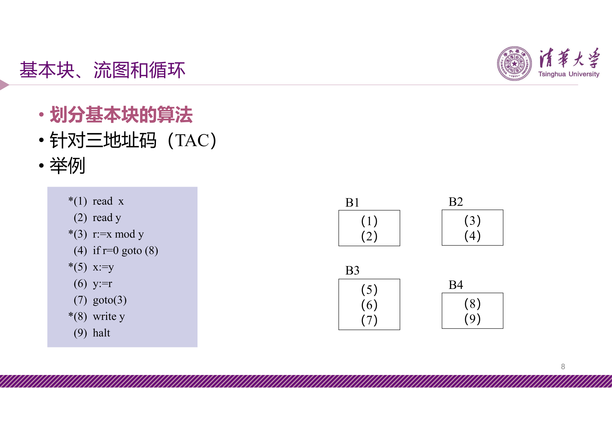

### 2.3 流图

!!! abstract "定义 2（流图 / 控制流图 CFG）"

    以基本块集为结点集的有向图。第一个结点为含有程序第一条语句的基本块；从基本块 $i$ 到基本块 $j$ 之间存在有向边，当且仅当：

    - 基本块 $j$ 在程序的位置紧跟在 $i$ 后，且 $i$ 的出口语句不是转移语句、停语句或返回语句；或者
    - $i$ 的出口是 `goto(S)` 或 `if goto(S)`，而 `(S)` 是 $j$ 的入口语句

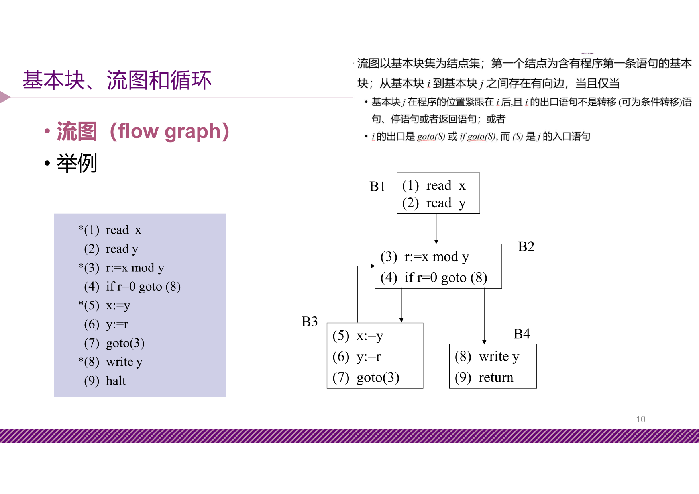

### 2.4 循环

#### 支配结点集

!!! abstract "定义 3（支配结点）"

    如果从流图的首结点出发，到达 $n$ 的任意通路都要经过 $m$，则称 $m$ **支配** $n$，记为 $m \text{ DOM } n$（$\forall a.\ a \text{ DOM } a$）。

    结点 $n$ 的所有支配结点的集合称为 $n$ 的 **支配结点集**，记为 $D(n)$。

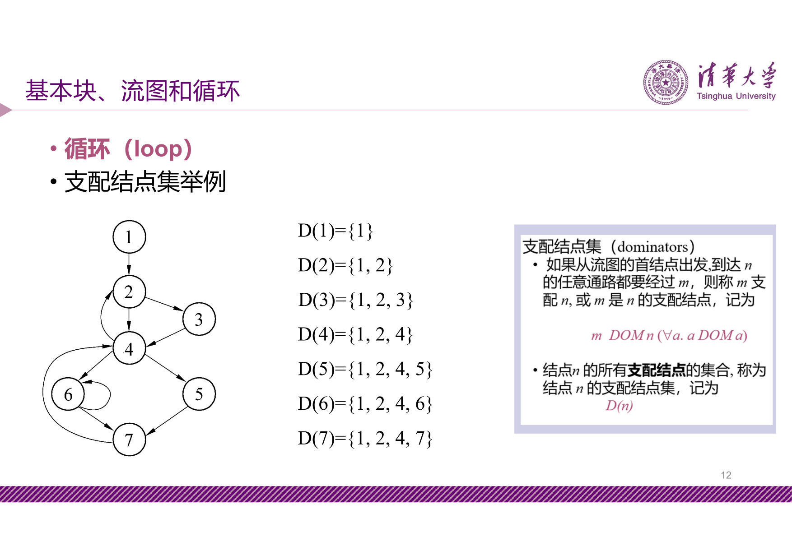

#### 自然循环

!!! abstract "定义 4（回边与自然循环）"

    假设 $n \to d$ 是流图中的一条有向边，如果 $d \text{ DOM } n$，则称 $n \to d$ 是流图中的一条 **回边**（back edge）。

    回边 $n \to d$ 对应的 **自然循环** 由结点 $d$、结点 $n$ 以及有通路到达 $n$ 而该通路不经过 $d$ 的所有结点组成，并且 $d$ 是该循环的唯一入口结点。

!!! info "补充"

    因 $d$ 是 $n$ 的支配结点，所以 $d$ 必可达该循环中任意结点。流图中的任何结点都是从首结点可达的。

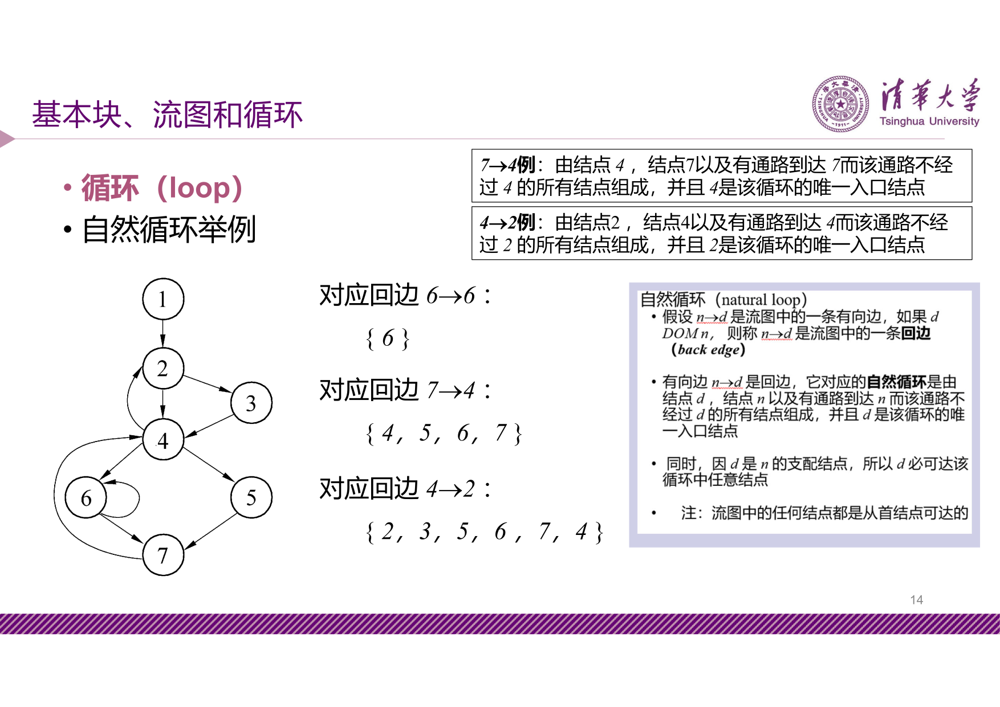

---

## 3 数据流分析基础

### 3.1 概述

!!! abstract "定义 5（数据流分析）"

    为做好代码生成和代码优化工作，通常需要收集整个程序的一些特定信息，并把这些信息分配到流图中的语句单元（基本块、循环、单条语句等）中。称这些信息为 **数据流信息**，上述过程为 **数据流分析**（data-flow analysis）。

数据流信息收集的主要途径是 **建立和求解数据流方程**（data-flow equation）。

典型的数据流方程（以面向基本块的某种正向数据流为例）：

$$
\text{out}[S] = \text{gen}[S] \cup (\text{in}[S] - \text{kill}[S])
$$

其含义为：基本块 $S$ 出口处的数据流信息（$\text{out}[S]$）或者是 $S$ 内部产生的信息（$\text{gen}[S]$），或者是从 $S$ 开始处进入（$\text{in}[S]$）但在穿过 $S$ 的控制流时未被杀死（killed）的信息。

### 3.2 到达-定值数据流分析

!!! abstract "定义 6（定值与到达-定值）"

    变量 $A$ 的 **定值**（definition）是一个（TAC）语句，它赋值或可能赋值给 $A$，该语句的位置称作 $A$ 的 **定值点**。

    变量 $A$ 的定值点 $d$ **到达** 某点 $p$，是指如果有路径从紧跟 $d$ 的点到达 $p$，并且在这条路径上 $d$ 未被"杀死"（指该变量重新被定值）。

数据流方程：

$$
\begin{aligned}
\text{OUT}[B] &= \text{GEN}[B] \cup (\text{IN}[B] - \text{KILL}[B]) \\[4pt]
\text{IN}[B] &= \bigcup_{p \in P[B]} \text{OUT}[p]
\end{aligned}
$$

其中：

- $P[B]$ 为 $B$ 的所有前驱基本块
- $\text{GEN}[B]$ 为 $B$ 中定值并可到达 $B$ 出口处的所有定值点集合
- $\text{KILL}[B]$ 为 $B$ 之外的能够到达 $B$ 的入口处、且其定值的变量在 $B$ 中又重新定值的那些定值点的集合
- $\text{IN}[B]$ 为到 $B$ 入口处各变量的所有可到达的定值点的集合
- $\text{OUT}[B]$ 为到达 $B$ 出口处各变量的所有可到达的定值点的集合

#### 数据流方程求解算法

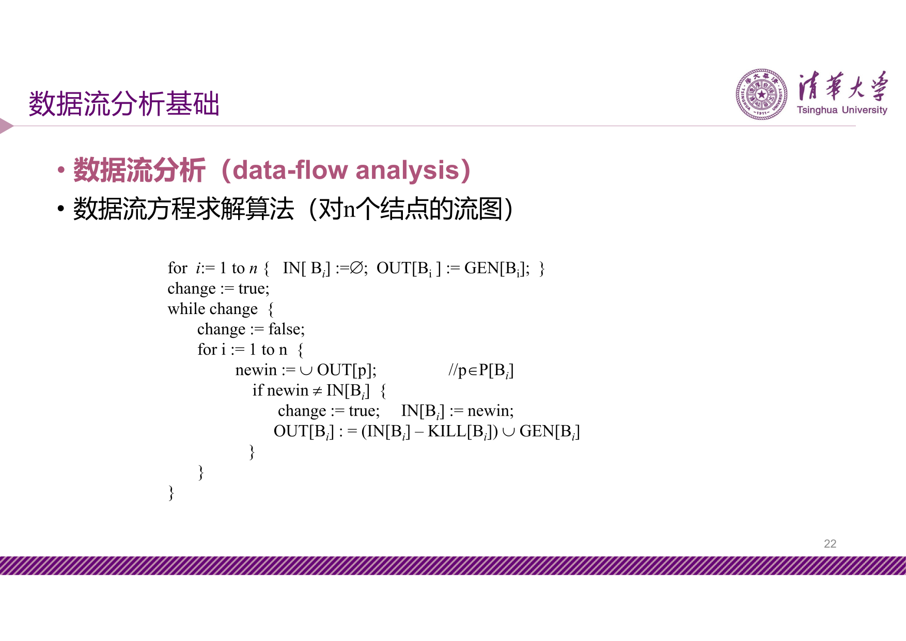

### 算法 3.1（到达-定值数据流方程求解）

$$
\begin{aligned}
& \textbf{算法: } \text{ReachingDefinitions} \\
& \textbf{输入: } \text{流图 } G = (V, E), \quad \text{GEN}[B_i], \quad \text{KILL}[B_i] \\
& \textbf{输出: } \text{IN}[B_i], \quad \text{OUT}[B_i] \\
& 1. \quad \textbf{for } i := 1 \textbf{ to } n \textbf{ do} \\
& 2. \quad \quad \text{IN}[B_i] := \emptyset; \quad \text{OUT}[B_i] := \text{GEN}[B_i]; \\
& 3. \quad \textbf{end for} \\
& 4. \quad change := true; \\
& 5. \quad \textbf{while } change \textbf{ do} \\
& 6. \quad \quad change := false; \\
& 7. \quad \quad \textbf{for } i := 1 \textbf{ to } n \textbf{ do} \\
& 8. \quad \quad \quad newin := \bigcup_{p \in P[B_i]} \text{OUT}[p]; \\
& 9. \quad \quad \quad \textbf{if } newin \neq \text{IN}[B_i] \textbf{ then} \\
& 10. \quad \quad \quad \quad change := true; \quad \text{IN}[B_i] := newin; \\
& 11. \quad \quad \quad \quad \text{OUT}[B_i] := (\text{IN}[B_i] - \text{KILL}[B_i]) \cup \text{GEN}[B_i]; \\
& 12. \quad \quad \quad \textbf{end if} \\
& 13. \quad \quad \textbf{end for} \\
& 14. \quad \textbf{end while} \\
& 15. \quad \textbf{return } \text{IN}, \text{OUT}
\end{aligned}
$$

#### 求解举例

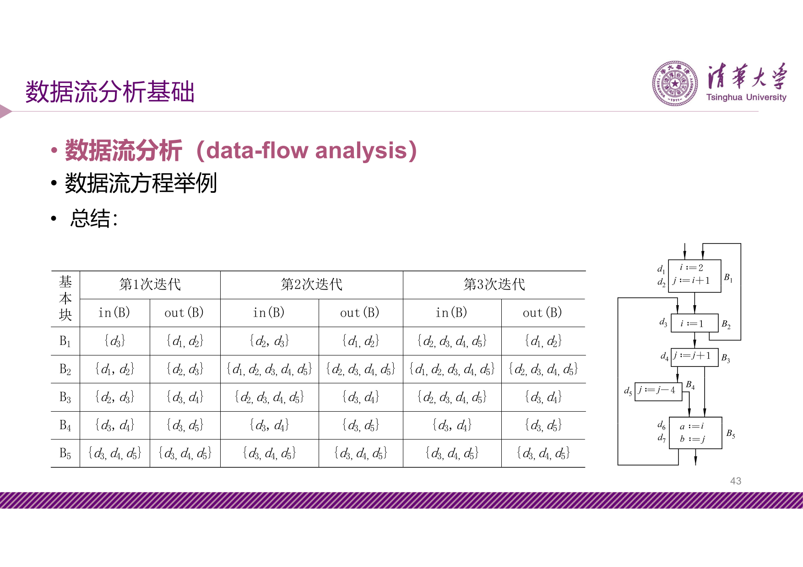

### 3.3 活跃变量数据流分析

!!! abstract "定义 7（活跃变量）"

    对程序中的某变量 $A$ 和某点 $p$ 而言，如果存在一条从 $p$ 开始的通路，其中引用了 $A$ 在点 $p$ 的值，则称 $A$ 在点 $p$ 是 **活跃的**（live）。

    直观地说，一个变量是活跃的，如果存在一条路径使得该变量被重新定值之前它的当前值还要被引用。

数据流方程：

$$
\begin{aligned}
\text{LiveIn}(B) &= \text{LiveUse}(B) \cup (\text{LiveOut}(B) - \text{Def}(B)) \\[4pt]
\text{LiveOut}(B) &= \bigcup_{s \in S[B]} \text{LiveIn}(s)
\end{aligned}
$$

其中：

- $S[B]$ 为 $B$ 的所有后继基本块
- $\text{LiveUse}(B)$ 为 $B$ 中被定值之前要引用变量的集合
- $\text{Def}(B)$ 为在 $B$ 中定值的且定值前未曾在 $B$ 中引用过的变量集合
- $\text{LiveIn}(B)$ 为 $B$ 入口处为活跃的变量的集合
- $\text{LiveOut}(B)$ 为 $B$ 的出口处的活跃变量的集合

#### 求解算法

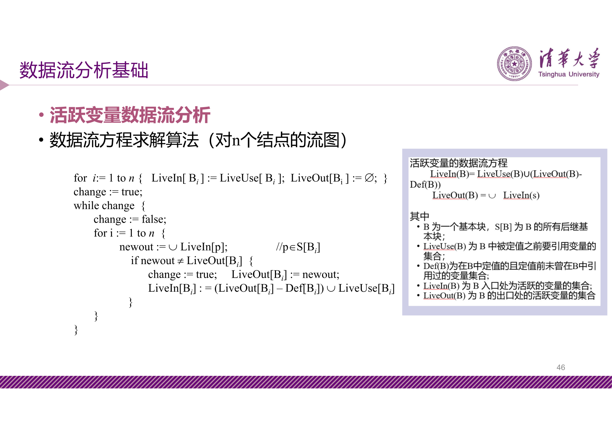

### 算法 3.2（活跃变量数据流方程求解）

$$
\begin{aligned}
& \textbf{算法: } \text{LiveVariables} \\
& \textbf{输入: } \text{流图 } G = (V, E), \quad \text{LiveUse}[B_i], \quad \text{Def}[B_i] \\
& \textbf{输出: } \text{LiveIn}[B_i], \quad \text{LiveOut}[B_i] \\
& 1. \quad \textbf{for } i := 1 \textbf{ to } n \textbf{ do} \\
& 2. \quad \quad \text{LiveIn}[B_i] := \text{LiveUse}[B_i]; \quad \text{LiveOut}[B_i] := \emptyset; \\
& 3. \quad \textbf{end for} \\
& 4. \quad change := true; \\
& 5. \quad \textbf{while } change \textbf{ do} \\
& 6. \quad \quad change := false; \\
& 7. \quad \quad \textbf{for } i := 1 \textbf{ to } n \textbf{ do} \\
& 8. \quad \quad \quad newout := \bigcup_{p \in S[B_i]} \text{LiveIn}[p]; \\
& 9. \quad \quad \quad \textbf{if } newout \neq \text{LiveOut}[B_i] \textbf{ then} \\
& 10. \quad \quad \quad \quad change := true; \quad \text{LiveOut}[B_i] := newout; \\
& 11. \quad \quad \quad \quad \text{LiveIn}[B_i] := (\text{LiveOut}[B_i] - \text{Def}[B_i]) \cup \text{LiveUse}[B_i]; \\
& 12. \quad \quad \quad \textbf{end if} \\
& 13. \quad \quad \textbf{end for} \\
& 14. \quad \textbf{end while} \\
& 15. \quad \textbf{return } \text{LiveIn}, \text{LiveOut}
\end{aligned}
$$

### 3.4 向前流与向后流

!!! abstract "定义 8（向前流与向后流）"


    - **向前流**：信息流的方向与控制流一致（如到达-定值数据流）。$\text{OUT}[B]$ 由 $\text{IN}[B]$ 计算得出
    - **向后流**：信息流的方向与控制流反向（如活跃变量数据流）。$\text{IN}[B]$ 由 $\text{OUT}[B]$ 计算得出

### 3.5 UD 链与 DU 链

!!! abstract "定义 9（UD 链，引用-定值链）"

    假设在程序中某点 $u$ 引用了变量 $A$ 的值，则把能到达 $u$ 的 $A$ 的所有定值点的全体，称为 $A$ 在引用点 $u$ 的 **引用-定值链**（Use-Definition Chaining），简称 **UD 链**。

**UD 链的计算**（借助到达-定值数据流信息 $\text{IN}[B]$）：

- 如果在基本块 $B$ 中，变量 $A$ 的引用点 $u$ 之前有 $A$ 的定值点 $d$，并且 $A$ 在点 $d$ 的定值到达 $u$，那么 $A$ 在点 $u$ 的 UD 链就是 $\{d\}$
- 如果在基本块中，变量 $A$ 的引用点 $u$ 之前没有 $A$ 的定值点，那么 $\text{IN}[B]$ 中 $A$ 的所有定值点均到达 $u$，它们就是 $A$ 在点 $u$ 的 UD 链

!!! tip "UD 链的用途"

    通过 UD 链可以知道被引用变量的来源，从而支持常量传播等优化。例如：

    ```c
    (1) x = 5
    (2) y = 10
    (3) x = y + 2    // y 的 UD 链 → {(2)}，可优化为 x = 12
    (4) print(x)
    ```

!!! abstract "定义 10（DU 链，定值-引用链）"

    假设在程序中某点 $u$ 定义了变量 $A$ 的值，从 $u$ 存在一条到达 $A$ 的某个引用点 $s$ 的路径，且该路径上不存在 $A$ 的其他定值点，则把所有此类引用点 $s$ 的全体称为 $A$ 在定值点 $u$ 的 **定值-引用链**（Definition-Use Chaining），简称 **DU 链**。

!!! tip "DU 链的用途"

    DU 链可帮助判断一个定值是否被使用。例如：

    ```c
    (1) x = 5        // x 的 DU 链为空（后面的 x 被重新定值前未使用），可删除
    (2) y = 10
    (3) x = y + 2
    (4) print(x)
    ```

### 3.6 基本块内变量的待用信息和活跃信息

!!! abstract "定义 11（待用信息）"

    基本块中某变量定值点的 **待用信息**（next use）链即为该点在基本块范围内的 DU 链中最近的引用点。

**计算步骤**（从基本块出口到入口反向扫描每个 TAC 语句 `i: A := B op C`）：

!!! info "计算待用信息和活跃信息的步骤"


    a) 把变量 $A$ 的待用信息和活跃信息附加到 TAC 语句 $i$ 上
    b) 把变量 $A$ 的待用信息栏和活跃信息栏分别置为"非待用"和"非活跃"
    c) 把变量 $B$ 和 $C$ 的待用信息和活跃信息附加到 TAC 语句 $i$ 上
    d) 把变量 $B$ 和 $C$ 的待用信息栏置为"$i$"，活跃信息栏置为"活跃"

!!! warning "注意"

    以上 a)、b)、c)、d) 的次序不能颠倒。

---

## 4 基本块的 DAG 表示（局部优化技术）

### 4.1 DAG 的基本概念

!!! abstract "定义 12（基本块的 DAG）"

    **DAG** 指有向无圈图（Directed Acyclic Graph）。基本块的 DAG 是在结点上带有标记的 DAG：

    - **叶结点**：代表名字的初值，以唯一的标识符（变量名字或常数）标记（用 $x_0$ 表示变量名字 $x$ 的初值）
    - **内部结点**：用运算符号标记，所有结点都可有一个附加的变量名字表

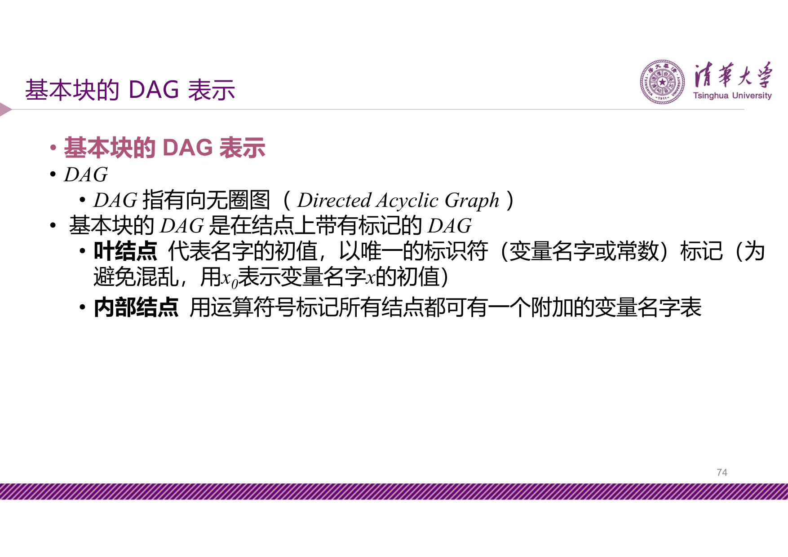

### 4.2 DAG 的构造

仅考虑三种形式的 TAC 语句对应的 DAG 子图：

| TAC 语句 | $A := B$ | $A := \text{op } B$ | $A := B \text{ op } C$ |
| --- | --- | --- | --- |
| DAG 子图 | 叶结点 $B$ 附加 $A$ | 内部结点 $\text{op}$ 连接 $B$，附加 $A$ | 内部结点 $\text{op}$ 连接 $B, C$，附加 $A$ |

设函数 $\text{node}(name)$ 返回最近创建的关联于 $name$ 的结点。构造算法：

1. 若 $\text{node}(y)$ 无定义，创建标记为 $y$ 的叶结点；对第一种语句，若 $\text{node}(z)$ 无定义，同样创建叶结点
2. 对第一种语句：若 $\text{node}(y)$ 和 $\text{node}(z)$ 都是常数叶结点，执行 $y \text{ op } z$，合并已知量；否则检查是否存在标记为 $\text{op}$ 且左右孩子为 $\text{node}(y), \text{node}(z)$ 的结点，若无则创建（**删除多余运算**）
3. 对第二种语句：类似处理，检查是否存在标记为 $\text{op}$ 且唯一孩子为 $\text{node}(y)$ 的结点
4. 对第三种语句：令 $\text{node}(y)$ 为 $n$
5. 从 $\text{node}(x)$ 的附加标识符表中删除 $x$，将 $x$ 添加到结点 $n$ 的附加变量名字表中，置 $\text{node}(x) = n$（**删除无用赋值**）

### 4.3 DAG 构造举例与优化效果

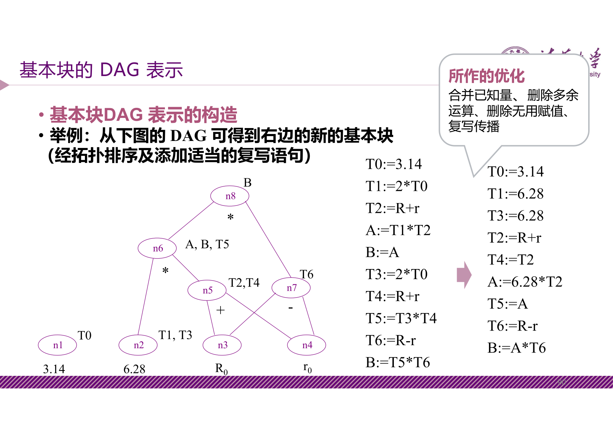

DAG 构造过程中自动完成的优化包括：

- **合并已知量**：常数运算在编译时求值
- **删除多余运算**（公共表达式删除）：相同运算只计算一次
- **删除无用赋值**：后续不再使用的赋值被消除
- **复写传播**：$B := A$ 后直接用 $A$ 替代 $B$

---

## 5 目标代码生成技术

### 5.1 代码生成要考虑的主要问题

目标代码生成需要解决三个核心问题：

1. **指令选择**（instruction selection）：为每条中间语言语句选择恰当的目标机指令序列
2. **寄存器分配**（register allocation）：充分、高效地使用寄存器
3. **指令调度**（code scheduling）：选择好计算的次序，充分利用目标机特性

### 5.2 指令选择

!!! abstract "定义 13（指令选择）"

    为每条中间语言语句选择恰当的目标机指令或指令序列。原则是：

    - 首先要保证语义的一致性
    - 其次要权衡所生成代码的效率（时间/空间代价）

**指令代价** 的简单模型：假设每条指令在操作数准备好后执行其操作的代价均为 $1$，每访问一次内存则增加代价 $1$。

???+ example "例：`a := b + c` 的几种转换方式"


    | 方式 | 代码序列 | cost |
    | --- | --- | --- |
    | (1) | `MOV b, R0; ADD R0, c; MOV R0, a` | 6 |
    | (2) | `MOV b, a; ADD a, c` | 6 |
    | (3) | 假设 R1, R2 已有 b, c：`MOV R1, R0; ADD R0, R2; MOV R0, a` | 4 |
    | (4) | 假设 R1, R2 已有 b, c，且 b 不再需要：`ADD R1, R2; MOV R1, a` | 3 |

### 5.3 简单的代码生成算法

在基本块范围内考虑如何充分利用寄存器，原则包括：

- 尽可能地让变量的值保留在寄存器中，必要时才 spill 到内存
- 尽可能引用变量在寄存器中的值
- 在取值相同的变量间共享寄存器
- 不再被引用的变量所占用的寄存器应尽早释放

算法借助基本块内变量的 **待用信息链** 和 **活跃信息链** 来决策。

!!! info "假定条件"


    - TAC 语句仅包含 $A := B \text{ op } C$ 和 $A := B$ 两类
    - 目标指令：`OP reg0, reg1, reg2`、`LD reg, mem`、`ST reg, mem`、`MV reg0, reg1`

**算法核心数据结构**：

- `VALUE[R]`：描述寄存器 $R$ 当前存放哪个变量
- `lookupReg(V)`：查询变量 $V$ 存放在哪个寄存器中
- `allocReg(V)`：为变量 $V$ 分配新的寄存器

**算法步骤**：

step1：对每个 TAC 语句：
- 调用 `lookupReg(A)` 确定目的寄存器，未分配则调用 `allocReg(A)`
- 调用 `lookupReg(B)` 和 `lookupReg(C)` 确定操作数位置，不在寄存器中则分配并用 `LD` 装入
- 更新 `VALUE` 数组
- 生成对应目标代码（`OP` 或 `MV`）
- 若 $B(C)$ 的现行值不再被引用且非出口活跃变量，释放其寄存器

step2：处理完所有 TAC 语句后，对出口活跃的变量生成 `ST` 指令存入内存

???+ example "例：基本块代码生成"


    对基本块 `t:=a-b; a:=b; u:=a-c; v:=t+u; d:=v+u`（假定 $b$ 和 $d$ 出口活跃），生成代码序列：

    ```
    LD R1, a      ; VALUE[R0]=t
    LD R2, b      ; VALUE[R2]=b
    SUB R0, R1, R2
    MV R1, R2     ; a:=b, VALUE[R1]=a
    LD R4, c
    SUB R3, R1, R4 ; u:=a-c, VALUE[R3]=u
    ADD R1, R0, R3 ; v:=t+u, VALUE[R1]=v
    ADD R0, R1, R3 ; d:=v+u, VALUE[R0]=d
    ST R0, d      ; 活跃变量存回内存
    ST R2, b
    ```

**`allocReg` 的 spill 策略**：

1. 若有未使用的寄存器，直接分配
2. 若有寄存器存放的变量不再被引用且非出口活跃，复用该寄存器
3. 否则使用 **LRU 算法**，选择最久未使用的寄存器，将其内容 spill 到内存

### 5.4 高效使用寄存器 — Ershov 数与 Sethi-Ullman 算法

!!! abstract "定义 14（Ershov 数）"

    表达式求值时所需寄存器数目的最小值。

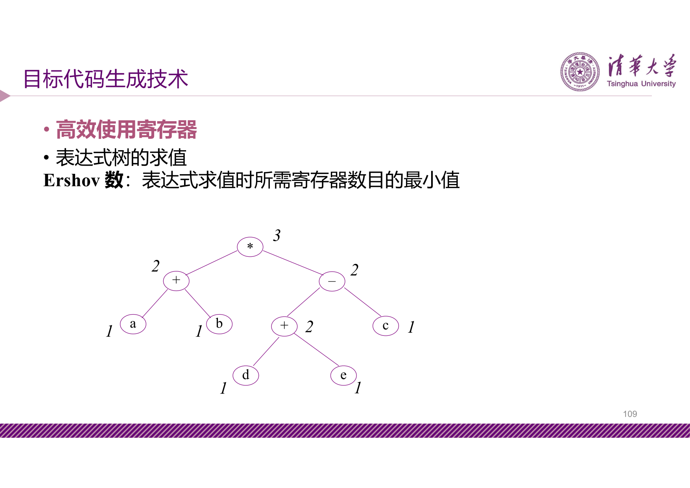

**Sethi-Ullman 算法** 根据 Ershov 数生成最优（使用最少寄存器）的表达式求值代码。基本策略：优先对需要更多寄存器的子树求值。

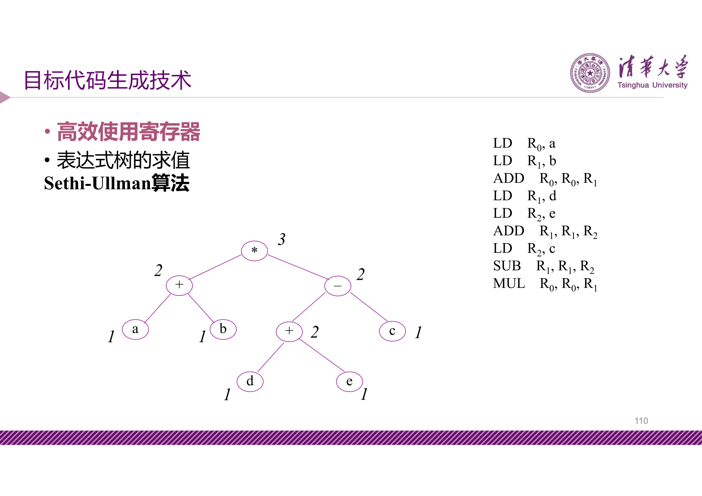

### 5.5 图着色物理寄存器分配

!!! abstract "定义 15（图着色寄存器分配）"

    两遍的寄存器分配和指派算法：

    - **第一遍**：先假定可用通用寄存器无限多，完成指令选择和生成（使用伪寄存器）
    - **第二遍**：将物理寄存器指派到伪寄存器，物理寄存器数量不足时将部分伪寄存器 spill 到内存

    图着色算法的核心任务是 **使得 spill 的伪寄存器数目最少**。

**寄存器相干图**（register-interference graph）：

- **结点**：每一个伪寄存器为一个结点
- **边**：如果程序中存在某点，一个结点在该点被定义，而另一个结点在紧靠该定值之后的点是活跃的，则在这两个结点间连一条边

对相干图使用 $k$（物理寄存器数量）种颜色进行着色，使相邻结点颜色不同。

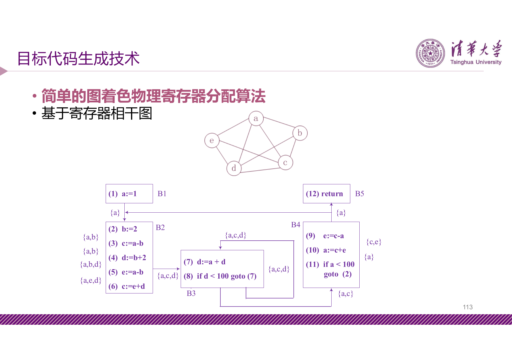

#### 启发式图着色算法

"一个图是否能用 $k$ 种颜色着色"是 NP-完全问题。常用的启发式 $k$-着色算法：

!!! info "启发式 $k$-着色算法"


    - 假设图 $G$ 中某个结点 $n$ 的度数小于 $k$，从 $G$ 中删除 $n$ 及其邻边得到图 $G'$，对 $G$ 的 $k$-着色问题可转化为先对 $G'$ $k$-着色，然后给结点 $n$ 分配一个其相邻结点未使用过的颜色
    - 重复此过程，若可到达空图，则成功实现 $k$-着色
    - 否则，从 $G$ 中选择某个结点作为 spill 候选，将其删除后算法继续

---

## 6 代码优化技术

### 6.1 优化的分类

**依优化范围划分**：

| 范围 | 说明 |
| --- | --- |
| 窥孔优化（peephole） | 局部的几条指令范围内的优化 |
| 局部优化 | 基本块范围内的优化 |
| 全局优化 | 流图范围内的优化 |
| 过程间优化 | 整个程序范围内的优化 |

**依优化侧面划分**：指令调度、寄存器分配、存储层次优化、存储布局优化、循环优化、控制流优化、过程优化等。

### 6.2 窥孔优化

**工作方式**：在目标指令序列上滑动一个包含几条指令的窗口（窥孔），发现不够优化的指令序列，用更短或更有效的指令序列替代。

常见窥孔优化类型：

???+ example "例 1：删除冗余的'取'和'存'"


    ```
    // 优化前                 // 优化后
    (1) LD R0, a             (1) LD R0, a
    (2) LD R1, b             (2) MV R1, R0
    (3) MV R1, R0
    ```

???+ example "例 2：合并已知量（constant folding）"


    ```
    // 优化前                 // 优化后
    (1) r2 := 3 * 2          (1) r2 := 6
    ```

???+ example "例 3：常量传播（constant propagation）"


    ```
    // 优化前                 // 优化后
    (1) r2 := 4              (1) r2 := 4
    (2) r3 := r1 + r2        (2) r3 := r1 + 4
    ```

    注：条数未少，但若 $r2$ 不再活跃，可删除 (1)。

???+ example "例 4：代数化简（algebraic simplification）"


    ```
    (1) x := x + 0    → 可删除
    (n) y := y * 1    → 可删除
    ```

???+ example "例 5：控制流优化"


    ```
    // 优化前                 // 优化后
          goto L1                   goto L2
          ……                        ……
    L1:   goto L2             L1:   goto L2
    ```

???+ example "例 6：死代码删除（dead-code elimination）"


    ```
    // 优化前                 // 优化后
          debug := false             debug := false
          if (debug) print …         ……
          ……
    ```

???+ example "例 7：强度削弱（reduction in strength）"


    ```
    x := 2.0 * f   →  x := f + f     // 乘法→加法
    x := f / 2.0   →  x := f * 0.5   // 除法→乘法
    ```

???+ example "例 8：使用目标机惯用指令（use of idioms）"


    - 与 $1$ 相加 → 用"加 1"指令而非"加"指令
    - 定点数乘以 $2$ → 左移指令
    - 定点数除以 $2$ → 右移指令

### 6.3 局部优化（基本块内）

DAG 构造过程中已自动完成的优化：

- 合并已知量
- 删除多余运算（公共表达式删除）
- 删除无用赋值
- 复写传播

### 6.4 全局优化

借助针对流图的数据流分析进行，例如：

- 全局公共表达式删除
- 全局死代码删除（删除从流图入口不能到达的代码）

### 6.5 循环优化

!!! abstract "定义 16（循环不变量）"

    在循环中值不随迭代变化的表达式。若循环内部语句 $x := y + z$ 中 $y$ 和 $z$ 的定值点都在循环外，则 $x := y + z$ 为 **循环不变量**（loop-invariant）。

#### 代码外提（code motion）

将循环不变量代码从循环体内移到循环体外：

```
// 优化前                      // 优化后
while (i < limit/2) {         t := limit/2;
    …                         while (i < t) {
}                                 …
                              }
```

循环不变量 $x := y + z$ 可以外提的充分条件：

1. 所在结点是循环的所有出口结点的支配结点
2. 循环中其它地方不再有 $x$ 的定值点
3. 循环中 $x$ 的所有引用点都是且仅是这个定值所能达到的
4. 若 $y$ 或 $z$ 是在循环中定值的，则只有当这些定值点的语句（也是循环不变量）已经被执行过代码外提

或者将条件 1 替换为：要求 $x$ 在离开循环之后不再是活跃的。

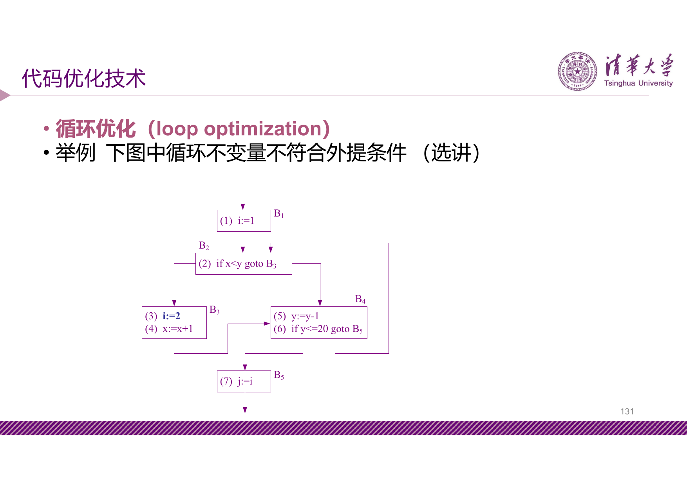

#### 归纳变量优化

!!! abstract "定义 17（归纳变量）"

    在循环的顺序迭代中取得一系列值的变量，称为 **归纳变量**（induction variable）。常见的如循环下标及循环体内显式增量和减量的变量。

可针对归纳变量进行的优化：

1. **削弱归纳变量的计算强度**：将乘法形式的归纳变量转换为加法形式
2. **删除冗余归纳变量**：经强度削弱后，往往可以只在寄存器中保存个别归纳变量，删除其余冗余的归纳变量

---

## 7 总结

| 主题 | 核心概念 | 关键算法/技术 |
| --- | --- | --- |
| 基本块与流图 | 入口语句、基本块划分、CFG、支配结点、回边、自然循环 | 划分基本块算法、支配结点计算 |
| 数据流分析 | 到达-定值、活跃变量、向前流/向后流、UD 链、DU 链 | 迭代求解数据流方程、待用/活跃信息计算 |
| DAG 表示 | 叶结点/内部结点、公共子表达式共享 | DAG 构造算法（合并已知量、删除多余运算、删除无用赋值） |
| 目标代码生成 | 指令选择、寄存器分配、指令调度 | 简单代码生成算法、Sethi-Ullman 算法、图着色分配 |
| 代码优化 | 窥孔优化、局部优化、全局优化、循环优化 | 常量折叠/传播、死代码删除、强度削弱、代码外提、归纳变量优化 |
