# 语法制导的语义计算基础

## 1 概述

### 1.1 基本思想

编译程序中的"前端"(Front End) 过程：

字符流形式的源程序 → 词法分析 → 单词流形式的源程序 → 语法分析 → 语法树 → 语义分析 → 中间代码

同时伴随 **符号表管理**（Symbol Table）。

### 1.2 本讲导引

**语法制导的（Syntax-Directed）语义计算：**

- 以语法定义（上下文无关文法）为基础
- 用于各种语义分析与翻译过程：静态语义检查，中间代码（甚至目标代码）生成等
- 用于语义计算规则及计算过程的定义
- 用于自动构造工具的设计（如 Yacc）

**原理与方法：**

- **属性文法**（Attribute Grammar）：侧重于语义计算 **规则** 的定义
- **翻译模式**（Translation Scheme）：侧重于语义计算 **过程** 的定义

### 1.3 属性文法举例

#### 识别语言 $L = \{ a^n b^n c^n \mid n \geq 1 \}$

| 产生式           | 语义动作/限定条件                                          |
| ------------- | -------------------------------------------------- |
| $S \to ABC$   | $\{(A.num = B.num) \text{ and } (B.num = C.num)\}$ |
| $A \to A_1 a$ | $\{A.num := A_1.num + 1\}$                         |
| $A \to a$     | $\{A.num := 1\}$                                   |
| $B \to B_1 b$ | $\{B.num := B_1.num + 1\}$                         |
| $B \to b$     | $\{B.num := 1\}$                                   |
| $C \to C_1 c$ | $\{C.num := C_1.num + 1\}$                         |
| $C \to c$     | $\{C.num := 1\}$                                   |
|               |                                                    |

#### 识别语言 $L = \{ a^i b^j c^k \mid i,j,k \geq 1 \}$（不含限定条件，但显示 $a^n b^n c^n$ 是合法的）

| 产生式 | 语义动作 |
|---|---|
| $S \to ABC$ | $\{\text{if } (A.num=B.num) \text{ and } (B.num=C.num) \text{ then print("Accepted!") else print("Refused!")}\}$ |
| $A \to A_1 a$ | $\{A.num := A_1.num + 1\}$ |
| $A \to a$ | $\{A.num := 1\}$ |
| $B \to B_1 b$ | $\{B.num := B_1.num + 1\}$ |
| $B \to b$ | $\{B.num := 1\}$ |
| $C \to C_1 c$ | $\{C.num := C_1.num + 1\}$ |
| $C \to c$ | $\{C.num := 1\}$ |

#### 另一种设计（含继承属性）

| 产生式 | 语义动作 |
|---|---|
| $S \to ABC$ | $\{B.in\_num := A.num;\; C.in\_num := A.num;\; \text{if } (B.num=0 \text{ and } C.num=0) \text{ then print("Accepted!") else print("Refused!")}\}$ |
| $A \to A_1 a$ | $\{A.num := A_1.num + 1\}$ |
| $A \to a$ | $\{A.num := 1\}$ |
| $B \to B_1 b$ | $\{B_1.in\_num := B.in\_num;\; B.num := B_1.num - 1\}$ |
| $B \to b$ | $\{B.num := B.in\_num - 1\}$ |
| $C \to C_1 c$ | $\{C_1.in\_num := C.in\_num;\; C.num := C_1.num - 1\}$ |
| $C \to c$ | $\{C.num := C.in\_num - 1\}$ |

### 1.4 翻译模式举例

!!! tip "属性文法 vs 翻译模式"

    翻译模式中，语义动作可以 **嵌入产生式右端的任意位置**，从而显式地表达动作和属性计算的次序；属性文法中不体现这种次序。

| 产生式（翻译模式）                                                           | 语义动作                                                                                                   |
| ------------------------------------------------------------------- | ------------------------------------------------------------------------------------------------------ |
| $S \to A\; \{B.in\_num := A.num\}\; B\; \{C.in\_num := A.num\}\; C$ | $\{\text{if } (B.num=0 \text{ and } C.num=0) \text{ then print("Accepted!") else print("Refused!")}\}$ |
| $A \to A_1 a$                                                       | $\{A.num := A_1.num + 1\}$                                                                             |
| $A \to a$                                                           | $\{A.num := 1\}$                                                                                       |
| $B \to \{B_1.in\_num := B.in\_num\}\; B_1 b$                        | $\{B.num := B_1.num - 1\}$                                                                             |
| $B \to b$                                                           | $\{B.num := B.in\_num - 1\}$                                                                           |
| $C \to \{C_1.in\_num := C.in\_num\}\; C_1 c$                        | $\{C.num := C_1.num - 1\}$                                                                             |
| $C \to c$                                                           | $\{C.num := C.in\_num - 1\}$                                                                           |

---

## 2 属性文法

### 2.1 概念

!!! abstract "定义（属性文法）"

    属性文法在上下文无关文法的基础上进行如下扩展：

    - 为每个文法符号关联多个 **属性**（Attribute）
    - 为文法的每个产生式关联一个 **语义规则集合** 或称为语义动作

    （从应用角度，本课程不讨论含限定条件的属性文法）

!!! abstract "定义（属性）"

    属性可用来刻画一个文法符号的任何我们所关心的特性，如：符号的值，符号的名字串，符号的类型，符号的偏移地址，符号被赋予的寄存器，代码片断，等等。

    记号：文法符号 $X$ 关联属性 $a$ 的属性值可通过 `X.a` 访问。

!!! abstract "定义（语义规则）"

    在属性文法中，每个产生式 $A \to \alpha$ 都关联一个语义规则的集合，用于描述如何计算当前产生式中文法符号的属性值或附加的语义动作。

    属性文法中允许如下语义规则：

    - **复写（copy）规则**，形如 `X.a := Y.b`
    - **基于语义函数（semantic function）的规则**，形如 `b := f(c1, c2, ..., ck)` 或 `f(c1, c2, ..., ck)`，其中 `b, c1, c2, ..., ck` 是该产生式中文法符号的属性
    - 实践中，语义函数的形式可以更灵活

### 2.2 两种属性：综合属性和继承属性

!!! abstract "定义（综合属性 Synthesized Attribute）"

    用于 **自下而上** 传递信息。

    对关联于产生式 $A \to \alpha$ 的语义规则 $b := f(c_1, c_2, \ldots, c_k)$，如果 $b$ 是 **$A$** 的某个属性，则称 $b$ 是 $A$ 的一个 **综合属性**。

!!! abstract "定义（继承属性 Inherited Attribute）"

    用于 **自上而下** 传递信息。

    对关联于产生式 $A \to \alpha$ 的语义规则 $b := f(c_1, c_2, \ldots, c_k)$，如果 $b$ 是产生式**右部某个文法符号 $X$** 的某个属性，则称 $b$ 是文法符号 $X$ 的一个 **继承属性**。

### 2.3 属性文法举例

#### 仅含综合属性的例子（开始符号 S）

| 产生式 | 语义动作 |
|---|---|
| $S \to E$ | $\{\text{print}(E.val)\}$ |
| $E \to E_1 + T$ | $\{E.val := E_1.val + T.val\}$ |
| $E \to T$ | $\{E.val := T.val\}$ |
| $T \to T_1 * F$ | $\{T.val := T_1.val \times F.val\}$ |
| $T \to F$ | $\{T.val := F.val\}$ |
| $F \to (E)$ | $\{F.val := E.val\}$ |
| $F \to d$ | $\{F.val := d.lexval\}$ |

注：`d.lexval` 是词法分析程序确定的属性值。

表达式 `3*(5+4)` 的分析树（综合属性代表自下而上传递的信息）：

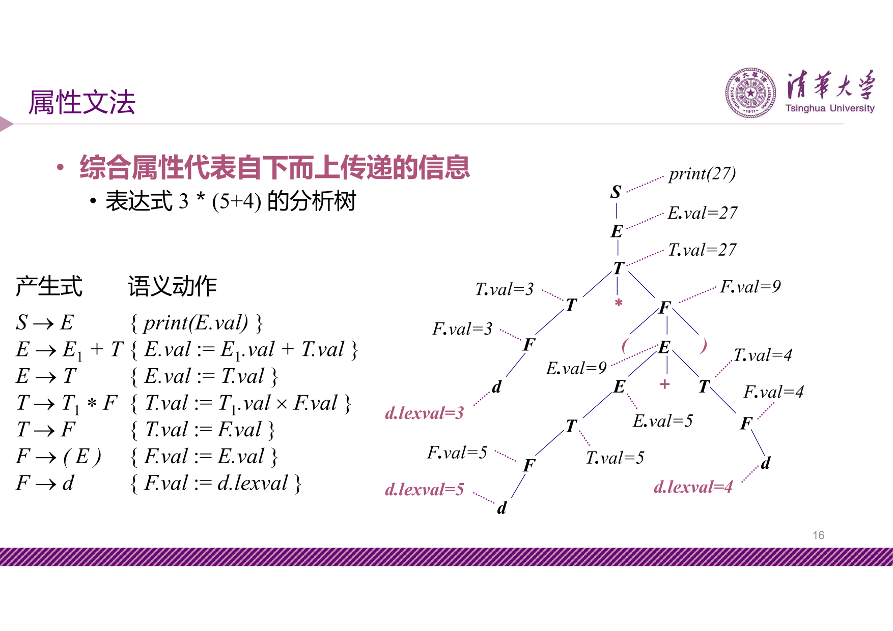

#### 含继承属性的例子（开始符号 S）

| 产生式 | 语义动作 |
|---|---|
| $S \to ABC$ | $\{B.in\_num := A.num;\; C.in\_num := A.num;\; \text{if } (B.num=0 \text{ and } C.num=0) \text{ then print("Accepted!") else print("Refused!")}\}$ |
| $A \to A_1 a$ | $\{A.num := A_1.num + 1\}$ |
| $A \to \varepsilon$ | $\{A.num := 0\}$ |
| $B \to B_1 b$ | $\{B_1.in\_num := B.in\_num;\; B.num := B_1.num - 1\}$ |
| $B \to \varepsilon$ | $\{B.num := B.in\_num\}$ |
| $C \to C_1 c$ | $\{C_1.in\_num := C.in\_num;\; C.num := C_1.num - 1\}$ |
| $C \to \varepsilon$ | $\{C.num := C.in\_num\}$ |

其中 `A.num`，`B.num` 和 `C.num` 是 **综合属性**，而 `B.in_num` 和 `C.in_num` 是 **继承属性**。

!!! info "继承属性代表自上而下传递的信息"

    对输入串 `aabbcc` 的分析树进行遍历，自下而上执行综合属性相应的语义动作，自上而下执行继承属性相应的语义动作，可以得到所有属性值的一个求值过程。

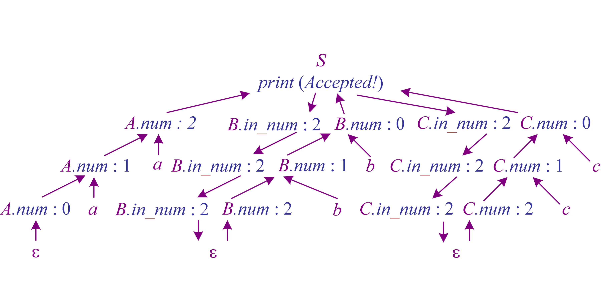

#### 更复杂的例子（开始符号 N，二进制无符号小数转十进制）

| 产生式 | 语义动作 |
|---|---|
| $N \to S_1.S_2$ | $\{N.v := S_1.v + S_2.v;\; S_1.f := 1;\; S_2.f := 2^{-S_2.l}\}$ |
| $S \to S_1 B$ | $\{S_1.f := 2S.f;\; B.f := S.f;\; S.v := S_1.v + B.v;\; S.l := S_1.l + 1\}$ |
| $S \to B$ | $\{S.l := 1;\; S.v := B.v;\; B.f := S.f\}$ |
| $B \to 0$ | $\{B.v := 0\}$ |
| $B \to 1$ | $\{B.v := B.f\}$ |

!!! tip "思考"

    语义动作中涉及的属性应该如何计算？参见下节基于树遍历方法的讨论。

---

## 3 基于属性文法的语义计算

### 3.1 计算方法

计算方法分两类：

- **树遍历方法**：通过遍历分析树进行属性计算
- **单遍的方法**：语法分析遍的同时进行属性计算

### 3.2 基于树遍历方法的语义计算

!!! abstract "步骤"


    1. 构造输入串的语法分析树
    2. 构造 **依赖图**（Dependency Graph）
    3. 若该依赖图是无圈（也称作环）的，则按照此无圈图的一种 **拓扑排序**（Topological Sort）对分析树进行遍历，则可以计算所有的属性

!!! warning "良定义的属性文法"

    若依赖图含有圈，则相应的属性文法不可采用这种方法进行语义计算，此类属性文法不是 **良定义** 的。所谓良定义的属性文法，当且仅当它的规则集合能够为所有分析树中的属性集确定唯一的值集。

!!! abstract "定义（依赖图）"

    依赖图是一个有向图，用来描述分析树中的属性与属性之间的相互依赖关系。

    **构造算法：**

    ```
    for 分析树中每一个结点 n do
        for 结点 n 所用产生式的每个语义规则中涉及的每一个属性 a do
            为 a 在依赖图中建立一个结点;
        for 结点 n 所用产生式中每个形如 f(c1,c2,...ck) 的语义规则 do
            为该规则在依赖图中也建立一个结点（称为虚结点）;
    for 分析树中每一个结点 n do
        for 结点 n 所用产生式对应的每个语义规则 b:=f(c1,c2,...ck) do
    	    这里可以只是：f(c1,c2,...ck)，b 对应虚节点）
            for i := 1 to k do
                从 ci 结点到 b 结点构造一条有向边
    ```

### 3.3 基于树遍历的计算方法举例

设有如下属性文法（二进制小数转十进制），考虑输入串 `10.01` 的语义计算过程。

| 产生式 | 语义动作 |
|---|---|
| $N \to S_1.S_2$ | $\{N.v := S_1.v + S_2.v;\; S_1.f := 1;\; S_2.f := 2^{-S_2.l}\}$ |
| $S \to S_1 B$ | $\{S_1.f := 2S.f;\; B.f := S.f;\; S.v := S_1.v + B.v;\; S.l := S_1.l + 1\}$ |
| $S \to B$ | $\{S.l := 1;\; S.v := B.v;\; B.f := S.f\}$ |
| $B \to 0$ | $\{B.v := 0\}$ |
| $B \to 1$ | $\{B.v := B.f\}$ |

**步骤一：** 构造输入串 `10.01` 的语法分析树

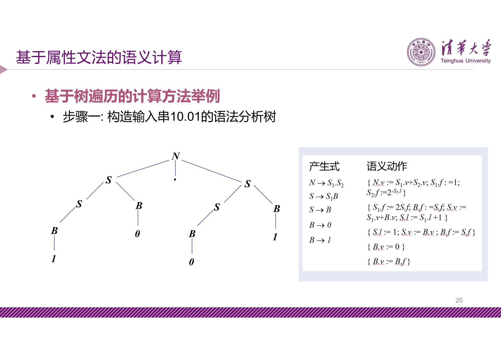

**步骤二：** 为分析树中所有结点的每个属性建立依赖图中的结点，并给定标记序号

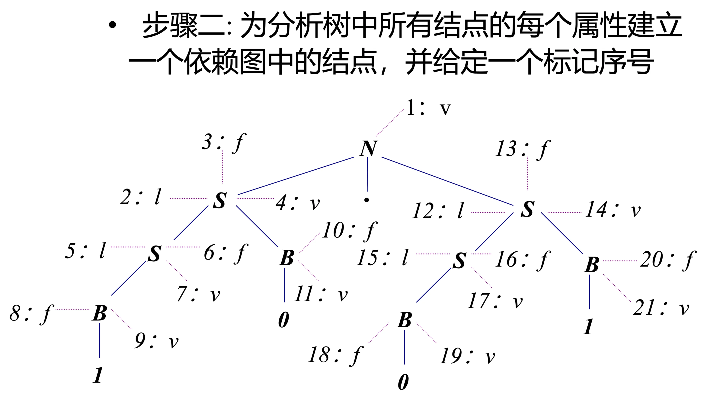


**步骤三：** 根据语义动作，建立依赖图中的有向边

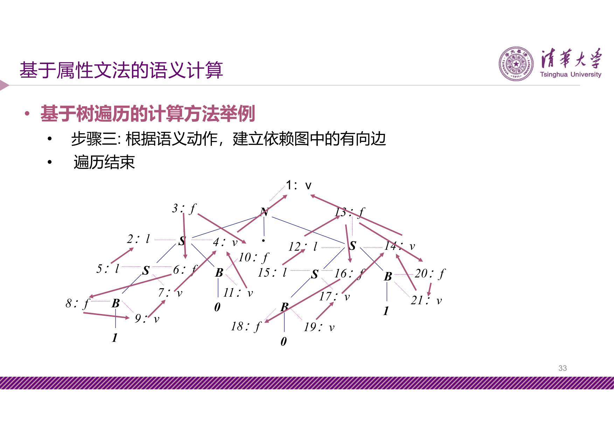

**步骤四：** 依赖图无圈，存在拓扑排序。一种可能的计算次序：

$$
3, 5, 2, 6, 10, 8, 9, 7, 11, 4, 15, 12, 13, 16, 20, 18, 21, 19, 17, 14, 1
$$

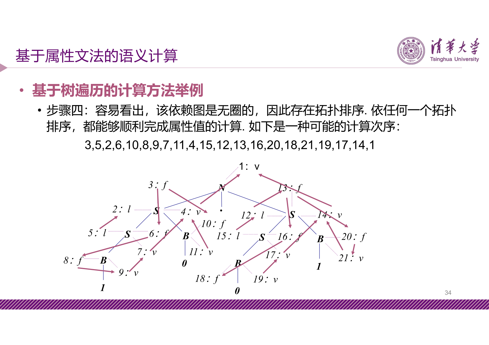

**步骤五：** 依计算次序，根据语义动作求出各结点对应的属性值

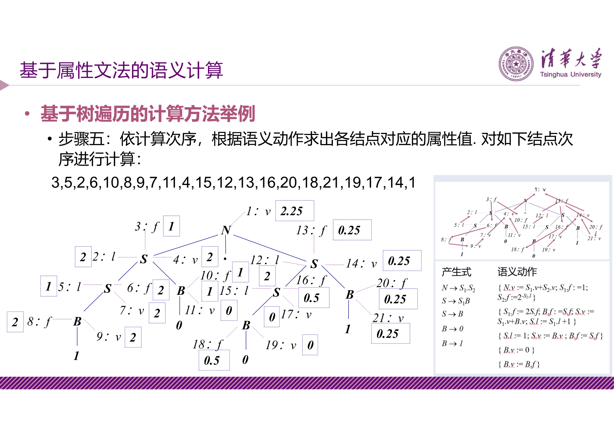

### 3.4 带标注的语法分析树

语法分析树中各结点属性值的计算过程被称为对语法分析树的 **标注**（annotating）或 **修饰**（decorating），用带标注的语法分析树表示属性值的计算结果：

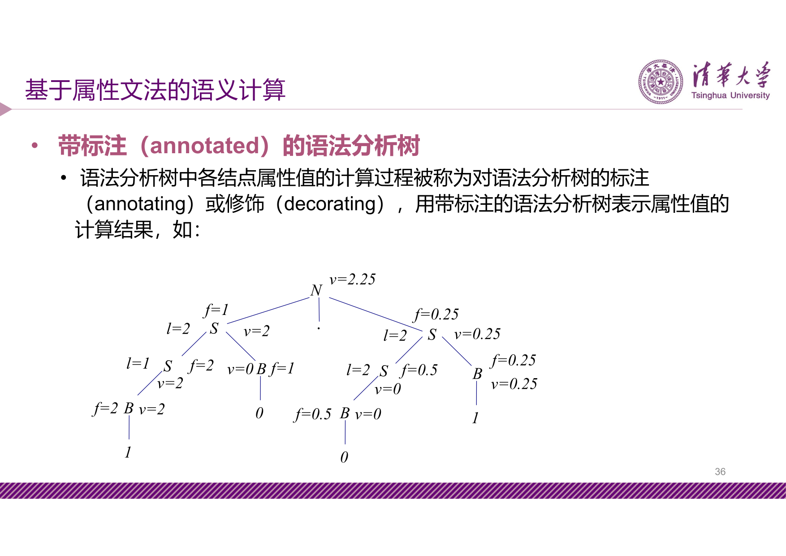

### 3.5 单遍的方法

语法分析遍的同时进行属性计算：

- **自下而上方法**
- **自上而下方法**

只适用于特定的属性文法，本课程讨论如下两类：

!!! abstract "定义（S-属性文法）"

    **S-属性文法**：只包含 **综合属性**。

!!! abstract "定义（L-属性文法）"

    **L-属性文法**：可以包含综合属性，也可以包含继承属性，但需满足：

    - 产生式右端某文法符号的继承属性的计算只取决于该符号 **左边** 文法符号的属性（对于产生式左边文法符号，只能是继承属性）

!!! tip "S-属性文法是 L-属性文法的一个特例"


### 3.6 S-属性文法的语义计算

S-属性文法通常采用 **自下而上** 的方式进行。若采用 LR 分析技术，可以通过扩充分析栈中的域，形成 **语义栈** 来存放综合属性的值，计算相应产生式左部文法符号的综合属性值刚好发生在每一步归约之前的时刻。

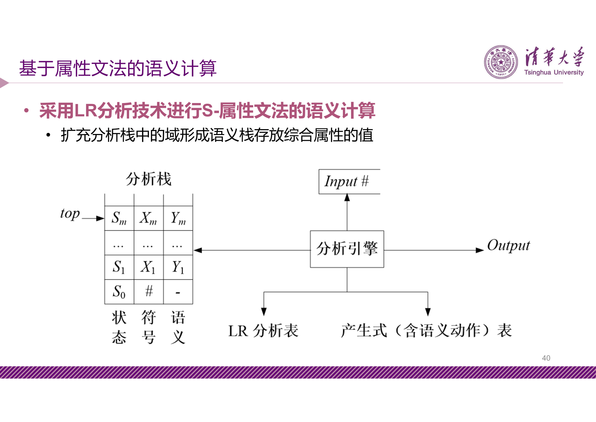

语义动作中的综合属性可以通过存在于当前语义栈栈顶部分的属性进行计算。例如，假设有相应于产生式 $A \to XYZ$ 的语义规则 `A.a := f(X.x, Y.y, Z.z)`，在 $XYZ$ 归约为 $A$ 之前，`Z.z`、`Y.y` 和 `X.x` 分别存放于语义栈的 top、top-1 和 top-2 的相应域中，因此 `A.a` 可以顺利求出。归约后，`X.x`、`Y.y`、`Z.z` 被弹出，而在栈顶 top 的位置上存放 `A.a`。

#### 用 LR 分析技术进行 S-属性文法的语义计算举例

通过下列 S-属性文法 G'[S] 为常量表达式求值：

| 产生式 | 语义动作 |
|---|---|
| $S \to E$ | $\{\text{print}(E.val)\}$ |
| $E \to E_1 + T$ | $\{E.val := E_1.val + T.val\}$ |
| $E \to T$ | $\{E.val := T.val\}$ |
| $T \to T_1 * F$ | $\{T.val := T_1.val \times F.val\}$ |
| $T \to F$ | $\{T.val := F.val\}$ |
| $F \to (E)$ | $\{F.val := E.val\}$ |
| $F \to d$ | $\{F.val := d.lexval\}$ |

文法 G'[S] 的 LR 分析表：

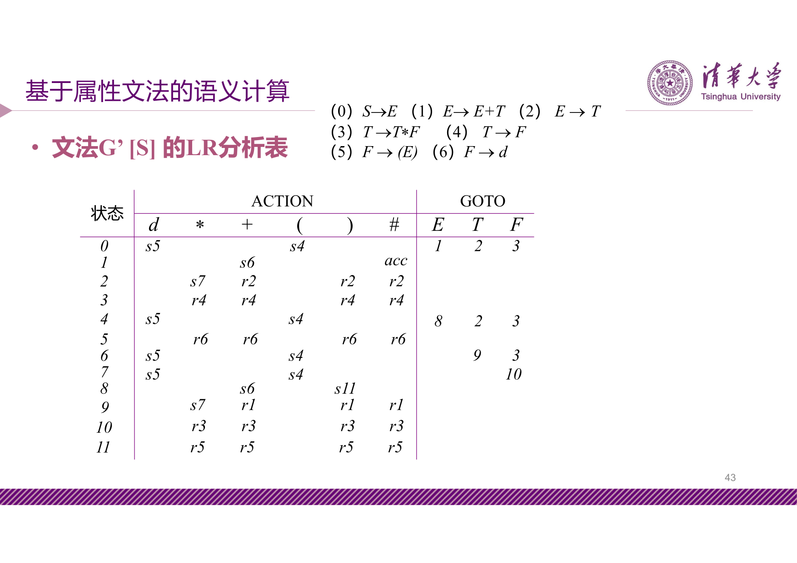

LR 分析过程伴随常量 `2 + 3 * 5` 的求值：

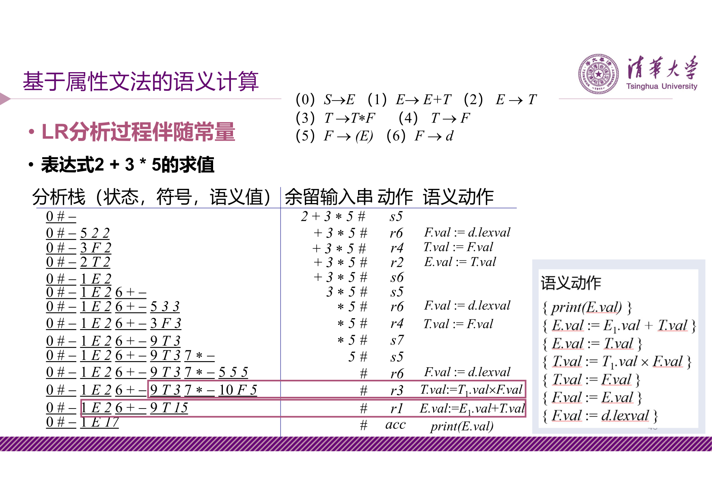

### 3.7 L-属性文法的语义计算

采用自上而下的方式可以较方便地进行，可以采用下列 **基于深度优先后序遍历** 的算法：

```
procedure dfvisit(n: node);
begin
    for n 的每一孩子 m, 从左到右 do
    begin
        计算 m 的继承属性值;
        dfvisit(m)
    end;
    计算 n 的综合属性值
end
```

该算法与自上而下预测分析过程对应。因此，基于 LL(1) 文法的 L-属性文法可以采用这种方法进行语义计算。

#### 采用深度优先后序遍历算法进行 L-属性文法的语义计算举例

考虑对于下列 L-属性文法，输入串为 `.101` 时的计算过程：

| 产生式 | 语义动作 |
|---|---|
| $N \to .S$ | $\{S.f := 1;\; \text{print}(S.v)\}$ |
| $S \to BS_1$ | $\{S_1.f := S.f + 1;\; B.f := S.f;\; S.v := S_1.v + B.v\}$ |
| $S \to \varepsilon$ | $\{S.v := 0\}$ |
| $B \to 0$ | $\{B.v := 0\}$ |
| $B \to 1$ | $\{B.v := 2^{-B.f}\}$ |

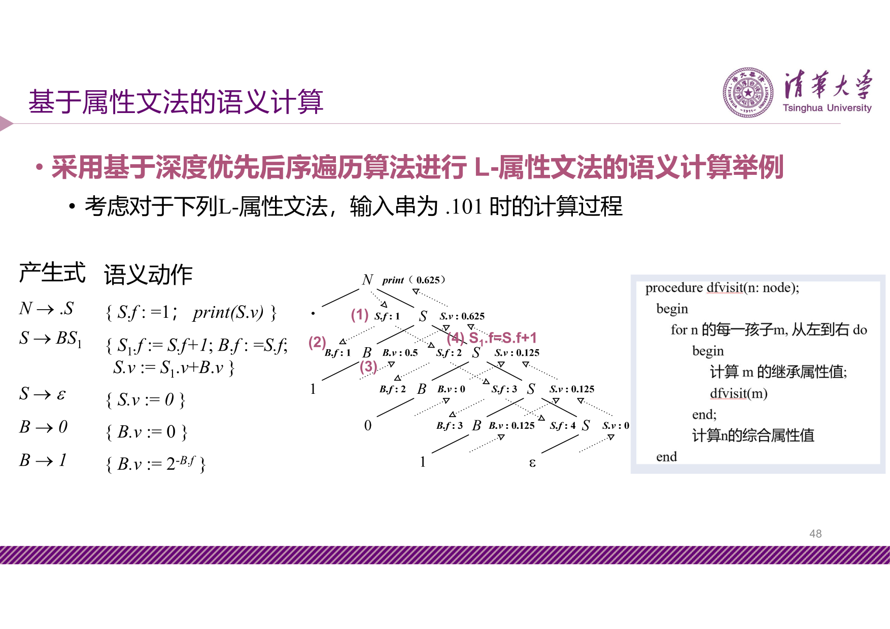

---

## 4 基于翻译模式的语义计算

### 4.1 翻译模式概念

!!! abstract "定义（翻译模式 Translation Scheme）"

    翻译模式是适合语法制导语义计算的另一种描述形式：

    - 可以体现一种合理调用语义动作的翻译算法
    - 形式上类似于属性文法，但允许由 `{}` 括起来的语义规则集合出现在产生式右端的 **任何位置**
    - 好处是可以 **显式地** 表达动作和属性 **计算的次序** ，而前述的属性文法中不体现这种次序

### 4.2 受限的翻译模式

在设计翻译模式时，必须作某些限制，以确保每个属性值在被访问到的时候已经存在。本讲仅讨论两类受限的翻译模式：

!!! note "受 S-属性文法启示"

    对于仅需要综合属性的情形，只要创建一个语义规则集合，放在相应产生式右端的末尾，把属性的计算规则加入其中即可。

!!! note "受 L-属性文法启示"

    对于既包含继承属性又包含综合属性的情形，需要满足：

    1. 产生式右端某个符号继承属性的计算必须位于该符号之前，其语义动作不访问位于它右边符号的属性（对于产生式左部的符号，只能是继承属性）
    2. 产生式左部非终结符的综合属性的计算只能在所用到的属性都已计算出来之后进行，通常将相应的语义动作置于产生式的尾部

### 4.3 翻译模式举例（定点二进制小数转十进制）

| 翻译模式 | 非翻译模式的语义动作 |
|---|---|
| $N \to .\; \{S.f := 1\}\; S\; \{\text{print}(S.v)\}$ | $\{S.f := 1;\; \text{print}(S.v)\}$ |
| $S \to \{B.f := S.f\}\; B\; \{S_1.f := S.f + 1\}\; S_1\; \{S.v := S_1.v + B.v\}$ | $\{S_1.f := S.f + 1;\; B.f := S.f;\; S.v := S_1.v + B.v\}$ |
| $S \to \varepsilon\; \{S.v := 0\}$ | $\{S.v := 0\}$ |
| $B \to 0\; \{B.v := 0\}$ | $\{B.v := 0\}$ |
| $B \to 1\; \{B.v := 2^{-B.f}\}$ | $\{B.v := 2^{-B.f}\}$ |

### 4.4 基于翻译模式的语义计算

仅考虑 **单遍的方法：**

- **自上而下的语义计算**：借助于自上而下的预测分析技术
- **自下而上的语义计算**：借助于自下而上的移进-归约分析技术

仅考虑上述受限的翻译模式。

### 4.5 基于翻译模式的自上而下语义计算

对适合于自上而下预测技术的翻译模式，语法制导的语义计算程序可以如下思路构造：

- 对每个非终结符 $A$，构造一个函数，以 $A$ 的每个继承属性为形参，以 $A$ 的综合属性为返回值。如同预测分析程序的构造，该函数代码的流程是根据当前的输入符号来决定调用哪个产生式
- 与每个产生式相关的代码根据其右端的结构来构造：
	- 对终结符 $X$，保存其综合属性 $x$ 的值至专为 `X.x` 而声明的变量；然后调用匹配终结符（`match_token`）和取下一输入符号（`next_token`）的函数
	- 对非终结符 $B$，利用相应于 $B$ 的函数 `ParseB` 产生赋值语句 `c := B(b1, b2, ..., bk)`，其中变量 $b_1, b_2, \ldots, b_k$ 对应 $B$ 的各继承属性，变量 $c$ 对应 $B$ 的综合属性
	- 对语义规则集，直接复制其中每一语义规则来产生代码，只是将对属性的访问替换为对相应变量的访问

#### 自上而下语义计算举例

构造下列翻译模式的自上而下递归下降（预测）翻译程序（可以验证其基础文法为 LL(1) 文法）：

```
N → . { S.f := 1 } S { print(S.v) }
S → { B.f := S.f } B { S1.f := S.f + 1 } S1 { S.v := S1.v + B.v }
S → ε { S.v := 0 }
B → 0 { B.v := 0 }
B → 1 { B.v := 2^(-B.f) }
```

对非终结符 $N$，构造如下函数：

```c
void ParseN() {
    MatchToken('.');      // 匹配 '.'
    Sf = 1;               // 变量 Sf 对应属性 S.f
    Sv = ParseS(Sf);      // 变量 Sv 对应属性 S.v
    print(Sv);
}
```

对非终结符 $S$，构造如下函数：

```c
float ParseS(int f) {
    if (lookahead == '0' || lookahead == '1') {
        Bf = f;  Bv = ParseB(Bf);  S1f = f + 1;
        S1v = ParseS(S1f);  Sv = S1v + Bv;
    }
    else if (lookahead == '#')  Sv = 0;
    else { printf("syntax error\n"); exit(0); }
    return Sv;
}
```

对非终结符 $B$，构造如下函数：

```c
float ParseB(int f) {
    if (lookahead == '0') { MatchToken('0'); Bv = 0; }
    else if (lookahead == '1') {
        MatchToken('1');  Bv = pow(2, -f);
    }
    else { printf("syntax error\n"); exit(0); }
    return Bv;
}
```

### 4.6 消除翻译模式中左递归的一种变换方法

如下是常量表达式求值的翻译模式，但含有左递归，因而不能用 LL(1) 方法：

```
S → E    { print(E.val) }
E → E1 + T  { E.val := E1.val + T.val }
E → T    { E.val := T.val }
T → T1 * F  { T.val := T1.val × F.val }
T → F    { T.val := F.val }
F → (E)  { F.val := E.val }
F → d    { F.val := d.lexval }
```

!!! abstract "消除左递归的一般变换方法"

    假设有如下翻译模式：

    - $A \to A_1 Y \quad \{A.a := g(A_1.a, Y.y)\}$
    - $A \to X \quad \{A.a := f(X.x)\}$

    消去关于 $A$ 的直接左递归，基础文法变换为 $A \to XR$，$R \to YR \mid \varepsilon$。

    再考虑语义动作，翻译模式变换为：

    - $A \to X\; \{R.i := f(X.x)\}\; R\; \{A.a := R.s\}$
    - $R \to Y\; \{R_1.i := g(R.i, Y.y)\}\; R_1\; \{R.s := R_1.s\}$
    - $R \to \varepsilon\; \{R.s := R.i\}$

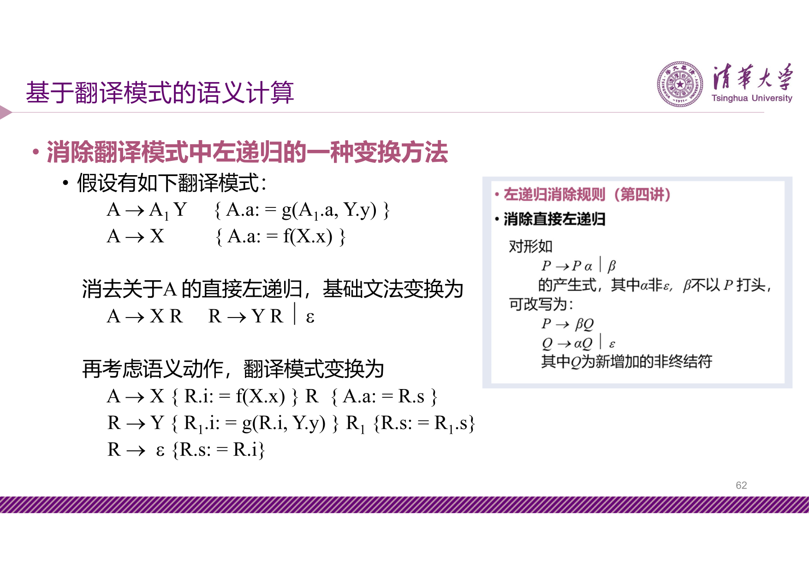

变换前后代表两种不同的计算方式（左递归 vs 右递归），但计算结果等价：

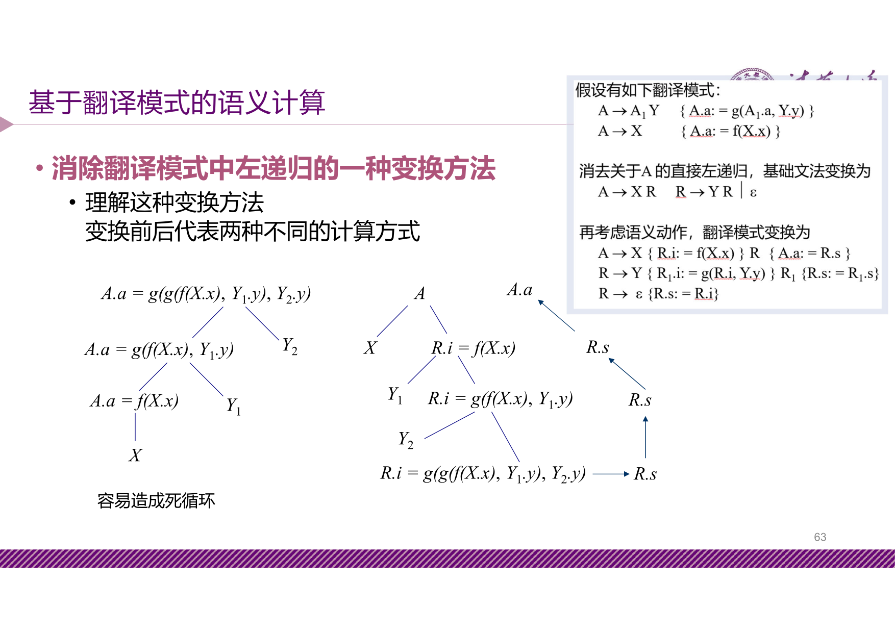

#### 消除左递归举例

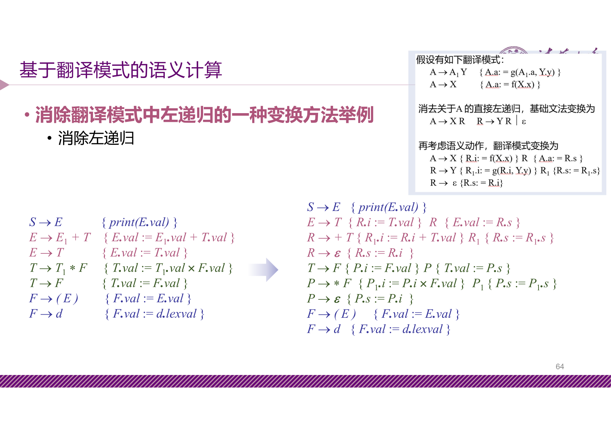

### 4.7 基于翻译模式的自下而上语义计算

扩展前述的关于 S-属性文法的自下而上计算技术（即在分析栈中增加存放属性值的域）。翻译模式中综合属性的求值采用前述的计算方法。

对于前述受限的翻译模式，核心问题实际上是 **L-翻译模式的自下而上计算**，本节仅涉及如下 3 个方面的简介：

1. 翻译模式中去掉嵌在产生式中间的语义动作
2. 分析栈中继承属性的访问及继承属性的模拟求值
3. 用综合属性代替继承属性

#### 4.7.1 从翻译模式中去掉嵌在产生式中间的语义规则集

- 若语义规则集中 **未关联任何属性**，引入新的非终结符 $N$ 和产生式 $N \to \varepsilon$，把嵌入在产生式中间的动作用非终结符 $N$ 代替，并把该语义规则集放在产生式后面
- 若语义规则集中 **有关联的属性**，引入新的非终结符 $N$ 和产生式 $N \to \varepsilon$，以及把该语义规则集放在产生式后面的同时，需要在适当的地方增加复写规则

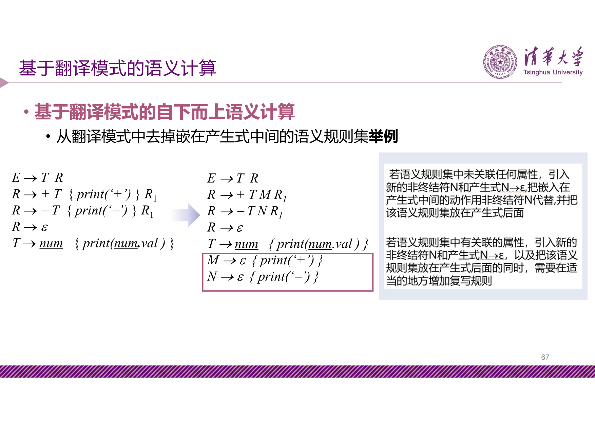

#### 4.7.2 分析栈中继承属性的访问

自下而上语义计算程序根据产生式 $A \to XY$ 的归约过程中，假设 $X$ 的综合属性 `X.s` 已经出现在语义栈上。因为在 $Y$ 以下子树的任何归约之前，`X.s` 的值一直存在，因此它可以被 $Y$ 继承。如果用复写规则 `Y.i := X.s` 来定义 $Y$ 的继承属性 `Y.i`，则在需要 `Y.i` 时，可以使用 `X.s`。

#### 4.7.3 分析栈中继承属性的访问举例

翻译模式：

```
D → T { L.in := T.type } L
T → int   { T.type := integer }
T → real  { T.type := real }
L → { L1.in := L.in } L1, v  { addtype(v.entry, L.in) }
L → v     { addtype(v.entry, L.in) }
```

| 产生式 | 依产生式归约时语义计算的代码片断 |
|---|---|
| $D \to TL$ | — |
| $T \to \underline{int}$ | `val[top] := integer` |
| $T \to \underline{real}$ | `val[top] := real` |
| $L \to L, v$ | `addtype(val[top].entry, val[top-3])` |
| $L \to v$ | `addtype(val[top].entry, val[top-1])` |

（分析栈 `val` 存放文法符号的综合属性，`top` 为栈顶指针）

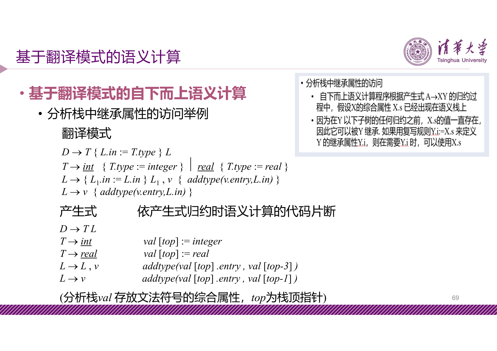

#### 4.7.4 继承属性的模拟求值

分析栈中继承属性的访问是通过栈中已有文法符号的综合属性值间接进行的，因此设计翻译模式时需要做到的一点就是要保证 **继承属性总可以通过某个文法符号的综合属性体现出来**。必要时，通过增加新的文法符号以及相应的复写规则常常可以达到上述目的。

???+ example "例 1：复写规则的模拟"

    考虑如下翻译模式：

    $S \to aA\; \{C.i := A.s\}\; C \mid bAB\; \{C.i := A.s\}\; C$

    $C \to c\; \{C.s := g(C.i)\}$

    若直接应用复写规则的计算方法，则在使用 $C \to c$ 进行归约时，`C.i` 的值或存在于次栈顶（top-1），或存在于次次栈顶（top-2），不能确定用哪一个。

    一种可行的做法是引入新的非终结符 $M$，将以上翻译模式改造为：

    $S \to aA\; \{C.i := A.s\}\; C \mid bAB\; \{M.i := A.s\}\; M\; \{C.i := M.s\}\; C$

    $C \to c\; \{C.s := g(C.i)\}$

    $M \to \varepsilon\; \{M.s := M.i\}$

    这样，在使用 $C \to c$ 进行归约时，`C.i` 的值就一定可以通过访问次栈顶（top-1）得到。

???+ example "例 2：非复写规则的模拟"

    考虑如下翻译模式：

    $S \to aA\; \{C.i := f(A.s)\}\; C$

    这里继承属性 `C.i` 不是通过复写规则来求值，而是通过普通函数 $f(A.s)$ 调用来计算。在计算 `C.i` 时，`A.s` 在语义栈上，但 $f(A.s)$ 并未存在于语义栈。同样，一种做法是引入新的非终结符 $M$，将以上翻译模式改造为：

    $S \to aA\; \{M.i := A.s\}\; M\; \{C.i := M.s\}\; C$

    $M \to \varepsilon\; \{M.s := f(M.i)\}$

#### 4.7.5 继承属性的模拟求值举例（较复杂的例子）

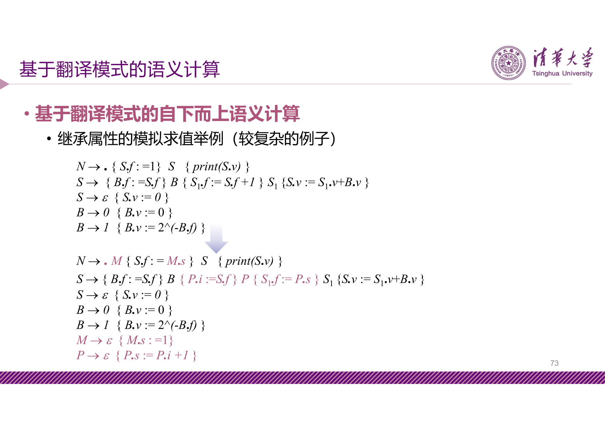

#### 4.7.6 用综合属性代替继承属性

有时，改变基础文法可能避免继承属性。如下列文法可能用来描述 Pascal 式的说明语句：

```
D → L : T
T → int | real
L → L, v | v
```

因变量标识符由 $L$ 产生而类型不在 $L$ 的子树中，所以不能仅仅使用综合属性就把 type 与标识符联系起来。从第一个产生式来看，似乎 $L$ 可以从它的右边 $T$ 中继承 type，但所得到的属性文法就不是 L-属性的。

若将上例中的基础文法变为：

```
D → v L
L → , v L
L → : T
T → int | real
```

这样，类型可以通过综合属性 `L.type` 进行传递，当通过 $L$ 产生每个变量标识符时，它的类型就可以填入到符号表中。
