<script>
  window.MathJax = {
    tex: {
      inlineMath: [["$", "$"], ["\\(", "\\)"]],
      displayMath: [["$$", "$$"], ["\\[", "\\]"]],
      processEscapes: true,
      processEnvironments: true,
      tags: "none"
    },
    options: {
      ignoreHtmlClass: "no-mathjax",
      processHtmlClass: "arithmatex"
    },
    svg: { fontCache: "global" }
  };
</script>
<script async src="https://cdn.jsdelivr.net/npm/mathjax@3/es5/tex-mml-chtml.js"></script>
<script>
  (function () {
    function typeset() {
      if (window.MathJax && window.MathJax.typesetPromise) {
        window.MathJax.typesetPromise();
      }
    }
    if (typeof document$ !== "undefined" && document$.subscribe) {
      document$.subscribe(typeset);
    } else if (document.readyState === "loading") {
      document.addEventListener("DOMContentLoaded", typeset);
    } else {
      typeset();
    }
  })();
</script>

# 运行时存储组织 — 存储分配策略、活动记录、过程调用与垃圾回收

## 1 运行时存储组织的作用与任务

### 1.1 为什么运行时存储组织重要？

存储层次对访问时间的影响巨大：

| 存储层次 | 通常大小 | 访问时间 |
| --- | --- | --- |
| 虚拟内存/硬盘 | 512GB–4TB | 50,000–100,000 ns |
| 内存 | 16GB–128GB | 60–100 ns |
| L2 缓存 | 1MB–2MB（每核） | 3–4 ns |
| L1 缓存 | 64KB–128KB（每核） | ~1 ns |
| 寄存器 | 几 KB | < 0.3 ns |

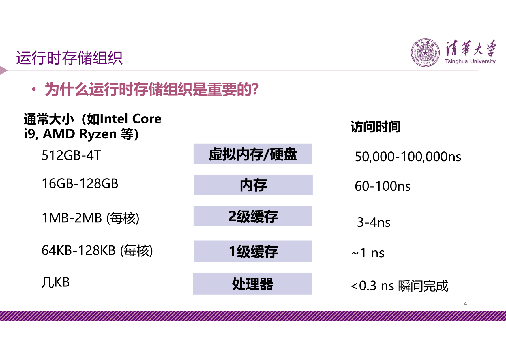

编译和运行过程中 **90%** 的时间都在运行 **10%** 的代码。针对动态数据（尤其是堆中的数据），最重要的部分是 **减少存储空间的碎片化** （fragmentation）。

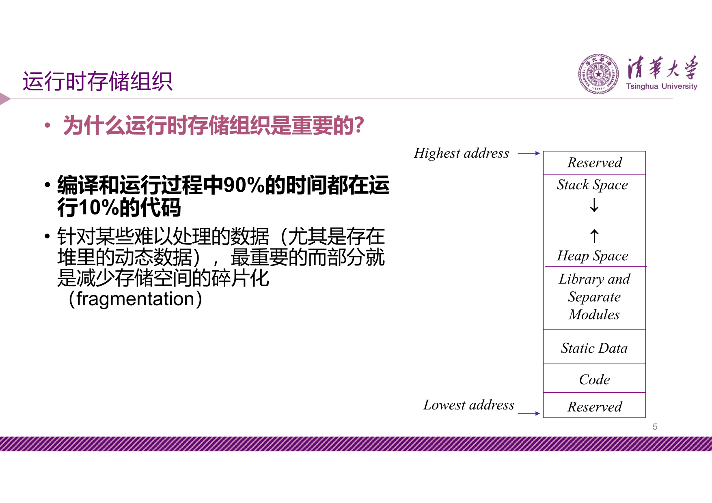

### 1.2 作用与任务

运行时存储组织关注：代码生成前如何安排目标机存储资源的使用。涉及四个核心问题：

- **数据表示**：目标机中如何表示源语言中各类数据对象
- **表达式计算**：如何组织表达式的计算
- **存储分配策略**：如何为不同作用域或不同生命周期的数据对象分配存储
- **过程实现**：如何实现过程/函数调用以及参数传递

---

## 2 程序运行时存储空间的布局

### 2.1 数据表示

源程序中数据对象在内存或寄存器中的表示形式。数据对象的属性包括：名字（name）、类型（type）、值（value）、复合数据对象（component）等。数据对象在内存中以位、字节、字、字节序列等形式表示。有些机器要求数据存放时按某种方式 **对齐**（align），如要求数据存放的起始地址能被 4 整除。

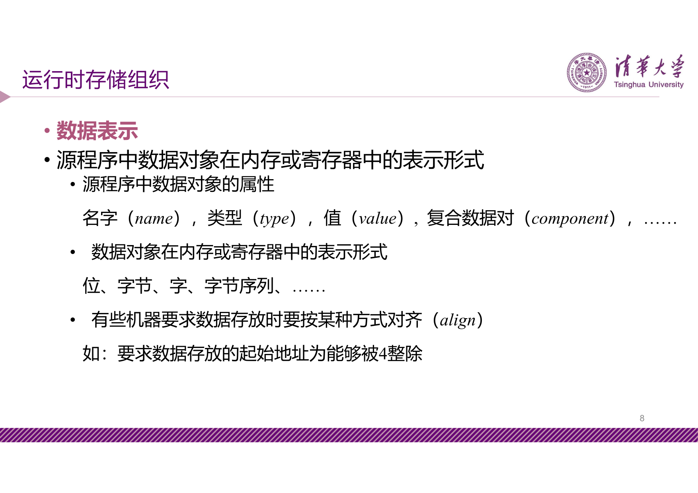

### 2.2 基本类型数据的表示

- `char` 数据：1 byte
- `integer` 数据：4 bytes
- `float` 数据：8 bytes
- `boolean` 数据：1 byte
- 指针：4 bytes
- 数组：一块连续的存储区（按行/列存放）
- 结构/记录：所有域（field）存放在一块连续的存储区
- 对象：实例变量像结构的域一样存放在一块连续的存储区，操作例程（方法、成员函数）存放在其所属类的代码区

### 2.3 表达式的计算

**在何处计算**有两种方式：

- **在栈区计算**：运算数/中间结果存放于当前活动记录或通用寄存器中
- **在运算数栈计算**：某些目标机采用专门的运算数栈用于表达式计算。对于普通表达式（无函数调用），一般可以估算出能否在运算数栈上进行；使用了递归函数的表达式的计算通常在栈区

### 2.4 典型的程序运行时布局

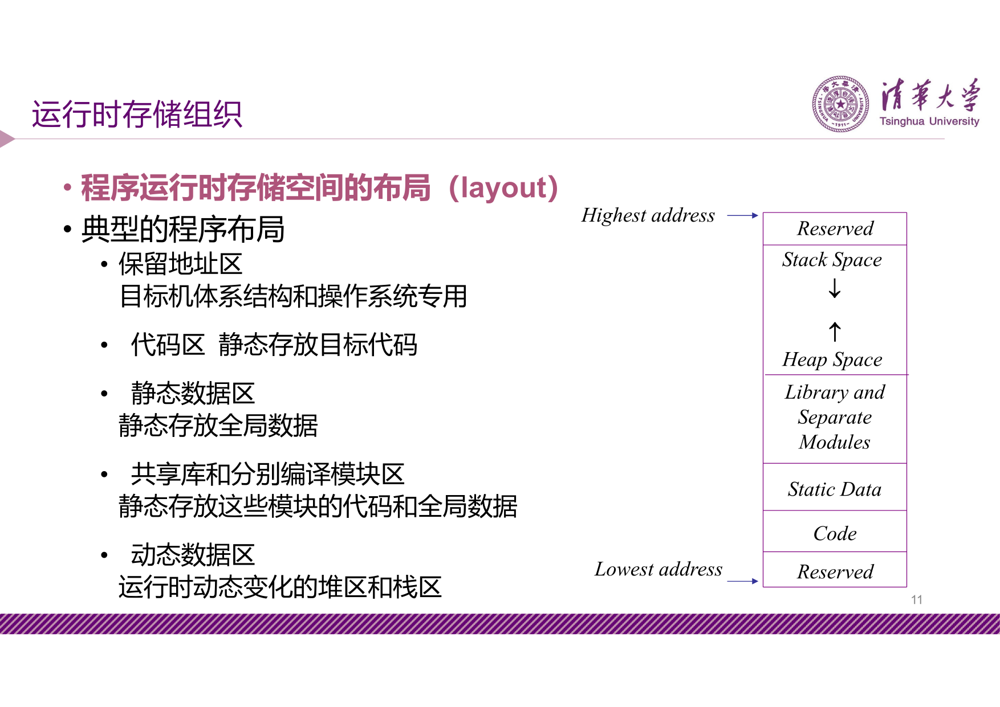

典型的程序虚地址空间布局（从低地址到高地址）：

1. **保留地址区**（Reserved）：目标机体系结构和操作系统专用
2. **代码区**（Code）：静态存放目标代码
3. **静态数据区**（Static Data）：静态存放全局数据
4. **共享库和分别编译模块区**（Library and Separate Modules）：静态存放这些模块的代码和全局数据
5. **动态数据区**：运行时动态变化的堆区（Heap Space）和栈区（Stack Space）
   - 栈向低地址增长（$\downarrow$）
   - 堆向高地址增长（$\uparrow$）

---

## 3 存储分配策略

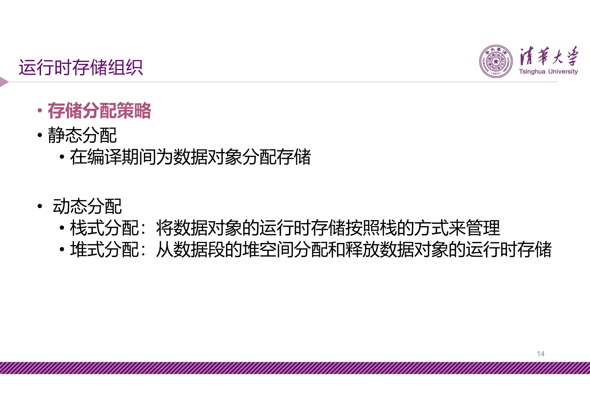

### 3.1 静态存储分配

!!! abstract "定义（静态存储分配）"

    在编译期间为数据对象分配存储，在编译期间就可确定数据对象的大小。

- 不宜处理递归过程或函数
- 某些语言中所有存储都是静态分配（如早期的 FORTRAN、COBOL）
- 多数语言只有部分存储进行静态分配：
  - 大小固定且在程序执行期间可全程访问的全局变量
  - 程序中的常量（literals）
  - 如 C++ 中的 `static` 变量

### 3.2 栈式存储分配

!!! abstract "定义（栈式存储分配）"

    将数据对象的运行时存储按照栈的方式来管理。

- 用于有效实现可动态嵌套的程序结构（如过程/函数、块层次结构）
- **可以实现递归过程/函数**（静态分配不宜实现递归）
- 运行栈中的数据单元是 **活动记录**（activation record）

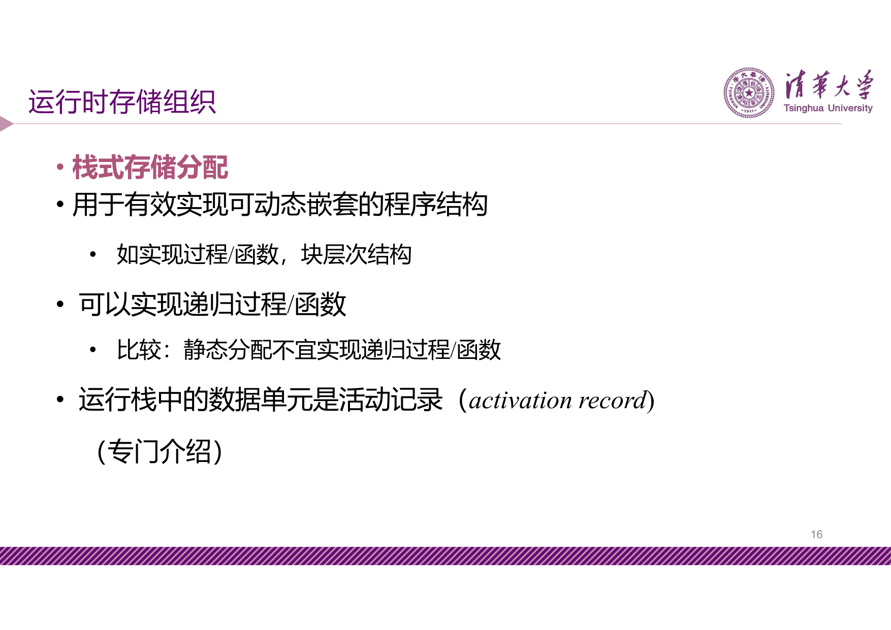

### 3.3 堆式存储分配

!!! abstract "定义（堆式存储分配）"

    从堆空间为数据对象分配/释放存储。灵活，数据对象的存储分配和释放不限时间和次序。

#### 分类

- **显式分配/释放**（explicit allocation/deallocation）：程序员负责堆存储空间管理
  - Pascal 中的 `new` / `dispose`，C++ 中的 `new` / `delete`
  - C 语言的 `malloc()` / `free()` 是标准库函数，由 library vendor 提供
- **隐式分配/释放**（implicit allocation/deallocation）：由编译器/运行时系统自动完成
  - 采用垃圾回收（garbage collection）机制
  - 如 Java 程序员不需要考虑对象的析构

#### 不释放堆空间的方法

只分配空间，不释放空间，空间耗尽时停止。适合于堆数据对象多数为一旦分配就永久使用的情形，或在虚存很大且无用数据对象不致带来很大零乱的情形。

#### 显式释放的危险：悬空指针

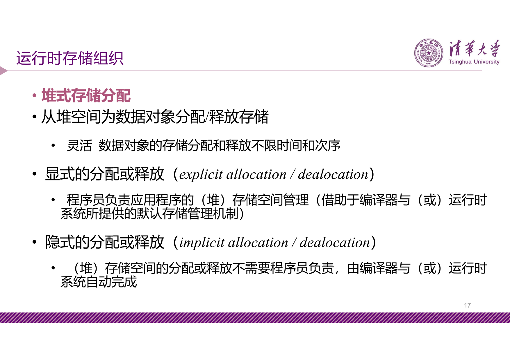

释放后继续使用指针会导致 **dangling pointer** 错误：

```pascal
var p, q: ^real;       // C++ 等价:
...                     // float *p, *q;
new(p);                 // p = new float;
q := p;                 // q = p;
dispose(p);             // delete p;
q^ := 1.0;              // *q = 1.0;  ← 危险！
```

#### 堆空间管理算法

- **分配算法**：面对多个可用的存储块，选择哪一个
  - 最佳适应算法（选择浪费最少的存储块）
  - 最先适应算法（选择最先找到的足够大的存储块）
  - 循环最先适应算法（起始点不同的最先适应算法）
- **碎片整理算法**：压缩合并小的存储块，使其更可用

---

## 4 活动记录

### 4.1 活动记录的概念

!!! abstract "定义（活动记录 Activation Record）"

    过程/函数每次被调用时在运行栈上分配的一块存储区域，用于存放该次激活所需的所有局部信息。活动记录也称为 **栈帧**（stack frame）。

某个数据对象的地址 = 活动记录起始地址 + 偏移地址（offset）

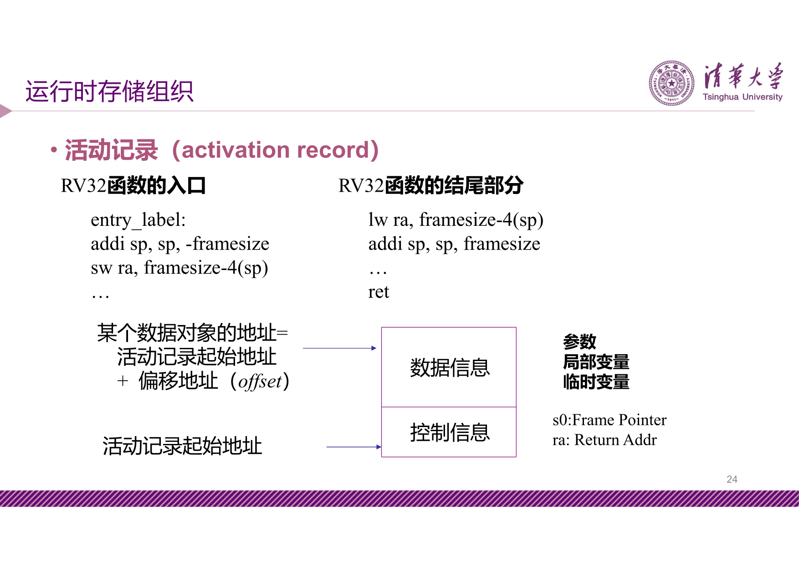

在 RISC-V32 中：
- `sp`（栈顶指针寄存器）指向栈顶
- `s0` / `fp`（帧指针寄存器）指向当前活动记录的基地址
- `ra` 保存返回地址

### 4.2 活动记录的栈式分配

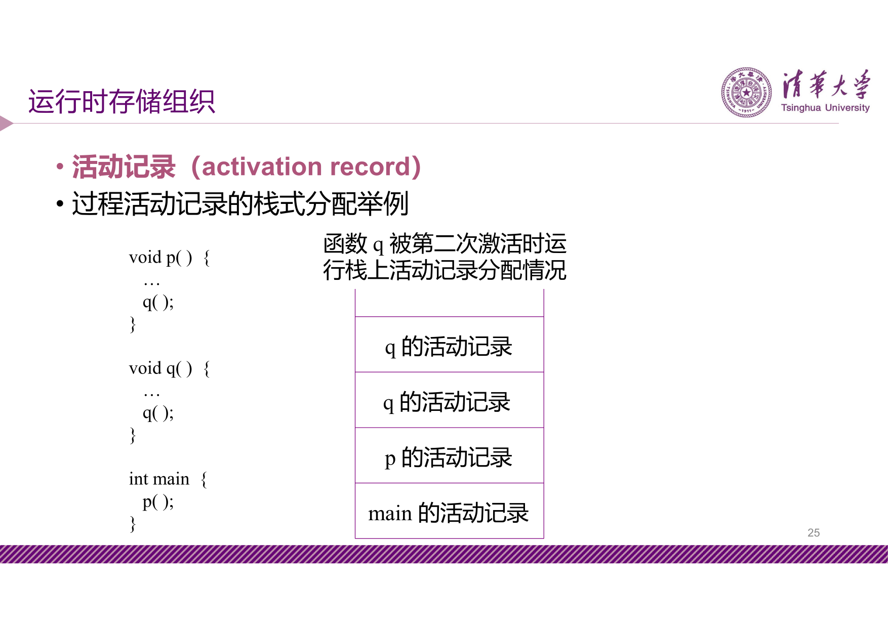

递归调用时，每次激活都会在栈上 push 一个新的活动记录，返回时 pop。

```
void p() { q(); }
void q() { q(); }   // 递归
int main { p(); }
```

运行栈从上到下：`q` 的 AR → `q` 的 AR → `p` 的 AR → `main` 的 AR

### 4.3 典型的活动记录结构

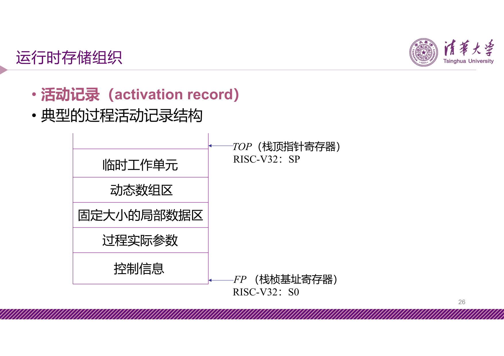

从栈顶（TOP / SP）到栈底（FP / S0）：

- 临时工作单元
- 动态数组区
- 固定大小的局部数据区
- 过程实际参数
- 控制信息（返回地址、旧 FP 等）

### 4.4 活动记录举例

#### 不含动态数组

```c
void p(int a) {
    float b;
    float c[10];
    b = c[a];
}
```

#### 含动态数组

```c
static int N;
void p(int a) {
    float b;
    float c[10];
    float d[N];   // 动态数组
    float e;
}
```

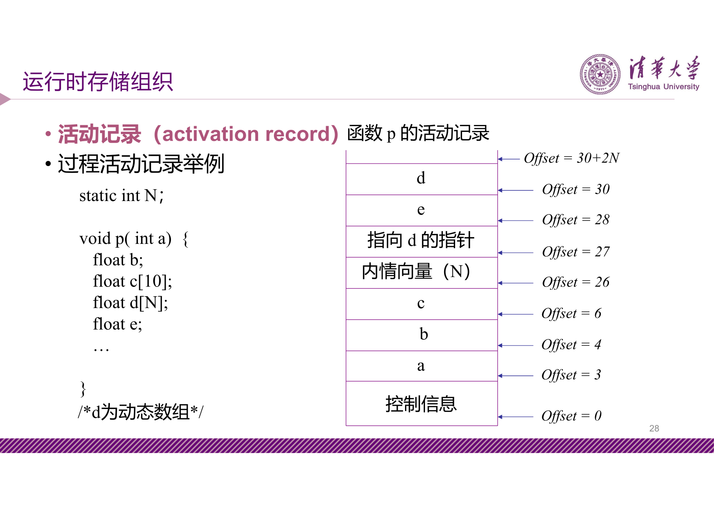

动态数组 `d` 在活动记录中需要额外的 **内情向量**（dope vector）记录其大小信息，且 `d` 的存储位置在固定大小部分之上。

### 4.5 嵌套过程语言的栈式分配

主要问题：解决对 **非局部量** 的引用（存取）。当过程嵌套定义时，内层过程可能访问外层过程声明的变量。

#### 方案一：Display 表

!!! abstract "定义（Display 表）"

    Display 表记录各嵌套层当前过程的活动记录在运行栈上的起始位置（基地址）。当前激活过程的层次为 $K$（主程序的层次设为 $0$），则对应的 Display 表含有 $K+1$ 个单元，依次存放着现行层、直接外层……直至最外层每一过程的最新活动记录的基地址。

嵌套作用域规则确保每一时刻 Display 表内容的唯一性。

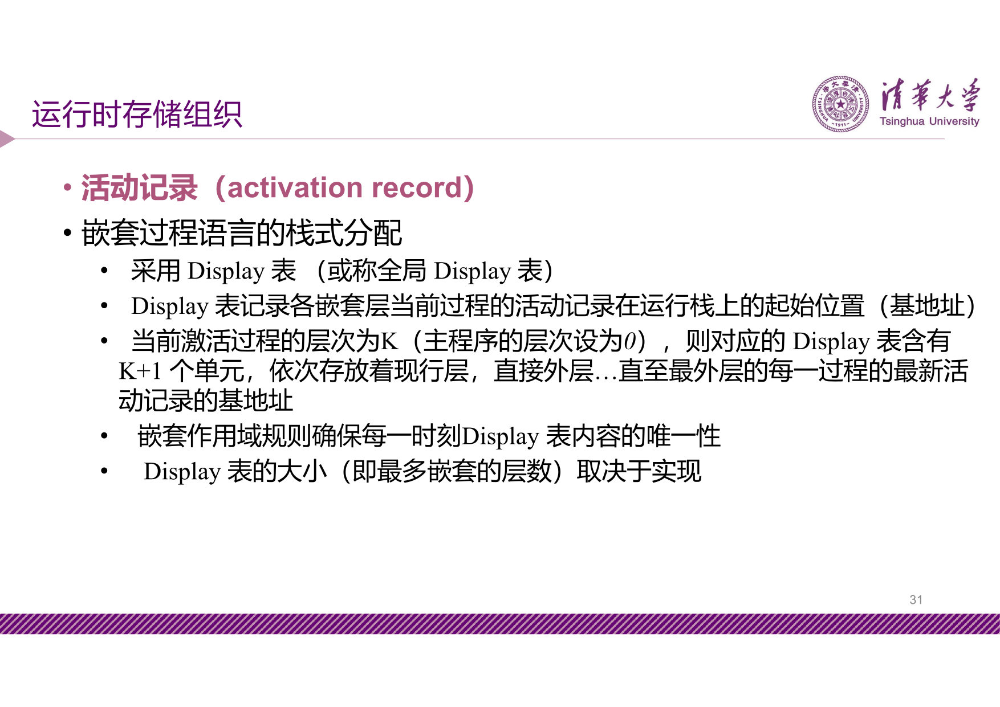

##### Display 表的维护

**方法一**：极端的方法是把整个 Display 表存入活动记录。若过程为第 $n$ 层，则需要保存 $D[0] \sim D[n]$。过程被调用时，从调用过程的 Display 表中自下向上抄录 $n$ 个 TOP 值，再加上本层的 TOP 值。

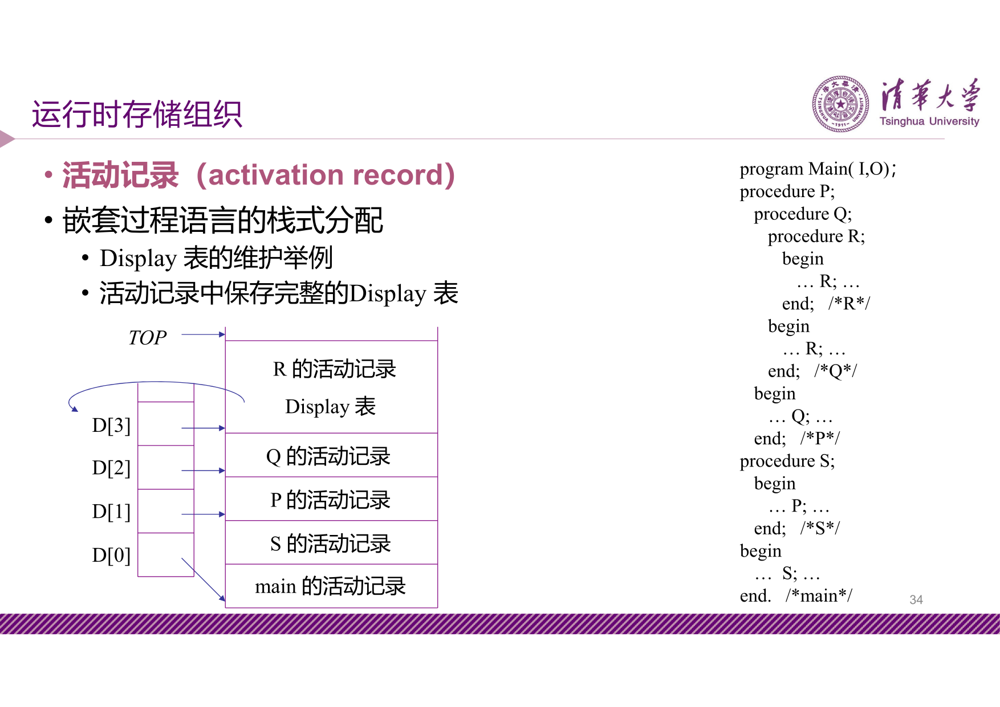

**方法二**：只在活动记录中保存一个 Display 表项，在静态存储区或专用寄存器中维护全局 Display 表。过程返回时，用活动记录中保存的旧表项恢复对应的 Display 表项。

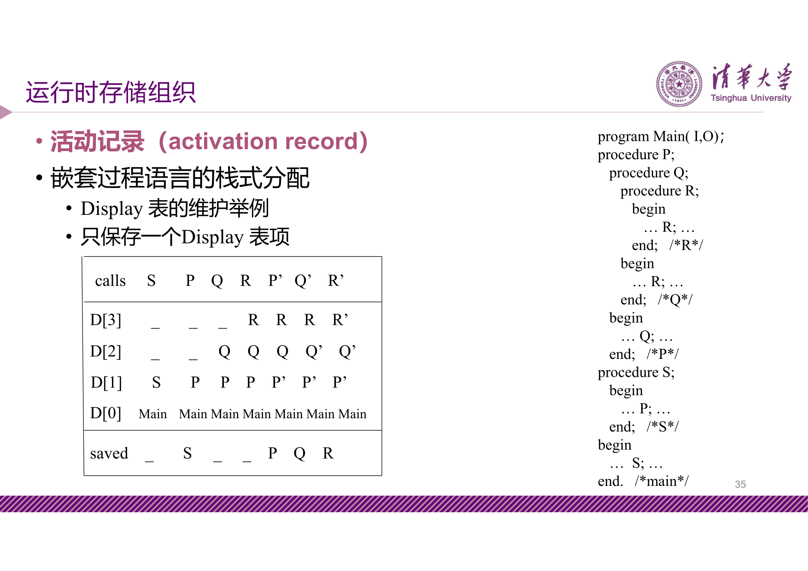

#### 方案二：静态链

!!! abstract "定义（静态链 Static Link）"

    所有活动记录都增加一个静态链域（如在 offset 为 0 处），指向定义该过程的直接外过程（或主程序）运行时最新的活动记录。用于访问非局部数据。

- Display 表的方法要用到多个存储单元或多个寄存器，静态链是一种替代方案
- 活动记录还需 **动态链**（Dynamic Link, DL）：指向调用该过程前的最新活动记录地址，用于过程返回时回卷（unwind）到调用过程的 AR

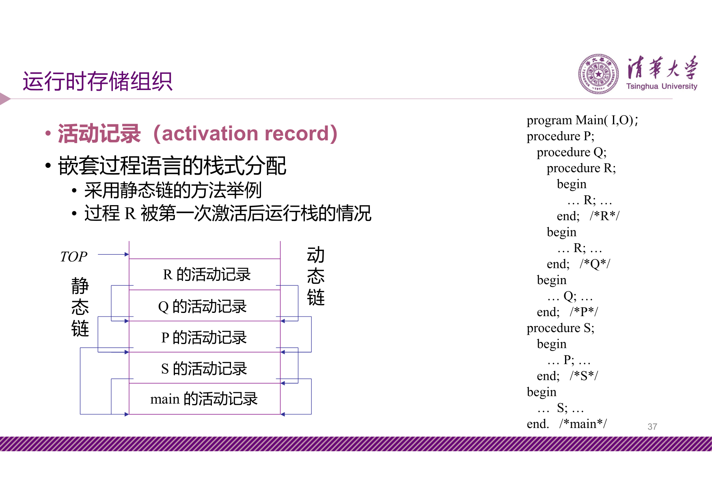

### 4.6 嵌套程序块的非局部量访问

一些语言（如 C 语言）支持嵌套的块，在块内部也允许声明局部变量。解决方法：

- **方法一**：将每个块看作为内嵌的无参过程，为它创建一个新的活动记录（块级活动记录），代价很高
- **方法二**：由于每个块中变量的相对位置在编译时就能确定，可以不创建块级活动记录，仅需过程级的活动记录

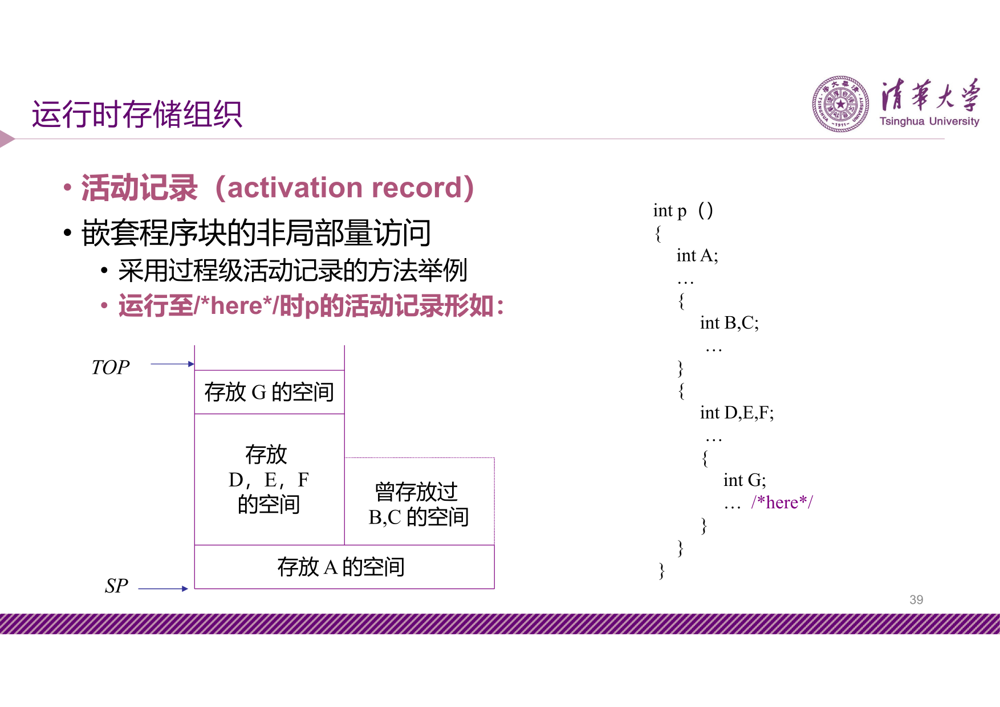

### 4.7 静态作用域 vs. 动态作用域

!!! abstract "定义（静态作用域 vs. 动态作用域）"

    - **静态作用域**（lexical/static scope）：名字的绑定由程序的词法结构决定，在编译时即可确定
    - **动态作用域**（dynamic scope）：名字的绑定由运行时的调用链决定，取决于最近的运行时绑定

```pascal
var r: real;

procedure show;
  begin write(r:5:3) end;

procedure small;
  var r: real;
  begin r := 0.125; show end;

begin
  r := 0.25;
  show; small;   // lexical: 0.250 0.250
                  // dynamic: 0.250 0.125
end.
```

静态作用域下 `show` 始终引用全局的 `r = 0.25`，动态作用域下 `small` 调用 `show` 时，`show` 看到的是最近的 `r` 绑定（`small` 中的 `r = 0.125`）。

---

## 5 过程调用与参数传递

### 5.1 活动记录中与调用相关的信息

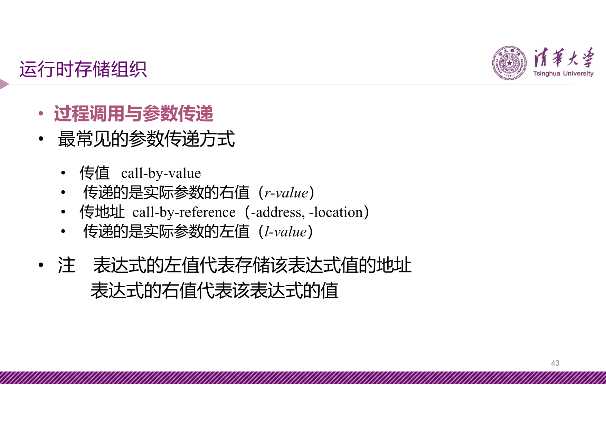

典型的活动记录（从高地址到低地址）：

- 动态数组区
- 固定大小的局部数据区
- 过程实际参数
- 寄存器保存区
- 调用程序返回地址
- 其他控制信息
- 返回值（仅适于函数）

过程调用由 **调用序列**（calling sequence）完成，包括调用前的准备（分配 AR、保存寄存器、传递参数）和返回后的清理。

### 5.2 参数传递方式

!!! abstract "定义（左值与右值）"

    - **左值**（l-value）：代表存储该表达式值的地址
    - **右值**（r-value）：代表该表达式的值

#### 传值调用（call-by-value）

传递的是实际参数的 **右值**。

- 形式参数当作过程的局部变量处理，在被调过程的活动记录中开辟形参的存储空间
- 调用过程计算实参的值，将其放于对应的存储空间
- 被调用过程执行时，就像使用局部变量一样使用这些形式单元

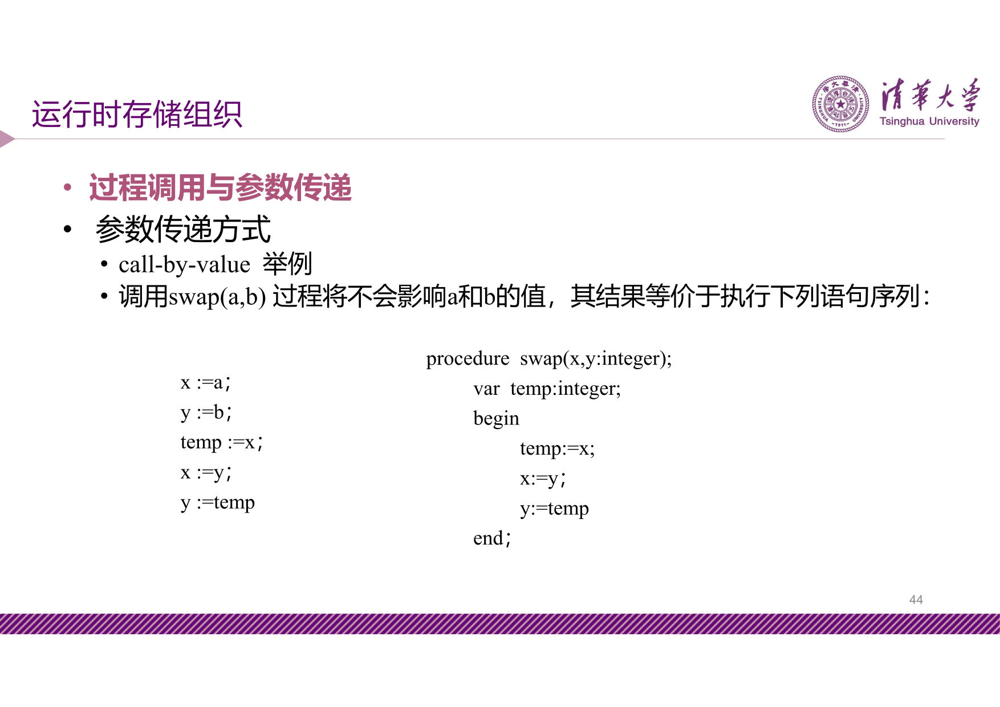

```pascal
procedure swap(x, y: integer);  // 传值
  var temp: integer;
  begin
    temp := x;
    x := y;
    y := temp
  end;
// swap(a, b) 不会影响 a 和 b 的值
```

#### 传地址调用（call-by-reference）

传递的是实际参数的 **左值**（地址）。

- 把实在参数的地址传递给相应的形参
- 若实在参数是一个名字或具有左值的表达式，则传递左值
- 若实在参数是无左值的表达式，则计算该表达式的值，放入一存储单元，传此存储单元地址

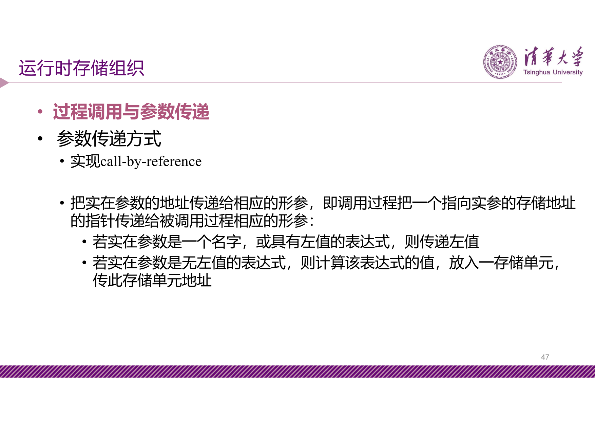

```pascal
procedure swap(var x, y: integer);  // 传地址
  var temp: integer;
  begin
    temp := x;
    x := y;
    y := temp
  end;
// swap(a, b) 会交换 a 和 b 的值
```

### 5.3 过程/函数参数（高阶函数）

#### 不含嵌套过程/函数声明

如 C 语言，任何过程/函数内部访问的非局部量只有全局量，可以将所有全局量分配在静态区。无论什么方式激活一个过程/函数，活动记录没有差异。

#### 包含嵌套过程/函数声明

需要闭包（closure）机制，记录函数代码及其定义时的环境。解决方案：使用带静态链的函数实参（call-by-closure）。

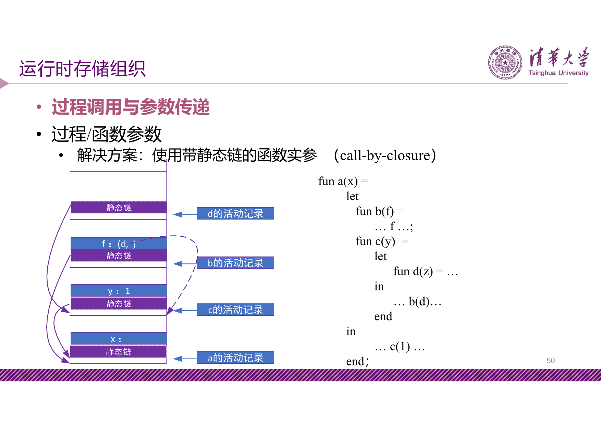

如 ML 程序中，`b(d)` 传递的不仅是函数 `d` 的代码，还包括 `d` 的静态链（指向其定义时的外层环境）。

---

## 6 垃圾回收（选讲）

### 6.1 垃圾回收机制

!!! abstract "定义（垃圾回收 Garbage Collection）"

    自动管理堆内存的机制，维护不变量：任何活跃的对象是可达的。更变程序（mutator）用于维护对象引用链的可达性。

核心问题：堆空间分配与堆空间释放。

### 6.2 垃圾回收算法分类

两大类方法：

1. **引用计数**（reference counting）：观察当前可达的对象是否转变为不可达的
2. **基于跟踪的垃圾回收**（trace-based garbage collection）：
   - 基本方法：标记-清除（mark-and-sweep）、拷贝回收（copying collection）
   - 短停顿方法：分代回收（generational collection）、增量回收（incremental collection）

### 6.3 引用计数

每个对象维护一个引用计数，记录有多少指针指向它。计数降为 $0$ 时回收。

- 优点：实时性好，回收操作分散在各次指针操作中
- 缺点：无法回收循环引用的数据结构；每次指针操作都需要更新计数，开销大

### 6.4 标记-清除（Mark-and-Sweep）

两阶段算法：

1. **标记阶段**：从根集（root set）出发，递归标记所有可达对象
2. **清除阶段**：扫描整个堆，回收所有未被标记的对象

- 优点：可以处理循环引用
- 缺点：需要扫描整个堆，stop-the-world 时间长；可能造成内存碎片

### 6.5 拷贝回收（Copying Collection）

将堆空间分为 from-space 和 to-space 两个半区。激活回收时，将 from-space 中所有可达对象拷贝至 to-space，紧凑排列，然后对调两个半区的角色。

- 优点：隐含地完成了碎片整理；分配极快（只需移动 free 指针）
- 缺点：浪费一半堆空间；长寿命对象会被反复拷贝

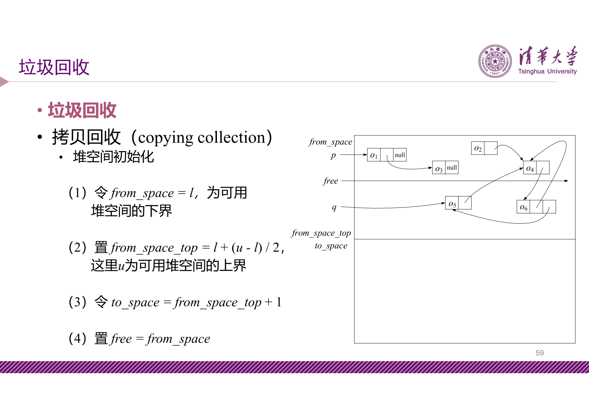
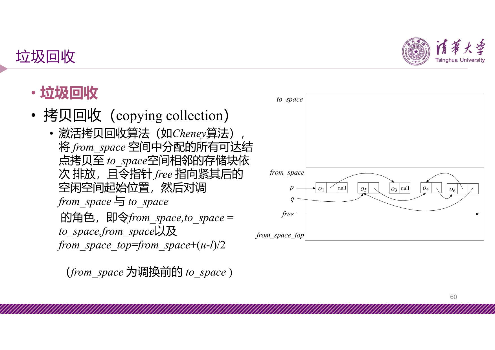
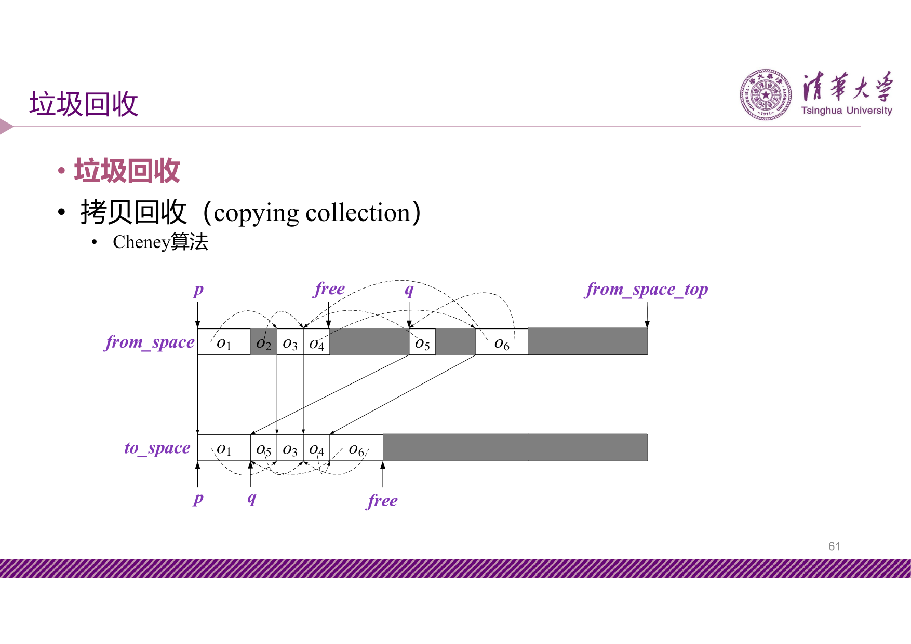

#### Cheney 算法

使用宽度优先的拷贝策略，不需要额外栈空间，在 to-space 中使用两个指针（scan 和 free）即可完成。

### 6.6 分代回收（Generational Collection）

核心思路：**优先回收年轻「短命」数据对象**（弱分代假说：大多数对象年轻时死去）。

- 堆空间被划分成多个「代」：$G_0, G_1, G_2, \ldots, G_n$
- 最年轻的对象分配在 $G_0$
- $G_0$ 空间不足时触发回收，存活的对象「提升」至 $G_1$
- $G_1$ 拥挤时启动对 $G_0$ 和 $G_1$ 的联合回收，依此类推

缺陷：「长寿」对象的回收代价相当昂贵。可与专注于「长寿」对象的列车算法（train algorithm）联用。

### 6.7 增量回收（Incremental Collection）

核心思路：

- 每一轮次仅回收部分垃圾，确保遗留的垃圾可在后面轮次中回收
- 满足实时性要求，每一轮次所遗留的漂流垃圾越少越好
- 关键技术：允许增量回收程序和更变程序交互或并发执行

**三色标记**（tricolor marking）方案：
- 白色：尚未访问的对象（潜在垃圾）
- 灰色：已访问但其引用的对象尚未全部访问
- 黑色：已访问且其引用的对象已全部访问

不变量：黑色对象不会直接引用白色对象，确保增量标记的正确性。

---

## 7 面向对象程序运行时组织（选讲）

### 7.1 类与对象的角色

- **类**：程序的静态定义，是一组运行时对象的共同性质的静态描述。特征成员包括 **属性**（attribute）和 **例程**（routine）
- **对象**：程序运行时的动态结构，是类的实例。在运行时按需创建，不是预先分配的

执行一个面向对象程序就是创建系统根类的一个实例，并调用该实例的创建过程。

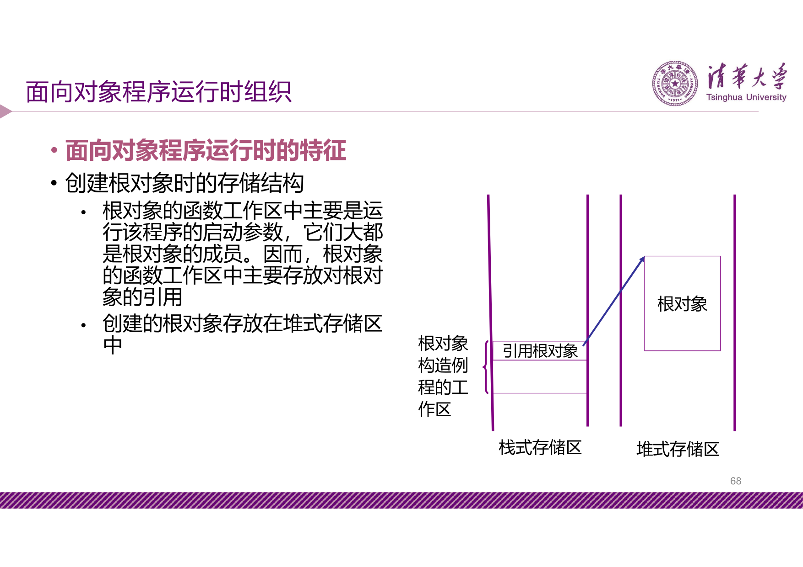

### 7.2 对象的存储组织

#### 方案一：直接复制

初始化代码将所有当前的继承特征（属性和例程）直接复制到对象存储区中（将例程当作代码指针）。**浪费空间**。

#### 方案二：类结构描述 + 对象指向类

在执行时将类结构的一个完整描述保存在每个类的存储中，由超类指针维护继承性（继承图）。每个对象保存一个指向其定义类的指针。

- 缺点：例程没有可预测的偏移量，必须由带有查询功能的符号表结构中的名字来维护。适合 Smalltalk 等强动态性语言。

#### 方案三：虚表（Vtable）

!!! abstract "定义（虚表 Vtable）"

    计算出每个类的可用例程的代码指针列表（例程索引表），使每个例程都有一个可预测的偏移量。每个对象包含属性变量 + 指向对应虚表的指针。

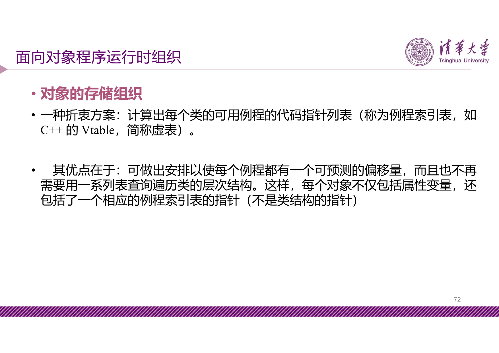

```java
class A      { int x; void f() {...} }
class B extends A { void g() {...} }
class C extends B { void g() {...} }
class D extends C { bool y; void f() {...} }
```

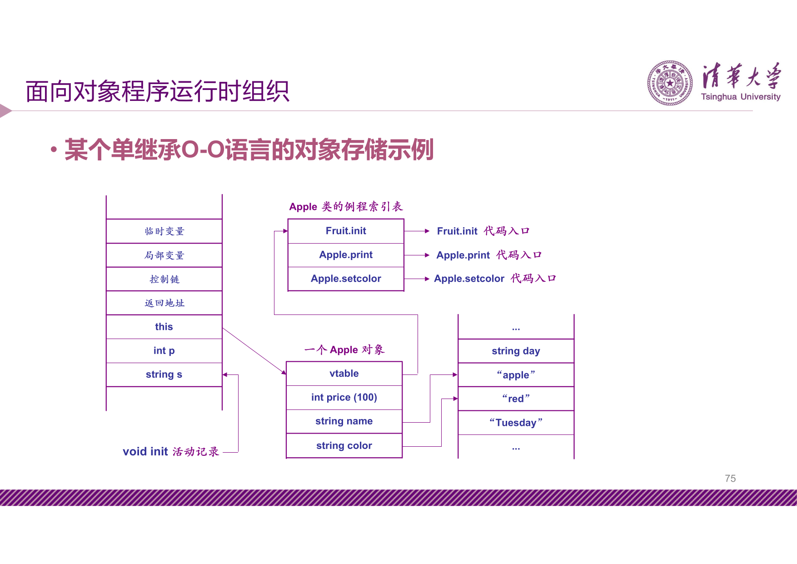

### 7.3 其他话题

- 类成员测试（Testing Class Membership）
- 对象的创建和撤消：构造函数和析构函数（执行次序）、垃圾回收
- 对象的操作：赋值、克隆、比较、持久存储
- 多重继承
- 例外处理（Exception Handling）

---

## 8 函数式程序运行时组织（选讲）

### 8.1 函数式程序的运行时特征

- 函数式语言（特别是纯函数式语言）所涉及的对象主体是数学对象，具有 **不可更变的**（immutable）性质，只能被定义（初始化）一次
- 纯函数式语言支持 **等式推理**
- 数学对象的增长速率一般会很快，需要高效的 **垃圾回收机制**
- 函数式语言中 **函数是一类对象**（高阶函数），函数本身可以作为其他函数的参数或返回值

### 8.2 闭包（Closure）

!!! abstract "定义（闭包 Closure）"

    函数代码及其求值环境的组合。函数对象的代码是函数对象的重要部分，函数对象的求值需要一个求值环境。核心技术之一是闭包的运行时存储组织。

### 8.3 逃逸变量

当嵌套函数作为返回值或参数传递时，其引用的外层局部变量需要「逃逸」到堆上。

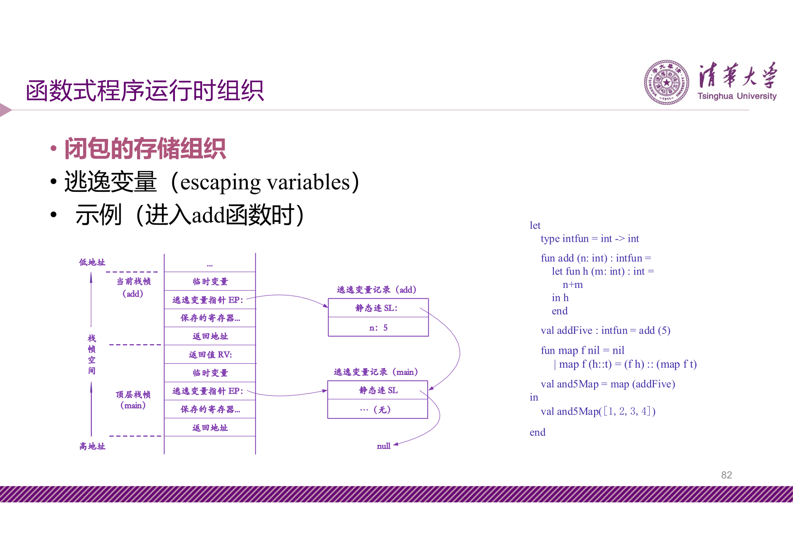

进入 `add` 函数时，参数 `n` 在 `add` 的栈帧中，逃逸变量记录（escaping variable record）通过逃逸变量指针 EP（Escaping Pointer）被引用。

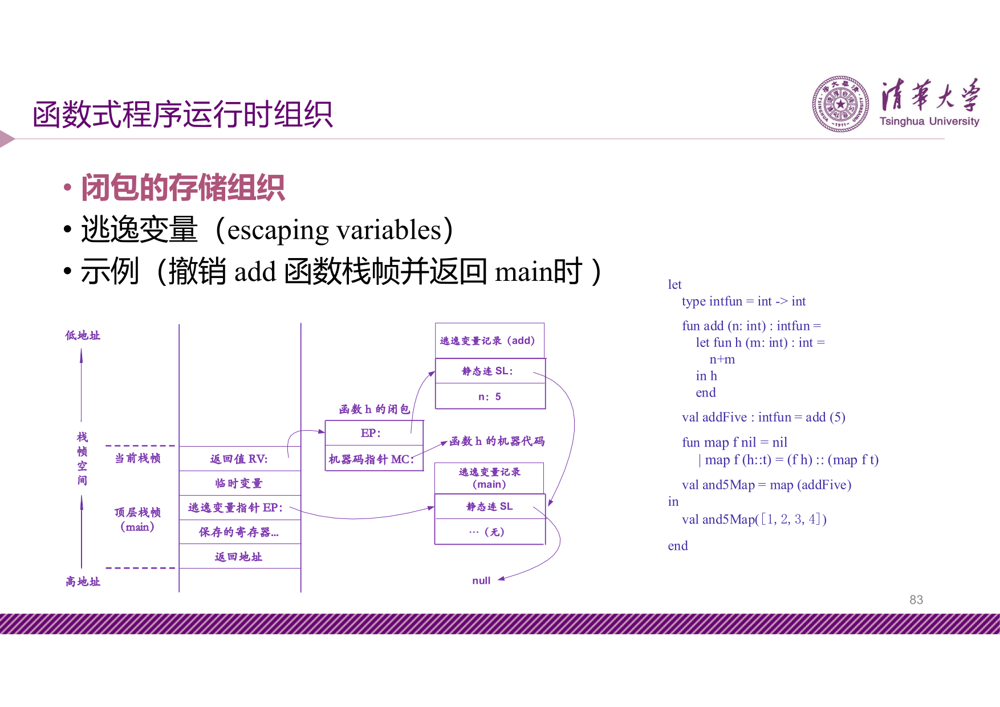

`add` 函数返回后，其栈帧被撤销，但逃逸变量记录保留在堆上。函数 `h` 的闭包包含：
- 机器码指针 MC：指向 `h` 的机器代码
- 逃逸变量记录指针 EP：指向捕获的变量 `n`

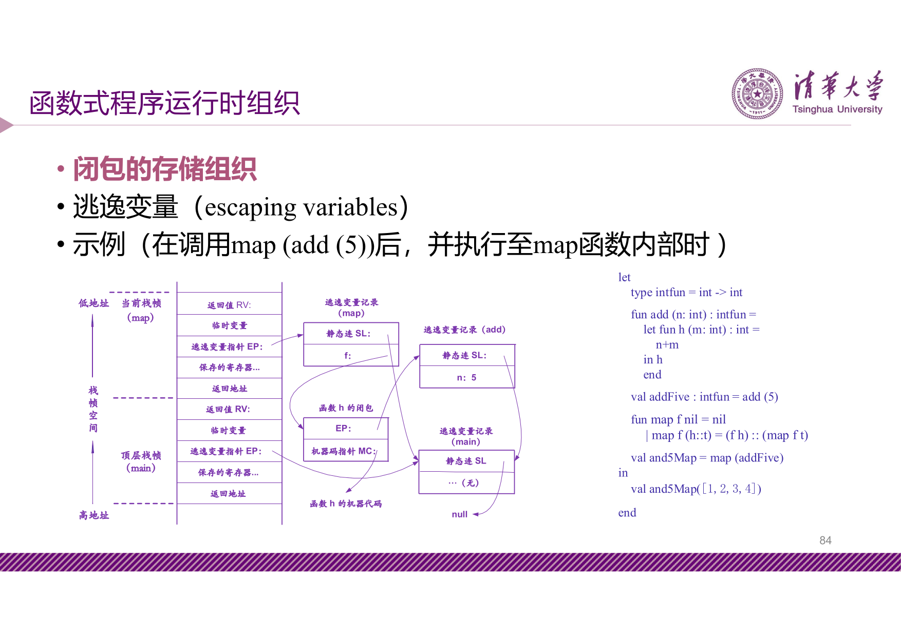

在 `map` 函数内部执行时，通过闭包调用 `h`，可以访问到逃逸变量记录中的 `n = 5`。

### 8.4 编译优化技巧

- **尾调用和尾递归**：简化活动记录的设计，优化调用代码序列
- **惰性求值**（lazy evaluation）：通过延迟求值支持函数的非严格定义，拓展等式推理。为避免延迟求值可能带来的重复计算，可借助创建和维护函数记忆簿（memoization），以存储代价换取优化性能

---

## 9 总结

| 存储分配策略 | 分配时机 | 特点 | 适用场景 |
| --- | --- | --- | --- |
| 静态分配 | 编译期 | 大小固定，不支持递归 | 全局变量、常量、FORTRAN |
| 栈式分配 | 运行时（LIFO） | 支持递归，自动回收 | 局部变量、过程调用 |
| 堆式分配 | 运行时（任意次序） | 灵活，需手动或 GC 回收 | 动态数据结构 |

| 嵌套过程非局部量访问方案 | 核心机制 | 优缺点 |
| --- | --- | --- |
| Display 表 | 全局表记录各嵌套层的当前 AR 基地址 | 访问快，但需维护 Display 表 |
| 静态链 | AR 中增加指向外层 AR 的指针 | 实现简单，但访问链较深时较慢 |

| 垃圾回收方法 | 核心思路 | 优缺点 |
| --- | --- | --- |
| 引用计数 | 维护每个对象的引用数 | 实时，但无法处理循环引用 |
| 标记-清除 | 标记可达对象后清除 | 可处理循环引用，但有 STW 暂停 |
| 拷贝回收 | 拷贝可达对象到另一半区 | 隐含碎片整理，但浪费一半空间 |
| 分代回收 | 优先回收年轻对象 | 效率高，但长寿对象回收贵 |
| 增量回收 | 分批回收，与 mutator 并发 | 减少暂停，但实现复杂 |
