<script>
  window.MathJax = {
    tex: {
      inlineMath: [["$", "$"], ["\\(", "\\)"]],
      displayMath: [["$$", "$$"], ["\\[", "\\]"]],
      processEscapes: true,
      processEnvironments: true,
      tags: "none"
    },
    options: {
      ignoreHtmlClass: "no-mathjax",
      processHtmlClass: "arithmatex"
    },
    svg: { fontCache: "global" }
  };
</script>
<script async src="https://cdn.jsdelivr.net/npm/mathjax@3/es5/tex-mml-chtml.js"></script>
<script>
  (function () {
    function typeset() {
      if (window.MathJax && window.MathJax.typesetPromise) {
        window.MathJax.typesetPromise();
      }
    }
    if (typeof document$ !== "undefined" && document$.subscribe) {
      document$.subscribe(typeset);
    } else if (document.readyState === "loading") {
      document.addEventListener("DOMContentLoaded", typeset);
    } else {
      typeset();
    }
  })();
</script>

# 静态语义分析（类型检查、作用域分析）与中间代码（TAC、AST/DAG/SSA）生成，包括借助翻译模式实现类型检查、声明/数组/表达式/布尔表达式/控制流的翻译、拉链与代码回填技术。

## 1 概述

### 1.1 编译前端到中端

静态语义分析与中间代码生成处于编译流程的 **前端尾部** 与 **中端首段**，承接 [语法分析](../%E8%87%AA%E9%A1%B6%E5%90%91%E4%B8%8B%E8%AF%AD%E6%B3%95%E5%88%86%E6%9E%90/)/[自底向上语法分析](../%E8%87%AA%E5%BA%95%E5%90%91%E4%B8%8A%E8%AF%AD%E6%B3%95%E5%88%86%E6%9E%90/) 产生的语法树，并通过 [符号表](../%E7%AC%A6%E5%8F%B7%E8%A1%A8/) 协同完成类型与作用域信息的建立。

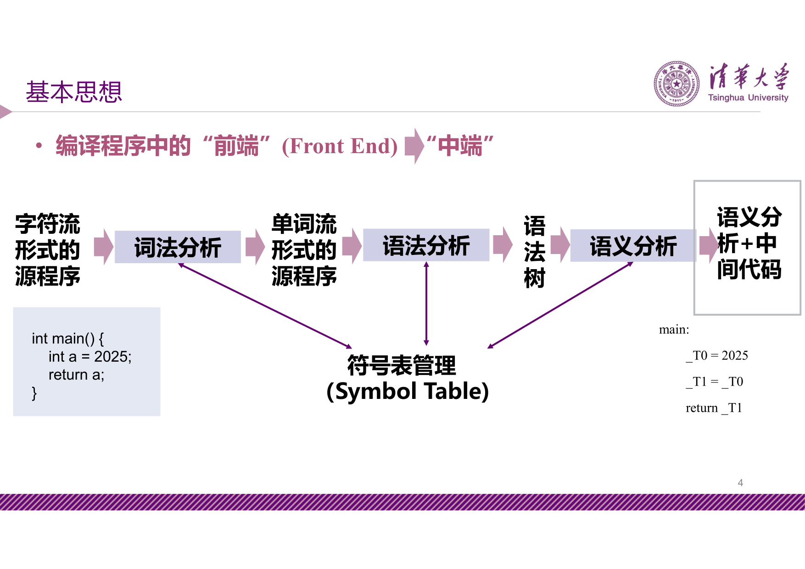

典型编译过程的阶段划分如下：

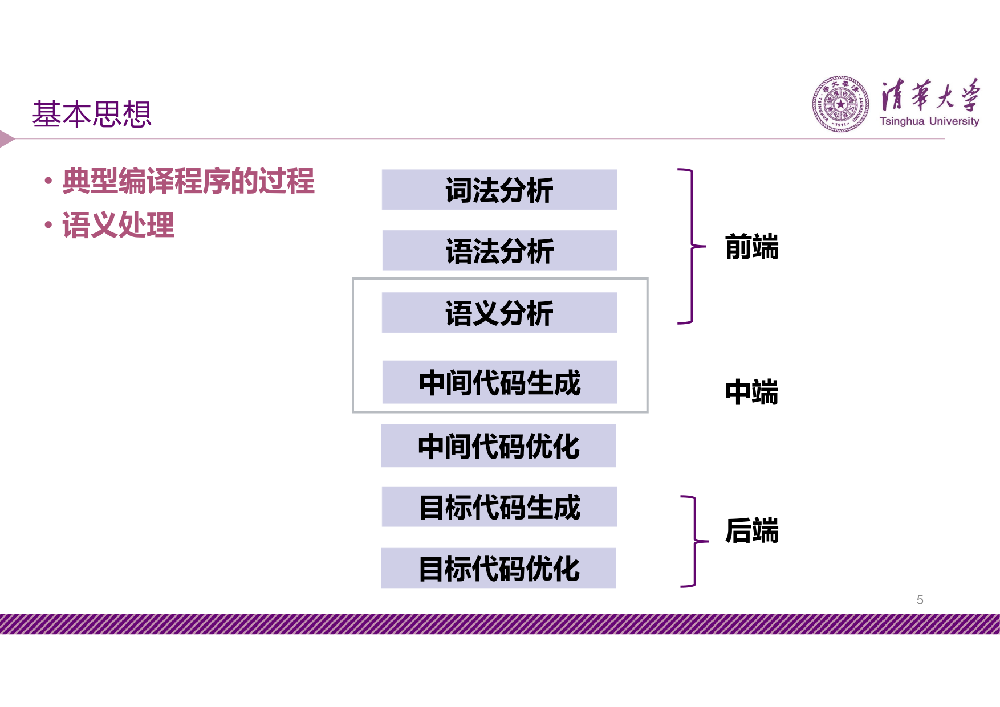

!!! info "本讲在编译流程中的位置"

    静态语义分析属于 **前端最后一步**（语义检查与信息收集），中间代码生成属于 **中端起点**（生成与目标无关的中间表示），二者通过 **翻译模式（translation scheme）** 共同实现，可看作 [语法制导翻译](../%E8%AF%AD%E6%B3%95%E5%88%B6%E5%AF%BC%E7%9A%84%E8%AF%AD%E4%B9%89%E8%AE%A1%E7%AE%97%E5%9F%BA%E7%A1%80/) 的具体应用。

### 1.2 重要数据结构：符号表

详见 [符号表](../%E7%AC%A6%E5%8F%B7%E8%A1%A8/)。这里只强调符号表在静态语义分析中的角色：

- 名字信息（种类、类型、偏移地址、占用空间等）由 **声明的语义动作** 写入
- 引用名字时通过 **查表** 获取类型，用于类型检查与中间代码生成
- 符号表的组织（栈式 / 嵌套）体现 **作用域规则**

### 1.3 范例语言：类 MiniDecaf 抽象语法

后续所有翻译模式均以下面这个简化的小语言为基础：

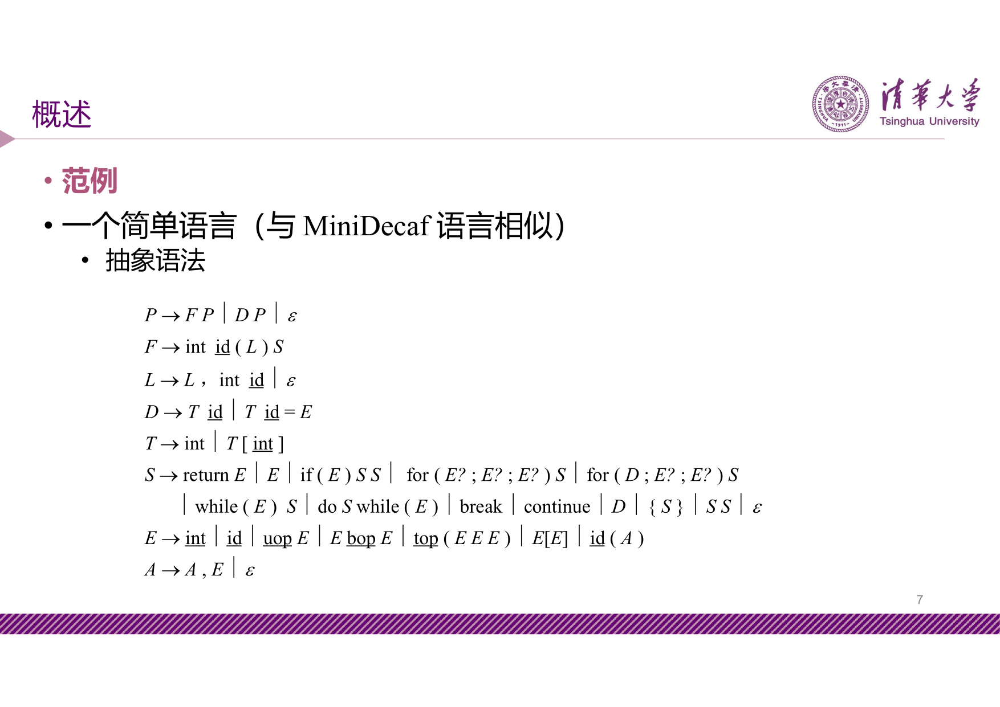

!!! tip "阅读约定"

    $D$ 表示声明，$T$ 表示类型构造，$F$ 表示函数定义，$L$ 表示形参列表，$E$ 表示表达式，$S$ 表示语句，$A$ 表示实参列表，$P$ 表示程序。元变量 $l \in \{\text{in}, \text{out}\}$ 用来表示当前是否在循环体中（影响 break/continue 的合法性）。

### 1.4 总体方法：借助翻译模式描述实现算法

静态语义分析与中间代码生成都通过为产生式附加 **语义动作** 来实现：

$$
S \to \text{while }(E)\ \{ S_1.inloop := 1 \}\ S_1\ \{ S.type := \text{if } E.type = int \text{ then } S_1.type \text{ else } type\_error \}
$$

这种翻译模式可以 **直接对应到递归下降的类型检查器 / 中间代码生成器** 的伪代码实现。

---

## 2 静态语义分析

### 2.1 与语义分析相关的工作

!!! abstract "定义 2.1（静态/动态语义检查）"

    编译期间所进行的语义检查为 **静态语义检查**；所生成代码在运行期间进行的语义检查为 **动态语义检查**。

静态语义分析的工作主要分两类：

- **静态语义检查**（编译期完成）
- **收集语义信息**（为代码生成等后续阶段服务）

### 2.2 静态语义检查的种类

!!! info "静态语义检查的常见种类"

    这是程序合法性检查的最后阶段，主要包含：

    - **静态类型检查**（type checks）：每个操作是否遵守类型系统
    - **作用域分析**（scope）：建立名字的定义和使用之间的联系
    - **控制流检查**（flow-of-control checks）：例如 break 必须有合法循环包围
    - **唯一性检查**（uniqueness checks）：例如枚举元素不能重复
    - **名字的上下文相关性检查**（name-related checks）：某些名字的多次出现间应满足上下文相关性

### 2.3 类型检查与类型系统

!!! abstract "定义 2.2（类型检查程序）"

    类型检查程序（type checker）负责类型检查，主要功能为：

    - 验证语言结构是否匹配上下文所期望的类型
    - 为相关阶段搜集及建立必要的类型信息
    - 实现某个 **类型系统**（type system）

类型系统由四个范畴构成：

- **语法范畴**：定义合法的程序单元
- **语义范畴**：定义类型表达式
- **类型环境**：定义标识符作用域并维护变量类型
- **类型规则**：为程序单元定义类型表达式

#### 2.3.1 类型表达式（面向类 MiniDecaf）

!!! abstract "定义 2.3（类型表达式）"

    类型表达式包括：

    - **基本类型表达式**：$int$
    - **数组类型表达式**：$array(\tau)$，其中 $\tau$ 是基本/数组类型
    - **函数类型表达式**：$fun(n)$，$n \ge 0$ 表示参数个数（在类 MiniDecaf 中参数与返回值都为 $int$）
    - $type\_error$：专用于有类型错误的程序单元
    - $ok$：专用于无类型错误的程序单元

#### 2.3.2 类型环境

!!! abstract "定义 2.4（类型环境）"

    类型环境是一个从程序部分标识符集到类型表达式集合的函数 $\Gamma$，用于记录某上下文中标识符被赋予的类型表达式。

记号约定：

- 设类型环境为 $\Gamma$，$[\underline{id} \mapsto t]$ 表示对类型环境的更新
- $\Gamma[\underline{id} \mapsto t]$ 表示以 $\mathrm{dom}(\Gamma) \cup \{\underline{id}\}$ 为定义域的类型环境
- 含义：对任意 $x \in \mathrm{dom}(\Gamma) \cup \{\underline{id}\}$，若 $\underline{id} = x$ 则结果为 $t$，否则为 $\Gamma(x)$

!!! info "Update 函数"

    定义特殊函数 $\mathrm{Update}(\Gamma, s)$：返回对 $\Gamma$ 更新了语句序列 $s$ **最外层作用域** 所有声明后所得的类型环境。即若 $s$ 最外层声明了类型为 $t_1$ 的变量 $\underline{id}_1$、$\dots$、类型为 $t_n$ 的变量 $\underline{id}_n$，则

    $$
    \mathrm{Update}(\Gamma, s) = \Gamma[\underline{id}_1 \mapsto t_1][\underline{id}_2 \mapsto t_2] \dots [\underline{id}_n \mapsto t_n]
    $$

#### 2.3.3 类型规则（断言形式）

引入三种 **断言（judgements）** 形式：

$$
\begin{aligned}
& \vdash t : A \quad &&\text{(类型声明 } t \text{ 的类型为 } A\text{)} \\
& \Gamma \vdash e : A \quad &&\text{(在 } \Gamma \text{ 下表达式 } e \text{ 的类型为 } A\text{)} \\
& \Gamma \vdash_l s : A \quad &&\text{(在 } \Gamma \text{ 与循环上下文 } l \text{ 下语句序列 } s \text{ 的类型为 } A\text{)}
\end{aligned}
$$

其中 $l \in \{\text{in}, \text{out}\}$。

???+ example "例 2.1：表达式类型规则"

    $$
    \dfrac{}{\Gamma \vdash \text{int} : int}\ (\text{E-int})
    \qquad
    \dfrac{\Gamma(\underline{id}) = \tau,\ \tau \text{ is int, array or function type}}{\Gamma \vdash \underline{id} : \tau}\ (\text{E-id})
    $$

    $$
    \dfrac{\Gamma \vdash e_1 : int \quad \Gamma \vdash e_2 : int}{\Gamma \vdash e_1\ \text{bop}\ e_2 : int}\ (\text{E-bop})
    \qquad
    \dfrac{\Gamma \vdash e_1 : array(\tau) \quad \Gamma \vdash e_2 : int}{\Gamma \vdash e_1[e_2] : \tau}\ (\text{E-access})
    $$

    $$
    \dfrac{\Gamma \vdash \underline{id} : fun(n) \quad \Gamma \vdash e_1 : int \quad \dots \quad \Gamma \vdash e_n : int}{\Gamma \vdash \underline{id}(e_1, e_2, \dots, e_n) : int}\ (\text{E-call})
    $$

???+ example "例 2.2：语句类型规则"

    $$
    \dfrac{\Gamma \vdash e : int \quad \Gamma \vdash_l s_1 : ok \quad \Gamma \vdash_l s_2 : ok}{\Gamma \vdash_l \text{if}(e)\ s_1\ s_2 : ok}\ (\text{S-if})
    \qquad
    \dfrac{\Gamma \vdash e : int \quad \Gamma \vdash_{in} s : ok}{\Gamma \vdash_l \text{while}(e)\ s : ok}\ (\text{S-while})
    $$

    $$
    \dfrac{}{\Gamma \vdash_{in} \text{break} : ok}\ (\text{S-break})
    \qquad
    \dfrac{\Gamma \vdash e : int}{\Gamma \vdash_l \text{return}\ e : ok}\ (\text{S-return})
    $$

    $$
    \dfrac{\Gamma \vdash_l s_1 : ok \quad \mathrm{Update}(\Gamma, s_1) \vdash_l s_2 : ok}{\Gamma \vdash_l s_1\ s_2 : ok}\ (\text{S-S})
    $$

???+ example "例 2.3：类型构造与函数定义"

    $$
    \dfrac{}{\vdash \text{int} : int}\ (\text{T-int})
    \qquad
    \dfrac{\vdash t : \tau \quad \underline{int} > 0}{\vdash t[\underline{int}] : array(\tau)}\ (\text{E-array})
    $$

    $$
    \dfrac{\Gamma[\underline{id} \mapsto fun(n)][\underline{id}_1 \mapsto int]\dots[\underline{id}_n \mapsto int] \vdash_{out} s : ok}{\Gamma \vdash \text{int}\ \underline{id}(\text{int}\ \underline{id}_1, \dots, \text{int}\ \underline{id}_n)\ s : int}\ (\text{F-def})
    $$

#### 2.3.4 类型系统的相关话题

!!! info "类型系统的延伸话题"

    仅作了解，本讲不深入展开：

    - **类型等价**（equivalence）：结构等价、名字等价、合一算法
    - **类型推导**（inference）：静态/动态类型推导
    - **子类型**（subtyping）：类型转换、兼容、多态、重载
    - **类型合理性/可靠性**（Soundness）：类型良定（well-typed）的程序是行为安全的

### 2.4 借助翻译模式实现类型检查

!!! tip "实现策略"

    将类型表达式作为 **属性值** 赋给程序的各个部分；通过 **设计恰当的翻译模式**，即可实现相应语言的类型系统。

#### 2.4.1 处理声明的翻译模式

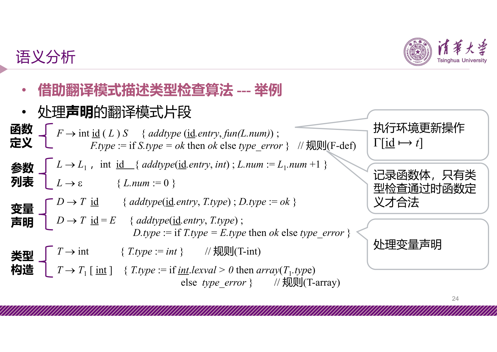

关键动作：

- $addtype(\underline{id}.entry, \tau)$：在符号表中为 $\underline{id}$ 登记类型 $\tau$（执行环境更新 $\Gamma[\underline{id} \mapsto t]$）
- $F$ 的合法性：函数体类型检查通过（$S.type = ok$）则 $F.type := ok$，否则 $type\_error$
- 数组规则要求 $\underline{int}.lexval > 0$，否则 $type\_error$（对应 E-array 规则）

???+ example "例 2.4：声明类型错误"

    代码：

    ```c
    int y = 1.5;
    int a[0];
    ```

    报错：

    - `int y = 1.5;` 触发 (T-int) 错误（赋值类型不匹配，由规则 $D \to T\ \underline{id} = E$ 中 $T.type \ne E.type$ 触发 $type\_error$）
    - `int a[0];` 触发 (T-array) 错误（数组长度必须 > 0）

???+ example "例 2.5：函数定义错误"

    代码：

    ```c
    int main() {
        int x = 10;
        return "hello";
    }
    ```

    报错：触发 (F-def) 错误，因为函数体语句序列类型不为 $ok$（return 语句要求表达式类型为 $int$）。

#### 2.4.2 处理表达式的翻译模式

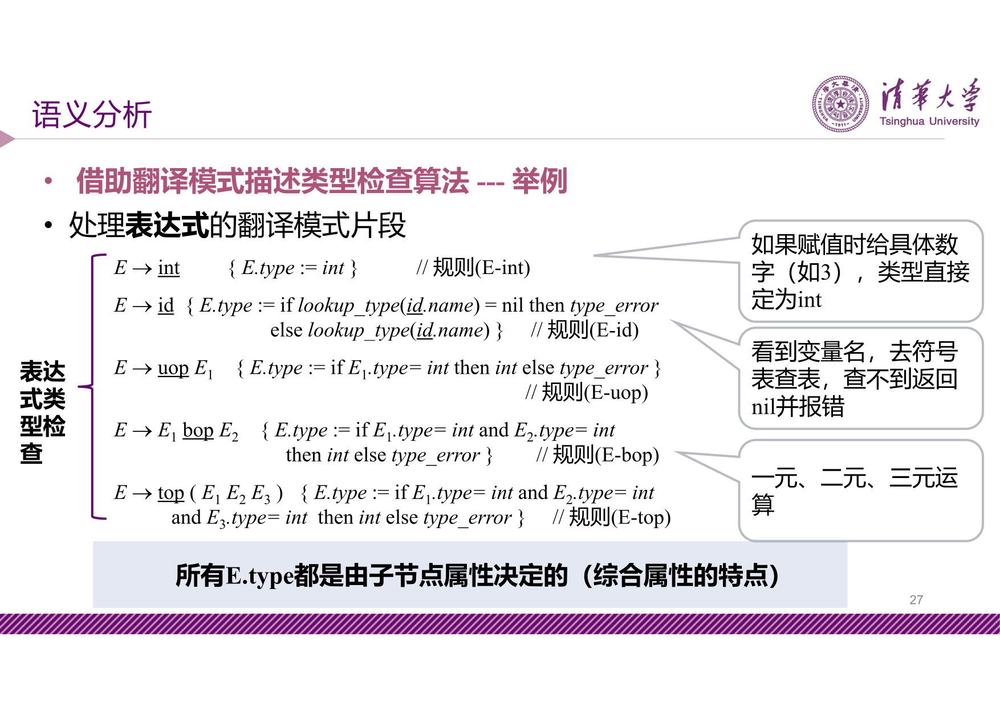

!!! tip "综合属性的特点"

    所有 $E.type$ 都是由 **子节点属性** 决定的——这正是 **综合属性（synthesized attribute）** 的典型特征，因此可在自底向上分析（如 LR）中自然地完成。

补充规则（数组访问、函数调用、参数列表）：

$$
\begin{aligned}
E &\to E_1[E_2] \quad \{ E.type := \text{if } E_2.type = int \text{ and } E_1.type = array(\tau) \text{ then } \tau \text{ else } type\_error \} \\
E &\to \underline{id}(A) \quad \{ E.type := \text{if } lookup\_type(\underline{id}.name) = fun(n) \text{ and } A.type = ok \text{ and } A.num = n \\
&\qquad\qquad\qquad\quad \text{then } int \text{ else } type\_error \} \\
A &\to A_1, E \quad \{ A.type := \text{if } A_1.type = ok \text{ and } E.type = int \text{ then } ok \text{ else } type\_error;\ A.num := A_1.num + 1 \} \\
A &\to \varepsilon \quad \{ A.type := ok;\ A.num := 0 \}
\end{aligned}
$$

???+ example "例 2.6：表达式访问错误"

    代码：

    ```c
    int a[10];
    int x = a[1.5];
    int y = a["index"];
    ```

    都会触发 (E-access) 错误：下标必须是 $int$。

#### 2.4.3 处理语句的翻译模式

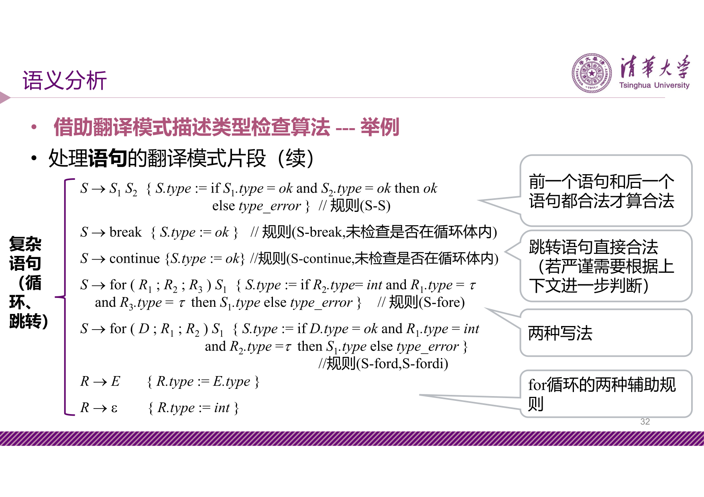

!!! warning "break/continue 的检查"

    上图中的 (S-break)、(S-continue) 直接置为 $ok$，**未检查是否在循环体内**。要更严格，需要 **继承属性 inloop** 来传递上下文信息。

#### 2.4.4 引入 inloop 继承属性

!!! abstract "定义 2.5（inloop 继承属性）"

    增加 inloop 是一个 **继承属性**：在循环结构中将 inloop 置为 1，沿语法树向下传播；break/continue 检查 inloop = 1 才合法。

修改后的关键产生式：

$$
\begin{aligned}
F &\to \text{int}\ \underline{id}(L)\ \{ S.inloop := 0 \}\ S \quad \{ \dots \} \\
S &\to \text{while}(E)\ \{ S_1.inloop := 1 \}\ S_1 \quad \{ \dots \} \\
S &\to \text{if}(E)\ \{ S_1.inloop := S.inloop \}\ S_1\ \{ S_2.inloop := S.inloop \}\ S_2 \quad \{ \dots \} \\
S &\to \text{break} \quad \{ S.type := \text{if } S.inloop = 1 \text{ then } ok \text{ else } type\_error \} \\
S &\to \text{continue} \quad \{ S.type := \text{if } S.inloop = 1 \text{ then } ok \text{ else } type\_error \}
\end{aligned}
$$

### 2.5 作用域分析

!!! info "静态作用域 vs 动态作用域"


    - **静态作用域**：通过 [符号表](../%E7%AC%A6%E5%8F%B7%E8%A1%A8/) 实现（参见 [符号表](../%E7%AC%A6%E5%8F%B7%E8%A1%A8/) 一讲）
    - **动态作用域**：通过运行时活动记录实现（参见后续运行环境一讲）

---

## 3 中间代码生成

### 3.1 中间代码的作用与形式

!!! abstract "定义 3.1（中间代码 Intermediate Code）"

    源程序的不同表示形式，作为 **源语言与目标语言之间的桥梁**。

作用：

- 避开源/目标之间较大的语义跨度，使编译程序逻辑结构更简单明确
- 利于编译程序的 **重定向**（同一前端 + 不同后端）
- 利于进行 **与目标机无关的优化**

#### 3.1.1 常见中间代码形式

!!! info "五种常见中间代码"


    - **AST**（Abstract Syntax Tree，抽象语法树）
    - **TAC**（Three-Address Code，三地址码 / 四元式）
    - **P-code**（特别用于 Pascal 语言实现）
    - **Bytecode**（Java 编译器的输出，JVM 的输入）
    - **SSA**（Static Single Assignment Form，静态单赋值形式）

#### 3.1.2 同一表达式的多种表示

以 $A + B \times (C - D) + E / (C - D)^N$ 为例。

**TAC 表示**（三地址码）：

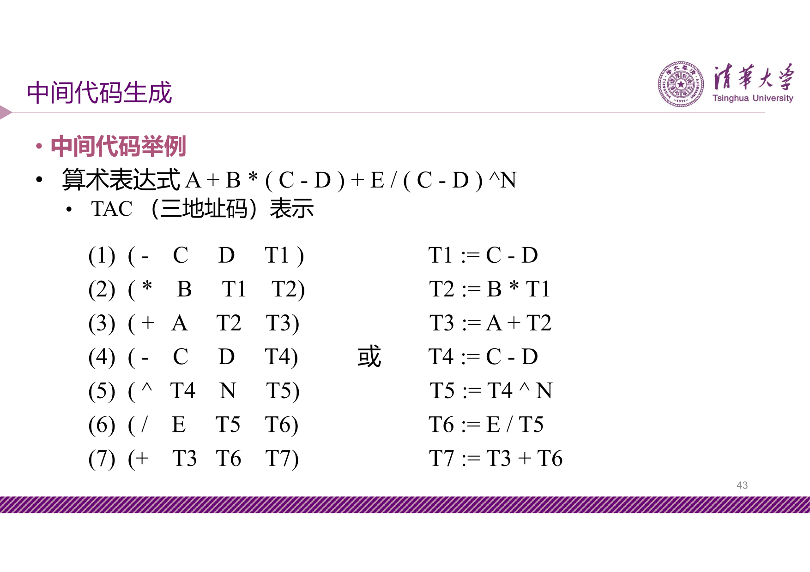

**AST 表示**：

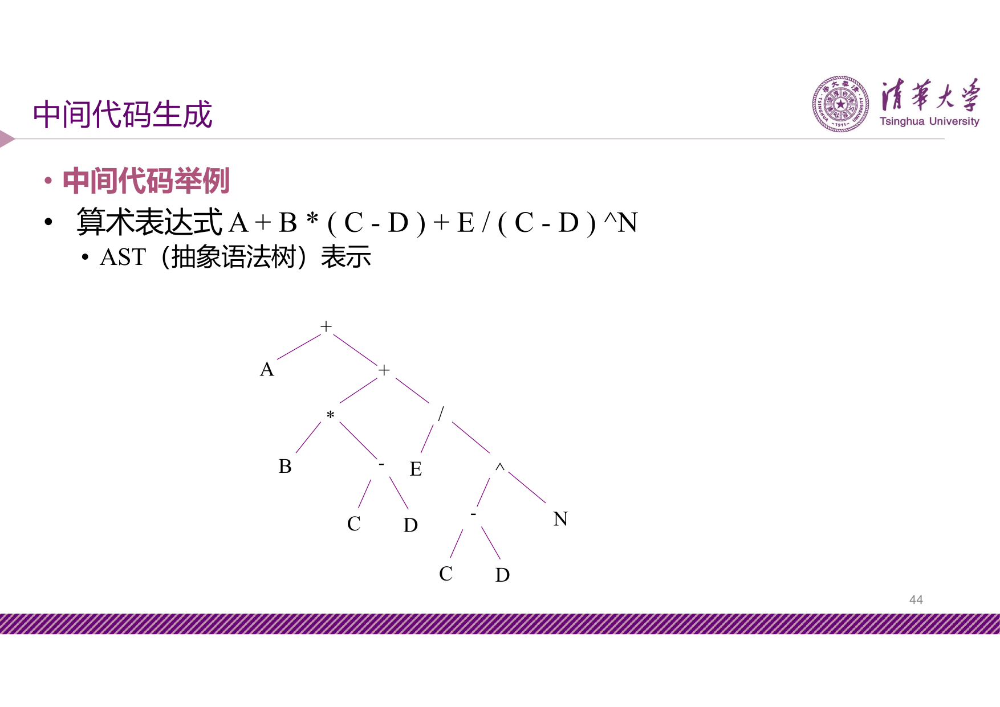

**DAG 表示**（有向无圈图，改进型 AST，可共享公共子表达式）：

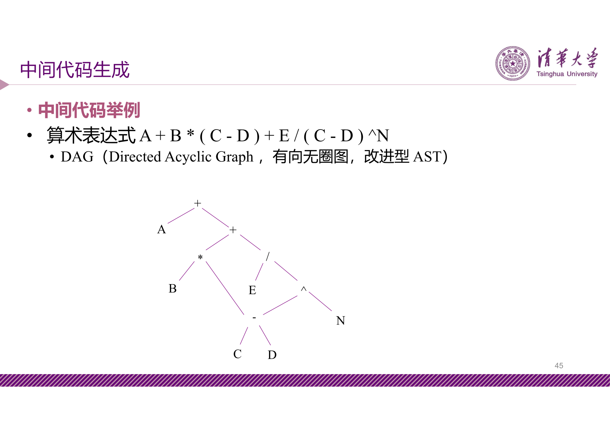

**SSA 形式**（每个变量只赋值一次，控制流汇合处用 $\varphi$ 函数）：

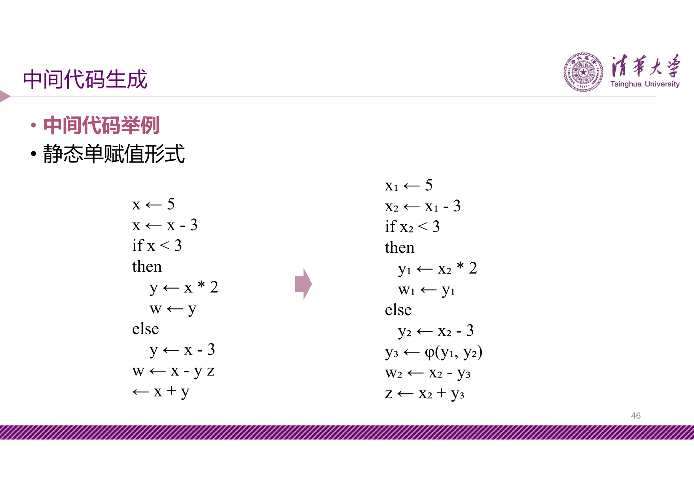

!!! tip "SSA 的关键"

    SSA 中每个变量在 **整个程序中只被赋值一次**，控制流合并处用 $\varphi(y_1, y_2)$ 表示「若来自 then 分支取 $y_1$，否则取 $y_2$」。这极大方便了后续的数据流分析与优化。

### 3.2 语法制导生成 AST

中间代码生成可借助 [语法制导](../%E8%AF%AD%E6%B3%95%E5%88%B6%E5%AF%BC%E7%9A%84%E8%AF%AD%E4%B9%89%E8%AE%A1%E7%AE%97%E5%9F%BA%E7%A1%80/) 方法（如 yacc）。AST 构造的核心动作是 $mknode$（构造内部结点）和 $mkleaf$（构造叶结点）：

$$
\begin{aligned}
S &\to \underline{id} = E &&\{ S.ptr := mknode(\text{`assign'}, mkleaf(\underline{id}.entry), E.ptr) \} \\
S &\to \text{if } E \text{ then } S_1 &&\{ S.ptr := mknode(\text{`if\_then'}, E.ptr, S_1.ptr) \} \\
S &\to \text{while } E \text{ do } S_1 &&\{ S.ptr := mknode(\text{`while\_do'}, E.ptr, S_1.ptr) \} \\
S &\to S_1\ S_2 &&\{ S.ptr := mknode(\text{`seq'}, S_1.ptr, S_2.ptr) \} \\
E &\to \underline{id} &&\{ E.ptr := mkleaf(\underline{id}.entry) \} \\
E &\to E_1 + E_2 &&\{ E.ptr := mknode(\text{`+'}, E_1.ptr, E_2.ptr) \} \\
E &\to E_1 \ast E_2 &&\{ E.ptr := mknode(\text{`*'}, E_1.ptr, E_2.ptr) \}
\end{aligned}
$$

### 3.3 三地址码 TAC

!!! abstract "定义 3.2（三地址码 TAC）"

    TAC 是顺序的语句序列，每条语句一般具有形式 $x := y\ op\ z$，其中 $op$ 为操作符，$y$、$z$ 为操作数，$x$ 为结果。

#### 3.3.1 课程后续用到的 TAC 语句类型

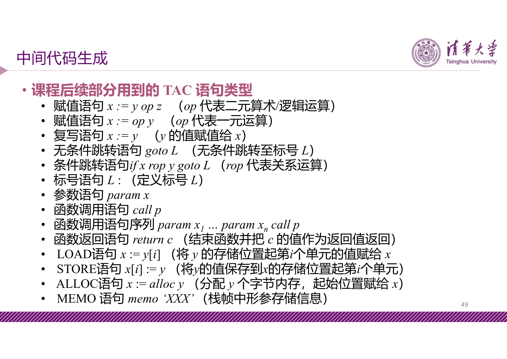

完整列表：

- 赋值语句：$x := y\ op\ z$（二元）、$x := op\ y$（一元）
- 复写语句：$x := y$
- 无条件跳转：$\text{goto}\ L$
- 条件跳转：$\text{if}\ x\ \text{rop}\ y\ \text{goto}\ L$
- 标号语句：$L:$
- 参数语句：$\text{param}\ x$；函数调用：$\text{call}\ p$
- 函数返回：$\text{return}\ c$
- LOAD：$x := y[i]$；STORE：$x[i] := y$
- ALLOC：$x := alloc\ y$；MEMO：$\text{memo}\ \text{`XXX'}$（栈帧形参存储信息）

### 3.4 声明语句的翻译

#### 3.4.1 全局声明：offset 与 width

```text
Prog → { P.offset := 0 } P
P → { F.offset := 0 } F { P_1.offset := P.offset } P_1 { P.width := P_1.width }
P → { D.offset := P.offset } D { P_1.offset := P.offset + D.width } P_1
    { P.width := D.width + P_1.width }
P → ε  { P.width := 0 }
D → T id   { enter(id.name, D.offset); D.width := T.width }
D → T id = E { enter(id.name, D.offset); D.width := T.width }
T → int    { T.width := 4 }
T → T_1 [int]  { T.width := int.lexval × T_1.width }
```

!!! tip "offset 与 width 的属性类型"


    - **offset**：继承属性，表示在内存中的起始地址偏移
    - **width**：综合属性，表示占用内存字节数

    基础整数类型占 4 字节；数组总宽度 = 元素个数 ($\underline{int}.lexval$) × 单个元素宽度 ($T_1.width$)。

#### 3.4.2 局部声明：每函数独立计算偏移

每个函数独立计算局部偏移，$enter$ 表示在 **局部符号表** 中登记相应的偏移信息：

```text
F → int id ( { L.offset := F.offset } L ) { S.offset := F.offset + L.width } S
L → { L_1.offset := L.offset } L_1 , int id
    { enter(id.name, L.offset + L_1.width); L.width := L_1.width + 4 }
L → ε  { L.width := 0 }
S → if (E) { S_1.offset := S.offset } S_1
    { S_2.offset := S.offset } S_2 { S.width := 0 }
S → while (E) { S_1.offset := S.offset } S_1 { S.width := 0 }
S → for (D; R_1; R_2) { S_1.offset := S.offset + D.width } S_1 { S.width := 0 }
S → '{' { S_1.offset := S.offset } S_1 '}' { S.width := 0 }
```

注意 $S.width$ 通常置 0（控制流语句本身不占新空间），仅 $S \to D$ 沿用 $D.width$。

### 3.5 数组的翻译

#### 3.5.1 数组的内情向量（dove vector）

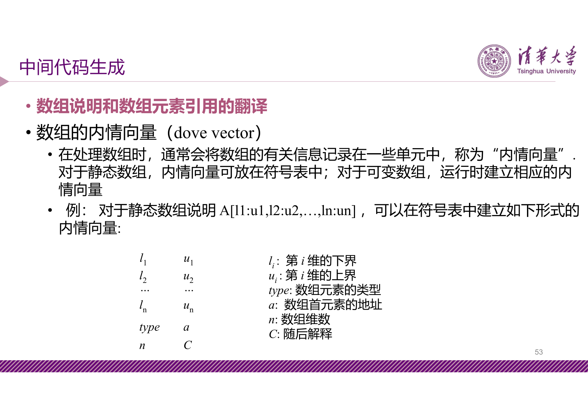

!!! abstract "定义 3.3（内情向量 dove vector）"

    处理数组时将数组的相关信息记录在一些单元中，称为 **内情向量**。

    - 静态数组：内情向量放在符号表中
    - 可变数组：运行时建立内情向量

    内情向量字段：$l_i, u_i$（第 $i$ 维下/上界）、$type$（元素类型）、$a$（首元素地址）、$n$（数组维数）、$C$（地址计算辅助常量）。

#### 3.5.2 数组元素的地址计算

对静态数组 $A[l_1:u_1, l_2:u_2, \dots, l_n:u_n]$，行优先连续布局，元素 $A[i_1, i_2, \dots, i_n]$ 的地址：

$$
\begin{aligned}
D &= a + (i_1 - l_1)(u_2 - l_2)(u_3 - l_3)\dots(u_n - l_n) \\
&\quad + (i_2 - l_2)(u_3 - l_3)\dots(u_n - l_n) \\
&\quad + \dots + (i_{n-1} - l_{n-1})(u_n - l_n) + (i_n - l_n)
\end{aligned}
$$

整理得 $D = a - C + V$，其中：

$$
\begin{aligned}
C &= (\dots(l_1(u_2 - l_2) + l_2)(u_3 - l_3) + l_3)(u_4 - l_4) + \dots + l_{n-1})(u_n - l_n) + l_n \\
V &= (\dots((i_1(u_2 - l_2) + i_2)(u_3 - l_3) + i_3)(u_4 - l_4) + \dots + i_{n-1})(u_n - l_n) + i_n
\end{aligned}
$$

!!! tip "拆分思路"

    $C$ 仅依赖 **下界 $l_i$ 与维大小**，**编译期可算**，存入内情向量；$V$ 依赖 **运行时下标 $i_j$**，运行时计算。

#### 3.5.3 数组声明与元素引用的 TAC 生成

```text
D → T id  { x := newtemp; y := newtemp;
            if T.type = int then D.code := ε
            else D.code := gen(y ':=' D.offset) ||
                           gen(x ':=' 'alloc' T.width) ||
                           gen(y'[' '0' ']' ':=' x) ||
                           gen(y'[' '1' ']' ':=' T.width) }

D → T id = E  { x := newtemp; y := newtemp;
                if T.type = int then D.code := E.code || gen(id.place ':=' E.place)
                else D.code := E.code || gen(y ':=' D.offset) ||
                               gen(y'[' '0' ']' ':=' E.place) ||
                               gen(y'[' '1' ']' ':=' T.width) }

E → E_1[E_2]  { E.place := newtemp;
                E.code := E_1.code || E_2.code ||
                          gen(E.place ':=' E_1.place '[' E_2.place ']') }
```

### 3.6 表达式的翻译

#### 3.6.1 语义属性与函数

!!! info "表达式翻译用到的属性与函数"

    **语义属性：**

    - $\underline{id}.place$：$\underline{id}$ 对应的存储位置
    - $E.place$：用来存放 $E$ 的值的存储位置
    - $E.code$、$A.code$：相应的 TAC 语句序列

    **语义函数/过程：**

    - $gen$：生成一条 TAC 语句
    - $newtemp$：新建未用过的名字，返回存储位置
    - $newlabel$：返回一个新的语句标号
    - $\|$：TAC 语句序列之间的链接运算
    - $A.arglist$：实参地址列表；$makelist$、$append$ 用于维护列表

#### 3.6.2 翻译模式

$$
\begin{aligned}
E &\to \underline{int} &&\{ E.place := newtemp;\ E.code := gen(E.place \text{ `:=' } \underline{int}.val) \} \\
E &\to \underline{id} &&\{ E.place := \underline{id}.place;\ E.code := \text{""} \} \\
E &\to \underline{uop}\ E_1 &&\{ E.place := newtemp;\ E.code := E_1.code\ \|\ gen(E.place \text{ `:=' } \underline{uop}.op\ E_1.place) \} \\
E &\to E_1\ \underline{bop}\ E_2 &&\{ E.place := newtemp;\ E.code := E_1.code\ \|\ E_2.code \\
&&&\quad \|\ gen(E.place \text{ `:=' } E_1.place\ \underline{bop}.op\ E_2.place) \}
\end{aligned}
$$

三元运算（如条件运算 $E_1 ? E_2 : E_3$）：

$$
\begin{aligned}
E &\to \underline{top}(E_1\ E_2\ E_3) \quad \{ E.place := newtemp;\ L := newlabel;\ M := newlabel; \\
&\quad E.code := E_1.code\ \|\ gen(\text{`if'}\ E_1.place \text{ `<=' '0' 'goto'}\ L)\ \| \\
&\quad E_2.code\ \|\ gen(E.place \text{ `:=' } E_2.place)\ \|\ gen(\text{`goto'}\ M) \\
&\quad \|\ gen(L \text{ `:'})\ \|\ E_3.code\ \|\ gen(E.place \text{ `:=' } E_3.place)\ \|\ gen(M \text{ `:'}) \}
\end{aligned}
$$

#### 3.6.3 函数调用

$$
\begin{aligned}
E &\to \underline{id}(A) \quad \{ E.code := A.code; \\
&\quad \textbf{for } d \in A.arglist \textbf{ do }\ E.code := E.code\ \|\ gen(\text{`param'}\ d); \\
&\quad E.code := E.code\ \|\ gen(\text{`call'}\ \underline{id}.place) \} \\
A &\to A_1, E \quad \{ A.n := A_1.n + 1;\ A.arglist := append(A_1.arglist, makelist(E.place));\ A.code := A_1.code\ \|\ E.code \} \\
A &\to \varepsilon \quad \{ A.n := 0;\ A.arglist := \text{""};\ A.code := \text{""} \}
\end{aligned}
$$

???+ example "例 3.1：函数调用 a = foo(x, y)"

    处理完参数生成的代码：

    ```text
    param x
    param y
    call foo.place
    ```

    处理完赋值语句：`a := t1`（$t_1$ 是临时变量，存放调用结果）。

### 3.7 布尔表达式的翻译

#### 3.7.1 两种翻译策略

!!! info "布尔表达式的两条路线"


    1. **直接对布尔表达式求值**：用 1 表示 true、0 表示 false，类似算术表达式那样求值
    2. **通过控制流体现布尔表达式语义**：通过转移到程序中的某个位置来表示求值结果。**优点**：方便实现控制流语句中布尔表达式翻译；常可以得到 **短路代码**（short-circuit），避免不必要求值

#### 3.7.2 直接求值方式

$$
\begin{aligned}
E &\to E_1 \vee E_2 &&\{ E.place := newtemp;\ E.code := E_1.code\ \|\ E_2.code\ \|\ gen(E.place \text{ `:=' } E_1.place \text{ `or' } E_2.place) \} \\
E &\to E_1 \wedge E_2 &&\{ E.place := newtemp;\ E.code := E_1.code\ \|\ E_2.code\ \|\ gen(E.place \text{ `:=' } E_1.place \text{ `and' } E_2.place) \} \\
E &\to \neg E_1 &&\{ E.place := newtemp;\ E.code := E_1.code\ \|\ gen(E.place \text{ `:=' `not' } E_1.place) \} \\
E &\to \underline{id}_1\ \underline{rop}\ \underline{id}_2 &&\{ E.place := newtemp; \\
&&&\quad E.code := gen(\text{`if'}\ \underline{id}_1.place\ \underline{rop}.op\ \underline{id}_2.place\ \text{`goto' } nextstat+3) \\
&&&\qquad \|\ gen(E.place \text{ `:=' `0'})\ \|\ gen(\text{`goto'}\ nextstat+2)\ \|\ gen(E.place \text{ `:=' `1'}) \}
\end{aligned}
$$

!!! info "nextstat"

    $nextstat$ 返回输出代码序列中下一条 TAC 语句的下标。

???+ example "例 3.2：a = x < y 的直接求值"


    源代码 `int x = 0; int y = 1; a = x < y;`，按 $E \to \underline{id}_1\ \underline{rop}\ \underline{id}_2$ 规则翻译：

    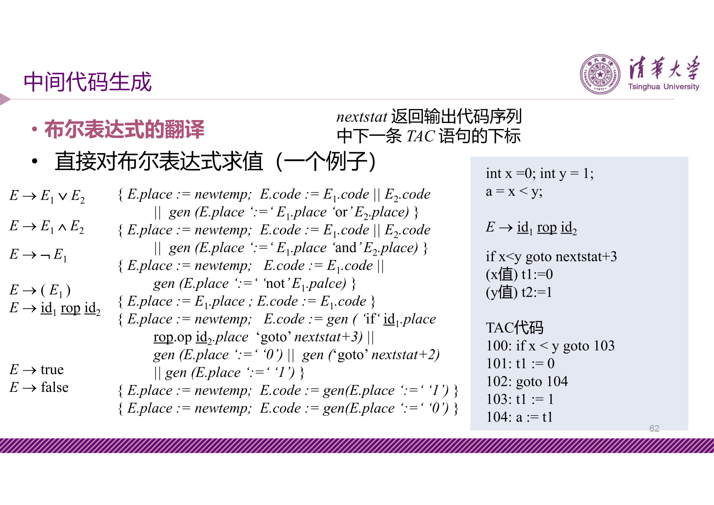

    生成的 TAC：

    ```text
    100: if x < y goto 103
    101: t1 := 0
    102: goto 104
    103: t1 := 1
    104: a := t1
    ```

#### 3.7.3 短路代码（控制流方式）

布尔表达式 $E = a < b\ \text{or}\ c < d\ \text{and}\ e < f$ 的短路翻译：

```text
if a < b goto E.true
   goto label1
label1:
   if c < d goto label2
   goto E.false
label2:
   if e < f goto E.true
   goto E.false
```

!!! tip "短路求值"

    已知 $E_1$ 为真时，不必再对 $E_1 \vee E_2$ 中的 $E_2$ 求值；已知 $E_1$ 为假时，不必再对 $E_1 \wedge E_2$ 中的 $E_2$ 求值。

#### 3.7.4 短路代码翻译模式（L-翻译模式）

L-翻译模式利用 **继承属性** $E.true$、$E.false$ 表示 $E$ 为真/假时跳转的目标标号：

$$
\begin{aligned}
E &\to \{ E_1.true := E.true;\ E_1.false := newlabel \}\ E_1 \vee \{ E_2.true := E.true;\ E_2.false := E.false \}\ E_2 \\
&\quad \{ E.code := E_1.code\ \|\ gen(E_1.false \text{ `:'})\ \|\ E_2.code \} \\
E &\to \{ E_1.false := E.false;\ E_1.true := newlabel \}\ E_1 \wedge \{ E_2.false := E.false;\ E_2.true := E.true \}\ E_2 \\
&\quad \{ E.code := E_1.code\ \|\ gen(E_1.true \text{ `:'})\ \|\ E_2.code \} \\
E &\to \neg \{ E_1.true := E.false;\ E_1.false := E.true \}\ E_1\ \{ E.code := E_1.code \} \\
E &\to \underline{id}_1\ \underline{rop}\ \underline{id}_2\ \{ E.code := gen(\text{`if'}\ \underline{id}_1.place\ \underline{rop}.op\ \underline{id}_2.place\ \text{`goto'}\ E.true)\ \|\ gen(\text{`goto'}\ E.false) \} \\
E &\to \text{true}\ \{ E.code := gen(\text{`goto'}\ E.true) \} \\
E &\to \text{false}\ \{ E.code := gen(\text{`goto'}\ E.false) \}
\end{aligned}
$$

### 3.8 控制流语句的翻译（L-翻译模式）

继承属性 $S.next$ 表示 $S$ 之后要执行的首条 TAC 语句的标号。

#### 3.8.1 if-then 与 if-then-else

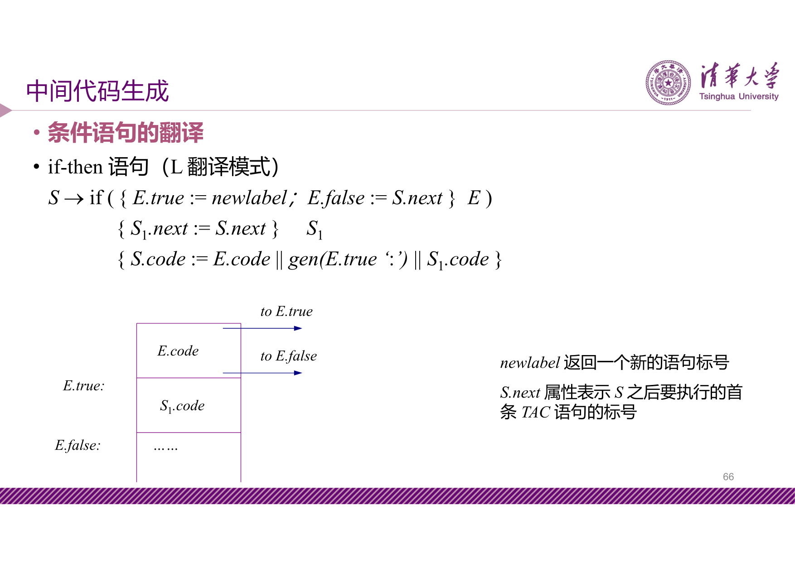

```text
S → if (
    { E.true := newlabel; E.false := S.next } E )
    { S_1.next := S.next } S_1
    { S.code := E.code || gen(E.true ':') || S_1.code }
```

if-then-else 控制流：

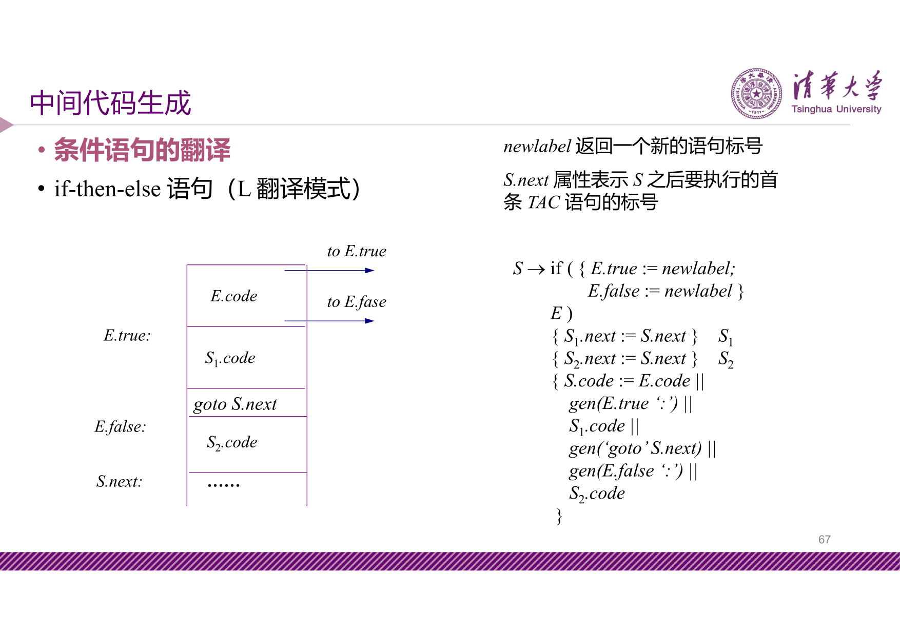

```text
S → if (
    { E.true := newlabel; E.false := newlabel } E )
    { S_1.next := S.next } S_1
    { S_2.next := S.next } S_2
    { S.code := E.code ||
                gen(E.true ':') || S_1.code ||
                gen('goto' S.next) ||
                gen(E.false ':') || S_2.code }
```

#### 3.8.2 while 语句

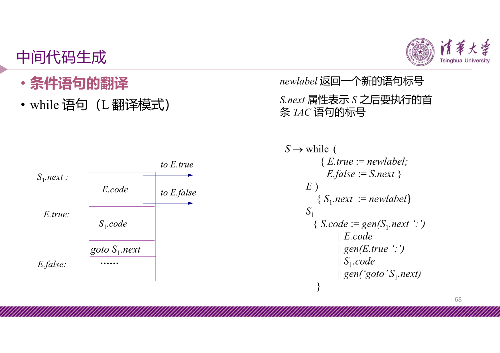

```text
S → while (
    { E.true := newlabel; E.false := S.next } E )
    { S_1.next := newlabel }
    S_1
    { S.code := gen(S_1.next ':') || E.code || gen(E.true ':') ||
                S_1.code || gen('goto' S_1.next) }
```

#### 3.8.3 顺序复合语句

```text
S → { S_1.next := newlabel } S_1
    { S_2.next := S.next } S_2
    { S.code := S_1.code || gen(S_1.next ':') || S_2.code }
```

#### 3.8.4 完整程序的 TAC 序列

```text
Prog → P  { output(P.code) }
P → { F.begin := newlabel } F P_1
    { P.code := gen(F.begin ':') || F.code || P_1.code }
P → D P_1  { P.code := D.code || P_1.code }
P → ε  { P.code := ε }
F → int id ( L ) S  { addplace(id.entry, F.begin);
                     S.code := gen('memo' '''' L.code '''') || S.code }
L → L_1, int id  { L.width := L_1.width + 4;
                   L.code := L_1.code || gen(id.name ':' L_1.width + 4) }
L → ε  { L.width := 0; L.code := ε }
```

!!! tip "addplace"

    将函数名与对应的代码起始标号关联，方便后续函数调用跳转。

#### 3.8.5 含 break 语句的翻译

引入继承属性 $S.break$ 表示 break 应跳到的标号（最外层 while 的结束位置）：

```text
F → int id ( L )  { S.next := newlabel; S.break := newlabel } S
    { S.code := gen('memo' '''' L.code '''') || S.code || gen(S.next ':') }

S → if ( { E.true := newlabel; E.false := S.next } E )
    { S_1.next := S.next; S_1.break := S.break } S_1
    { S.code := E.code || gen(E.true ':') || S_1.code }

S → while ( { E.true := newlabel; E.false := S.next } E )
    { S_1.next := newlabel; S_1.break := S.next } S_1
    { S.code := gen(S_1.next ':') ||
                E.code || gen(E.true ':') || S_1.code ||
                gen('goto' S_1.next) }

S → break  { S.code := gen('goto' S.break) }
```

!!! tip "break 标号传递"

    $S.break$ 沿语法树向下传递，确保任何嵌套位置的 break 都能找到最外层 while 的「大出口」。

### 3.9 拉链与代码回填（backpatching）

!!! info "又一种控制流中间代码生成技术"


    - 前面的 L-翻译模式：使用 **L-属性文法/翻译模式**（含继承属性）
    - 拉链回填：使用 **S-属性文法/翻译模式**（仅综合属性，可一遍 LR）

#### 3.9.1 语义属性

!!! abstract "定义 3.4（真链、假链、next 链）"


    - $E.truelist$：「真链」，链表中元素表示一系列跳转语句的地址，这些跳转目标是「$E$ 为真」的标号
    - $E.falselist$：「假链」，目标是「$E$ 为假」的标号
    - $S.nextlist$：「next 链」，目标是紧跟 $S$ 之后的下条 TAC 语句的标号

#### 3.9.2 语义函数

!!! info "拉链回填的辅助函数"


    - $makelist(i)$：创建只有结点 $i$ 的表，对应存放目标 TAC 语句数组的下标
    - $merge(p_1, p_2)$：连接两个链表 $p_1$ 和 $p_2$
    - $backpatch(p, i)$：将链表 $p$ 中每个元素所指向的跳转语句的标号置为 $i$
    - $nextstm$：下一条 TAC 语句的地址
    - $emit(\dots)$：输出一条 TAC 语句，并使 $nextstm$ 加 1
    - $M \to \varepsilon$：通过非终结符 $M$ 的 $M.gotostm := nextstm$ 来 **抓取当前位置**

#### 3.9.3 处理布尔表达式的翻译模式

```text
E → E_1 ∨ M E_2  { backpatch(E_1.falselist, M.gotostm);
                   E.truelist := merge(E_1.truelist, E_2.truelist);
                   E.falselist := E_2.falselist }

E → E_1 ∧ M E_2  { backpatch(E_1.truelist, M.gotostm);
                   E.falselist := merge(E_1.falselist, E_2.falselist);
                   E.truelist := E_2.truelist }

E → ¬ E_1  { E.truelist := E_1.falselist; E.falselist := E_1.truelist }

E → ( E_1 )  { E.truelist := E_1.truelist; E.falselist := E_1.falselist }

E → id_1 rop id_2  { E.truelist := makelist(nextstm);
                     E.falselist := makelist(nextstm + 1);
                     emit('if' id_1.place rop.op id_2.place 'goto _');
                     emit('goto _') }

E → true  { E.truelist := makelist(nextstm); emit('goto _') }
E → false  { E.falselist := makelist(nextstm); emit('goto _') }

M → ε  { M.gotostm := nextstm }
```

!!! tip "backpatch 的核心思想"

    关系比较 emit 的两条 goto 暂时填 `_`（空目标）。当上层规约时，已知跳转目标，再用 $backpatch$ 把同一条链上所有空目标 **统一回填**。

#### 3.9.4 翻译示例：$E = a < b\ \vee\ c < d\ \wedge\ e < f$

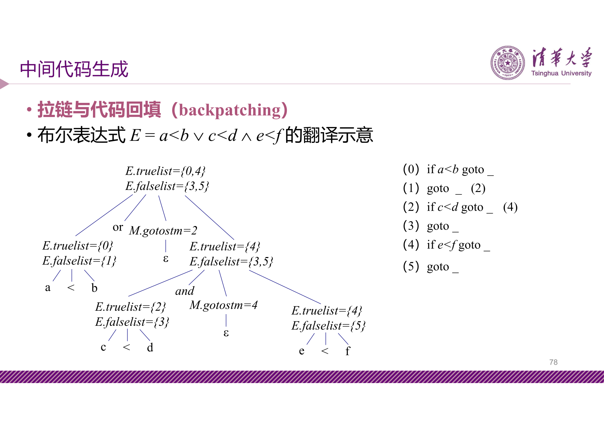

emit 出的 TAC：

```text
(0) if a < b goto _
(1) goto _   (2)
(2) if c < d goto _   (4)
(3) goto _
(4) if e < f goto _
(5) goto _
```

每个内部节点合并子节点的真/假链，最终 $E.truelist = \{0, 4\}$、$E.falselist = \{3, 5\}$，由上层（如 if 的 then/else 标号）回填。

#### 3.9.5 处理条件语句

```text
S → if ( E ) M S_1
    { backpatch(E.truelist, M.gotostm);
      S.nextlist := merge(E.falselist, S_1.nextlist) }

S → if ( E ) M_1 S_1 N else M_2 S_2
    { backpatch(E.truelist, M_1.gotostm);
      backpatch(E.falselist, M_2.gotostm);
      S.nextlist := merge(S_1.nextlist, merge(N.nextlist, S_2.nextlist)) }

N → ε  { N.nextlist := makelist(nextstm); emit('goto _') }
```

#### 3.9.6 处理循环、复合、块、表达式语句

```text
S → while ( M_1 E ) M_2 S_1
    { backpatch(S_1.nextlist, M_1.gotostm);
      backpatch(E.truelist, M_2.gotostm);
      S.nextlist := E.falselist;
      emit('goto', M_1.gotostm) }

S → S_1 M S_2  { backpatch(S_1.nextlist, M.gotostm);
                 S.nextlist := S_2.nextlist }

S → { S_1 }  { S.nextlist := S_1.nextlist }
S → B  { S.nextlist := B.nextlist }
M → ε  { M.gotostm := nextstm }
```

!!! tip "while 的核心逻辑"

    若 $E$ 为假，跳到 while 之外（$S.nextlist := E.falselist$）；若 $S_1$ 执行完，跳回循环条件起始位置 $M_1$。

#### 3.9.7 含 break 的拉链回填

引入 $S.breaklist$，链表元素是跳转地址，目标是直接所属 while 的结束位置：

```text
F → int id ( L ) S M  { backpatch(S.nextlist, M.gotostm);
                        backpatch(S.breaklist, M.gotostm) }

S → if ( E ) M S_1  { backpatch(E.truelist, M.gotostm);
                      S.nextlist := merge(E.falselist, S_1.nextlist);
                      S.breaklist := S_1.breaklist }

S → while ( M_1 E ) M_2 S_1
    { backpatch(S_1.nextlist, M_1.gotostm);
      backpatch(E.truelist, M_2.gotostm);
      S.nextlist := merge(E.falselist, S_1.breaklist);
      S.breaklist := ε;
      emit('goto', M_1.gotostm) }

S → break  { S.breaklist := makelist(nextstm); S.nextlist := ε;
             emit('goto _') }
```

!!! tip "break 的「大出口」"

    while 在闭合处接收来自子节点的 $breaklist$ 与 $E.falselist$ 一起回填到 while 之外的位置（整个循环的「大出口」）。break 自己不写 nextlist，因为它根本不会落到下一条语句。

### 3.10 GOTO 语句的语法制导翻译

#### 3.10.1 拉链回填技术示例

源中间代码（标号 $L$ 在 (40) 处定义）：

```text
... (10) goto L  ...  (20) goto L  ...  (30) goto L
... (40) L:      ...  (50) goto L  ...
```

第一次扫描时，$L$ 还没看到，前向 goto 被 **拉成一条链**：(100) goto 0、(200) goto 100、(300) goto 200。等扫到 $L:$（标号 (400)）时，沿链反向 **回填** 为 400：

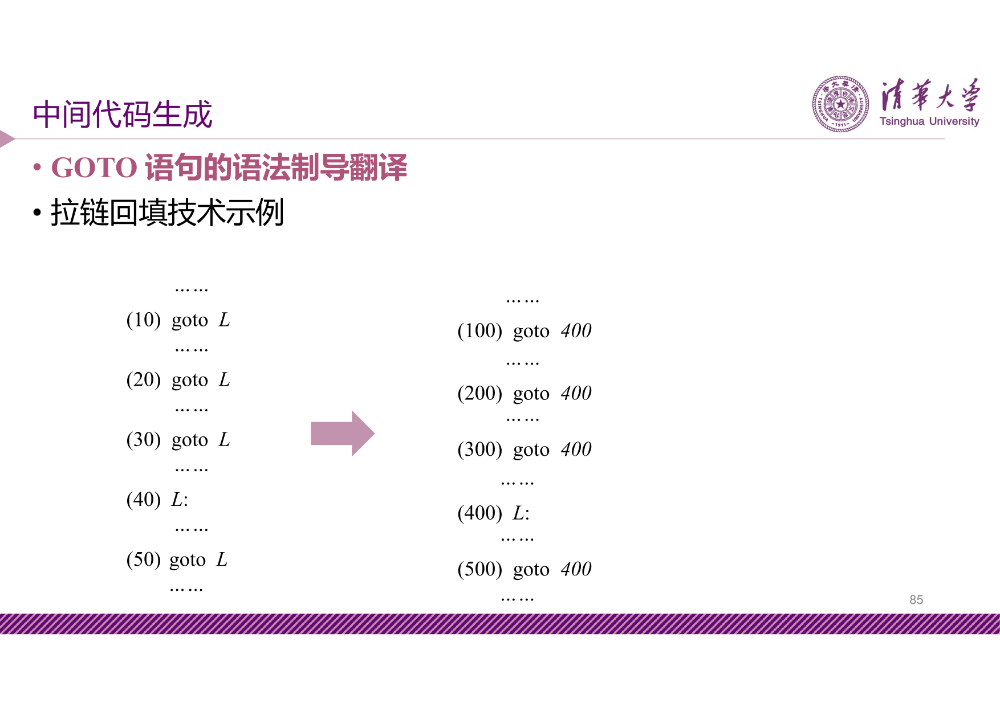

!!! tip "链表用 goto 自身的目标字段串起"

    巧妙之处：在尚未确定目标时，新 goto 的「目标字段」直接指向 **上一条同标号未回填 goto 的下标**，从而把整条链表存在 emit 出来的指令里，无需额外数据结构。

#### 3.10.2 利用标号符号表项维护拉链

!!! info "标号符号表项的字段"


    - $name$、$kind$、$level$ 等（与其他符号一样）
    - $defined$：表示该标号的说明是否已处理过
    - $add$：处理之前用于拉链；处理之后表示翻译后所指向的 TAC 语句位置

辅助过程：

- $setlbdefined(\underline{id}.name, x)$、$getlbdefined(\underline{id}.name)$：设置/获取 $defined$
- $setlbadd(\underline{id}.name, x)$、$getlbadd(\underline{id}.name)$：设置/获取 $add$
- $backpatch(nextstm)$：沿拉链反向将所有 goto 的目标回填为 $nextstm$

#### 3.10.3 标号说明与 GOTO 语句的翻译模式

```text
S → id : S
    { p := lookup(id.name);
      if (p = nil) then enter(id.name);
      setlbdefined(id.name, 1);
      backpatch(nextstm);
      setlbadd(id.name, nextstm) }

S → goto id
    { p := lookup(id.name);
      if (p = nil) then {
          enter(id.name);
          setlbdefined(id.name, 0);
          setlbadd(id.name, 0);
          emit('goto', 0);
      }
      else emit('goto', getlbadd(id.name));
      if (getlbdefined(id.name) = 0) then setlbadd(id.name, nextstm - 1) }
```

!!! warning "前向引用与后向引用"


    - **前向引用**（goto 在标号定义之前）：$defined = 0$，emit 的 goto 目标暂填 0，把 $add$ 更新为这条 goto 的位置——形成拉链
    - **后向引用**（goto 在标号定义之后）：$defined = 1$，直接 emit 已知的目标地址 $getlbadd$，不入链
    - 标号 $id:$ 处理时，调用 $backpatch$ 沿拉链回填整条链上的所有 goto

---

## 4 总结

### 4.1 静态语义分析全景

| 任务 | 实现方式 | 关键属性/函数 |
| --- | --- | --- |
| 静态类型检查 | 翻译模式 + 类型规则 | $E.type$、$lookup\_type$、$addtype$ |
| 作用域分析 | 符号表（栈式 / 嵌套） | 见 [符号表](../%E7%AC%A6%E5%8F%B7%E8%A1%A8/) |
| 控制流检查 | 继承属性 inloop | $S.inloop \in \{0, 1\}$ |
| 收集语义信息 | 同时为代码生成准备 | $T.width$、$D.offset$ |

### 4.2 中间代码生成翻译模式两条路线

| 维度 | L-翻译模式 | S-翻译模式（拉链回填） |
| --- | --- | --- |
| 属性类型 | 继承 + 综合 | 仅综合 |
| 实现配合 | 递归下降 | LR 一遍扫描 |
| 关键属性 | $E.true$、$E.false$、$S.next$ | $E.truelist$、$E.falselist$、$S.nextlist$ |
| 跳转目标处理 | 自顶向下传递目标 | 暂留空，事后 $backpatch$ |
| 适用代表语句 | if/while/sequence | 同左 + GOTO 前向引用 |

### 4.3 核心思想

!!! tip "一句话总结"


    - **静态语义分析**：把 **类型规则** 与 **作用域规则** 编码为翻译模式上的语义动作；通过综合/继承属性把 **判断结果**（$ok$、$type\_error$）沿语法树传播
    - **中间代码生成**：把 **运算/控制流** 编码为翻译模式上的语义动作；输出标准的 TAC，**短路代码** 与 **回填技术** 是处理控制流跳转的两个关键工具

### 4.4 与其他章节的联系

- 类型规则与翻译模式的形式化基础：[语法制导的语义计算基础](../%E8%AF%AD%E6%B3%95%E5%88%B6%E5%AF%BC%E7%9A%84%E8%AF%AD%E4%B9%89%E8%AE%A1%E7%AE%97%E5%9F%BA%E7%A1%80/)
- 名字定义/查询、作用域实现：[符号表](../%E7%AC%A6%E5%8F%B7%E8%A1%A8/)
- 输入语法树来源：[自顶向下语法分析](../%E8%87%AA%E9%A1%B6%E5%90%91%E4%B8%8B%E8%AF%AD%E6%B3%95%E5%88%86%E6%9E%90/)、[自底向上语法分析](../%E8%87%AA%E5%BA%95%E5%90%91%E4%B8%8A%E8%AF%AD%E6%B3%95%E5%88%86%E6%9E%90/)
- 三种分析在编译流程的位置：[三种分析的简明理解](../%E4%B8%89%E7%A7%8D%E5%88%86%E6%9E%90%E7%9A%84%E7%AE%80%E6%98%8E%E7%90%86%E8%A7%A3/)
